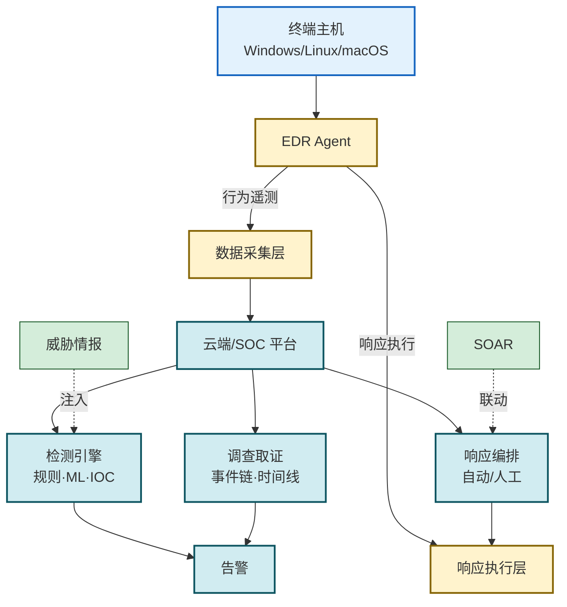

# 5.4 杀毒软件、EDR 防护机制

> [!abstract] 本节概述
> 终端是恶意代码落地的最后一公里，终端防护的演进直接对应着恶意代码的进化。本节梳理两条主线：**传统杀毒软件**（特征码扫描、启发式分析）以"已知威胁"为对象；**EDR（Endpoint Detection and Response，端点检测与响应）** 以"行为与上下文"为对象，提供持续监控、威胁检测、调查取证与自动响应四大能力。最后扩展到 **SOAR（Security Orchestration, Automation and Response，安全编排自动化响应）** 与 EDR 的协同。本节是第 5 章防护侧的收口，呼应 [[1.3 信息安全模型、安全体系框架|PPDR 模型]] 中的 $D_t$ 与 $R_t$。

## 一、安全语境与威胁模型

> [!info] 资产、信任边界与攻击者能力
> - **信息资产**：终端操作系统、终端上的业务数据、内网横向移动入口。
> - **信任边界**：终端（防护对象）／内网服务器（横向移动目标）／SOC（安全运营中心，可信管理域）。
> - **攻击者能力**：可投递零日载荷、可绕过特征码、可滥用合法工具（Living-off-the-Land）、可禁用或对抗终端防护。
> - **安全目标**：阻止已知威胁、检测未知与异常行为、保留取证证据、快速隔离响应。
> - **前置条件**：掌握 [[5.3 恶意代码传播途径、特征识别|5.3 传播与特征识别]]。

## 二、传统杀毒软件

> [!definition] 传统杀毒软件
> 传统杀毒软件（Antivirus, AV）以**已知威胁特征库**为核心，通过扫描文件、内存、引导区与可移动介质，识别并清除已知恶意代码。

### 2.1 特征码扫描

- **原理**：从已知样本中提取**唯一字节序列或哈希**作为签名，扫描时比对待测文件是否包含该特征。
- **优点**：检测准确、误报低、性能可控。
- **缺点**：无法识别新样本与变种（"零日盲区"）；特征库需持续更新；攻击者通过加壳、混淆、多态变形即可绕过。

### 2.2 启发式分析

- **原理**：基于规则或简单模型评估代码"可疑度"，如导入表异常、可疑 API 调用序列、可疑指令模式。
- **优点**：能识别部分未知变种；不依赖具体特征库。
- **缺点**：误报率较高；难以应对高度混淆与多态代码；现代变种易绕过。

> [!note] 传统 AV 的根本局限
> 传统 AV 本质是"已知威胁数据库 + 比对引擎"，对零日、定向攻击、合法工具滥用都束手无策。这正是 EDR 兴起的根本动因——把检测重心从"已知特征"转移到"行为与上下文"。

## 三、EDR 原理

> [!definition] EDR
> EDR（Endpoint Detection and Response，端点检测与响应）是一类部署在终端、**持续采集进程/文件/网络/注册表等行为遥测数据**，结合行为分析、威胁情报与上下文关联进行检测，并提供调查取证与响应处置能力的终端安全解决方案。

EDR 的四个核心能力（Gartner 定义）：

| 能力 | 描述 | 落地示例 |
| ---- | ---- | -------- |
| **持续监控** | 终端 Agent 7×24 采集行为遥测，上报 SOC | 进程树、文件写、网络连接、注册表变更 |
| **威胁检测** | 基于行为规则、机器学习、威胁情报识别异常 | 检测进程注入、可疑 PowerShell、异常横向移动 |
| **调查取证** | 提供事件时间线、进程链、影响范围可视化 | 攻击故事线、受害者清单、传播路径 |
| **自动响应** | 触发响应动作，隔离主机、终止进程、撤销变更 | 网络隔离、Kill Process、回滚文件 |

## 四、EDR vs 传统杀毒对比

| 维度 | 传统杀毒 AV | EDR |
| ---- | ----------- | --- |
| **检测对象** | 已知特征 | 行为、上下文、异常 |
| **数据来源** | 文件特征库 | 终端全行为遥测 |
| **检测方法** | 签名/哈希匹配 + 启发式 | 行为规则 + ML + 威胁情报 + 关联分析 |
| **响应能力** | 隔离文件、删除 | 隔离主机、终止进程、回滚、取证 |
| **取证能力** | 弱（仅扫描日志） | 强（完整事件链与时间线） |
| **对未知威胁** | 几乎无能为力 | 能识别行为异常与变种 |
| **典型代表** | 早期 Norton、卡巴斯基、KV3000 | CrowdStrike Falcon、Carbon Black、Microsoft Defender for Endpoint |
| **资源占用** | 低 | 较高（持续采集与上报） |
| **运维模式** | 被动查杀 | 主动检测 + 响应 + 取证闭环 |

> [!tip] AV 与 EDR 不是替代而是叠加
> EDR 并不取代 AV 的特征码能力——签名扫描仍是已知威胁的高性价比防线。现代终端防护平台（NGAV/XDR）通常**叠加**特征码、启发式、行为检测、ML、威胁情报，形成"已知 + 未知 + 行为"三层覆盖。EDR 在此基础上补齐了响应与取证能力。

## 五、EDR 架构

## 六、SOAR 概念

> [!definition] SOAR
> SOAR（Security Orchestration, Automation and Response，安全编排自动化响应）是一类**把安全运营流程（剧本/Playbook）编排化、自动化执行**的平台，对接 SIEM、EDR、防火墙、威胁情报等多源工具，把"人肉响应"转化为可重复、可审计的自动响应。

EDR 与 SOAR 的协同：

- EDR 提供**端点层面的检测信号与执行通道**。
- SOAR 接收信号后，按 Playbook 自动串联多工具：①查询 SIEM 关联；②向威胁情报查询 IoC；③触发 EDR 隔离主机；④通知运维与创建工单；⑤生成事件报告。
- 价值：缩短 $R_t$（响应时间），降低人工操作误差与疲劳。

> [!example] 典型响应剧本
> 1. EDR 检测某终端 PowerShell 异常调用，触发告警；
> 2. SOAR 自动查询该进程哈希的威胁情报，确认为已知勒索家族；
> 3. SOAR 调用 EDR 隔离该主机出网；
> 4. SOAR 通知 SOC 值班与该主机属主；
> 5. SOAR 自动生成事件工单与初步报告。
> 全程数十秒，对比人工处理通常需 30 分钟以上。

## 七、案例：CrowdStrike 与 Carbon Black EDR 实践

> [!example] 主流 EDR 实践对比
>
> | 厂商产品 | 架构特点 | 核心能力 |
> | ------- | -------- | -------- |
> | **CrowdStrike Falcon** | 云原生 SaaS、轻量 Agent（SENSOR） | 行为检测 Overwatch 人工威胁狩猎、IOA/IOC、横向移动可视化 |
> | **VMware Carbon Black** | 云控制台 + 本地传感器、支持 NGAV + EDR 合一 | 行为分析、Live Response 远程调查、回滚能力 |
> | **Microsoft Defender for Endpoint** | 与 Windows 深度集成、含 EDR + AV | 自动调查与自愈、与 Microsoft 365 Defender XDR 联动 |
>
> **共性实践**：①轻量 Agent 持续上报；②云端集中分析与威胁情报；③行为基线与异常检测；④快速隔离与响应剧本；⑤与 SIEM/SOAR/XDR 联动。
>
> **核实日期**：2026-08-03。产品能力随版本更新可能变化，选型时应核对最新功能矩阵与受影响版本范围。

## 八、易错点

> [!warning] 常见误区
> 1. **认为装了 AV 就够了**：传统 AV 对未知与变种无能为力，必须叠加 EDR 或 NGAV 才能覆盖行为层。
> 2. **EDR 与 AV 混为一谈**：AV 侧重"查杀已知"，EDR 侧重"行为检测 + 响应 + 取证"，能力维度不同。
> 3. **忽视 Agent 资源占用**：EDR 持续采集会带来 CPU/IO 开销，选型需评估对业务终端的影响。
> 4. **EDR 装完就万事大吉**：EDR 只是工具，需配合威胁狩猎、Playbook 调优与告警运营才能发挥价值。
> 5. **SOAR ≠ EDR**：SOAR 是编排层，依赖 EDR、SIEM 等执行能力；没有 EDR 的执行通道，SOAR 的自动响应无法落地。
> 6. **忽视 EDR 自身防护**：攻击者首要目标之一是禁用/卸载 EDR Agent，需为 EDR 进程、服务、配置设置防篡改与卸载审计。

## 章节导航

- 上级：[[MOC - 第5章|第5章 恶意代码防护]]
- 上一节：[[5.3 恶意代码传播途径、特征识别|5.3 传播途径、特征识别]]
- 下一章：[[MOC - 第6章|第6章 数据安全与存储安全]]
- 习题：[[MOC - 第5章习题|第5章 习题]]
