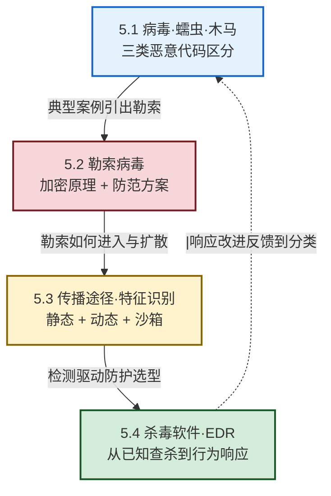

# MOC - 第5章 恶意代码防护

> [!info] 本章定位
> 本章承接 [[MOC - 第4章|第4章 网络攻防]] 的"网络层攻防"，进入**端点层攻防**——恶意代码是攻击者在受害者主机内部落地、扩散与变现的最主要载体。本章回答四个递进问题：恶意代码有哪些形态、如何区分（[[5.1 计算机病毒、蠕虫、木马区别|5.1 病毒/蠕虫/木马]]）？当下最具破坏力的勒索软件如何运作、如何防范（[[5.2 勒索病毒原理与防范方案|5.2 勒索软件]]）？恶意代码通过哪些途径进入终端、又如何被识别（[[5.3 恶意代码传播途径、特征识别|5.3 传播与特征识别]]）？终端防护如何从传统杀毒演进到 EDR/SOAR（[[5.4 杀毒软件、EDR 防护机制|5.4 AV/EDR]]）？四节构成"识别—案例—传播—防护"的闭环，是 [[1.3 信息安全模型、安全体系框架|PPDR 模型]] 中端点侧 $D_t$ 与 $R_t$ 的具体落地。

## 学习路线图



## 知识点导航

| 小节 | 标题 | 核心内容 | 关键概念 |
| ---- | ---- | -------- | -------- |
| [[5.1 计算机病毒、蠕虫、木马区别\|5.1]] | 病毒·蠕虫·木马 | 三类恶意代码四维区分（宿主/复制/传播/目的）、Botnet | Virus/Worm/Trojan、寄生性、主动性、伪装性 |
| [[5.2 勒索病毒原理与防范方案\|5.2]] | 勒索软件 | 加密 + 勒索攻击链、混合加密设计、家族对比、多层防御 | AES+RSA 混合加密、EternalBlue、双重勒索、RaaS、3-2-1 备份 |
| [[5.3 恶意代码传播途径、特征识别\|5.3]] | 传播与识别 | 邮件/U 盘/漏洞/挂马/社工五路径、静态/动态/沙箱 | YARA、行为遥测、反沙箱、APT Kill Chain |
| [[5.4 杀毒软件、EDR 防护机制\|5.4]] | AV/EDR | 特征码 + 启发式 → EDR 行为检测 + 响应 + 取证 + SOAR | NGAV、EDR 四能力、SOAR、Playbook、XDR |

## 核心考点

> [!summary] 本章核心考点（7 点）
> 1. **病毒 vs 蠕虫 vs 木马四维区分**：是否需要宿主、是否自我复制、传播方式、典型目的——这是选择题与简答题最高频考点，务必用对比表强化记忆。
> 2. **僵尸网络（Botnet）的定位**：Botnet 不是与三类并列的第四类恶意代码，而是蠕虫/木马的"网络化运营形态"，由 Bot + C2 + Botmaster 组成。
> 3. **勒索软件混合加密设计**：AES 对称加密文件（快），RSA 非对称加密 AES 密钥（仅攻击者私钥可解），并删除卷影副本——这是简答/分析题的常考点。
> 4. **WannaCry 事件**：EternalBlue 蠕虫式扩散、Kill Switch 域名、补丁 MS17-010——分析题常以此案例考察攻击链与教训。
> 5. **双重勒索（Double Extortion）**：先窃取再加密，"备份只解决加密、不解决外泄"——是勒索防御的考点深化。
> 6. **静态分析 vs 动态分析**：静态不运行（哈希/字符串/YARA），动态运行（行为/沙箱/反沙箱对抗）——两者互补，不可混淆。
> 7. **AV vs EDR**：AV 侧重已知特征查杀，EDR 侧重行为检测 + 响应 + 取证；EDR 四能力（持续监控/威胁检测/调查取证/自动响应）对应 PPDR 的 $D_t$ 与 $R_t$。

## 本章贯穿线索

```mermaid
flowchart LR
    Cls[5.1 分类<br/>识别形态] --> Case[5.2 勒索案例<br/>最具破坏力]
    Case --> Path[5.3 传播与识别<br/>如何进入·如何识别]
    Path --> Def[5.4 AV/EDR<br/>如何防护]

    Cls -.- Ch3[[MOC - 第3章|认证与访问控制]]
    Case -.- Ch2[[MOC - 第2章|密码学基础]]
    Path -.- Ch4[[MOC - 第4章|网络攻防]]
    Def -.- Ch8[[MOC - 第8章|运维与应急]]

    classDef core fill:#e3f2fd,stroke:#1565c0,stroke-width:2px
    classDef rel fill:#d4edda,stroke:#155724,stroke-width:1px
    class Cls,Case,Path,Def core
    class Ch2,Ch3,Ch4,Ch8 rel
```

> [!tip] 与其他章节的衔接
> - **承接 [[MOC - 第4章|第4章 网络攻防]]**：网络层威胁在本章延伸到端点内部落地。
> - **依赖 [[MOC - 第2章|第2章 密码学]]**：勒索软件加密设计直接应用 AES/RSA，理解 5.2 需先掌握对称/非对称加密。
> - **呼应 [[1.3 信息安全模型、安全体系框架|PPDR 模型]]**：EDR/SOAR 的 $D_t$ 与 $R_t$ 是 PPDR 在端点侧的落地。
> - **支撑 [[MOC - 第8章|第8章 运维与应急]]**：终端响应与取证是应急响应的关键环节。

## 章节导航

> [!nav] 导航
> 上级：[[MOC - 信息安全技术|课程总览]]
> 上一章：[[MOC - 第4章|第4章 网络攻击与防御技术]]
> 下一章：[[MOC - 第6章|第6章 数据安全与存储安全]]
> 配套习题：[[MOC - 第5章习题|第5章 习题]]
