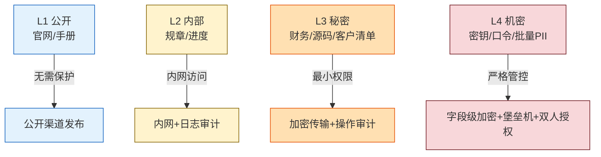
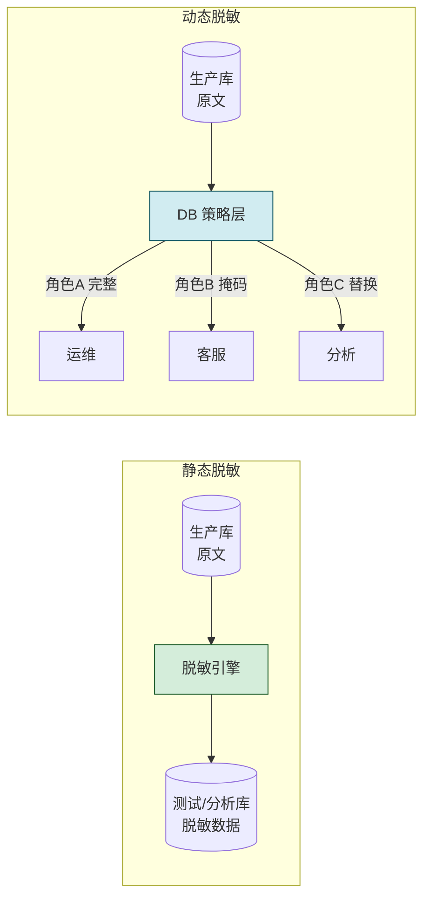

# 6.1 数据分级分类、数据脱敏

> [!abstract] 本节概述
> 数据是信息资产的最小承载体，"分级"决定保护力度、"分类"决定保护方式、"脱敏"则在保障业务可用前提下降低敏感数据暴露面。本节先建立**数据分级（按敏感程度）与数据分类（按业务属性）** 两套坐标系，再系统介绍掩码、替换、扰动、泛化、假名化五类脱敏方法，最后对比**静态脱敏与动态脱敏**的适用场景，并以银行客户数据脱敏为案例落地。

## 安全视角

> [!info] 资产·信任边界·安全目标
> - **资产**：客户身份信息、交易记录、经营数据等结构化/非结构化数据。
> - **信任边界**：生产库 ↔ 测试/分析环境 ↔ 外部共享三方之间的边界是脱敏主要发生点。
> - **安全目标**：在保持业务/分析可用性的前提下，保障**保密性**与**合规性**（GDPR、《个人信息保护法》、等保 2.0）；完整性由脱敏过程可追溯保证。
> - **前置条件**：已完成数据资产清册与所有权确认；已建立分级分类标准。
> - **缓解措施**：分级标签随数据流转、最小权限访问、脱敏规则审计。

## 数据分级

> [!definition] 数据分级（Data Classification by Sensitivity）
> 按数据**泄露后对组织、客户、监管的影响程度**将数据划分为若干等级，决定存储、传输、访问、销毁各环节的控制强度。分级关注"敏感度"，与业务属性无关。

| 等级 | 名称 | 典型数据 | 泄露影响 | 控制要求 |
| ---- | ---- | -------- | -------- | -------- |
| L1 | 公开（Public） | 官网公告、产品手册 | 无 | 无访问限制 |
| L2 | 内部（Internal） | 内部规章、项目进度 | 轻度 | 内网访问、日志审计 |
| L3 | 秘密（Confidential） | 财务报表、源代码、客户清单 | 严重 | 最小权限、加密传输、操作审计 |
| L4 | 机密（Secret/Restricted） | 密钥、口令、核心算法、大量 PII | 灾难性 | 字段级加密、堡垒机、双人授权、DLP 监控 |

> [!warning] 分级与"密级"术语差异
> 政务/军工体系常用"绝密—机密—秘密—内部—公开"五级，对应《保守国家秘密法》；企业一般简化为公开—内部—秘密—机密四级。本章采用企业四级，与 [[MOC - 第8章|第8章 等保 2.0]] 中的数据安全分级保持一致。



## 数据分类

> [!definition] 数据分类（Data Classification by Attribute）
> 按**业务属性或法规属性**对数据归类，用于匹配不同的合规要求与处理规则。分类与分级正交：同一分类下可有不同分级（如"客户 PII"中既有 L2 的姓名也有 L4 的身份证号）。

| 分类 | 缩写 | 典型字段 | 主要法规约束 |
| ---- | ---- | -------- | ------------ |
| 个人身份信息 | PII | 姓名、身份证号、手机号、住址 | 《个人信息保护法》《GDPR》 |
| 金融数据 | — | 银行卡号、交易流水、征信记录 | 《商业银行法》、PCI-DSS |
| 医疗健康数据 | PHI | 病历、检验报告、基因数据 | 《数据安全法》、HIPAA |
| 认证凭证 | — | 口令哈希、私钥、Token | 等保 2.0、《密码法》 |
| 经营核心数据 | — | 源代码、配方、定价模型 | 《反不正当竞争法》《数据安全法》 |

> [!tip] 分级 × 分类 矩阵
> 实践中常把两者组成二维矩阵，例如"PII+L4"要求字段级加密与双人授权，"PII+L2"仅需内网访问。这种矩阵能避免"一刀切"，把控制资源集中到真正高敏感的数据子集。

## 数据脱敏方法

> [!definition] 数据脱敏（Data Masking / Desensitization）
> 对敏感数据按规则进行变形或遮蔽，使脱敏后数据**仍保留业务/分析所需的格式与统计特征**，但无法还原出原始敏感值。脱敏是降低 L3/L4 数据在测试、分析、共享场景暴露面的核心手段。

| 方法 | 原理 | 例子 | 是否可逆 | 适用场景 |
| ---- | ---- | ---- | -------- | -------- |
| 掩码（Masking） | 用 `*`/`X` 替换部分字符 | `110101********1234` | 否 | 展示、日志、报表 |
| 替换（Substitution） | 用随机但同格式的值替换 | 真实姓名 → 字典随机名 | 否 | 测试库 |
| 扰动（Perturbation） | 加噪声/数值微调 | 工资 ±5% | 否 | 统计分析 |
| 泛化（Generalization） | 用更宽区间替代精确值 | 26 岁 → 25~30 岁 | 否 | 数据挖掘 |
| 假名化（Pseudonymization） | 用假名/ID 替换标识，映射表另行保存 | 身份证 → `USR10237` | 是（需映射表） | 跨系统共享、可重标识 |
| 加密（Encryption） | 用密钥加密原文 | 卡号 → AES 密文 | 是（需密钥） | 需还原的业务存储 |

> [!note] 假名化 vs 匿名化
> - **假名化（Pseudonymization）**：替换为假名，但通过额外映射表**仍可还原**到个人，属 GDPR 中的"个人数据"。
> - **匿名化（Anonymization）**：通过不可逆处理使数据**无法再关联到个人**，不再受个保法规制。
> 假名化常作为"可逆脱敏"使用，但映射表必须按 L4 数据保护，否则成为新的攻击面。

### 掩码规则示例

```text
手机号:       13812345678  ->  138****5678
身份证号:     110101199001011234  ->  110101********1234
银行卡号:     6225880123456789  ->  6225********6789
邮箱:         zhang.san@bank.com  ->  zha***@bank.com
```

> [!warning] 掩码不是加密
> 掩码只防"肉眼可见"，不能防止拥有原始数据访问权限者的查询。掩码后的字段若直接入库仍可能被批量拉取，因此掩码通常与[[6.2 数据库加密、透明存储加密|字段级加密]]、访问控制组合使用。

## 静态脱敏 vs 动态脱敏

> [!definition] 静态脱敏（Static Data Masking, SDM）
> 在数据**导出/复制时一次性**对副本进行脱敏，生成一份脱敏后的数据集供测试或分析使用。原始数据不变，副本与生产环境隔离。

> [!definition] 动态脱敏（Dynamic Data Masking, DDM）
> 数据在**数据库中仍以原文存储**，应用查询时由数据库层根据用户角色/策略**实时**返回脱敏后的结果。无需副本，但依赖数据库策略配置。

| 维度 | 静态脱敏 SDM | 动态脱敏 DDM |
| ---- | ------------ | ------------ |
| 作用时机 | 数据导出/复制时 | 查询返回时 |
| 是否生成副本 | 是，脱敏副本 | 否，原文仍在库 |
| 原文位置 | 仅生产库 | 生产库（需配合加密） |
| 性能开销 | 一次性，运行期无开销 | 每次查询实时处理 |
| 适用场景 | 测试库、数据仓库、外部共享 | 客服系统、运维查询、报表展示 |
| 风险 | 副本管理不善可能二次泄露 | DBA 仍可见原文，需配合最小权限 |



> [!tip] 静动结合的常见组合
> 生产库对内：**动态脱敏 + [[6.2 数据库加密、透明存储加密|TDE]] 字段级加密**；对外/测试：**静态脱敏导出副本**。这样既保证业务可用，又控制了副本扩散。

## 案例：银行客户数据脱敏实践

> [!example] 某商业银行数据脱敏方案
> **背景**：核心系统升级需将生产数据同步到开发测试环境用于联调；同时客服中心需查询客户信息。
>
> **资产与边界**：生产库（L4 PII）↔ 测试环境（L2 内部）↔ 客服前台（按角色）。
>
> **方案**：
> 1. **分级分类**：客户表中的身份证号、银行卡号、手机号、余额标记为 L4 PII；姓名标记为 L3。
> 2. **测试环境（静态脱敏）**：
>    - 身份证号、手机号 → 掩码保留前 6 后 4；
>    - 姓名 → 字典替换为随机中文姓名；
>    - 银行卡号 → 替换为符合 Luhn 校验的测试卡号；
>    - 余额 → 扰动 ±10%，保持统计分布。
> 3. **客服查询（动态脱敏）**：
>    - 普通客服查询手机号返回 `138****5678`；
>    - 主管经双人授权可申请临时解掩；
>    - DBA 直接查询受字段级加密与审计监控限制。
> 4. **审计**：所有脱敏访问记录入 SIEM，异常批量查询触发告警。
>
> **效果**：测试库不再含真实 PII，符合《商业银行信息科技风险管理指引》；客服泄露面下降 80%；批量拉取行为可追溯。

## 本节小结

- 分级按敏感度（公开/内部/秘密/机密），分类按业务属性（PII/金融/医疗等），两者正交，组成控制矩阵。
- 五类脱敏方法：掩码、替换、扰动、泛化、假名化；其中假名化可逆、加密可逆，其余不可逆。
- 静态脱敏适合测试/共享副本，动态脱敏适合运行期按角色返回；常见组合是"动+静+加密"。
- 脱敏不是孤立手段，需与 [[6.2 数据库加密、透明存储加密|加密]]、访问控制、审计联动才能闭合保密性目标。

## 章节导航

- ⬆️ 上级：[[MOC - 第6章|第6章 数据安全与存储安全 MOC]]
- ➡️ 下一节：[[6.2 数据库加密、透明存储加密|6.2 数据库加密、透明存储加密]]
- 📝 习题：[[MOC - 第6章习题|第6章 习题]]
