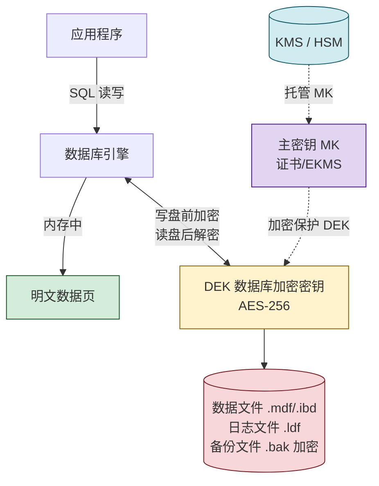
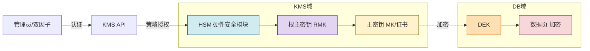

# 6.2 数据库加密、透明存储加密

> [!abstract] 本节概述
> 数据库是数据资产的集中存放点，也是拖库、物理盘失窃等攻击的主要目标。本节按**应用层、数据库层、存储层**三个加密层次梳理方案，重点讲解**透明数据加密（TDE）** 的工作原理、与列级加密的对比、以及 KMS 密钥管理在 TDE 中的关键作用，最后以 SQL Server 与 Oracle 的 TDE 实践落地。

## 安全视角

> [!info] 资产·信任边界·安全目标
> - **资产**：数据库文件、备份介质、临时表空间、日志文件。
> - **信任边界**：应用 ↔ 数据库引擎 ↔ 操作系统/存储介质三层边界。
> - **安全目标**：保障**保密性**（介质失窃、文件被拷贝时不可读）与**完整性**（密钥与数据分离，篡改可发现）。
> - **前置条件**：[[2.2 对称加密算法：DES、AES 原理|AES]] 等强算法已就绪；KMS 可用；备份介质同样在保护范围。
> - **缓解措施**：密钥与数据分离存储、最小权限访问、密钥轮换、TDE+列级加密组合。

## 数据库加密层次

| 层次 | 加密位置 | 典型技术 | 对应用透明度 | 主要威胁对抗 |
| ---- | -------- | -------- | ------------ | ------------ |
| 应用层加密 | 应用代码内 | 业务代码调 AES | 不透明，需改造 | DBA/拖库/DB 主机失陷 |
| 数据库层加密（列级） | DB 引擎内部 | 列级加密函数 | 半透明，需改 schema/SQL | 拖库、备份泄露 |
| 存储层加密（TDE） | DB 引擎写盘前 | TDE | 全透明 | 介质失窃、文件拷贝 |

> [!warning] TDE 不能防御 DBA
> TDE 在数据库引擎**写盘前**加密、**读盘后**解密，因此对应用透明；但 DBA 在数据库内查询到的仍是**明文**。要对抗 DBA/恶意 SQL 注入，必须叠加 [[6.1 数据分级分类、数据脱敏|列级加密]]、动态脱敏、最小权限。

## 透明数据加密（TDE）

> [!definition] 透明数据加密（Transparent Data Encryption, TDE）
> 数据库引擎在**将数据页写入磁盘前**用对称密钥加密，**从磁盘读入内存时**解密的存储层加密机制。由于加解密发生在引擎内部，应用与 SQL 完全无感，因此称为"透明"。TDE 主要保护**数据文件、日志文件、备份介质**等静态数据（Data at Rest）。

### TDE 工作原理

TDE 采用**两层密钥结构**：

1. **数据库加密密钥（DEK）**：对称密钥（通常 AES-128/256），存放在数据库启动记录中，用于加解密数据页。
2. **主密钥（MK）/ 证书 / 非对称密钥**：用于加密 DEK，存放在数据库外部（master 库或 KMS/HSM）。



> [!note] 为什么 DEK 不直接由口令保护？
> 直接用口令派生 DEK 会导致：口令更换时全库重加密、口令泄露即全库失陷。两层结构使得**轮换主密钥只需重加密 DEK（几 KB）**，轮换 DEK 才需要全库重写。日常运维只轮换 MK，业务无感。

### 启用 TDE 的关键步骤

```sql
-- SQL Server 启用 TDE 示例（环境：SQL Server 2019+，需 sysadmin 权限）
-- 1. 在 master 库创建主密钥与证书
USE master;
CREATE MASTER KEY ENCRYPTION BY PASSWORD = 'Str0ng#Pass!';
CREATE CERTIFICATE TDECert WITH SUBJECT = 'TDE Certificate';

-- 2. 在用户库创建由证书保护的 DEK
USE BusinessDB;
CREATE DATABASE ENCRYPTION KEY
    WITH ALGORITHM = AES_256
    ENCRYPTION BY SERVER CERTIFICATE TDECert;

-- 3. 开启 TDE
ALTER DATABASE BusinessDB SET ENCRYPTION ON;
```

> [!warning] 必须备份证书与私钥
> 启用 TDE 后，**证书私钥丢失 = 数据库无法恢复**。务必将证书备份文件与私钥分别存放于安全的离线介质与 KMS，并测试恢复演练。

## 列级加密 vs 全库加密（TDE）

| 维度 | 列级加密 | 全库加密（TDE） |
| ---- | -------- | --------------- |
| 加密粒度 | 单个字段 | 整库数据页 |
| 加密层 | 数据库层 | 存储层 |
| 对应用透明 | 否，需改 SQL/Schema | 是 |
| 索引能力 | 加密列通常无法走索引（或仅等值） | 完全保留索引能力 |
| 查询性能 | 每行加解密，影响大 | 页级加解密，影响小（约 3%~5%） |
| 对抗 DBA | 是，DBA 无密钥不可读 | 否，DBA 在引擎内可见明文 |
| 对抗介质失窃 | 是 | 是 |
| 典型场景 | 身份证、卡号、密钥等强敏感字段 | 全盘静态数据保护 |

> [!tip] 组合策略
> 高敏感场景常用 **TDE（兜底）+ 列级加密（强敏感字段）+ 动态脱敏（按角色返回）** 三层叠加：
> - TDE 防"盘被偷走"；
> - 列级加密防"DBA 拖库"；
> - 动态脱敏防"客服批量拉取"。

## 密钥管理（KMS）

> [!definition] 密钥管理服务（Key Management Service, KMS）
> 集中生成、存储、轮换、撤销和审计加密密钥的系统。提供基于 HSM（硬件安全模块）的根密钥保护，向上层应用与数据库提供密钥使用 API。

### KMS 在 TDE 中的职责

- **密钥生成**：在高安全等级环境（HSM/FIPS 140-2 Level 3 以上）生成根主密钥。
- **密钥分发**：通过认证通道把 DEK 加密后下发到 DB 实例，DEK 明文不出 KMS。
- **密钥轮换**：定期轮换 MK，只需重加密 DEK；轮换 DEK 触发后台重写数据页。
- **密钥撤销**：实例下线/失陷时撤销密钥访问，使加密数据立即不可读（"密钥销毁"等效于数据销毁）。
- **审计**：记录每一次密钥使用、轮换、导出操作。

> [!warning] 密钥与数据同库存放 = 没加密
> 把主密钥与业务库放在同一台服务器或同一备份集中，介质失窃时密钥与数据一起泄露，TDE 形同虚设。正确做法：MK 由独立 KMS/HSM 托管，DEK 经 MK 加密后才能存入业务库启动记录。



## 案例：SQL Server TDE 与 Oracle TDE 实践

> [!example] SQL Server TDE
> - **密钥层次**：服务主密钥（SMK，master 库）→ 数据库主密钥（DMK）→ 证书 → DEK。
> - **算法**：AES_128 / AES_192 / AES_256，默认推荐 AES_256。
> - **范围**：数据文件 `.mdf`、日志 `.ldf`、备份 `.bak`、内存优化表的文件组。
> - **性能**：典型 OLTP 工作负载开销 3%~5%，CPU 密集型负载可达 10%。
> - **常见坑**：tempdb 也会被加密；备份文件不加密 DEK，必须同时备份证书私钥。

> [!example] Oracle TDE
> - **两种模式**：
>   - **列级加密（Column TDE）**：`ENCRYPT USING 'AES256'` 标注列，使用钱包中的密钥。
>   - **表空间加密（Tablespace TDE）**：整个表空间加密，对应用透明，相当于全库加密。
> - **密钥存储**：默认存放于 `sqlnet.ora` 配置的钱包目录；12c 起支持集中式钱包（Centralized Wallet）与 KMS。
> - **管理命令**：
>   ```bash
>   # 在 Linux 上管理 Oracle 钱包（环境：Oracle 19c，需 oracle 用户与 SYSDBA）
>   mkstore -wrl /etc/oracle/wallet -create
>   sqlplus / as sysdba <<'EOF'
>   ALTER SYSTEM SET ENCRYPTION KEY IDENTIFIED BY "WalletPass" WITH BACKUP;
>   ALTER SYSTEM SET ENCRYPTION WALLET OPEN;
>   EOF
>   ```
> - **与 SQL Server 差异**：Oracle 偏向"钱包（Wallet）+ 表空间"模式；SQL Server 是"证书 + DEK + 数据库"模式，但两层密钥结构本质一致。

## 本节小结

- 三层加密：应用层（最强但侵入大）、数据库层列级加密、存储层 TDE。
- TDE 用 DEK 加密数据页、MK 保护 DEK、KMS/HSM 保护 MK，三层密钥结构使轮换成本低、密钥与数据可分离。
- 列级加密防 DBA 拖库，TDE 防介质失窃，二者常组合使用。
- KMS 是 TDE 安全性的真正边界：密钥与数据同库存放 = 没加密。

## 章节导航

- ⬆️ 上级：[[MOC - 第6章|第6章 数据安全与存储安全 MOC]]
- ⬅️ 上一节：[[6.1 数据分级分类、数据脱敏|6.1 数据分级分类、数据脱敏]]
- ➡️ 下一节：[[6.3 数据备份、容灾恢复策略|6.3 数据备份、容灾恢复策略]]
- 📝 习题：[[MOC - 第6章习题|第6章 习题]]
