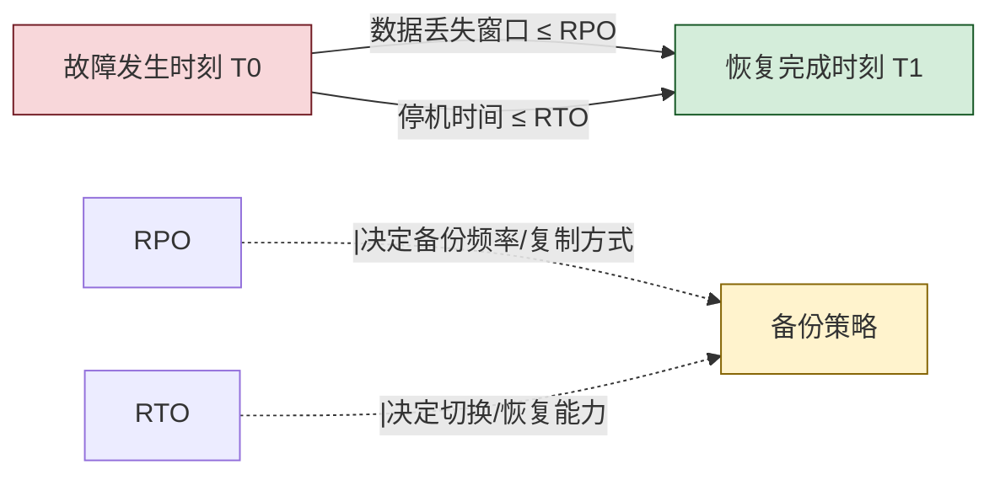
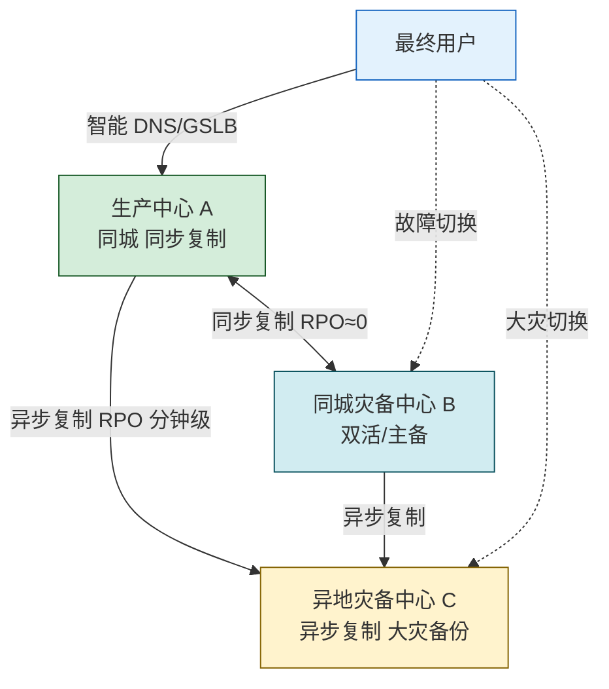

# 6.3 数据备份、容灾恢复策略

> [!abstract] 本节概述
> 备份与容灾是数据安全中保障**可用性**的核心机制。本节先介绍全量、增量、差异三类备份及其组合策略；再以 **RPO/RTO** 两个关键指标量化恢复需求；进而区分数据级、应用级、业务级三类容灾等级，并对比主备、双活、两地三中心三种架构；最后给出 3-2-1 备份法则与银行两地三中心实践案例。

## 安全视角

> [!info] 资产·信任边界·安全目标
> - **资产**：业务数据、配置、应用、机房与数据中心。
> - **信任边界**：主中心 ↔ 同城灾备中心 ↔ 异地灾备中心三地边界。
> - **安全目标**：保障**可用性**为主（RTO/RPO 达标），兼顾**完整性**（备份不可被篡改）与**保密性**（备份介质加密）。
> - **前置条件**：[[6.2 数据库加密、透明存储加密|TDE]] 已就位，备份介质同样需要加密。
> - **缓解措施**：备份链路加密、备份介质离线、防勒索（不可变备份）、定期演练。

## 备份类型

> [!definition] 三种基础备份类型
> - **全量备份（Full Backup）**：备份所有选定数据，自成完整副本。
> - **增量备份（Incremental Backup）**：仅备份自"上一次任意备份"以来变化的数据。
> - **差异备份（Differential Backup）**：仅备份自"上一次全量备份"以来变化的数据。

| 维度 | 全量备份 | 差异备份 | 增量备份 |
| ---- | -------- | -------- | -------- |
| 备份内容 | 全部数据 | 自上次全量后的变化 | 自上次任意备份后的变化 |
| 备份速度 | 慢 | 中 | 快 |
| 备份体积 | 大 | 中（随时间增大） | 小 |
| 恢复速度 | 快（1 份副本） | 中（2 份：全量+最后一次差异） | 慢（全量+所有增量链） |
| 恢复依赖 | 仅本身 | 全量+最近一次差异 | 全量+整条增量链 |
| 风险 | 单点失效即丢全部 | 中间增量损坏影响小 | 任一增量损坏全链失效 |
| 典型周期 | 每周日 | 每工作日 | 每小时/每天 |

> [!tip] 常见组合策略
> - **Full + Differential**：每周日全量，每天差异。恢复只需 2 份，平衡性好，最常用。
> - **Full + Incremental**：每周日全量，每天/每小时增量。备份快但恢复链长，适合频繁备份。
> - **Forever Forward Incremental**：首次全量后只做增量，定期把增量合并进全量合成新全量。

## RPO 与 RTO

> [!definition] RPO（Recovery Point Objective，恢复点目标）
> 业务可容忍的**最大数据丢失量**，以时间表示。RPO=0 意味着零数据丢失（需同步复制）；RPO=1 小时意味着最多丢失 1 小时数据。

> [!definition] RTO（Recovery Time Objective，恢复时间目标）
> 业务可容忍的**最长恢复时间**，即从故障到恢复正常服务的时间上限。RTO=15 分钟意味着故障后 15 分钟内必须恢复。

> [!note] RPO 与 RTO 决定方案成本
> | RPO/RTO | 数据同步方式 | 典型架构 |
> | ------- | ------------ | -------- |
> | RPO≈0、RTO≈0 | 同步复制 | 双活 |
> | RPO 分钟级、RTO 分钟~小时级 | 异步复制 | 主备/同城灾备 |
> | RPO 小时级、RTO 小时~天级 | 定期备份+搬运 | 离线备份 |
> 越小的 RPO/RTO 成本指数级上升，需根据业务分级（[[6.1 数据分级分类、数据脱敏|L1~L4]]）选择。

## 容灾等级

| 等级 | 名称 | 保护对象 | RPO | RTO | 典型技术 |
| ---- | ---- | -------- | --- | --- | -------- |
| 数据级容灾 | Data-level | 数据不丢 | 分钟~小时 | 小时~天 | 数据复制、备份恢复 |
| 应用级容灾 | Application-level | 应用可用 | 秒~分钟 | 分钟~小时 | 应用切换、集群热备 |
| 业务级容灾 | Business-level | 业务连续 | ≈0 | ≈0 | 双活、多地多中心 |

> [!warning] 数据级容灾 ≠ 应用级容灾
> 仅做数据备份/复制能保证"数据不丢"，但应用服务器、配置、网络未同步时仍无法快速恢复业务。等保 2.0 三级及以上要求**应用级容灾**，关键金融业务要求**业务级容灾**。

## 容灾架构

### 主备（Active-Standby）

- 主中心对外服务，备中心处于待机状态。
- 数据异步或同步复制到备中心。
- 故障时手动/自动切换到备中心。
- RPO：分钟~小时；RTO：分钟~小时。

### 双活（Active-Active）

- 两个中心同时对外服务，负载均衡。
- 数据双向同步，任一中心故障另一中心继续服务。
- RPO≈0；RTO≈0（业务无感切换）。
- 成本最高，需解决数据一致性、冲突避免。

### 两地三中心

> [!definition] 两地三中心
> 同城双活（生产中心 A + 同城灾备中心 B，距离通常 30~100km，同步复制）+ 异地灾备中心 C（距离通常 1000km 以上，异步复制）。兼顾"同城业务连续"与"异地大灾备份"。

> [!note] 距离与延迟的权衡
> - **同步复制**要求往返时延 < 应用可接受写延迟（通常 < 5ms），因此同城距离受限在 ~100km 内。
> - **异步复制**无时延硬约束，可跨上千公里，但 RPO>0。
> 两地三中心本质上是"同城零丢失 + 异地抗大灾"的工程平衡。

## 3-2-1 备份策略

> [!tip] 3-2-1 法则
> - **3** 份数据副本：1 份生产 + 2 份备份；
> - **2** 种不同介质：磁盘 + 磁带/对象存储/云；
> - **1** 份离线/异地：防止勒索软件同步加密在线备份。

> [!warning] 防勒索的关键：不可变备份（Immutable Backup）
> 勒索软件会主动加密在线备份。建议至少一份备份满足 **WORM**（Write Once Read Many）特性：
> - 对象存储的对象锁定（Object Lock）；
> - 磁带离线归档；
> - 备份存储专用账号、与生产网隔离。
> 这把"备份"从可用性问题扩展到**完整性 + 保密性**问题。

## 案例：某银行两地三中心容灾实践

> [!example] 某全国性股份制商业银行容灾方案
> **背景**：核心交易系统需满足监管 RTO≤30 分钟、RPO≈0 的要求。
>
> **资产与边界**：生产中心（北京）↔ 同城灾备中心（北京周边）↔ 异地灾备中心（上海）。
>
> **方案**：
> 1. **同城双活**：A、B 两中心距离 ~50km，专线往返时延 < 2ms，存储层同步复制，RPO=0；核心系统在两中心同时对外服务，前端 GSLB 智能调度。
> 2. **异地灾备**：C 中心在上海，异步复制生产数据，RPO≤5 分钟；当 A、B 同时失效（如大停电、地震）时承担业务。
> 3. **备份策略（3-2-1）**：
>    - 3 份副本：生产库 + 同城副本 + 异地副本；
>    - 2 种介质：SSD 阵列 + 磁带库；
>    - 1 份离线：每周日全量备份写入磁带并离线归档；
>    - 关键备份启用对象存储 WORM 锁定 30 天，防勒索。
> 4. **演练**：每季度进行一次切换演练，每年进行一次异地灾备真实接管演练。
>
> **效果**：在一次核心交换机故障演练中，同城切换耗时 8 分钟、零数据丢失，达到 RTO≤30 分钟、RPO=0 目标。

## 本节小结

- 备份三类型：全量、增量、差异；Full+Differential 是最常用组合。
- RPO 决定数据丢失容忍度（影响备份/复制频率），RTO 决定恢复时间容忍度（影响切换能力）。
- 容灾三等级：数据级、应用级、业务级；等保 2.0 三级要求应用级以上。
- 容灾三架构：主备（最简）、双活（最强最贵）、两地三中心（兼顾同城与异地）。
- 3-2-1 + 不可变备份是防勒索与抗大灾的工程底线。

## 章节导航

- ⬆️ 上级：[[MOC - 第6章|第6章 数据安全与存储安全 MOC]]
- ⬅️ 上一节：[[6.2 数据库加密、透明存储加密|6.2 数据库加密、透明存储加密]]
- ➡️ 下一节：[[6.4 残余数据销毁技术|6.4 残余数据销毁技术]]
- 📝 习题：[[MOC - 第6章习题|第6章 习题]]
