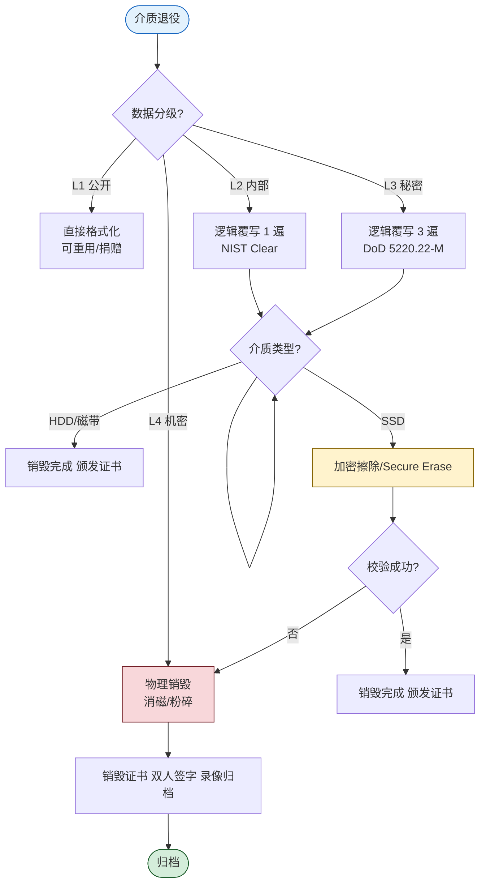

# 6.4 残余数据销毁技术

> [!abstract] 本节概述
> 数据生命周期终点若处置不当，"删除"只是去掉索引、数据仍可被恢复。本节针对磁盘退役、设备报废、租用云盘退订等场景，介绍**物理销毁（消磁/粉碎/焚烧）** 与**逻辑销毁（多次覆写）** 两类技术，重点说明 **SSD 因磨损均衡导致覆写不彻底**的特殊性，并给出硬盘退役销毁决策流程与企业实践案例。

## 安全视角

> [!info] 资产·信任边界·安全目标
> - **资产**：退役硬盘、SSD、磁带、含敏感数据的云存储卷、复印机/打印机内置存储。
> - **信任边界**：内部机房 ↔ 退役处置商 ↔ 二手流通市场三道边界，越靠后信任度越低。
> - **安全目标**：保障**保密性**——残余数据不可被任何手段恢复；兼顾**不可逆性**——销毁结果可验证、可审计。
> - **前置条件**：已确认数据已完成 [[6.3 数据备份、容灾恢复策略|合规备份]]；剩余价值低于继续保护的成本。
> - **缓解措施**：销毁前清册登记、销毁过程录像、双人监督、销毁证书存档。

> [!warning] "删除"≠"销毁"
> - 文件系统删除：仅去掉目录项，数据扇区原样保留；
> - 格式化（快速）：清空文件分配表，数据可恢复；
> - 即便"完全格式化"对 SSD 也不可靠——TRIM 后控制器何时擦除由固件决定。
> 任何"软删除"都不能视为数据销毁。

## 物理销毁

> [!definition] 物理销毁（Physical Destruction）
> 通过破坏存储介质的物理结构使数据无法被任何设备读出，是保密性最强、不可逆性最高的销毁方式。

| 方法 | 原理 | 适用介质 | 优点 | 缺点 |
| ---- | ---- | -------- | ---- | ---- |
| 消磁（Degaussing） | 强磁场破坏磁记录畴 | HDD、磁带、软盘 | 快、彻底 | 仅对磁性介质有效；SSD 无效；消磁后硬盘不可再用 |
| 粉碎（Shredding） | 机械粉碎为碎片 | HDD、SSD、磁带、光盘 | 通用、可视化 | 设备昂贵；碎片仍可能含可读芯片 |
| 焚烧（Incineration） | 高温熔融 | 各类介质 | 极彻底 | 环保与安全要求高，需专业设施 |
| 钻孔/压扁 | 物理破坏盘片/芯片 | HDD、SSD | 简便 | 不彻底，可能残留可读区域 |

> [!note] 消磁为何对 SSD 无效
> SSD 使用 NAND 闪存电荷存储而非磁记录，外加强磁场不会改变浮栅电荷。SSD 必须用粉碎、焚烧或厂商加密擦除（Cryptographic Erase）。

## 逻辑销毁

> [!definition] 逻辑销毁（Logical Destruction / Overwriting）
> 通过对存储介质上所有可寻址扇区**多次写入特定数据模式**，使原数据被覆盖而无法恢复。无需破坏介质，介质可继续使用。

### DoD 5220.22-M 标准

> [!example] DoD 5220.22-M 三遍覆写模式
> 美国国防部发布的销毁标准，对每个扇区执行：
> 1. 第一遍：写入全 `0x00`；
> 2. 第二遍：写入全 `0xFF`；
> 3. 第三遍：写入随机数据；
> 4. 最后：可选地读取校验写入是否成功。
>
> 后续增强版本扩展到 7 遍（DoD 5220.22-M ECE）。NIST SP 800-88 Rev.1 则认为对现代高密度硬盘**单遍覆写**已足够防止恢复。

> [!tip] NIST SP 800-88 销毁等级
> NIST Special Publication 800-88 Rev.1 将介质销毁分为：
> - **Clear**：逻辑覆写，介质可重用；
> - **Purge**：加密擦除、区块擦除、消磁，使数据不可恢复；
> - **Destroy**：物理销毁，介质不可再用。
> 选哪一级取决于数据敏感度与介质类型。

```bash
# Linux 下用 shred 进行逻辑销毁（环境：Linux 任意发行版，root 权限，目标 /dev/sdb）
# -v 显示进度；-n 3 覆写 3 遍；-z 最后一遍写零；-f 强制修改权限
shred -v -n 3 -z -f /dev/sdb
```

## 物理销毁 vs 逻辑销毁

| 维度 | 物理销毁 | 逻辑销毁 |
| ---- | -------- | -------- |
| 介质可否重用 | 否 | 是 |
| 保密性 | 极强 | 强（HDD）/ 弱（SSD） |
| 速度 | 慢（需设备） | 中等 |
| 成本 | 设备高、单次低 | 软件成本 |
| 可验证性 | 视觉/重量 | 校验读回 |
| 适用介质 | 所有 | HDD、磁带 |
| SSD 适用性 | 是（推荐） | 否（见下节） |
| 典型场景 | 高密级、退役、报损 | 中低密级、内部重用 |

## SSD 销毁的特殊性

> [!warning] 磨损均衡使覆写不可靠
> SSD 为延长寿命采用**磨损均衡（Wear Leveling）** 与**垃圾回收（GC）**：
> - 当主机向逻辑扇区 LBA X 写入新数据时，控制器会把数据写到**新的物理页**，并把 LBA X 重新映射过去；
> - 旧物理页标记为"无效"，但**其中的电荷数据仍然存在**，直到 GC 真正擦除；
> - 这意味着主机层面的"覆写"并不能保证旧物理页被覆盖，**逻辑销毁对 SSD 不彻底**。

### SSD 推荐销毁方法

| 方法 | 原理 | 推荐度 |
| ---- | ---- | ------ |
| 加密擦除（Cryptographic Erase, CE） | 销毁加密密钥使密文不可解 | ⭐⭐⭐⭐⭐ |
| 厂商 Secure Erase / Sanitize 命令 | 控制器发送 ATA/NVMe 指令全盘擦除 | ⭐⭐⭐⭐ |
| 物理粉碎/焚烧 | 直接破坏闪存颗粒 | ⭐⭐⭐⭐⭐（高密级必选） |
| 主机层 shred 覆写 | 见上文磨损均衡问题 | ❌ 不推荐 |

> [!tip] 加密擦除（Cryptographic Erase, CE）的妙用
> 如果 SSD 在启用前就开启**全盘加密**（如 SED, Self-Encrypting Drive），销毁时只需**销毁加密密钥**（几毫秒），所有数据立即变为不可解密的无意义密文。这是 NIST SP 800-88 推荐的现代 SSD 销毁首选，前提是：
> - 加密算法可信（AES-256）；
> - 密钥确实只存于 SSD 内部且可被销毁；
> - 启用前确认加密未旁路。

## 数据销毁决策流程



> [!note] 双人监督与销毁证书
> L3/L4 数据销毁应执行**双人监督**：一人操作、一人核对；过程录像；销毁后由处置商出具**销毁证书（Certificate of Destruction）**，记录介质序列号、销毁方法、时间、操作人、监督人，存档备查。这是等保 2.0 与 ISO 27001 审计的常见核查项。

## 案例：企业硬盘退役销毁流程

> [!example] 某互联网企业存储介质退役流程
> **背景**：每年退役约 2000 块 HDD 与 800 块 SSD，含 L3 客户数据与 L4 凭证。
>
> **资产与边界**：内部机房 → 资产管理 → 销毁服务商 → 二手市场。
>
> **流程**：
> 1. **清册登记**：运维对每块盘记录序列号、原所属系统、数据分级，录入资产系统。
> 2. **预擦除**：L2/L3 数据在机房内用 `shred -n 3 -z` 做逻辑销毁；L4 数据跳过此步直接物理销毁。
> 3. **SSD 处理**：开启SED 加密擦除，验证密钥已销毁；若不支持 CE 则送物理粉碎。
> 4. **物理销毁**：交由具备涉密资质的销毁服务商，使用消磁机 + 粉碎机处置，全程录像。
> 5. **双人监督**：运维 1 人 + 安全 1 人现场监督，并在销毁证书上签字。
> 6. **归档**：销毁证书、录像片段、资产清册归档保存 3 年，供内外审计核查。
>
> **效果**：3 年内通过等保 2.0 三级、ISO 27001 两轮审计，介质销毁环节零不符合项。

## 本节小结

- "删除/格式化"不是销毁，必须执行物理或逻辑销毁。
- 物理销毁（消磁/粉碎/焚烧）保密性最强但介质不可再用；逻辑销毁（覆写）保留介质但仅对 HDD 可靠。
- SSD 因磨损均衡使覆写不彻底，应优先采用**加密擦除**或**物理销毁**。
- 高密级介质须物理销毁 + 双人监督 + 销毁证书归档，符合等保 2.0 与 ISO 27001 审计要求。

## 章节导航

- ⬆️ 上级：[[MOC - 第6章|第6章 数据安全与存储安全 MOC]]
- ⬅️ 上一节：[[6.3 数据备份、容灾恢复策略|6.3 数据备份、容灾恢复策略]]
- 📝 习题：[[MOC - 第6章习题|第6章 习题]]
