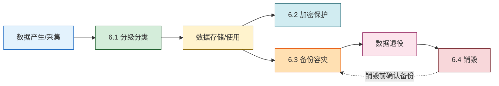

# MOC - 第6章 数据安全与存储安全

> [!info] 本章定位
> 本章把视角从"网络与系统"收回到**数据本身**，按数据生命周期"**分级分类 → 加密存储 → 备份容灾 → 退役销毁**"组织四个小节，覆盖数据从产生到消亡的全过程保护。
> - **承上**：[[MOC - 第2章|第2章 密码学]] 提供 AES/RSA/KMS 等算法基础，[[MOC - 第1章|第1章]] 的 CIA 三要素为本章安全目标的来源。
> - **启下**：[[MOC - 第7章|第7章 安全通信协议]] 处理数据**传输中**的安全，本章聚焦数据**静态**与**生命周期**安全；[[MOC - 第8章|第8章 法律法规]] 把本章的方法与等保 2.0、《数据安全法》《个人信息保护法》衔接。
> - **核心线索**：分级是基础、加密是核心、备份是底线、销毁是闭环。
> - **安全边界**：本章描述的标准与命令需在授权环境内使用，介质销毁涉及物理操作应交由具备资质的服务商。

## 本章学习路线

```mermaid
flowchart LR
    S1["6.1 分级分类·脱敏<br/>L1~L4 · PII · 掩码/替换/扰动/泛化/假名化"]
    S2["6.2 数据库加密·TDE<br/>应用层/DB层/存储层 · DEK+MK+KMS"]
    S3["6.3 备份·容灾<br/>Full/Incr/Diff · RPO/RTO · 两地三中心"]
    S4["6.4 残余数据销毁<br/>物理/逻辑销毁 · DoD 5220.22-M · SSD特殊性"]

    S1 -->|"分级决定保护强度"| S2
    S1 -->|"分级决定脱敏方式"| S2
    S2 -->|"加密后的备份也需容灾"| S3
    S3 -->|"退役介质进入销毁"| S4
    S4 -.|"销毁前确认已备份"| S3

    classDef cls fill:#d4edda,stroke:#155724
    classDef enc fill:#d1ecf1,stroke:#0c5460
    classDef bak fill:#fff3cd,stroke:#856404
    classDef des fill:#f8d7da,stroke:#721c24
    class S1 cls
    class S2 enc
    class S3 bak
    class S4 des
```

## 知识点导航

| 小节 | 文件 | 核心内容 | 关键概念/标准 |
| ---- | ---- | -------- | ------------- |
| 6.1 | [[6.1 数据分级分类、数据脱敏]] | 数据分级（公开/内部/秘密/机密）、数据分类（PII/金融/医疗）、五类脱敏方法、静态/动态脱敏 | PII、假名化 vs 匿名化、SDM/DDM |
| 6.2 | [[6.2 数据库加密、透明存储加密]] | 三层加密体系、TDE 原理与两层密钥结构、列级 vs 全库、KMS | TDE、DEK、MK、AES-256、HSM |
| 6.3 | [[6.3 数据备份、容灾恢复策略]] | Full/Incr/Diff、RPO/RTO、三等级容灾、两地三中心、3-2-1 | RPO、RTO、双活、不可变备份 |
| 6.4 | [[6.4 残余数据销毁技术]] | 物理销毁（消磁/粉碎/焚烧）、逻辑销毁（DoD 5220.22-M）、SSD 特殊性、加密擦除 | DoD 5220.22-M、NIST SP 800-88、CE |

## 数据生命周期与四节对应



## 核心概念速查

| 概念 | 所属小节 | 一句话定义 |
| ---- | -------- | ---------- |
| 数据分级 | 6.1 | 按敏感度划分公开/内部/秘密/机密 |
| 数据分类 | 6.1 | 按业务属性区分 PII/金融/医疗等 |
| 假名化 | 6.1 | 用假名替换标识，映射表另行保存，可逆 |
| 静态脱敏 SDM | 6.1 | 数据导出时一次性脱敏，生成副本 |
| 动态脱敏 DDM | 6.1 | 查询时按角色实时返回脱敏结果 |
| TDE | 6.2 | 数据库引擎写盘前加密、读盘后解密，对应用透明 |
| DEK / MK | 6.2 | 数据库加密密钥 / 主密钥，两层密钥结构 |
| KMS | 6.2 | 集中管理密钥生成/分发/轮换/审计 |
| 全量/增量/差异备份 | 6.3 | 三种基础备份类型 |
| RPO / RTO | 6.3 | 可容忍最大数据丢失量 / 最长恢复时间 |
| 两地三中心 | 6.3 | 同城双活 + 异地灾备 |
| 3-2-1 备份 | 6.3 | 3 份副本、2 种介质、1 份离线 |
| 物理销毁 | 6.4 | 消磁/粉碎/焚烧，介质不可再用 |
| 逻辑销毁 | 6.4 | 多次覆写，介质可重用（仅 HDD 可靠） |
| 加密擦除 CE | 6.4 | 销毁密钥使密文不可解，SSD 首选 |
| DoD 5220.22-M | 6.4 | 三遍覆写销毁标准 |

## 核心考点

> [!warning] 高频考点（8 点）
> 1. **数据分级与分类的区别**：分级按敏感度（公开/内部/秘密/机密），分类按业务属性（PII/金融/医疗），两者正交组成控制矩阵。
> 2. **五类脱敏方法**：掩码、替换、扰动、泛化、假名化；区分假名化（可逆）与匿名化（不可逆，不再受个保法规制）。
> 3. **静态脱敏 vs 动态脱敏**：作用时机、是否生成副本、原文位置、性能、适用场景对比——这是选择题/简答高频考点。
> 4. **TDE 两层密钥结构**：DEK 加密数据页、MK 加密 DEK、KMS 保护 MK；为何不能直接用口令保护 DEK；轮换 MK 只需重加密 DEK。
> 5. **TDE 的"透明"含义与局限**：对应用透明但**对 DBA 不透明无效**——DBA 在引擎内仍见明文；要对抗 DBA 需列级加密 + 最小权限。
> 6. **列级加密 vs 全库加密（TDE）对比**：粒度、透明度、索引能力、性能、抗 DBA、适用场景。
> 7. **RPO 与 RTO**：定义、对方案成本的影响、与同步/异步复制、双活/两地三中心的对应关系；典型业务 RPO/RTO 推导容灾等级。
> 8. **SSD 销毁特殊性**：磨损均衡使覆写不彻底，逻辑销毁不可靠；推荐加密擦除（CE）或物理销毁；DoD 5220.22-M 三遍模式与 NIST SP 800-88 Clear/Purge/Destroy 分级。

## 与其他章节的关联

- [[MOC - 第1章|第1章 信息安全基础概论]]：CIA 三要素是本章保护目标的来源；分级对应保密性、备份对应可用性、销毁对应保密性的闭环。
- [[MOC - 第2章|第2章 密码学基础]]：AES 提供加密算法、KMS/HSM 依赖非对称密钥与证书体系。
- [[MOC - 第4章|第4章 网络攻击与防御技术]]：拖库、SQL 注入是 TDE+列级加密+脱敏的对抗对象。
- [[MOC - 第7章|第7章 安全通信协议]]：传输中安全（TLS）与本章静态安全互补，共同构成"全程加密"。
- [[MOC - 第8章|第8章 法律法规与运维规范]]：等保 2.0 三级要求应用级容灾与介质销毁审计；《数据安全法》《个人信息保护法》对应数据分级与脱敏要求。

## 章节导航

- ⬆️ 上级：[[MOC - 信息安全技术|信息安全技术 MOC]]
- ⬅️ 上一章：[[MOC - 第5章|第5章 恶意代码防护]]
- ➡️ 下一章：[[MOC - 第7章|第7章 安全通信协议]]
- 📝 习题：[[MOC - 第6章习题|第6章 习题]]
