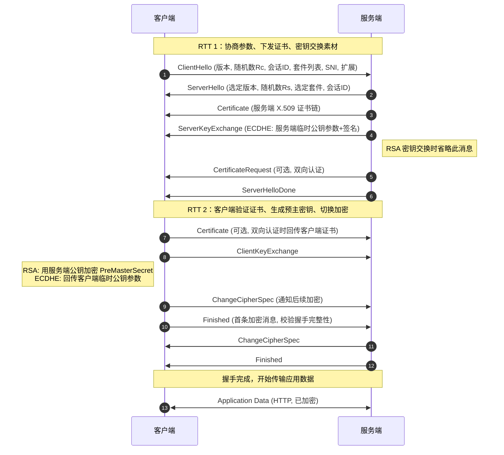
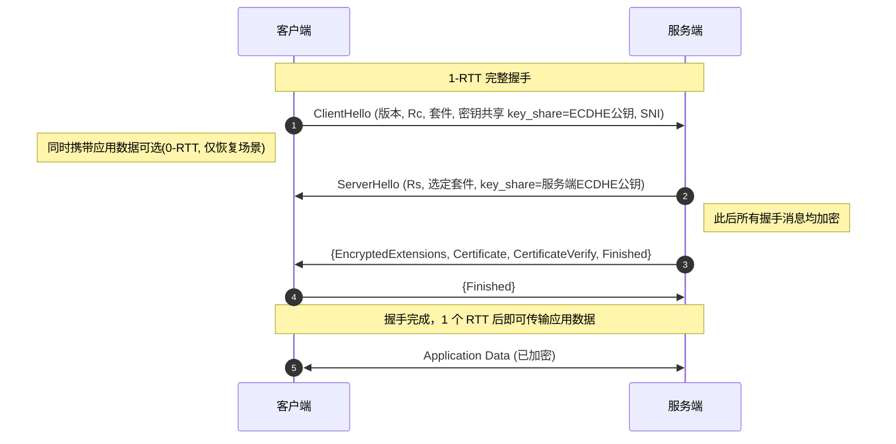
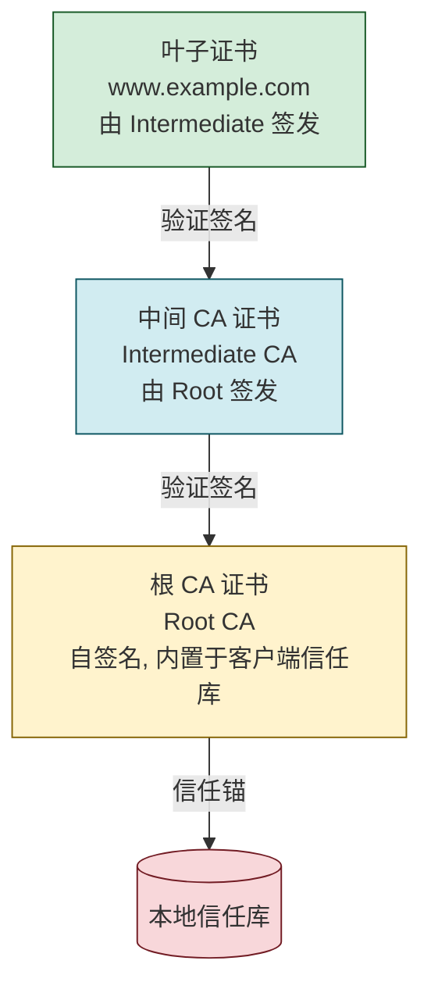

# 7.1 HTTPS、TLS/SSL 握手流程

> [!abstract] 本节概述
> HTTP 本身明文传输，在公网上面临嗅探、篡改与身份伪造三类威胁。HTTPS = HTTP over TLS/SSL，通过 TLS 握手协商加密套件、交换密钥、验证证书，在 TCP 之上建立加密通道，再承载 HTTP。本节先讲 TLS 协议分层，再以 **TLS 1.2 完整握手流程**为核心，对比 **TLS 1.3 的改进**，最后讨论 RSA 与 ECDHE 在前向保密（PFS）上的差异、证书链验证与抓包分析要点。

## 安全视角

> [!info] 资产·信任边界·安全目标
> - **资产**：浏览器/客户端与服务端之间传输的 HTTP 请求/响应（含 Cookie、表单、API 凭据）。
> - **信任边界**：客户端 ↔ 公网 ↔ 服务端；公网段不可信，存在嗅探与中间人。
> - **攻击者能力**：被动嗅探流量、主动中间人（MITM）篡改/重放、长期保存密文等待私钥泄露（"先存后解"）。
> - **安全目标**：**机密性**（密文传输）、**完整性**（MAC/AEAD 防篡改）、**认证**（服务端证书，可选双向）、**前向保密**（PFS，抗"先存后解"）。
> - **前置条件**：服务端持有可信 CA 签发的 X.509 证书与对应私钥；客户端内置 CA 根证书库。
> - **缓解措施**：启用 TLS 1.2/1.3、禁用弱套件、启用 HSTS、证书透明度（CT）监控、私钥入 HSM。

## HTTPS 与 TLS 分层

> [!definition] HTTPS
> HTTPS 是 `http://` over TLS 的统一标识，默认端口 **443**。它本身不是新协议，而是在 TCP 三次握手完成后、HTTP 通信之前插入一段 TLS 握手，建立加密通道后再承载 HTTP/1.1 或 HTTP/2 报文。

> [!note] SSL 与 TLS 的关系
> SSL（Secure Sockets Layer）由 Netscape 提出，SSL 2.0/3.0 已全部废止。IETF 接管后改名 TLS（Transport Layer Security），TLS 1.0≈SSL 3.1。当前主流为 **TLS 1.2（RFC 5246）** 与 **TLS 1.3（RFC 8446）**，SSL 全系与 TLS 1.0/1.1 均已废弃（RFC 8996）。

TLS 协议本身分为两层：

| 层级 | 子协议 | 作用 |
| ---- | ------ | ---- |
| 记录层（Record Protocol） | TLS Record | 对上层报文分片、压缩（1.2 可选，1.3 已移除）、加解密、附加 MAC/AEAD；承载握手、告警、ChangeCipherSpec、应用数据 |
| 握手层 | Handshake Protocol | 协商加密套件、交换证书与密钥素材、导出会话密钥 |
| 握手层 | ChangeCipherSpec | 通知对端后续消息改用新协商参数加密 |
| 握手层 | Alert Protocol | 传递告警/错误（如 certificate_unknown、bad_record_mac） |
| 握手层 | Application Data | 实际承载应用层数据（HTTP） |

> [!tip] 抓包观察要点
> 抓 HTTPS 流量时，TCP 80/443 端口、SNI（Server Name Indication）、证书链、握手消息类型均可见；应用层数据被加密。SNI 在 TLS 1.2 明文传输（可用于审查/分类），TLS 1.3 配合 ECH（Encrypted ClientHello）可加密 SNI。

## TLS 1.2 握手流程（重点）

### 完整握手时序

> [!warning] TLS 1.2 完整握手需要 2 个 RTT 才能开始传输应用数据，且默认 RSA 密钥交换无 PFS。

### 密钥派生

握手结束后双方都持有三个秘密素材，据此派生会话密钥：

| 素材 | 来源 | 保密性 |
| ---- | ---- | ------ |
| 客户端随机数 $R_c$ | ClientHello | 明文，公开 |
| 服务端随机数 $R_s$ | ServerHello | 明文，公开 |
| 预主密钥 PreMasterSecret | 密钥交换产物 | 加密/协商得到 |

> [!definition] 主密钥与会话密钥派生
> $$ \text{MasterSecret} = \text{PRF}(\text{PreMasterSecret},\ \text{"master secret"},\ R_c \oplus R_s) $$
> 再由 MasterSecret 派生 4 组会话密钥：客户端写密钥、服务端写密钥、客户端写 MAC 密钥、服务端写 MAC 密钥（CBC 模式还需 IV）。TLS 1.3 改用 HKDF，结构更简洁。

### Finished 消息的作用

> [!tip] Finished 为何能验证握手完整性
> Finished 是握手阶段第一条用新协商密钥加密的消息，其内容是对**全部握手消息**的哈希与 PRF 输出。任何中间人对 ClientHello/ServerHello/Certificate 的篡改都会导致双方 Finished 校验失败，从而触发 `bad_record_mac` 告警断连。这是 TLS 抗 MITM 的最后防线。

## TLS 1.3 改进

> [!warning] TLS 1.3（RFC 8446, 2018）是对 1.2 的重大简化与强化，强制 PFS、移除大量不安全算法，握手从 2-RTT 降到 1-RTT。

### 1-RTT 与 0-RTT 握手

### 主要改进点

| 改进 | TLS 1.2 | TLS 1.3 |
| ---- | ------- | ------- |
| 握手 RTT | 2-RTT | 1-RTT，恢复可 0-RTT |
| 密钥交换 | RSA / DHE / ECDHE | 仅 (EC)DHE / PSK，强制 PFS |
| 对称加密 | CBC、RC4、3DES 等可选 | 仅 AEAD（AES-GCM、AES-CCM、ChaCha20-Poly1305） |
| 哈希 | MD5+SHA-1 组合 | SHA-256/384 单一算法族 |
| 压缩 | 可选 | 移除（消除 CRIME/BREACH 攻击面） |
| 握手消息加密 | 明文 | ServerHello 之后全部加密 |
| 消息数量 | 较多 | 合并简化（如 ServerHelloDone 取消） |
| 静态 RSA/DH | 允许 | 移除 |
| 重协商 | 支持 | 移除（用 KeyUpdate 替代） |

> [!note] 0-RTT 的代价
> 0-RTT 让"恢复连接"首条请求即可携带应用数据，时延极低；但其应用数据**没有前向保密**（基于 PSK），且**可能被重放**。因此 0-RTT 只能用于幂等请求（如 GET），不应承载会改变状态的操作（支付、下单）。

## 密钥交换：RSA vs ECDHE

> [!definition] 前向保密（Perfect Forward Secrecy, PFS）
> 即使服务端长期私钥在将来泄露，过去已捕获的加密会话仍无法被解密。实现关键是**每次会话使用临时密钥对**并在会话结束时销毁，长期私钥只用于签名认证而非密钥传输。

| 维度 | RSA 密钥交换 | ECDHE 密钥交换 |
| ---- | ------------ | -------------- |
| 工作方式 | 客户端用服务端公钥加密 PreMasterSecret | 双方交换临时 ECDH 公钥，各自计算共享秘密 |
| 私钥用途 | 解密 PreMasterSecret（**密钥传输**） | 对 ServerKeyExchange 签名（**认证**） |
| PFS | ❌ 无。私钥泄露即可解历史流量 | ✅ 有。临时密钥销毁后历史会话不可解 |
| 计算开销 | 较低 | 中等（椭圆曲线运算） |
| TLS 1.3 | 已移除 | 强制使用 |
| 抗"先存后解" | 弱（攻击者囤积密文等私钥泄露） | 强 |

> [!tip] 为何 TLS 1.3 强制 PFS
> "先存后解"（Harvest Now, Decrypt Later）威胁日益现实：攻击者囤积 TLS 1.2 RSA 流量，等待量子计算或私钥泄露再批量解密。TLS 1.3 移除 RSA 密钥交换，确保即使私钥泄露，历史 ECDHE 会话仍安全。

## 证书验证链

> [!definition] 证书链验证
> 客户端收到服务端证书后，沿"叶子证书 → 中间 CA → 根 CA"逐级验证签名、有效期、域名匹配（SAN/CN）、用途（EKU=serverAuth）、吊销状态（CRL/OCSP），直到达到本地信任库中的根 CA。

验证步骤：

1. **链完整性**：能从叶子证书逐级签发到信任库中的根 CA。
2. **签名有效性**：每级用上级公钥验证下级证书签名。
3. **有效期**：`notBefore ≤ 当前 ≤ notAfter`。
4. **域名匹配**：访问的域名出现在 SAN（Subject Alternative Name）或 CN 中。
5. **用途约束**：EKU 包含 `serverAuth`；基本约束（BasicConstraints）正确。
6. **吊销检查**：通过 OCSP 或 CRL 确认未吊销；TLS 1.3 推荐 OCSP Stapling 减少往返。

> [!warning] 常见失败原因
> - 证书过期（`certificate has expired`）。
> - 域名不匹配（`certificate name mismatch`）。
> - 中间证书未下发（链不完整，常见于自配 Nginx 漏配中间证书）。
> - 自签名证书未导入信任库。
> - 证书被吊销但客户端未检查 OCSP（"吊销盲区"）。

## TLS 1.2 vs TLS 1.3 对比

| 维度 | TLS 1.2（RFC 5246） | TLS 1.3（RFC 8446） |
| ---- | ------------------ | ------------------ |
| 发布年份 | 2008 | 2018 |
| 握手 RTT | 2-RTT | 1-RTT，恢复 0-RTT |
| 密钥交换 | RSA / DHE / ECDHE / PSK | 仅 (EC)DHE / PSK，强制 PFS |
| 对称加密 | CBC、RC4、3DES、AEAD 可选 | 仅 AEAD（GCM/CCM/ChaCha20） |
| 哈希/PRF | MD5+SHA-1 PRF | SHA-256/384 + HKDF |
| 压缩 | 可选 | 移除 |
| 握手消息加密 | 否（仅 Finished 后） | 是（ServerHello 之后） |
| 静态 RSA 密钥交换 | 允许 | 移除 |
| 重协商 | 支持 | 移除（用 KeyUpdate） |
| SNI 加密 | 否（明文） | 配合 ECH 可加密 |
| 已废弃算法 | 仍可被配置启用 | 全部移除 |

## 案例：浏览器 HTTPS 连接抓包分析

> [!example] 抓包观察一次 HTTPS 连接
> **环境**：浏览器 Chrome 访问 `https://www.example.com`，Wireshark 抓包（服务端私钥未持有，无法解密应用数据）。
>
> **观察要点**：
>
> 1. **TCP 三次握手**：SYN → SYN-ACK → ACK，端口 443。
> 2. **ClientHello**：可见客户端支持的 TLS 版本、随机数 $R_c$、Cipher Suites 列表、SNI=`www.example.com`、扩展（key_share 含客户端 ECDHE 公钥，对应 TLS 1.3）。
> 3. **ServerHello**：选定 TLS 版本、随机数 $R_s$、选定 Cipher Suite（如 `TLS_AES_256_GCM_SHA384`）、key_share 服务端公钥。
> 4. **Certificate**：明文可见证书链（叶子 + 中间 CA），含颁发者、有效期、SAN 域名、公钥算法。
> 5. **后续握手消息**：TLS 1.3 中 ServerHello 之后变更为"Application Data"封装（解密后才是 EncryptedExtensions/CertificateVerify/Finished），抓包无法看到明文。
> 6. **应用数据**：全部以 `Application Data` 形式呈现，仅可见方向与长度，内容不可读。
>
> **判断版本**：若 ServerHello 之后立刻出现明文 Certificate，多为 TLS 1.2；若紧接 Application Data 封装，则为 TLS 1.3。
>
> **常见排障**：
> - 证书链不完整 → 浏览器报"NET::ERR_CERT_AUTHORITY_INVALID"。
> - 套件协商失败 → `handshake failure`，需检查客户端与服务端套件交集。
> - SNI 缺失 → 共享 IP 的虚拟主机返回默认证书，导致域名不匹配。

## 本节小结

- HTTPS = HTTP over TLS，默认端口 443；TLS 分记录层（承载数据加解密）与握手层（协商参数密钥）。
- TLS 1.2 完整握手 2-RTT：ClientHello → ServerHello → Certificate → ServerKeyExchange → ServerHelloDone → ClientKeyExchange → ChangeCipherSpec → Finished（双向）。
- TLS 1.3 简化为 1-RTT，恢复支持 0-RTT；强制 PFS、仅用 AEAD、移除弱算法与压缩、握手消息加密。
- RSA 密钥交换无 PFS，ECDHE 通过临时密钥实现 PFS；TLS 1.3 移除 RSA 密钥交换以抗"先存后解"。
- 证书链验证逐级检查签名、有效期、域名、用途、吊销状态，根 CA 为信任锚。
- 抓包可见 TCP、SNI、证书链与握手消息类型，但应用数据不可读；可通过握手消息是否加密判断 TLS 1.2/1.3。

## 章节导航

- ⬆️ 上级：[[MOC - 第7章|第7章 安全通信协议 MOC]]
- ➡️ 下一节：[[7.2 VPN 技术：IPSec、SSL VPN|7.2 VPN 技术：IPSec、SSL VPN]]
- 📝 习题：[[MOC - 第7章习题|第7章 习题]]
