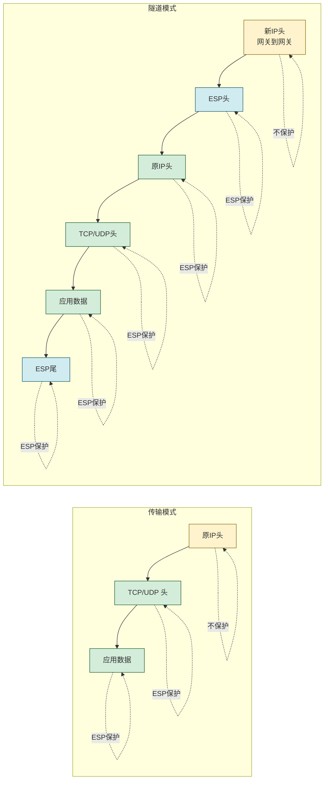
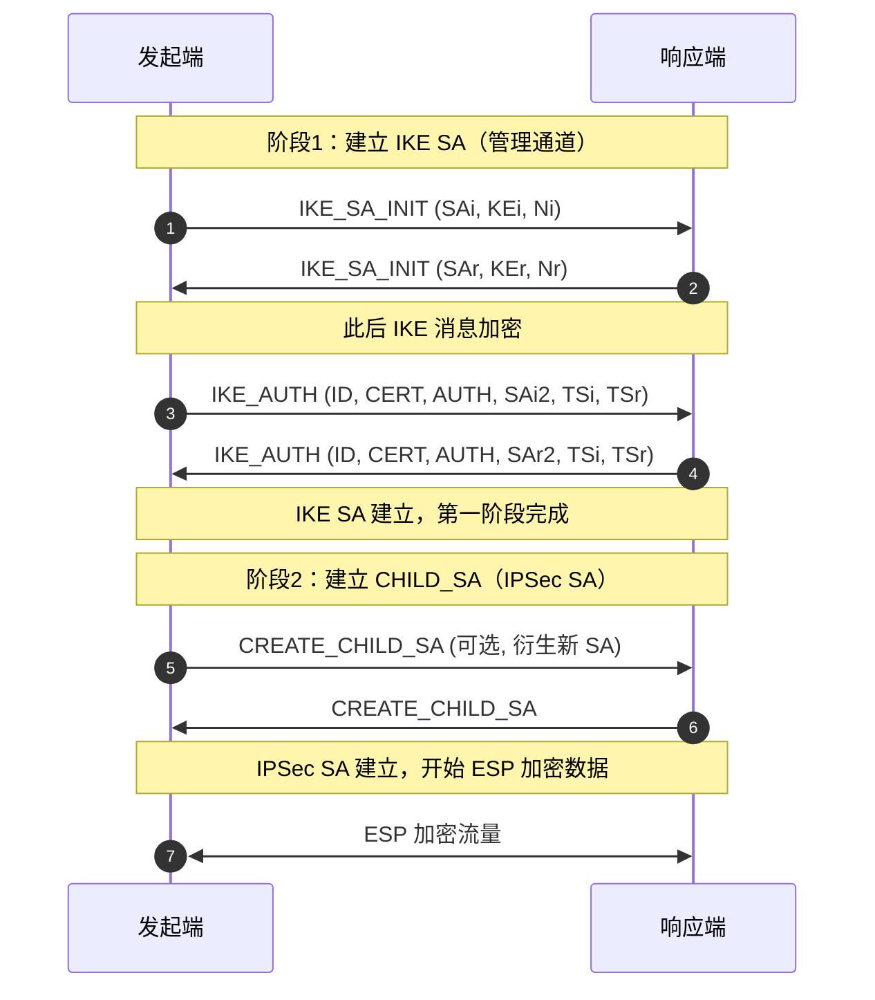
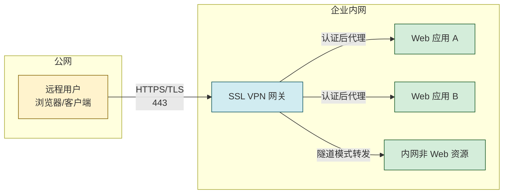

# 7.2 VPN 技术：IPSec、SSL VPN

> [!abstract] 本节概述
> 公网不可信，但企业常需把分支机构、远程员工、云上 VPC 与总部内网连通。VPN（Virtual Private Network）通过**加密隧道**在公共网络上模拟专线，实现跨网段的私密通信。本节先讲 VPN 通用模型，再深入 **IPSec 协议栈**（AH/ESP、传输/隧道模式、IKE 两阶段、SA），最后对比 **SSL VPN**（基于 TLS、浏览器接入）的架构差异与适用场景。

## 安全视角

> [!info] 资产·信任边界·安全目标
> - **资产**：跨公网传输的内网业务流量、内网主机可达性、分支间数据同步。
> - **信任边界**：分支内网 ↔ 公网（ISP 可观察）↔ 总部内网；公网段不可信。
> - **攻击者能力**：嗅探隧道流量、伪造/重放隧道报文、尝试接入 VPN 网关、对内网横向渗透。
> - **安全目标**：**机密性**（隧道内加密）、**完整性**（防篡改）、**认证**（网关间/用户身份）、**访问控制**（仅授权用户进入内网）。
> - **前置条件**：网关间已协商密钥（IKE）或用户已通过认证；两端时钟与路由配置正确。
> - **缓解措施**：强认证（MFA）、最小授权（按应用而非全网络）、补丁管理、日志审计、限制 VPN 后内网可达范围。

## VPN 基本概念

> [!definition] VPN
> VPN 在公共网络（互联网）之上通过**隧道封装**与**加密**建立逻辑专用网络，使远端节点像在本地内网一样通信。其"虚拟"在于不独占物理链路，"专用"在于流量加密隔离。

VPN 三要素：

| 要素 | 含义 | 实现手段 |
| ---- | ---- | -------- |
| 隧道封装 | 把原始数据包封装进新包头传输 | IP-in-IP、GRE、ESP |
| 加密/认证 | 防止嗅探与篡改 | IPSec ESP、TLS |
| 访问控制 | 限制谁能接入与接入后能访问什么 | IKE 身份认证、AAA、ACL |

常见分类：按协议分 **IPSec VPN / SSL VPN / WireGuard / OpenVPN**；按拓扑分 **site-to-site（站点到站点）/ remote-access（远程接入）**。

## IPSec 协议栈

> [!note] 标准引用
> IPSec 由一组 RFC 定义：架构 RFC 4301、AH RFC 4302、ESP RFC 4303、加密套件 RFC 4309/4106 等、IKEv2 RFC 7296。它工作在 **IP 层（网络层）**，对上层协议透明。

### AH 与 ESP

| 协议 | 协议号 | 提供的安全服务 | 是否加密 | 覆盖范围 |
| ---- | ------ | -------------- | -------- | -------- |
| AH（Authentication Header） | 51 | 数据完整性、源认证、防重放 | ❌ 不加密 | 覆盖整个 IP 包（含可变字段除外），可验"包来自谁、未被改" |
| ESP（Encapsulating Security Payload） | 50 | 加密 + 完整性 + 认证 + 防重放 | ✅ 加密 | 加密 IP 载荷，认证 ESP 头+载荷 |

> [!warning] AH 与 NAT 不兼容
> AH 对 IP 头部分字段（如源 IP）计算 MAC，NAT 设备修改源 IP 后 MAC 校验失败。实际部署中 ESP 远比 AH 常用；若需穿越 NAT，使用 **NAT-T（UDP 封装 ESP，端口 4500）**。

### 传输模式 vs 隧道模式

> [!definition] 传输模式（Transport Mode）
> 仅保护 IP **载荷**（如 TCP/UDP 段），保留原 IP 头。主机到主机通信常用，开销小，但不隐藏源/目的 IP。

> [!definition] 隧道模式（Tunnel Mode）
> 加密**整个原始 IP 包**并封装进新 IP 头（新源=网关、新目的=对端网关）。网关到网关（site-to-site）常用，隐藏内网拓扑。

### 隧道模式封装结构

| 模式 | 结构（从左到右为报文顺序） | 典型场景 |
| ---- | -------------------------- | -------- |
| 传输模式 ESP | IP头 \| ESP头 \| 加密(TCP头+数据) \| ESP认证 | 主机↔主机 |
| 隧道模式 ESP | 新IP头 \| ESP头 \| 加密(原IP头+TCP头+数据) \| ESP认证 | 网关↔网关（site-to-site） |

### SA 安全关联

> [!definition] 安全关联（Security Association, SA）
> SA 是 IPSec 中**单向**的逻辑连接，描述两端对一类流量应用的安全参数（算法、密钥、SPI、模式、生存期）。每对通信需两个 SA（一去一回）。

SA 由三元组唯一标识：

$$ \text{SA} = (\text{SPI},\ \text{目的IP},\ \text{协议标识 AH/ESP}) $$

- **SPI（Security Parameter Index）**：32 位本地标识，由接收端分配，放在 AH/ESP 头中。
- SA 存于 **SAD（SA 数据库）**；哪些流量走哪个 SA 由 **SPD（安全策略数据库）** 决定。

### IKE 密钥交换

> [!definition] IKE（Internet Key Exchange）
> IKE 用于动态协商 IPSec SA 的密钥与参数，基于 ISAKMP 框架与 Diffie-Hellman 交换。IKEv2（RFC 7296）是当前主流，简化了 IKEv1 的多模式。

IKE 分两阶段：

| 阶段 | 目标 | 产物 | IKEv1 模式 | IKEv2 |
| ---- | ---- | ---- | ---------- | ----- |
| 阶段 1 | 建立安全的管理通道（ISAKMP SA / IKE SA） | 双向 IKE SA，用于保护阶段 2 协商 | 主模式（6 条消息）/ 野蛮模式（3 条消息） | 2 次交换（4 条消息），默认 1-RTT |
| 阶段 2 | 在 IKE SA 保护下协商 IPSec SA | 单向 IPSec SA（CHILD_SA），加密实际流量 | 快速模式（3 条消息） | 1 次可选 CREATE_CHILD_SA 交换 |

> [!tip] TSi/TSr 流量选择器
> 阶段 2 协商中 **TSi（Traffic Selector initiator）/ TSr（responder）** 定义"哪些源/目的 IP、协议、端口走这个 IPSec SA"。这是细粒度访问控制的关键——不是协商后整段内网全通，而是按策略只放行特定子网/端口。

## SSL VPN

> [!definition] SSL VPN
> SSL VPN 基于 TLS（旧称 SSL）建立隧道，工作在**应用层/传输层**，使用浏览器或轻量客户端即可接入。常见形态：**无客户端模式**（浏览器反向代理 Web 应用）与**隧道模式**（轻量客户端建立虚拟网卡，转发非 Web 流量）。

SSL VPN 特点：

- 复用 [[7.1 HTTPS、TLS、SSL 握手流程|TLS]] 通道，端口 443，NAT/防火墙穿透好。
- 客户端形态灵活：浏览器免安装、或轻量客户端。
- 认证后**按应用授权**，而非暴露整个内网（与 IPSec 默认整段子网可达形成对比）。
- 依赖 [[2.5 数字签名、数字证书、PKI 体系|证书]]/口令/OTP 完成用户认证。

## IPSec vs SSL VPN 对比

| 维度 | IPSec VPN | SSL VPN |
| ---- | --------- | -------- |
| 工作层次 | 网络层（IP） | 应用层/传输层（TLS） |
| 客户端 | 通常需专用客户端/系统级配置 | 浏览器或轻量客户端 |
| 接入后可达范围 | 默认整段子网（受 SPD/TS 控制） | 按应用/URL 授权，粒度细 |
| NAT 穿越 | 需 NAT-T（UDP 4500） | 原生支持（443） |
| 典型场景 | site-to-site 分支互联、固定站点 | 远程办公、移动办公、按需接入 |
| 配置复杂度 | 高（IKE、SPD、SA、路由） | 中（网关配置为主） |
| 性能 | 网关硬件加速，适合大流量 | 中等，受 TLS 开销影响 |
| 多因素认证 | 需结合 IKE AUTH 扩展 | 原生集成 AAA/OTP 较成熟 |
| 协议栈透明 | 全 IP 协议透明 | 部分协议需隧道客户端 |

> [!tip] 选型经验法则
> - **分支到总部固定互联** → IPSec site-to-site，性能与稳定性优先。
> - **员工移动办公、按应用访问** → SSL VPN，免客户端+细粒度授权。
> - **混合场景** → 两者并用：IPSec 连分支，SSL VPN 给出差员工。

## 案例：企业远程办公 VPN 部署

> [!example] 某企业远程办公 VPN 方案
> **背景**：企业总部在北京，分支在上海，员工出差频繁；需保障分支互联与远程办公安全接入。
>
> **资产与边界**：分支内网（10.2.0.0/16）↔ 公网 ↔ 总部内网（10.1.0.0/16）；出差员工 ↔ 公网 ↔ 总部 VPN 网关。
>
> **方案**：
> 1. **分支互联（IPSec site-to-site）**：
>    - 北京、上海两端 VPN 网关间建立 IKEv2 隧道，ESP 隧道模式。
>    - 加密套件 AES-256-GCM，认证用预共享密钥 + 证书。
>    - TS 限定 10.1.0.0/16 ↔ 10.2.0.0/16，仅业务子网互通，避免整网暴露。
>    - 启用 NAT-T 兼容运营商 NAT；DPD 检测对端存活。
> 2. **远程办公（SSL VPN）**：
>    - 出差员工通过浏览器访问 `https://vpn.example.com`，TLS 1.3。
>    - 认证：用户名口令 + 短信 OTP（MFA）；通过后下发"按应用授权"清单。
>    - 仅放行 OA、ERP、文件共享等应用 URL，不可直达内网任意主机。
>    - 会话超时 8 小时，关键操作（财务）二次认证。
> 3. **访问控制与审计**：
>    - VPN 接入后进入隔离区（DMZ），再经防火墙 ACL 进入内网，遵循最小权限。
>    - 全部登录、访问日志入 SIEM；异常时段/异地登录触发告警。
> 4. **客户端安全基线**：要求终端安装杀毒、系统补丁齐全，否则拒绝接入（终端合规检查）。
>
> **效果**：分支间流量全程加密，分支员工访问总部应用如本地；远程办公免装客户端、按应用授权降低横向渗透风险；MFA 与日志审计满足等保 2.0 三级要求。

## 本节小结

- VPN = 隧道封装 + 加密 + 访问控制，在公网上模拟专线。
- IPSec 工作在网络层：AH 仅认证不加密、ESP 加密+认证；传输模式保护载荷、隧道模式封装整个 IP 包。
- SA 是单向逻辑连接，由 (SPI, 目的IP, 协议) 标识，存于 SAD，由 SPD 选择。
- IKE 分两阶段：阶段1 建 IKE SA（管理通道），阶段2 建 IPSec SA（CHILD_SA，加密实际流量）；IKEv2 简化为 2 次交换。
- SSL VPN 基于 TLS，浏览器/轻量客户端接入，按应用授权，NAT 友好。
- 选型：分支互联用 IPSec，远程办公用 SSL VPN，可并用。

## 章节导航

- ⬆️ 上级：[[MOC - 第7章|第7章 安全通信协议 MOC]]
- ⬅️ 上一节：[[7.1 HTTPS、TLS、SSL 握手流程|7.1 HTTPS、TLS/SSL 握手流程]]
- ➡️ 下一节：[[7.3 SSH 安全远程协议|7.3 SSH 安全远程协议]]
- 📝 习题：[[MOC - 第7章习题|第7章 习题]]
