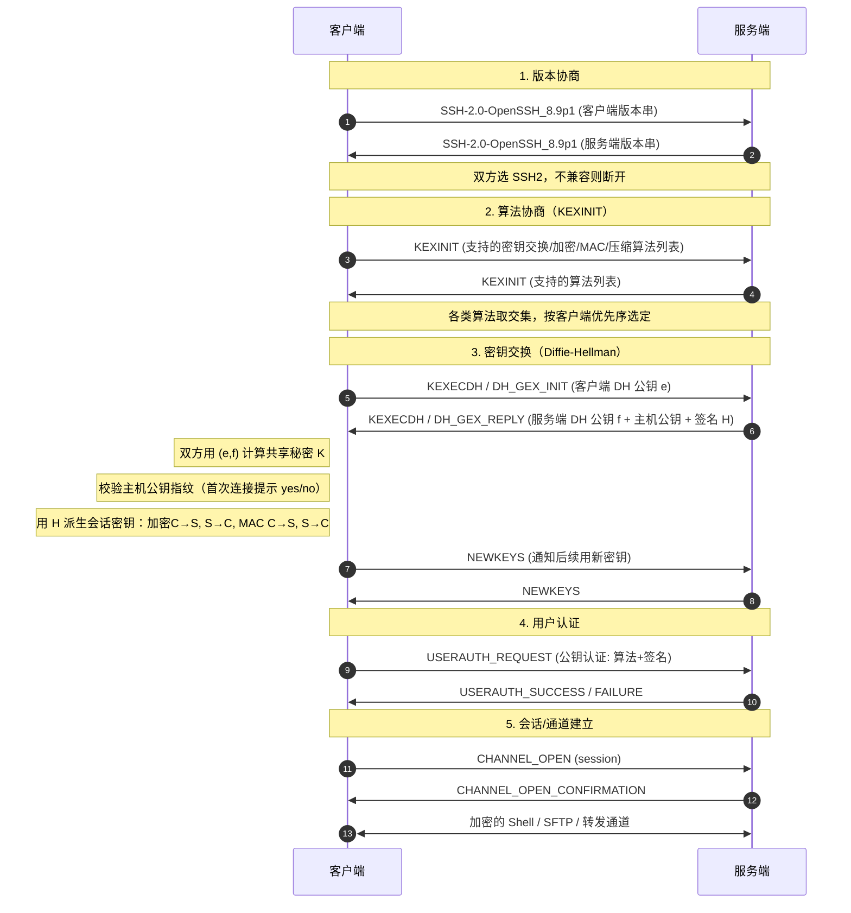
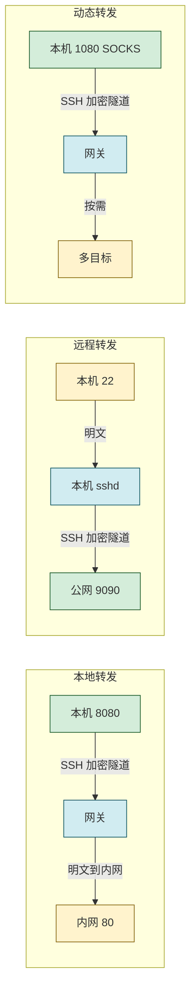

# 7.3 SSH 安全远程协议

> [!abstract] 本节概述
> Telnet、RSH、Rlogin、FTP 等早期远程协议明文传输口令与数据，在公网上一旦嗅探即告沦陷。SSH（Secure Shell）在 TCP 之上建立加密通道，承载远程登录、文件传输与端口转发，已成为系统管理的标准协议。本节先讲 SSH 协议分层与版本差异，再以**握手流程**（版本协商→算法协商→密钥交换→认证→会话）为主线，介绍三种认证方式与典型功能，最后给出安全配置实践。

## 安全视角

> [!info] 资产·信任边界·安全目标
> - **资产**：远程 Shell 会话、文件传输内容、服务器登录凭据、内网服务端口。
> - **信任边界**：管理员终端 ↔ 公网 ↔ 服务器 sshd；公网段不可信。
> - **攻击者能力**：嗅探流量、暴力破解口令、伪造服务器（中间人）、利用旧版漏洞（SSH1 CRC 补偿）、横向端口扫描。
> - **安全目标**：**机密性**（加密会话）、**完整性**（MAC）、**认证**（服务端主机认证 + 客户端用户认证）、**不可否认性**（日志）。
> - **前置条件**：客户端首次连接需校验主机公钥指纹；服务端配置认证策略与最小权限。
> - **缓解措施**：禁用 SSH1、禁用 root 登录、禁用口令认证、修改默认端口、限源访问、MFA、堡垒机审计。

## SSH 协议概述

> [!definition] SSH
> SSH 是基于 TCP 的安全远程协议，默认端口 **22**，提供加密的远程登录、命令执行、文件传输与端口转发。它替代了 Telnet/RSH/Rlogin/FTP 等明文协议，由 IETF 在 RFC 4251-4254 系列文档定义。

协议分层：

| 层 | 子协议 | 作用 |
| -- | ------ | ---- |
| 传输层 | SSH Transport Layer Protocol（RFC 4253） | 版本协商、算法协商、密钥交换、加密与 MAC |
| 认证层 | SSH Authentication Protocol（RFC 4252） | 客户端用户认证（口令/公钥/主机） |
| 连接层 | SSH Connection Protocol（RFC 4254） | 多路复用通道：会话、SCP/SFTP、端口转发 |

> [!note] 标准引用
> SSH 协议族规范：RFC 4251（架构）、RFC 4252（认证）、RFC 4253（传输层）、RFC 4254（连接层）；SFTP 为单独的 Internet-Draft；SCP 历史早于 SFTP，基于 BSD rcp 改造。

## SSH 版本：SSH1 vs SSH2

| 维度 | SSH1 | SSH2 |
| ---- | ---- | ---- |
| 当前状态 | **已废弃，不安全** | **当前标准** |
| 协议结构 | 单一协议 | 分层架构（传输/认证/连接） |
| 密钥交换 | 固定算法 | 协商（DH 组、ECDH 等） |
| 完整性 | CRC-32（弱，可被 CRC 补偿攻击绕过） | HMAC-SHA 系列、umac 等 |
| 漏洞 | CRC 补偿攻击、插入攻击、弱随机数 | 修复上述问题 |
| 扩展性 | 差，算法硬编码 | 强，可协商新算法 |

> [!warning] 必须禁用 SSH1
> SSH1 的 CRC-32 完整性校验可被绕过（CVE-2002-0083 等），且不支持现代密钥交换。OpenSSH 7.6（2017）起默认编译时移除 SSH1 支持。生产环境应显式在 `sshd_config` 设置 `Protocol 2`（旧版）或确保不启用 SSH1。

## SSH 握手流程

> [!tip] SSH 握手目标
> 与 TLS 类似，SSH 握手要解决四件事：**版本协商、算法协商、密钥交换（生成会话密钥）、（可选）服务端主机认证**。完成后进入认证阶段。



### 密钥派生

> [!definition] SSH 会话密钥派生
> DH 交换得到共享秘密 $K$ 与交换哈希 $H$，双方用 $H$ 与 $K$ 派生多个密钥：
> - 初始 IV（C→S、S→C）
> - 加密密钥（C→S、S→C）
> - 完整性密钥（C→S、S→C）
>
> 服务端在 KEXECDH_REPLY 中用**主机私钥**对 $H$ 签名，客户端据此完成**主机认证**——确认对端确实是该主机公钥对应的服务器，防中间人。

> [!note] 首次连接的指纹校验
> 首次连接时客户端尚未保存主机公钥，会提示 `The authenticity of host '...' can't be established` 并要求用户确认指纹（如 SHA256 哈希）。用户确认后公钥写入 `~/.ssh/known_hosts`，后续连接若公钥变化将告警"HOST KEY HAS CHANGED"，提示可能遭受中间人或服务器被替换。这是 SSH 抗 MITM 的关键。

## SSH 认证方式

| 认证方式 | 原理 | 安全性 | 典型用途 |
| -------- | ---- | ------ | -------- |
| 口令认证 | 客户端用会话密钥加密传输用户口令，服务端比对 `/etc/shadow` | 抗嗅探（加密），但**抗暴力破解弱** | 临时登录、未配密钥的用户 |
| 公钥认证 | 客户端用本地私钥对挑战签名，服务端用 `authorized_keys` 中的公钥验证 | **强**，无私钥不可登录，可加密保护私钥 | 自动化运维、生产标准 |
| 主机认证（host-based） | 基于客户端主机公钥+主机名+用户名信任，免密登录 | 需严格主机信任关系，少用 | 受控集群内互通 |
| 键盘交互 | 服务端发起多轮交互（如 OTP、MFA） | 可承载 MFA | 双因素场景 |
| GSSAPI | 基于 Kerberos 票据 | 依赖 KDC 域信任 | 企业域内单点登录 |

> [!tip] 公钥认证优于口令认证
> 公钥认证的私钥从不离开客户端，服务端只持有公钥，无口令可被暴力破解。生产环境应**禁用口令认证**（`PasswordAuthentication no`）并强制公钥认证，结合私钥口令短语与硬件密钥（如 FIDO2/ed25519-sk）进一步提升强度。

## SSH 功能

### 远程登录与命令执行

```bash
# 远程登录交互 Shell
ssh user@host.example.com

# 远程执行单条命令后返回
ssh user@host.example.com "uname -a; df -h"
```

### 文件传输：SCP 与 SFTP

| 工具 | 协议 | 特点 |
| ---- | ---- | ---- |
| SCP | 基于 SSH Connection 协议，类 rcp 语法 | 简单，但协议旧、不支持断点续传 |
| SFTP | 独立文件传输协议（运行于 SSH 通道） | 支持目录列表、断点续传、删除等完整文件操作，**推荐** |
| rsync over SSH | rsync + ssh 传输 | 增量同步、高效 |

```bash
# SCP 上传
scp report.pdf user@host.example.com:/data/reports/

# SFTP 交互
sftp user@host.example.com
sftp> put localfile /remote/path/
sftp> get /remote/file ./

# rsync 增量同步（通过 SSH）
rsync -avz --delete ./src/ user@host:/data/src/
```

### 端口转发

> [!definition] 端口转发
> SSH 端口转发通过加密隧道把端口流量从一端转发到另一端，常用于穿越防火墙、保护明文协议、访问内网服务。

| 类型 | 命令样式 | 方向 | 典型用途 |
| ---- | -------- | ---- | -------- |
| 本地转发（-L） | `ssh -L 8080:intranet:80 user@gateway` | 客户端本地端口 → 经网关 → 目标 | 通过跳板机访问内网 Web |
| 远程转发（-R） | `ssh -R 9090:localhost:22 user@public` | 远端端口 → 经本机 → 目标 | 内网反向暴露到公网（反弹） |
| 动态转发（-D） | `ssh -D 1080 user@gateway` | 本地 SOCKS5 代理，按需转发 | 临时代理多目标流量 |



> [!warning] 远程转发的滥用风险
> 远程转发（`-R`）能把内网服务反弹到公网服务器端口，绕过防火墙入站限制。这既是合法运维手段（如访问 NAT 后的服务器），也是常见横向渗透手法。运维应监控公网服务器异常监听端口，并限制 SSH 服务端 `GatewayPorts` 与 `AllowTcpForwarding`。

## SSH 安全配置

> [!tip] `sshd_config` 推荐基线
> ```text
> Protocol 2                       # 仅启用 SSH2（新版默认已移除 SSH1）
> PermitRootLogin no               # 禁止 root 直接登录，先普通用户再 sudo
> PasswordAuthentication no        # 禁用口令，强制公钥认证
> PubkeyAuthentication yes         # 启用公钥认证
> PermitEmptyPasswords no          # 禁止空口令
> MaxAuthTries 3                   # 限制认证尝试次数
> LoginGraceTime 30                # 限制未认证连接时长
> AllowUsers ops @10.1.0.0/16      # 仅允许指定用户/来源
> Port 22022                       # 修改默认端口（减少扫描噪音，非安全核心）
> ClientAliveInterval 300          # 空闲超时
> ClientAliveCountMax 0            # 不响应保活，强制超时断开
> X11Forwarding no                 # 不必要时关闭 X11 转发
> AllowTcpForwarding local         # 按需限制端口转发
> Banner /etc/ssh/banner           # 法律告警横幅
> ```
> 修改后用 `sshd -t` 校验语法，再 `systemctl reload sshd` 生效。

> [!note] 修改默认端口的安全意义
> 把端口从 22 改为非标准端口只能减少自动化扫描的噪音（"安全靠 obscurity 不是安全"），对定向攻击无效。它不是核心防护，但可显著降低日志中暴力破解噪音，便于真实告警浮现。核心防护仍是禁用口令、最小权限、限源访问、MFA。

## 案例：SSH 密钥认证配置实践

> [!example] 配置公钥认证登录
> **环境**：Ubuntu 22.04 LTS，OpenSSH 8.9，客户端为 Linux/macOS。
>
> **步骤**：
>
> 1. **客户端生成密钥对**（推荐 ed25519，比 RSA 更短更快）：
>    ```bash
>    ssh-keygen -t ed25519 -C "ops@example.com" -f ~/.ssh/id_ed25519
>    ```
>    交互式设置私钥口令短语（passphrase），私钥 `~/.ssh/id_ed25519`，公钥 `~/.ssh/id_ed25519.pub`。
>
> 2. **上传公钥到服务端 `authorized_keys`**：
>    ```bash
>    ssh-copy-id -i ~/.ssh/id_ed25519.pub user@host.example.com
>    ```
>    或手动追加公钥内容到服务端 `~/.ssh/authorized_keys`，确保权限 `~/.ssh` 为 700、`authorized_keys` 为 600。
>
> 3. **服务端禁用口令认证**（编辑 `/etc/ssh/sshd_config`）：
>    ```text
>    PubkeyAuthentication yes
>    PasswordAuthentication no
>    PermitRootLogin no
>    ```
>    校验并重载：`sshd -t && systemctl reload sshd`。
>
> 4. **首次连接校验主机指纹**：
>    ```bash
>    ssh user@host.example.com
>    # 首次提示指纹，确认后写入 known_hosts
>    ```
>
> 5. **加固私钥**：私钥设置 passphrase；高安全场景用硬件密钥（`ssh-keygen -t ed25519-sk`，FIDO2）。
>
> **效果**：暴力破解口令已无入口（口令认证关闭）；攻击者必须获得私钥文件本身才能尝试登录，配合私钥 passphrase 与硬件密钥形成多因素保护。

## 本节小结

- SSH 是端口 22 的安全远程协议，替代 Telnet/RSH/FTP；RFC 4251-4254 定义，分传输/认证/连接三层。
- SSH1 已不安全（CRC 补偿攻击等），SSH2 为当前标准，必须禁用 SSH1。
- 握手流程：版本协商 → 算法协商（KEXINIT）→ 密钥交换（DH/ECDH）→ NEWKEYS → 认证 → 会话；服务端用主机私钥对交换哈希签名完成主机认证。
- 认证方式：口令（抗嗅探但不抗暴力）、公钥（推荐，私钥不离机）、主机认证、键盘交互/GSSAPI；生产应禁用口令、强制公钥。
- 功能：远程登录、SCP/SFTP 文件传输、本地/远程/动态端口转发。
- 安全配置：禁 root、禁口令、限源、限认证次数、按需关端口转发；修改端口仅为降噪，非核心防护。

## 章节导航

- ⬆️ 上级：[[MOC - 第7章|第7章 安全通信协议 MOC]]
- ⬅️ 上一节：[[7.2 VPN 技术：IPSec、SSL VPN|7.2 VPN 技术：IPSec、SSL VPN]]
- ➡️ 下一节：[[7.4 无线网络安全 WPA2、WPA3|7.4 无线网络安全 WPA2/WPA3]]
- 📝 习题：[[MOC - 第7章习题|第7章 习题]]
