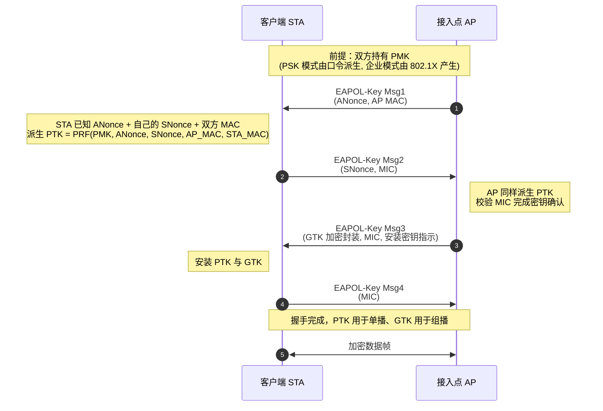
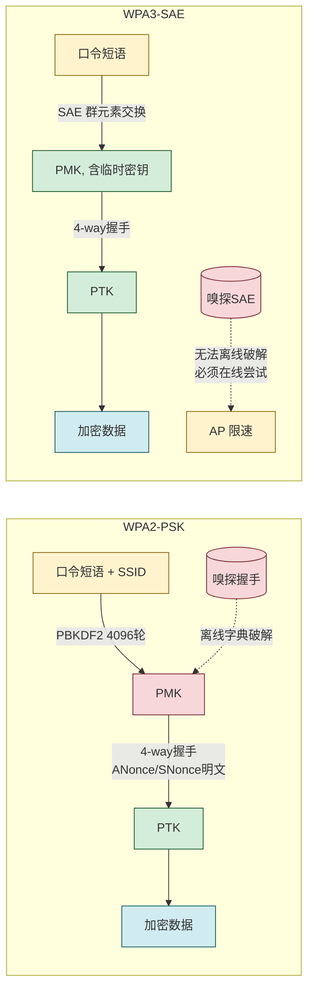

# 7.4 无线网络安全 WPA2/WPA3

> [!abstract] 本节概述
> 无线信道是广播介质，任何人在覆盖范围内均可嗅探，传统有线"物理边界即安全边界"完全失效。Wi-Fi 安全协议经历了 **WEP → WPA → WPA2 → WPA3** 四代演进，逐步修补加密弱点、引入强算法与抗离线字典攻击机制。本节以演进为主线，重点讲 **WPA2 的 4-way 握手与 CCMP**、**WPA3 的 SAE 与前向保密**，并对比四代协议的安全差异。

## 安全视角

> [!info] 资产·信任边界·安全目标
> - **资产**：无线接入凭证（PSK/用户账号）、空中传输数据、接入后内网可达性。
> - **信任边界**：无线信道（开放广播）↔ AP ↔ 有线内网；空中段不可信。
> - **攻击者能力**：被动嗅探全部帧、主动伪造/重放帧、离线字典攻击捕获的握手、伪造 AP（邪恶双子）、解关联攻击。
> - **安全目标**：**机密性**（空中加密）、**完整性**（防篡改）、**认证**（接入方与 AP 互相认证）、**前向保密**（WPA3 引入）。
> - **前置条件**：客户端与 AP 共享 PSK 或持有 802.1X 凭证；AP 与认证服务器（RADIUS）可达。
> - **缓解措施**：使用 WPA3 或 WPA2-Enterprise、长随机 PSK、关闭 WPS、802.1X 动态密钥、 rogue AP 检测。

## 无线安全演进概览

| 代次 | 标准来源 | 加密算法 | 认证方式 | 主要缺陷/改进 |
| ---- | -------- | -------- | -------- | -------------- |
| WEP | IEEE 802.11-1997 | RC4 流加密，24bit IV | 共享 WEP Key | IV 过短、密钥相关攻击，可在分钟级破解 |
| WPA | IEEE 802.11i 草案（2003） | TKIP（仍用 RC4，加 MIC+包计数器） | PSK / 802.1X | 过渡方案，修补 WEP 但仍依赖 RC4 |
| WPA2 | IEEE 802.11i-2004 | CCMP（AES-CCM） | PSK / 802.1X | 强加密，但 PSK 模式可离线字典攻击、无 PFS |
| WPA3 | Wi-Fi Alliance WPA3（2018） | CCMP / GCMP-256 | SAE（个人模式）/ 802.1X（企业模式） | 抗离线字典攻击、强制 PFS、192 位安全套件 |

> [!note] 标准引用
> WPA2 基于 IEEE 802.11i-2004；WPA3 由 Wi-Fi Alliance 于 2018 年发布，个人模式采用 SAE（Simultaneous Authentication of Equals，RFC 8386 描述的蜻蜓协议 Dragonfly），并入 IEEE 802.11-2016 后续修订。CCMP 全称 Counter Mode with CBC-MAC Protocol，基于 AES-CCM（RFC 3610）。

## WEP 缺陷

> [!definition] WEP（Wired Equivalent Privacy）
> IEEE 802.11-1997 定义的原始无线加密，使用 RC4 流密码与 24 位 IV（初始化向量）。

主要缺陷：

1. **IV 过短**：24 位空间仅约 1677 万个，繁忙网络数小时即重复，相同 IV + 相同密钥产生相同密钥流，可异或恢复明文。
2. **RC4 流加密弱点**：IV 直接拼在密钥前参与 RC4 调度，FMS/KoreK 攻击利用弱 IV 快速恢复主密钥。
3. **完整性弱**：使用 CRC-32 校验，线性可被篡改而不被发现。
4. **无双向认证**：仅共享密钥校验，无法识别伪造 AP。

> [!warning] WEP 已可在分钟级破解
> 工具如 Aircrack-ng 在足够流量下约 1-2 分钟可恢复 WEP 密钥。WEP 早被 IEEE 标记为废弃，现代设备不应再支持。任何仍运行 WEP 的网络视为不安全。

## WPA：TKIP 过渡方案

> [!definition] TKIP（Temporal Key Integrity Protocol）
> WPA 为兼容旧 WEP 硬件设计的过渡加密协议：保留 RC4 但引入**每包密钥混合（per-packet key mixing）**、**包计数器防重放**、**Michael 完整性校验（MIC）**，并把 IV 扩展到 48 位。

TKIP 修补了 WEP 的 IV 重复与重放问题，但：

- 仍基于 RC4，根算法弱点未根本解决。
- Michael MIC 强度有限，发现伪造时只能"关闭网络 60 秒"作为缓解。
- 2012 年起被 Wi-Fi Alliance 废止，WPA2 取而代之。

> [!note] WPA 的两种模式
> - **WPA-Personal（WPA-PSK）**：家庭/小型网络，AP 与客户端共享预共享密钥 PSK。
> - **WPA-Enterprise**：企业网络，使用 802.1X + EAP + RADIUS 做用户级认证，每个用户独立凭证。后续 WPA2/WPA3 沿用此划分。

## WPA2：CCMP 与 4-way 握手

### CCMP 加密

> [!definition] CCMP（Counter Mode with CBC-MAC Protocol）
> WPA2 强制加密协议，基于 **AES-CCM**（Counter with CBC-MAC）：Counter 模式提供机密性，CBC-MAC 提供完整性，使用 128 位 AES。同时替换了 WEP 的 RC4 与 WPA 的 TKIP，从根本上消除流密码相关问题。

| 维度 | TKIP（WPA） | CCMP（WPA2） |
| ---- | ----------- | ------------ |
| 算法 | RC4（流密码） | AES（分组密码） |
| 密钥长度 | 128 位（混合派生） | 128 位 |
| 完整性 | Michael MIC（弱） | CBC-MAC（强） |
| 防重放 | 48 位计数器 | 48 位包序号 |
| 性能 | 软件实现，较慢 | 可硬件加速，更快 |
| 安全性 | 过渡方案，已废止 | 强，当前主流 |

### PSK 模式 vs 企业模式

| 维度 | WPA2-Personal（PSK） | WPA2-Enterprise（802.1X） |
| ---- | -------------------- | ------------------------- |
| 认证依据 | 共享 PSK（口令短语） | 每用户独立账号（用户名+口令/证书） |
| 密钥来源 | PSK 派生 PMK | 802.1X/EAP 协商产生 PMK |
| 适用场景 | 家庭、小型办公 | 企业、园区、大型机构 |
| 用户隔离 | 弱（同 PSK 共享） | 强（每用户独立密钥） |
| 离线字典攻击 | **可被攻击**（捕获 4-way 握手即可） | 不可（需在线认证） |
| 撤销用户 | 需改全网 PSK | 仅禁用该用户账号 |
| 审计粒度 | 粗（仅识别设备） | 细（按用户） |

> [!definition] PMK 与 PTK
> - **PMK（Pairwise Master Key，成对主密钥）**：PSK 模式下由口令短语与 SSID 经 PBKDF2-HMAC-SHA1 派生（4096 轮）；企业模式下由 802.1X EAP 产生。
> - **PTK（Pairwise Transient Key，成对临时密钥）**：由 PMK、客户端随机数 ANonce、AP 随机数 SNonce、双方 MAC 地址经 PRF 派生，用于单播数据的加密与 MAC。**每次会话不同**。

### 4-way 握手

> [!warning] WPA2 PSK 的核心风险
> 4-way 握手在空中明文传递 ANonce、SNonce 与 MAC，攻击者嗅探到完整握手后即可**离线**对 PSK 进行字典/暴力破解——PSK 强度不足时分钟级沦陷。这是 WPA3 SAE 要解决的根本问题。

握手要点：

- **Msg1**：AP 发 ANonce，客户端据此可算 PTK。
- **Msg2**：客户端回 SNonce 并附 MIC（用 PTK 校验），AP 据此确认客户端持有正确 PMK。
- **Msg3**：AP 下发加密的 **GTK（Group Temporal Key，组临时密钥）** 用于组播/广播，并指示安装密钥。
- **Msg4**：客户端确认，握手完成。

> [!tip] KRACK 攻击与 4-way 握手
> 2017 年 Mathy Vanhoef 发现的 KRACK（Key Reinstallation Attack）通过重放 Msg3，迫使客户端重置 PTK 计数器，导致相同密钥流重用，可解密/篡改部分流量。这是**实现层**漏洞而非协议根本缺陷，需客户端打补丁。它说明协议安全也依赖正确实现。

## WPA3 改进

> [!definition] SAE（Simultaneous Authentication of Equals）
> WPA3 个人模式用 SAE 替代 WPA2-PSK 的 4-way 握手前置认证。SAE 基于蜻蜓（Dragonfly）协议，是一种**对等密码认证密钥交换**：双方用口令派生群元素并交换，最终协商出 PMK，整个过程对离线字典攻击免疫。

WPA3 主要改进：

1. **抗离线字典攻击**：SAE 强制攻击者必须**在线**与 AP 交互才能尝试口令，每次失败可被 AP 限速/锁定。即使捕获全部 SAE 交互，也无法离线穷举 PSK。
2. **前向保密（PFS）**：SAE 每次会话引入临时密钥材料，PMK 泄露或口令破解后过去会话仍不可解。
3. **192 位安全套件（WPA3-Enterprise 192-bit）**：企业模式提供 AES-256-GCM-256 / SHA-384 套件，满足美国 CNSA 套件要求，适用于高安全场景。
4. **OPP（Open Public Networks）缓解**：OWE（Opportunistic Wireless Encryption，RFC 8110）为开放网络提供无认证加密，替代无加密的开放 Wi-Fi。
5. **SAE 模式下向后兼容**：WPA3 与 WPA2 共存部署模式（WPA3-Personal Transition）便于渐进升级。

> [!warning] WPA3 过渡模式的妥协
> WPA3-Personal Transition 模式允许 AP 同时接受 WPA2-PSK 与 WPA3-SAE，便于兼容旧设备。但只要存在 WPA2-PSK 客户端，攻击者可降级攻击，迫使客户端走 PSK 路径再离线破解。因此应尽快淘汰 WPA2 客户端，最终切换为纯 WPA3。

### WPA2 PSK vs WPA3 SAE 流程对比

## 四代协议对比

| 维度 | WEP | WPA | WPA2 | WPA3 |
| ---- | --- | --- | ---- | ---- |
| 标准 | 802.11-1997 | 802.11i 草案 | 802.11i-2004 | WFA WPA3 (2018) |
| 加密 | RC4 | TKIP(RC4) | CCMP(AES-CCM) | CCMP/GCMP-256 |
| 完整性 | CRC-32 | Michael MIC | CBC-MAC | CBC-MAC/GMAC |
| IV 长度 | 24 bit | 48 bit | 48 bit 包序号 | 48 bit 包序号 |
| 认证 | 共享 WEP Key | PSK / 802.1X | PSK / 802.1X | SAE / 802.1X |
| 离线字典攻击 | 可（弱） | 可（PSK） | 可（PSK） | **不可（SAE）** |
| 前向保密 | 无 | 无 | 无 | **有** |
| 状态 | 废弃 | 废止（2012） | 当前主流 | 新标准，逐步普及 |

## 案例：企业 WLAN 802.1X 认证部署

> [!example] 某高校园区 WLAN 部署
> **背景**：园区数千师生需无线接入校园网，按身份（教师/学生/访客）授权不同网段；PSK 模式无法区分用户且离职后无法撤销。
>
> **资产与边界**：无线终端 ↔ 空中 ↔ AP ↔ 有线园区网 ↔ RADIUS 服务器 ↔ 身份目录（LDAP/AD）。
>
> **方案**：
> 1. **协议选型**：WPA2-Enterprise（CCMP/AES）+ 802.1X + EAP-PEAP；规划升级到 WPA3-Enterprise。
> 2. **认证流程**：
>    - 终端关联 AP → AP 触发 802.1X 端口认证；
>    - 终端与 RADIUS 通过 EAP-PEAP 协商（外层 TLS 隧道保护内层 MS-CHAPv2）；
>    - RADIUS 查询 LDAP 验证账号口令，返回 Accept 与授权 VLAN；
>    - AP 与终端执行 4-way 握手，派生每用户独立 PTK。
> 3. **授权隔离**：教师账号 → VLAN 10（可访问科研网）；学生账号 → VLAN 20（仅校园网）；访客账号 → VLAN 30（仅互联网）。不同 VLAN 间防火墙隔离。
> 4. **安全加固**：
>    - 证书：RADIUS 服务器持有可信 CA 签发证书，终端校验防伪造 AP。
>    - 账号生命周期：毕业/离职自动禁用，无需改全网密钥。
>    - 日志：认证日志入 SIEM，异常（短时间内多 MAC 同账号）触发告警。
>    - Rogue AP 检测：WIPS 监测未授权 AP 与邪恶双子。
> 5. **访客接入**：独立 SSID 用 WPA3-OWE 提供无认证加密，配合 Portal 短信验证。
>
> **效果**：用户身份与密钥分离，离职即时撤销；按身份授权 VLAN，最小权限；每用户独立 PTK，单点泄露不扩散；满足等保 2.0 三级对无线接入的身份认证与审计要求。

## 本节小结

- 无线信道广播特性使物理边界失效，需协议层加密+认证弥补。
- 演进：WEP（RC4+24bit IV，分钟级破解）→ WPA（TKIP 过渡）→ WPA2（CCMP/AES-CCM，强加密）→ WPA3（SAE，抗离线字典+PFS）。
- WPA2 PSK 模式可被离线字典攻击（捕获 4-way 握手即可），企业模式 802.1X 不可离线攻击且每用户独立密钥。
- 4-way 握手用 PMK + ANonce + SNonce + MAC 派生 PTK；KRACK 是实现层重放漏洞。
- WPA3 SAE 强制在线认证，抗离线字典并引入 PFS；过渡模式存在降级风险，应尽快纯 WPA3。
- 企业场景用 WPA2/WPA3-Enterprise + 802.1X + RADIUS，按身份授权 VLAN，配合证书、生命周期管理与 rogue AP 检测。

## 章节导航

- ⬆️ 上级：[[MOC - 第7章|第7章 安全通信协议 MOC]]
- ⬅️ 上一节：[[7.3 SSH 安全远程协议|7.3 SSH 安全远程协议]]
- 📝 习题：[[MOC - 第7章习题|第7章 习题]]
