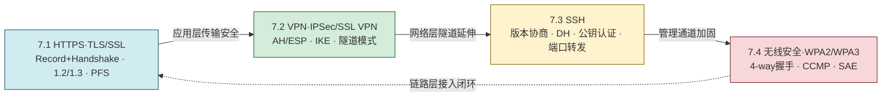

# MOC - 第7章 安全通信协议

> [!info] 本章定位
> 本章把密码学从"算法层"提升到"协议层"，回答"数据在**网络传输中**如何获得机密性、完整性、身份认证与不可否认性"。围绕四类典型场景组织四个小节：**Web 传输（HTTPS/TLS）→ 网络互联（VPN/IPSec）→ 远程管理（SSH）→ 无线接入（WPA2/WPA3）**，覆盖应用层、网络层、传输层与链路层的安全协议栈。
> - **承上**：[[MOC - 第2章|第2章 密码学基础]] 提供 AES/RSA/ECDHE/哈希/数字证书等算法基础，[[MOC - 第1章|第1章]] 的 CIA 三要素与[[2.5 数字签名、数字证书、PKI 体系|PKI 体系]]是本章握手与认证的理论支撑。
> - **启下**：[[MOC - 第6章|第6章 数据安全]] 处理数据**静态**安全，本章处理数据**传输中**安全，二者共同构成"全程加密"；[[MOC - 第8章|第8章 法律法规]] 把 TLS、等保加密传输要求与合规审计衔接。
> - **核心线索**：握手协商密钥 → 加密保护数据 → 认证对端身份 → 完整性防篡改 → 前向保密抗后续泄露。
> - **安全边界**：本章描述的协议标准引用 RFC，命令与配置仅在授权实验环境内使用；版本相关结论已注明标准版本号与核实范围。

## 本章学习路线

## 知识点导航

| 小节 | 文件 | 核心内容 | 关键概念/标准 |
| ---- | ---- | -------- | ------------- |
| 7.1 | [[7.1 HTTPS、TLS、SSL 握手流程]] | HTTPS 概念、TLS 分层、TLS 1.2/1.3 握手、RSA vs ECDHE、PFS、证书链 | TLS 1.2 RFC 5246、TLS 1.3 RFC 8446、ECDHE、PFS、X.509 |
| 7.2 | [[7.2 VPN 技术：IPSec、SSL VPN]] | VPN 概念、IPSec（AH/ESP/传输/隧道/IKE/SA）、SSL VPN、对比 | IPSec RFC 4301、ESP 4303、IKEv2 RFC 7296、SA、隧道模式 |
| 7.3 | [[7.3 SSH 安全远程协议]] | SSH 协议、SSH1/SSH2、握手流程、认证方式、SCP/SFTP/端口转发 | SSH RFC 4251-4254、Diffie-Hellman、公钥认证、端口 22 |
| 7.4 | [[7.4 无线网络安全 WPA2、WPA3]] | WEP→WPA→WPA2→WPA3 演进、4-way 握手、CCMP、SAE | IEEE 802.11i、WPA3 IEEE 802.11-2016、CCMP/AES-CCM、SAE、802.1X/EAP |

## 核心概念速查

| 概念 | 所属小节 | 一句话定义 |
| ---- | -------- | ---------- |
| HTTPS | 7.1 | HTTP over TLS/SSL，默认端口 443，提供 Web 传输机密性与身份认证 |
| TLS 记录协议 | 7.1 | 负责数据分片、压缩、加解密与 MAC，承载上层握手等子协议 |
| TLS 握手协议 | 7.1 | 协商加密套件、交换证书与密钥素材、导出会话密钥 |
| PFS | 7.1 | 前向保密，长期私钥泄露不危及过去会话，依赖 ECDHE 等临时密钥 |
| 0-RTT | 7.1 | TLS 1.3 恢复场景下首条请求即可携带应用数据，降低时延但有重放风险 |
| VPN | 7.2 | 在公共网络上建立的加密隧道，提供跨网段私密通信 |
| AH | 7.2 | IPSec 认证头，仅提供完整性+认证，不加密 |
| ESP | 7.2 | IPSec 封装安全载荷，提供加密+完整性 |
| SA | 7.2 | 安全关联，单向逻辑连接，由 SPI/DST/协议三元组标识 |
| IKE | 7.2 | IPSec 密钥交换协议，分阶段1（建 ISAKMP SA）与阶段2（建 IPSec SA） |
| 隧道模式 | 7.2 | 加密整个 IP 包并加新 IP 头，常用于 site-to-site VPN |
| SSH | 7.3 | 端口 22 的安全远程协议，替代 Telnet/RSH，提供加密通道 |
| 公钥认证 | 7.3 | SSH 基于非对称密钥对的认证方式，免口令、抗嗅探 |
| 端口转发 | 7.3 | 通过 SSH 隧道转发本地/远程/动态端口，穿越防火墙 |
| WEP | 7.4 | 早期无线加密，IV 过短+RC4 流加密缺陷，已淘汰 |
| TKIP | 7.4 | WPA 过渡方案，临时密钥+包计数器，兼容旧硬件 |
| CCMP | 7.4 | WPA2 使用的 AES-CCM 模式，提供加密+完整性 |
| 4-way 握手 | 7.4 | WPA2 中 AP 与客户端派生成对临时密钥 PTK 的四步交互 |
| SAE | 7.4 | WPA3 对等同步认证，抗离线字典攻击并提供前向保密 |
| 802.1X/EAP | 7.4 | 企业无线认证框架，基于端口认证与 RADIUS 服务器 |

## 核心考点

> [!warning] 高频考点（8 点）
> 1. **TLS 分层与握手目标**：记录协议承载数据加解密，握手协议协商套件与密钥；握手要解决"协商算法、验证身份、交换密钥素材、导出会话密钥"四件事。
> 2. **TLS 1.2 完整握手流程**：ClientHello→ServerHello→Certificate→ServerKeyExchange→ServerHelloDone→ClientKeyExchange→ChangeCipherSpec→Finished（双向），是简答与协议分析题的必考点。
> 3. **TLS 1.2 vs TLS 1.3**：1-RTT/0-RTT、强制 PFS（移除 RSA 密钥交换与静态 DH）、移除 MD5/RC4/CBC 等弱算法、握手消息加密、合并多余消息；高频对比题。
> 4. **RSA vs ECDHE 密钥交换与 PFS**：RSA 密钥交换无 PFS（私钥泄露可解历史流量），ECDHE 用临时密钥对实现 PFS；理解为何 TLS 1.3 强制 ECDHE。
> 5. **IPSec 协议栈**：AH（完整性+认证，不加密）vs ESP（加密+完整性）；传输模式（保护载荷）vs 隧道模式（保护整个 IP 包）；IKE 两阶段与 SA 概念。
> 6. **IPSec vs SSL VPN 对比**：网络层 vs 应用层、客户端 vs 浏览器、全网络访问 vs 按应用授权、NAT 穿越能力、运维复杂度。
> 7. **SSH 握手与认证**：版本协商→算法协商→DH 密钥交换→认证→会话；口令/公钥/主机认证的差别；SSH1 已不安全，SSH2 为标准。
> 8. **无线安全演进与 4-way 握手**：WEP 缺陷（IV 24bit+RC4）→WPA/TKIP→WPA2/CCMP→WPA3/SAE；WPA2 4-way 握手派生 PTK 的流程；WPA3 SAE 抗离线字典攻击与 PFS。

## 与其他章节的关联

- [[MOC - 第1章|第1章 信息安全基础概论]]：CIA 三要素是本章协议安全目标的来源；TLS/SSH 同时提供机密性、完整性、认证。
- [[MOC - 第2章|第2章 密码学基础]]：AES/RC4 提供对称加密、RSA/ECDHE 提供密钥交换与认证、SHA 提供完整性、[[2.5 数字签名、数字证书、PKI 体系|PKI/X.509 证书]]支撑 TLS 证书链。
- [[MOC - 第3章|第3章 身份认证与访问控制]]：SSH 公钥认证、WPA2 企业模式 802.1X/EAP、TLS 双向认证都属于身份认证落地。
- [[MOC - 第4章|第4章 网络攻击与防御技术]]：[[4.3 ARP 欺骗、中间人攻击|中间人攻击]]是 TLS 证书校验的对抗对象；[[4.4 Web 安全：SQL 注入、XSS、CSRF|HTTPS]] 是 Web 安全传输基线。
- [[MOC - 第6章|第6章 数据安全与存储安全]]：本章传输中安全与第6章静态安全互补，构成"全程加密"。
- [[MOC - 第8章|第8章 法律法规与运维规范]]：等保 2.0 三级要求"通信传输完整性、机密性"；TLS 与 IPSec 是合规落地的核心协议。

## 章节导航

- ⬆️ 上级：[[MOC - 信息安全技术|信息安全技术 MOC]]
- ⬅️ 上一章：[[MOC - 第6章|第6章 数据安全与存储安全]]
- ➡️ 下一章：[[MOC - 第8章|第8章 信息安全法律法规与运维规范]]
- 📝 习题：[[MOC - 第7章习题|第7章 习题]]
