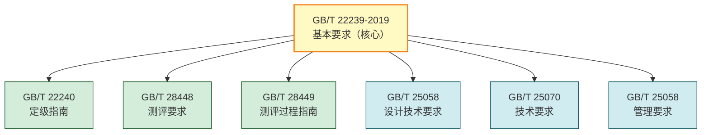
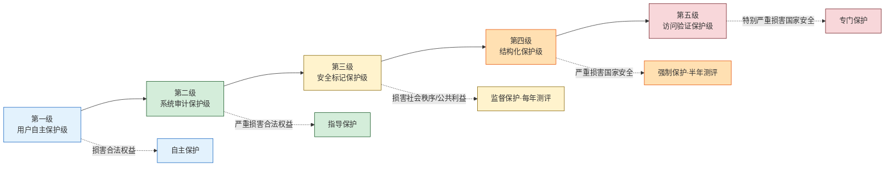
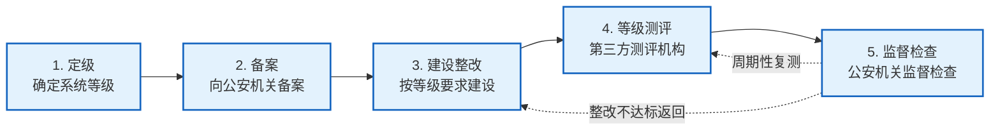
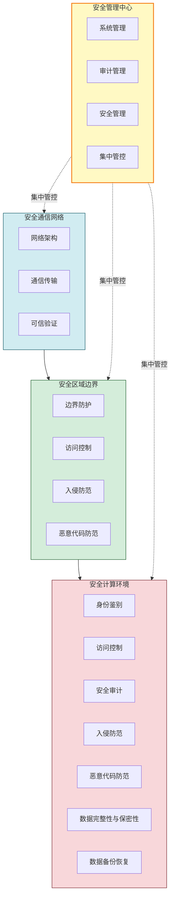

# 8.2 等保 2.0 基本概念

> [!abstract] 本节概述
> 网络安全等级保护制度（简称"等保"）是我国《网络安全法》确立的**法定强制制度**，要求网络运营者按信息系统的重要程度分等级履行安全保护义务。等保 2.0 以 **GB/T 22239-2019《信息安全技术 网络安全等级保护基本要求》** 为核心标准，相比等保 1.0 新增云计算、移动互联、物联网、工控系统、大数据五个扩展场景，从"被动防御"转向"主动防御、综合防控"。本节梳理等保 2.0 的标准体系、五级划分、定级流程与安全通用要求，并以某三级系统测评实践落地。

## 安全视角

> [!info] 资产·信任边界·安全目标
> - **资产**：信息系统及其承载的业务数据、网络设施、应用服务。
> - **信任边界**：系统边界（与互联网/合作伙伴的边界）、内部安全域（DMZ/核心区/管理区）。
> - **安全目标**：按等级落实技术与管理控制，达到"合法合规、风险可控"。
> - **前置条件**：理解 [[8.1 网络安全法、数据安全法、个人信息保护法基础|8.1 网络安全法]] 确立的等级保护法定义务。
> - **缓解措施**：定级备案、建设整改、等级测评、监督检查的闭环管理。

## 一、等保 2.0 标准体系

> [!note] 核心标准
> - 主标准：**GB/T 22239-2019《信息安全技术 网络安全等级保护基本要求》**（2019-05-10 发布，**2019-12-01 实施**）
> - 配套标准：GB/T 22240（定级指南）、GB/T 28448（测评要求）、GB/T 28449（测评过程指南）、GB/T 25058（设计技术要求）等。
> - 核实日期：本节标准条款以 2019 版为准，后续若有修订需另行核实。

等保 2.0 标准体系由"**一个核心、多个配套**"构成：

## 二、等级划分：五级保护

> [!definition] 等级保护五级
> 信息系统的安全保护等级由受到破坏后对客体（公民、法人、其他组织、国家安全、社会秩序、公共利益、合法权益）的侵害程度决定，分为五级，保护强度逐级递增。

| 等级 | 名称 | 保护对象受破坏后的侵害程度 | 适用系统 | 监管要求 |
| ---- | ---- | -------------------------- | -------- | -------- |
| **第一级** | 用户自主保护级 | 损害公民、法人合法权益（不损害国家安全与社会秩序） | 一般小型内部系统 | 自主保护 |
| **第二级** | 系统审计保护级 | 严重损害公民、法人合法权益，或损害社会秩序、公共利益 | 一般业务系统 | 指导保护 |
| **第三级** | 安全标记保护级 | 严重损害社会秩序、公共利益，或损害国家安全 | 重要业务系统、CII | **监督保护**，每年测评一次 |
| **第四级** | 结构化保护级 | 特别严重损害社会秩序、公共利益，或严重损害国家安全 | 关键核心系统 | **强制保护**，每半年测评一次 |
| **第五级** | 访问验证保护级 | 特别严重损害国家安全 | 极端重要系统 | 专门保护 |

> [!tip] 实务中的等级分布
> - 绝大多数企业业务系统定级为**二级或三级**；
> - **三级是常见分水岭**：达到三级即被认定为重点保护对象，需每年开展等级测评，监管强度显著上升；
> - 第四级、第五级涉及国家安全，普通企业较少触及；
> - 关键信息基础设施通常不低于三级。

## 三、等保 2.0 vs 等保 1.0

> [!note] 版本演进
> 等保 1.0 以 GB/T 22239-2008 为核心，聚焦传统信息系统；等保 2.0（2019 版）适应新技术发展，扩展了多个场景，并强化了主动防御与安全管理。

| 维度 | 等保 1.0（2008） | 等保 2.0（2019） |
| ---- | ---------------- | ---------------- |
| **标准号** | GB/T 22239-2008 | **GB/T 22239-2019** |
| **保护对象** | 传统信息系统 | 信息系统 + 云计算、移动互联、物联网、工控系统、大数据 |
| **防御理念** | 被动防御 | **主动防御、综合防控** |
| **安全要求结构** | 物理/网络/主机/应用/数据 + 管理 | 通用要求 + 五个**扩展要求** |
| **技术要求维度** | 物理安全、网络安全、主机安全、应用安全、数据安全 | **物理与环境安全、通信网络安全、区域边界安全、设备计算安全、应用与数据安全** |
| **新增内容** | — | 集中管控、恶意代码防范扩展、个人信息保护、可信验证 |
| **测评周期** | 三级每年一次、四级半年一次 | 沿用，监管更严格 |

> [!warning] 等保 2.0 的"四新"
> 1. **新场景**：云、移动互联、物联网、工控、大数据五个扩展；
> 2. **新结构**：技术要求从"五大维度"重组为"通信网络-区域边界-计算环境-安全管理中心"的"一个中心三重防御"；
> 3. **新理念**：强调主动防御、可信验证、集中管控；
> 4. **新要求**：增加个人信息保护、供应链安全、恶意代码防范扩展等条款。

## 四、定级流程

> [!definition] 等保五步法定流程
> 信息系统安全等级保护工作分为**定级、备案、建设整改、等级测评、监督检查**五个阶段，构成闭环管理。

| 阶段 | 内容 | 责任主体 |
| ---- | ---- | -------- |
| **定级** | 依据 GB/T 22240 确定系统等级，组织专家评审 | 信息系统运营、使用单位 |
| **备案** | 第二级及以上系统向所在地**设区的市级及以上公安机关**备案，取得备案证明 | 运营单位 |
| **建设整改** | 按等级要求进行安全建设与整改，制定安全方案 | 运营单位 + 集成商 |
| **等级测评** | 委托**公安部认可的第三方测评机构**开展测评，出具测评报告 | 运营单位 + 测评机构 |
| **监督检查** | 公安机关对运营单位履责情况监督检查 | 公安机关 |

> [!warning] 备案与测评的时间要求
> - **备案**：确定等级后 30 个工作日内向公安机关备案；
> - **测评**：第三级系统**每年至少一次**、第四级系统**每半年至少一次**；
> - 测评未达标的需限期整改，整改后复测。

## 五、安全通用要求

等保 2.0 安全要求 = **安全通用要求** + **安全扩展要求**（云/移动/物联网/工控/大数据按需选用）。通用要求分技术要求与管理要求两大类。

### 1. 技术要求："一个中心、三重防御"

| 技术维度 | 关键控制点 |
| -------- | ---------- |
| **物理与环境安全** | 机房选址、防震防火、温湿度控制、电力供应、电磁防护 |
| **通信网络安全** | 网络架构、通信传输加密、可信验证 |
| **区域边界安全** | 边界防护、访问控制、入侵防范、恶意代码防范、安全审计 |
| **计算环境安全** | 身份鉴别、访问控制、安全审计、入侵防范、数据完整性与保密性、数据备份恢复、剩余信息保护、个人信息保护 |
| **安全管理中心** | 系统管理、审计管理、安全管理、**集中管控** |

### 2. 管理要求

| 管理维度 | 关键内容 |
| -------- | -------- |
| **安全管理制度** | 管理制度制定、评审与发布（详见 [[8.5 安全管理制度建设\|8.5 安全管理制度建设]]） |
| **安全管理机构** | 岗位设置、人员配备、授权与审批、沟通与合作、审核与检查 |
| **安全管理人员** | 人员录用、人员考核、安全意识教育与培训、离岗 |
| **安全建设管理** | 定级备案、安全方案设计、产品采购、软件开发、工程实施、测试验收、系统交付 |
| **安全运维管理** | 环境管理、资产管理、介质管理、设备维护、漏洞与风险管理、网络与系统安全管理、恶意代码防范、密码管理、变更管理、备份与恢复、安全事件处置、应急预案管理 |

> [!tip] 等保是"技术 + 管理"双轮驱动
> 等保 2.0 的核心思想是"**三分技术、七分管理**"。仅有技术手段而无制度落地，无法通过测评；反之亦然。这与 [[8.5 安全管理制度建设|8.5]] 的制度体系建设直接呼应。

## 六、案例：某信息系统等保三级测评实践

> [!example] 某政务信息系统等保三级测评
> **背景**：某市政务审批系统面向公众办理行政审批，存储大量公民身份、办事记录等个人信息，被定为**第三级**。
>
> **资产与边界**：互联网入口（WAF/负载均衡）↔ 应用区（审批应用）↔ 数据区（数据库）↔ 管理区（堡垒机/安全管理中心）。
>
> **测评准备**：
> 1. 完成定级备案，取得公安备案证明；
> 2. 委托具备公安部认证资质的测评机构；
> 3. 提供网络拓扑、资产清单、安全管理制度、配置基线等材料。
>
> **测评过程（关键技术核查点）**：
>
> | 测评维度 | 核查内容 | 典型不符合项 |
> | -------- | -------- | ------------ |
> | 通信网络 | 网络是否划分安全域、关键链路是否加密 | 未做 VLAN 隔离 |
> | 区域边界 | 边界防火墙、IPS、WAF 是否部署并启用 | WAF 仅旁路未阻断 |
> | 计算环境 | 身份鉴别是否双因素、密码复杂度、审计是否覆盖 | 数据库仅口令登录、审计未开启 |
> | 数据安全 | 数据备份策略、传输加密、敏感字段加密 | 身份证号明文存储 |
> | 安全管理中心 | 是否部署集中日志/态势感知 | 日志分散、无集中管控 |
> | 管理制度 | 是否有完整安全策略、应急演练记录 | 制度缺失、无演练记录 |
>
> **整改要点**：
> 1. 网络分域：划分互联网区、应用区、数据区、管理区，区间启用防火墙策略；
> 2. 数据库开启审计并对接日志平台，管理员登录启用双因素；
> 3. 敏感字段（身份证号、手机号）字段级加密 + [[6.1 数据分级分类、数据脱敏|脱敏]] 展示；
> 4. 部署 SIEM 集中收集日志，留存 6 个月以上（衔接 [[8.3 安全审计、日志管理|8.3]]）；
> 5. 完善安全管理制度体系，每半年组织应急演练（衔接 [[8.4 应急响应、安全事件处置流程|8.4]]、[[8.5 安全管理制度建设|8.5]]）。
>
> **结果**：整改后复测达到"基本符合"，取得等级测评报告，报公安机关备查，系统合规上线。
>
> **启示**：等保测评不是"走过场"，技术与管理必须同步达标；测评报告中的不符合项是整改路线图。

## 本节小结

- 等保 2.0 以 GB/T 22239-2019 为核心，是《网络安全法》法定的强制制度。
- 五级保护：用户自主→系统审计→安全标记→结构化→访问验证，强度递增；三级是常见分水岭，每年测评。
- 等保 2.0 相比 1.0 新增云、移动互联、物联网、工控、大数据五个扩展，从被动防御转向主动防御。
- 定级流程：定级→备案→建设整改→等级测评→监督检查，五步闭环。
- 安全要求 = 通用要求 + 扩展要求；技术要求按"一个中心、三重防御"组织，管理要求覆盖制度、机构、人员、建设、运维。

## 章节导航

- ⬆️ 上级：[[MOC - 第8章|第8章 信息安全法律法规与运维规范 MOC]]
- ⬅️ 上一节：[[8.1 网络安全法、数据安全法、个人信息保护法基础|8.1 三法基础]]
- ➡️ 下一节：[[8.3 安全审计、日志管理|8.3 安全审计、日志管理]]
- 📝 习题：[[MOC - 第8章习题|第8章 习题]]
