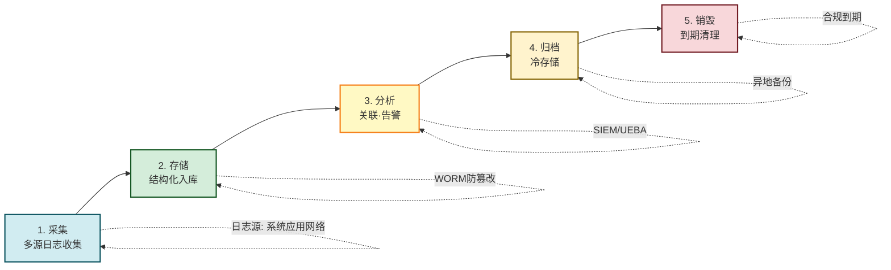
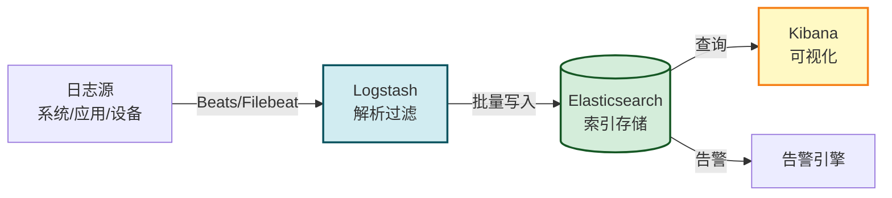
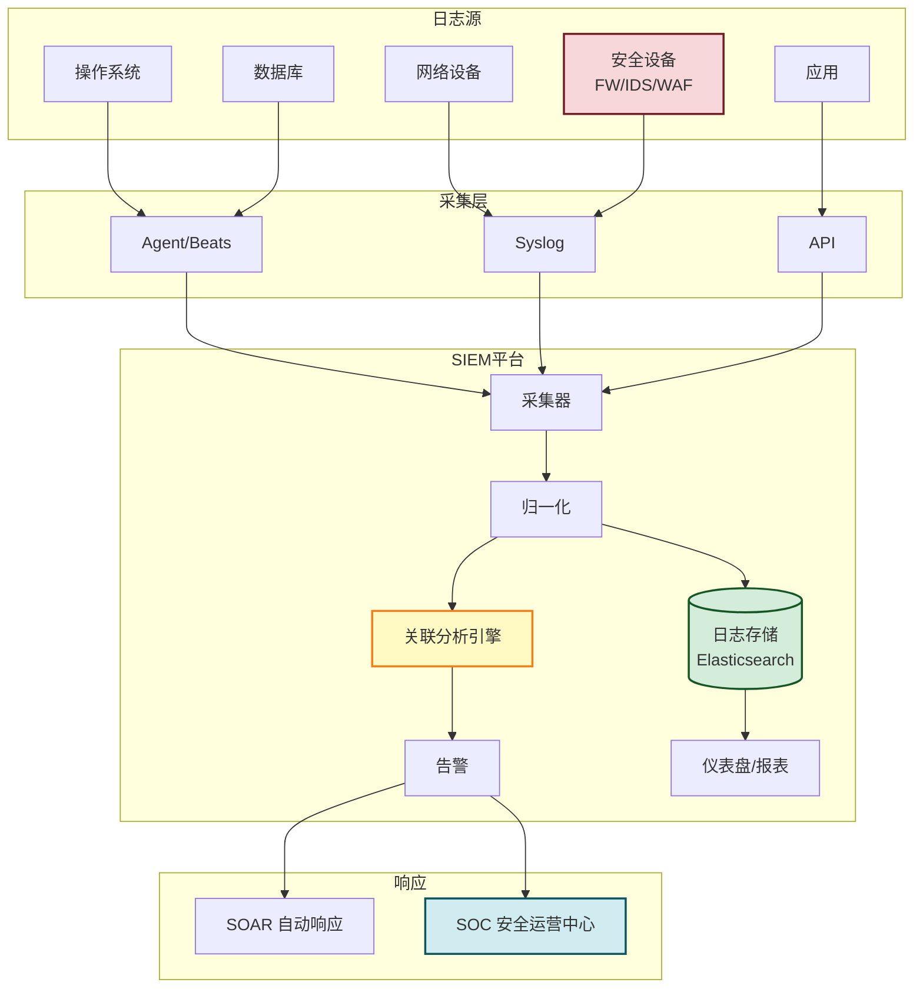

# 8.3 安全审计、日志管理

> [!abstract] 本节概述
> 安全审计与日志管理是"事后追溯、合规取证、入侵检测辅助"的基石。《网络安全法》第 21 条要求**网络日志留存不少于六个月**，等保 2.0 进一步要求审计覆盖、防篡改、异地备份与集中管控。本节从审计目的出发，梳理审计日志的内容要素、日志管理生命周期、主流日志收集技术（Syslog、Windows Event Log、ELK Stack），以及 SIEM 安全信息事件管理的架构与流程，最后以企业 SIEM 平台实践落地。

## 安全视角

> [!info] 资产·信任边界·安全目标
> - **资产**：审计日志本身（泄露即暴露行为模式）、业务系统、安全事件证据链。
> - **信任边界**：日志产生源（系统/应用）↔ 日志采集器 ↔ 日志存储/分析平台 ↔ 审计员。
> - **安全目标**：保证日志的**完整性**（不被篡改/删除）、**可用性**（可检索可追溯）、**机密性**（敏感日志不外泄）。
> - **前置条件**：理解 [[8.1 网络安全法、数据安全法、个人信息保护法基础|8.1 法定日志留存义务]] 与 [[8.2 等保 2.0 基本概念|8.2 等保审计要求]]。
> - **缓解措施**：日志加密传输、签名校验、访问控制、异地备份、WORM 不可变存储。

## 一、安全审计的目的

> [!definition] 安全审计
> 安全审计是对信息系统中的用户活动、系统行为进行**记录、分析与审查**的过程，目的是事后追溯、合规取证、入侵检测辅助与责任认定。

| 审计目的 | 说明 | 典型场景 |
| -------- | ---- | -------- |
| **事后追溯** | 发生安全事件后还原"谁在何时做了什么" | 排查越权访问、数据泄露源头 |
| **合规要求** | 满足法律法规与行业标准对日志留存的要求 | 等保 2.0、网安法 6 个月留存 |
| **入侵检测辅助** | 通过日志关联分析发现异常行为模式 | SIEM 关联告警、UEBA 行为分析 |
| **责任认定** | 基于不可抵赖的审计记录认定责任人 | 内部违规调查、司法取证 |
| **运维改进** | 通过日志发现系统瓶颈与配置缺陷 | 性能调优、容量规划 |

> [!warning] 审计日志的"不可否认性"
> 审计日志要发挥法律效力，必须满足**不可否认性**：日志生成后任何人都无法篡改或删除而不被发现。这要求日志系统具备防篡改机制（签名、WORM、异地副本），且日志中应包含可靠的时间戳与身份标识。

## 二、审计日志的内容要素

> [!definition] 审计日志六要素
> 一条有效的安全审计日志至少应包含**时间戳、用户 ID、操作类型、操作对象、操作结果、源地址**六个核心要素，缺一不可。

| 要素 | 说明 | 示例 |
| ---- | ---- | ---- |
| **时间戳** | 精确到秒（必要时毫秒），应使用 NTP 同步统一时间 | `2026-08-03T14:23:05+08:00` |
| **用户 ID** | 操作主体的唯一标识 | `zhangsan` / `uid=1024` |
| **操作类型** | 登录、读取、修改、删除、导出、配置变更 | `LOGIN_SUCCESS` / `DELETE` |
| **操作对象** | 被操作的资源 | `/data/customer.csv` |
| **操作结果** | 成功/失败及失败原因 | `SUCCESS` / `FAIL:permission_denied` |
| **源地址** | 操作发起的 IP/主机 | `10.20.30.40` |

> [!tip] 日志要素的完整性决定追溯能力
> 缺少时间戳无法排序，缺少用户 ID 无法定责，缺少源地址无法定位攻击源，缺少结果无法区分"尝试"与"成功"。等保 2.0 测评中，日志要素不全是典型不符合项。

## 三、日志管理生命周期

| 阶段 | 关键要求 |
| ---- | -------- |
| **采集** | 覆盖操作系统、数据库、应用、网络设备、安全设备；统一格式（如 JSON/CEF） |
| **存储** | 结构化入库；时间同步；防篡改（WORM/签名）；按等保留存≥6 个月 |
| **分析** | 实时关联规则、统计基线、UEBA 行为分析；产生告警 |
| **归档** | 冷存储降本；异地备份防丢失；加密保护 |
| **销毁** | 到期安全销毁；销毁记录留存 |

## 四、日志收集技术

### 1. Syslog

> [!definition] Syslog
> Syslog 是 UNIX/Linux 系统与网络设备最广泛使用的**日志协议**（RFC 5424），采用 UDP/TCP 514 端口传输，日志按**设施（Facility）**和**严重级别（Severity）**分类。

| 严重级别 | 名称 | 含义 |
| -------- | ---- | ---- |
| 0 | Emergency | 系统不可用 |
| 1 | Alert | 必须立即处理 |
| 2 | Critical | 严重情况 |
| 3 | Error | 错误 |
| 4 | Warning | 警告 |
| 5 | Notice | 正常但重要 |
| 6 | Informational | 信息 |
| 7 | Debug | 调试 |

> [!note] Syslog 的局限
> 原生 Syslog 通过明文 UDP 传输，缺乏完整性与保密性保护。生产环境通常使用 **Syslog over TLS（RFC 5425）** 或转发到集中日志平台统一保护。

### 2. Windows Event Log

> [!definition] Windows 事件日志
> Windows 系统通过**事件日志（Event Log）** 记录系统、安全、应用三类事件，安全日志记录登录、对象访问、权限使用等审计事件。

| 日志类型 | 内容 |
| -------- | ---- |
| **System** | 系统服务、驱动事件 |
| **Security** | 登录成功/失败、对象访问、特权使用、账户管理 |
| **Application** | 应用程序事件 |
| **Setup** | 安装相关事件 |
| **Forwarded Events** | 转发事件（用于集中收集） |

通过 `wevtutil` 或 PowerShell `Get-EventLog`/`Get-WinEvent` 可查询；常用 **Windows Event Forwarding (WEF)** 将日志集中到订阅服务器。

### 3. ELK Stack

> [!definition] ELK Stack
> ELK 是开源日志分析平台的事实标准，由 **Elasticsearch（搜索存储）+ Logstash（采集解析）+ Kibana（可视化）** 组成，常加入 Beats（轻量采集器）构成 EFK/ELK 体系。

| 组件 | 角色 |
| ---- | ---- |
| **Beats** | 轻量采集器，部署在各主机，转发日志 |
| **Logstash** | 日志解析、过滤、转换管道 |
| **Elasticsearch** | 分布式搜索引擎，存储与检索 |
| **Kibana** | Web 可视化与仪表盘 |

> [!tip] ELK 是 SIEM 的基础
> ELK 提供采集-存储-可视化的能力，但不内置安全关联规则。在 ELK 之上叠加规则引擎、告警、威胁情报即构成轻量 SIEM（如 Elastic Security）。商业 SIEM 通常在 ELK 类似架构上增加合规包与场景化规则。

## 五、日志保护要求

> [!warning] 等保 2.0 日志保护硬性要求
> - **留存期限**：网络日志留存**不少于六个月**（《网络安全法》第 21 条 + 等保 2.0）；
> - **防篡改**：审计日志应受到保护，避免未预期的访问、修改或删除；
> - **异地备份**：关键日志应异地备份，防止本地灾难导致日志丢失；
> - **集中管控**：三级及以上系统应建立集中日志/审计平台；
> - **权限分离**：审计员权限与系统管理员权限分离，避免"自己审自己"。

| 风险 | 防护措施 |
| ---- | -------- |
| 攻击者删日志灭迹 | WORM 不可变存储、日志实时转发到隔离平台 |
| 日志被篡改 | 哈希链/签名校验、区块链存证 |
| 本地灾难丢失日志 | 异地实时备份、云上冷归档 |
| 日志含敏感信息泄露 | 日志脱敏、传输加密、访问审计 |
| 日志膨胀难检索 | 分层存储（热-温-冷）、按需归档 |

## 六、SIEM 安全信息事件管理

> [!definition] SIEM
> SIEM（Security Information and Event Management，安全信息与事件管理）是集中采集全网日志、进行**关联分析与告警**的安全运营平台，由 SIM（信息管理）与 SEM（事件管理）融合而来。

### SIEM 核心能力

| 能力 | 说明 |
| ---- | ---- |
| **日志采集** | 多源异构日志统一接入（Syslog、Agent、API） |
| **归一化** | 不同设备日志格式统一为标准模型（如 CEF/LEEF） |
| **关联分析** | 基于规则、统计、行为分析的跨源关联 |
| **告警** | 命中规则产生告警，分级分派处置 |
| **报表合规** | 等保、PCI-DSS 等合规报表自动生成 |
| **威胁情报** | 接入 IOC 情报匹配已知威胁 |
| **取证检索** | 全量日志快速检索，支持事后取证 |

### SIEM 日志管理架构

> [!tip] SIEM 与 SOC 的关系
> - **SIEM** 是工具平台，负责采集、分析、告警；
> - **SOC（安全运营中心）** 是组织与流程，由人（分析师）+ 流程（处置 SOP）+ 工具（SIEM/SOAR）构成；
> - 工具不会自动解决安全问题，必须有 SOC 团队对告警进行研判与处置，否则告警只是"噪音"。

## 七、案例：企业 SIEM 日志审计平台实践

> [!example] 某金融企业 SIEM 平台建设
> **背景**：某银行核心系统等保三级，监管要求集中审计、6 个月日志留存、安全事件分钟级响应，决定建设 SIEM 平台。
>
> **资产与边界**：分行网络 ↔ 总行数据中心 ↔ 云上日志平台（隔离域）。
>
> **平台架构**：
> 1. **采集层**：部署 Filebeat/Auditd 采集操作系统日志；数据库审计插件采集 SQL；网络设备与安全设备通过 Syslog 转发；应用通过 API 推送业务审计日志；
> 2. **处理层**：Logstash 解析归一化为 CEF 格式，按等保要求补全六要素；
> 3. **存储层**：Elasticsearch 集群热数据 30 天 + 冷数据归档 6 个月以上，启用 WORM 锁定防篡改；
> 4. **分析层**：内置 200+ 等保与金融场景规则，叠加 UEBA 行为基线；接入威胁情报匹配 IOC；
> 5. **响应层**：告警分级分派到 SOC，高危告警经 SOAR 自动隔离主机/封禁 IP。
>
> **典型告警场景**：
>
> | 场景 | 关联规则 | 响应 |
> | ---- | -------- | ---- |
> | 暴力破解 | 1 分钟内同 IP 登录失败≥10 次 | 自动封禁 IP 30 分钟 |
> | 越权访问 | 普通用户访问 L4 数据目录 | 告警 + 二次验证 |
> | 异常导出 | 单用户 10 分钟内导出≥1 万条记录 | 告警 + 暂停导出权限 |
> | 横向移动 | 同主机多账号登录 + 端口扫描 | 高危告警 + 主机隔离 |
> | 数据外传 | 大量数据上传到未知外部 IP | 高危告警 + 防火墙阻断 |
>
> **效果**：
> - 日志合规留存 12 个月，等保测评一次通过；
> - 平均检测时间（MTTD）从 4 小时降至 5 分钟；
> - 内部违规行为可追溯定责，违规事件下降 60%。
>
> **启示**：SIEM 的价值不在平台本身，而在"规则 + 情报 + SOC 运营"的持续优化；规则需随业务与威胁演进迭代，否则会产生大量误报。

## 本节小结

- 安全审计目的：事后追溯、合规要求、入侵检测辅助、责任认定；审计日志须具备不可否认性。
- 审计日志六要素：时间戳、用户 ID、操作类型、操作对象、操作结果、源地址。
- 日志管理生命周期：采集→存储→分析→归档→销毁，全程防篡改、异地备份。
- 主流技术：Syslog（Linux/网络设备）、Windows Event Log、ELK Stack（开源事实标准）。
- 等保 2.0 硬性要求：日志留存≥6 个月、防篡改、异地备份、三级以上集中管控。
- SIEM 集中采集-归一化-关联分析-告警-取证；SIEM 是工具，SOC 是组织与流程，二者结合才有效。

## 章节导航

- ⬆️ 上级：[[MOC - 第8章|第8章 信息安全法律法规与运维规范 MOC]]
- ⬅️ 上一节：[[8.2 等保 2.0 基本概念|8.2 等保 2.0 基本概念]]
- ➡️ 下一节：[[8.4 应急响应、安全事件处置流程|8.4 应急响应、安全事件处置流程]]
- 📝 习题：[[MOC - 第8章习题|第8章 习题]]
