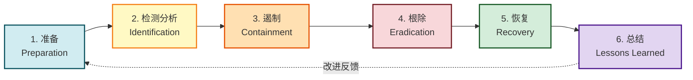
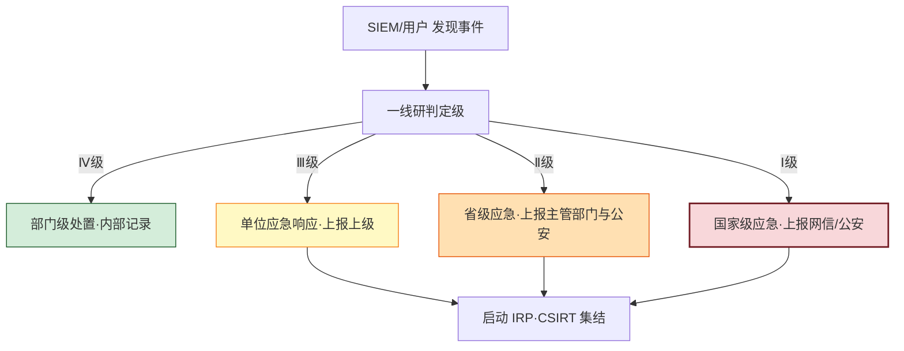
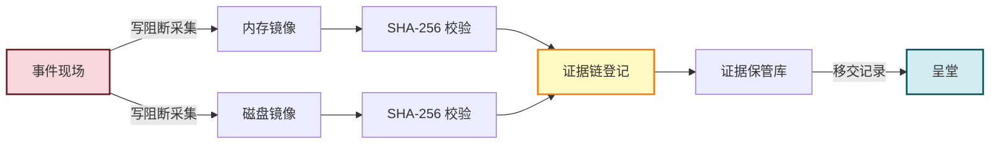

# 8.4 应急响应、安全事件处置流程

> [!abstract] 本节概述
> 无论防御多强，安全事件终会发生。应急响应（Incident Response, IR）是组织面对安全事件时**有序检测、遏制、根除、恢复并总结改进**的过程，目标是最小化损失、快速恢复业务并沉淀经验。本节依据 PICERL 六阶段模型，梳理安全事件分类、严重等级与上报流程、应急响应计划（IRP）组成与事件取证基础，并以勒索软件事件应急响应全过程落地。本节衔接 [[8.3 安全审计、日志管理|8.3 日志]] 提供的检测能力，并向 [[8.5 安全管理制度建设|8.5 制度]] 输出常态化的应急制度。

## 安全视角

> [!info] 资产·信任边界·安全目标
> - **资产**：业务系统、数据、凭据、声誉；事件现场的**证据**本身也是资产。
> - **信任边界**：受感染区域 ↔ 未受感染区域；取证环境 ↔ 生产环境。
> - **安全目标**：快速遏制扩散、恢复业务可用性、保留可呈堂证据、改进防御。
> - **前置条件**：掌握 [[8.3 安全审计、日志管理|8.3 日志与告警]]、[[5.2 勒索病毒原理与防范方案|5.2 勒索软件]]。
> - **缓解措施**：IRP、隔离预案、备份恢复、取证保全、双人与法务介入。

## 一、安全事件分类

> [!definition] 网络与信息安全事件
> 由于人为原因、软硬件缺陷或故障、自然灾害等因素，对网络和信息系统或者其中的数据造成**危害，对社会造成负面影响**的事件。

依据 GB/Z 20986《信息安全技术 信息安全事件分类分级指南》，安全事件按性质分为七类：

| 类别 | 典型事件 | 示例 |
| ---- | -------- | ---- |
| **恶意程序事件** | 病毒、蠕虫、木马、勒索软件、间谍软件 | WannaCry 勒索爆发 |
| **网络攻击事件** | DoS/DDoS、扫描、SQL 注入、XSS、ARP 欺骗 | DDoS 流量清洗 |
| **信息破坏事件** | 篡改、假冒、泄露、窃取 | 网页被篡改 |
| **信息内容安全事件** | 违法有害信息发布 | 平台违规内容 |
| **设备设施故障事件** | 软硬件故障、电力中断 | 核心交换机宕机 |
| **灾害性事件** | 水灾、火灾、地震 | 机房进水 |
| **其他事件** | 上述未涵盖 | — |

## 二、应急响应六阶段：PICERL

> [!definition] PICERL 模型
> PICERL 是应急响应的六阶段模型，源自 NIST SP 800-61 与 SANS，由 **Preparation（准备）、Identification（检测分析）、Containment（遏制）、Eradication（根除）、Recovery（恢复）、Lessons Learned（总结）** 六阶段组成。

| 阶段 | 关键活动 | 输出 |
| ---- | -------- | ---- |
| **1. 准备** | 制定 IRP、组建 CSIRT、工具就绪、备份演练、威胁情报订阅 | 应急响应计划、值守制度 |
| **2. 检测分析** | 日志/SIEM 告警研判、异常确认、范围与影响评估、定级 | 事件单、初步影响评估 |
| **3. 遏制** | 隔离受感染主机、断网、封禁 IP、停用账号、保留证据 | 遏制措施记录、证据保全 |
| **4. 根除** | 清除恶意代码、修复漏洞、重置凭据、重建系统 | 干净环境确认 |
| **5. 恢复** | 从备份还原数据、业务验证、监控期观察 | 业务恢复确认单 |
| **6. 总结** | 复盘根因、改进措施、更新 IRP、培训 | 事件报告、改进清单 |

> [!warning] 遏制阶段的"先断网后取证"权衡
> 遏制与取证存在张力：立即断网可阻止扩散，但可能丢失内存中的易失证据（如进程、连接）。**关键系统**应在断网前先做内存镜像与磁盘取证；**扩散风险极高**的事件（如勒索软件）应优先断网隔离。需在 IRP 中预先约定决策权限与顺序。

## 三、事件严重等级与上报流程

> [!definition] 事件分级
> 依据 GB/Z 20986，信息安全事件按严重程度分为**特别重大（Ⅰ级）、重大（Ⅱ级）、较大（Ⅲ级）、一般（Ⅳ级）**四级，对应不同上报与响应级别。

| 等级 | 名称 | 典型特征 | 响应 |
| ---- | ---- | -------- | ---- |
| Ⅰ级 | 特别重大 | 国家关键信息基础设施瘫痪、大规模数据泄露、严重危害国家安全 | 国家级应急、上报网信办/公安 |
| Ⅱ级 | 重大 | 重要系统瘫痪、跨省影响、大量个人信息泄露 | 省级应急、上报主管部门 |
| Ⅲ级 | 较大 | 单位重要系统受损、一定范围业务中断 | 单位应急、上报上级 |
| Ⅳ级 | 一般 | 局部影响、可快速恢复 | 部门级应急、内部记录 |

### 上报流程

> [!info] 法定上报义务
> 《网络安全法》第 25 条要求网络运营者**立即启动应急预案、采取补救措施，并向有关主管部门报告**。CII 运营者还需向**国家网信部门**和**保护工作部门**报告。瞒报、迟报将面临行政处罚，情节严重者追究刑责。

## 四、应急响应计划（IRP）

> [!definition] 应急响应计划 IRP
> IRP（Incident Response Plan）是组织预先制定的、用于指导安全事件处置的**正式文档**，明确角色、流程、工具与通信策略，确保事件发生时响应有序而非慌乱。

| IRP 组成 | 内容 |
| -------- | ---- |
| **角色与职责** | CSIRT（计算机安全事件响应团队）成员、指挥链、联系人清单 |
| **事件分类分级标准** | 与 GB/Z 20986 对接，明确各级触发条件 |
| **响应流程** | PICERL 各阶段操作 SOP |
| **通信策略** | 内部通报、对外披露、监管上报、媒体应对 |
| **工具与资源** | 取证工具、隔离手段、备份访问、外部专家 |
| **演练计划** | 桌面演练、红蓝对抗、实战拉练的频率与范围 |
| **培训要求** | 全员意识培训、CSIRT 专项技能培训 |

> [!definition] CSIRT
> CSIRT（Computer Security Incident Response Team，计算机安全事件响应团队）是负责接收、研判、处置安全事件的专门团队，通常由安全、运维、法务、公关、人力资源等代表组成。

## 五、事件取证基础

> [!definition] 数字取证
> 数字取证（Digital Forensics）是对电子证据进行**识别、收集、保全、分析与呈堂**的过程，目标是在保证证据**完整性、真实性、不可变性**的前提下还原事件真相。

### 证据保全与链式保管

> [!warning] 证据链（Chain of Custody）
> 证据链指证据从**采集、保管、移交到呈堂**的全过程可追溯记录，证明证据始终未被篡改。任何环节缺失记录都可能导致证据失去法律效力。

| 取证原则 | 要求 |
| -------- | ---- |
| **及时性** | 优先提取易失证据（内存、网络连接），再做磁盘镜像 |
| **完整性** | 使用哈希（SHA-256）校验镜像与原件一致 |
| **不可变性** | 写阻断采集，原始介质只读访问 |
| **链式保管** | 每次交接记录时间、人员、介质、目的 |
| **合法合规** | 取证需有授权，遵守法定程序 |

> [!tip] 易失性顺序（Order of Volatility）
> 取证按数据易失性从高到低进行：**CPU 缓存/寄存器 → 内存 → 网络状态 → 进程 → 临时文件 → 磁盘 → 远程日志**。内存中的恶意代码、加密密钥断电即失，必须优先采集。

## 六、案例：勒索软件事件应急响应全过程

> [!example] 某制造企业勒索事件应急响应
> **背景**：某制造企业周末被发现 ERP 服务器文件被加密，勒索信要求支付 50 比特币。SIEM 在周五晚曾告警"主机异常 SMB 连接激增"但未处置。
>
> **资产与边界**：生产网 ↔ 办公网 ↔ 互联网；ERP 数据区 ↔ 备份存储（部分离线）。
>
> **应急响应六阶段复盘**：
>
> | 阶段 | 操作 | 关键决策 |
> | ---- | ---- | ---- |
> | **检测分析** | 一线运维发现文件扩展名异常，上报 CSIRT；调取 SIEM 日志确认扩散范围 | 确认为勒索软件事件，定级Ⅲ级 |
> | **遏制** | 立即物理断开 ERP 网线；隔离办公网与生产网；禁用受感染账号；封锁横向端口 | 优先断网阻止扩散，备份区已离线幸免 |
> | **根除** | 取证镜像后重装系统；重置所有特权账号密码；修补 EternalBlue（MS17-010）漏洞；清查横向植入 | 确保环境干净 |
> | **恢复** | 从离线备份恢复最近一次全量+差异；业务验证后分批上线；监控期 7 天 | 不支付赎金，依赖备份恢复 |
> | **总结** | 复盘根因：周末无值守导致告警延迟、补丁未打、备份策略有效但告警响应失效 | 改进措施清单 |
>
> **取证关键动作**：
> 1. 断网前对一台受感染主机做内存镜像，提取到 C2 地址与加密密钥残留；
> 2. 磁盘镜像后 SHA-256 校验，登记证据链；
> 3. 内存分析确认攻击者通过钓鱼邮件落地，利用 MS17-010 横向移动。
>
> **根因与改进**：
>
> | 根因 | 改进措施 |
> | ---- | -------- |
> | 周末无 7×24 值守 | 建立 7×24 SOC 值守，高危告警自动电话通知 |
> | MS17-010 补丁未打 | 补丁 SLA：高危 7 天内全量修复，建立补丁合规看板 |
> | 备份部分在线被加密 | 落实 3-2-1 + 不可变备份，关键备份 WORM 锁定 |
> | 告警响应 SOP 缺失 | 更新 IRP，明确"勒索告警 5 分钟内必须响应" |
> | 邮件安全薄弱 | 部署邮件沙箱，默认禁用宏 |
>
> **启示**：勒索事件应急的核心是"**先隔离、勿付赎金、留证据、从备份恢复**"；备份与值守是勒索对抗的两道生命线。

## 本节小结

- 安全事件按性质分为恶意程序、网络攻击、信息破坏、设备故障、灾害等七类；按严重程度分为Ⅰ～Ⅳ四级。
- 应急响应六阶段 PICERL：准备→检测分析→遏制→根除→恢复→总结，形成持续改进闭环。
- 事件分级决定上报层级，CII 运营者有法定上报义务，瞒报迟报将追责。
- IRP 明确角色、流程、工具、通信与演练；CSIRT 是响应的核心团队。
- 数字取证遵循及时性、完整性、不可变性与链式保管原则；按易失性顺序优先提取内存证据。
- 勒索事件响应核心：先隔离、勿付赎金、留证据、从备份恢复。

## 章节导航

- ⬆️ 上级：[[MOC - 第8章|第8章 信息安全法律法规与运维规范 MOC]]
- ⬅️ 上一节：[[8.3 安全审计、日志管理|8.3 安全审计、日志管理]]
- ➡️ 下一节：[[8.5 安全管理制度建设|8.5 安全管理制度建设]]
- 📝 习题：[[MOC - 第8章习题|第8章 习题]]
