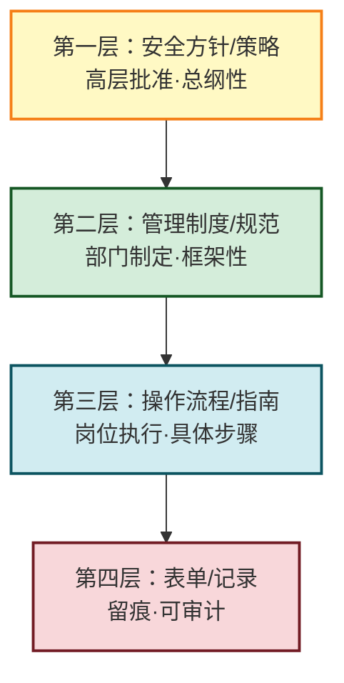
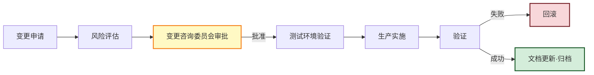

# 8.5 安全管理制度建设

> [!abstract] 本节概述
> 技术是"骨"、制度是"魂"。等保 2.0 的核心思想是"三分技术、七分管理"，没有制度落地的技术手段无法通过合规测评，也无法应对真实威胁。本节从安全管理制度体系的"方针→规范→流程→记录"四层次出发，梳理安全策略、访问控制、密码管理、变更管理、备份恢复等核心制度，延伸至人员安全管理、物理环境安全与安全意识培训，并以某企业信息安全管理制度体系建设落地。本节是本章的收束，也是全课程的收尾——把技术与法规转化为可执行的常态化管理。

## 安全视角

> [!info] 资产·信任边界·安全目标
> - **资产**：制度文档本身、人员、物理环境、凭据与密钥。
> - **信任边界**：组织内部 ↔ 外部供应商；员工入职 ↔ 在岗 ↔ 离职；机房内 ↔ 机房外。
> - **安全目标**：通过制度化使安全要求"可执行、可考核、可审计"，实现合规与风险可控。
> - **前置条件**：理解 [[8.1 网络安全法、数据安全法、个人信息保护法基础|8.1 法规底线]]、[[8.2 等保 2.0 基本概念|8.2 等保管理要求]]、[[8.4 应急响应、安全事件处置流程|8.4 应急制度]]。
> - **缓解措施**：制度分层、岗位制衡、培训考核、审计监督。

## 一、安全管理制度体系层次

> [!definition] 安全管理制度四层体系
> 信息安全管理制度按"**方针→规范→流程→记录**"自上而下分为四个层次，上层定方向、中层定规则、下层定操作、底层留证据，构成可执行、可审计的完整体系。

| 层次 | 内容 | 制定者 | 审批者 | 示例 |
| ---- | ---- | ------ | ------ | ---- |
| **方针/策略** | 信息安全总方针、安全目标、组织承诺 | 安全管理部门 | 高层/董事会 | 《信息安全方针书》 |
| **管理制度/规范** | 各领域管理规则、岗位职责、合规要求 | 安全管理部门 | 信息安全委员会 | 《访问控制管理制度》 |
| **操作流程/指南** | 具体 SOP、配置基线、操作手册 | 业务/运维岗位 | 部门负责人 | 《数据库账号申请流程》 |
| **表单/记录** | 申请单、审批单、操作记录、审计日志 | 执行人 | — | 《特权账号使用登记表》 |

> [!tip] 制度体系的"金字塔原则"
> 上层文档少而稳定，下层文档多而灵活。方针层不应频繁变动；流程与表单随业务调整快速迭代。四层之间必须自洽：上层要求能在下层找到执行点，下层操作能追溯到上层授权。

## 二、核心制度

### 1. 安全策略

> [!definition] 信息安全策略
> 信息安全策略是组织对信息安全的**总体意图、原则与方向的正式表述**，由最高管理层批准，是所有下级制度的依据。

安全策略通常包含：适用范围、安全目标、组织结构、职责分工、合规承诺、违规处罚、评审周期等。它是等保 2.0 管理要求中"安全管理制度"维度的顶层文档。

### 2. 访问控制策略

| 要点 | 内容 |
| ---- | ---- |
| **最小权限原则** | 仅授予完成职责所需的最小权限（衔接 [[3.4 权限管理、最小权限原则\|3.4 最小权限]]） |
| **权限分离** | 开发/测试/生产账号分离；审批与执行分离；三权分立（系统管理员、安全管理员、审计管理员） |
| **账号生命周期** | 申请→审批→开通→变更→注销的全流程管理 |
| **特权账号管理** | 堡垒机托管、双人授权、会话录像、定期改密 |
| **定期复查** | 至少每季度复查权限合理性，离职/调岗即时收回 |

### 3. 密码管理

| 要点 | 内容 |
| ---- | ---- |
| **口令复杂度** | 长度≥8 位（特权账号≥12 位），含大小写、数字、特殊字符 |
| **口令轮换** | 普通账号 90 天、特权账号 30 天轮换 |
| **存储** | 禁止明文存储，使用加盐哈希（bcrypt/Argon2） |
| **传输** | 禁止明文传输，使用 TLS/SSH |
| **密钥管理** | 密钥分级、KMS 托管、定期轮换（衔接 [[6.2 数据库加密、透明存储加密\|6.2 KMS]]） |

### 4. 变更管理

> [!definition] 变更管理
> 变更管理是对信息系统配置、代码、数据的任何变更进行**申请、评估、审批、实施、验证、回滚**的受控流程，防止未经测试的变更引发故障或安全漏洞。

| 变更类型 | 审批层级 | 时段 |
| -------- | -------- | ---- |
| 标准变更（预批准） | 预审批通过 | 任意时段 |
| 普通变更 | 变更经理 | 维护窗口 |
| 重大变更 | CAB + 高层 | 业务低峰 + 回滚预案 |
| 紧急变更 | 紧急 CAB（事后补审） | 即时 |

### 5. 备份恢复管理

| 要点 | 内容 |
| ---- | ---- |
| **备份策略** | 全量+增量/差异，明确频率与保留周期（衔接 [[6.3 数据备份、容灾恢复策略\|6.3 备份]]） |
| **3-2-1 原则** | 3 份副本、2 种介质、1 份离线 |
| **不可变备份** | 关键备份 WORM 锁定，防勒索 |
| **恢复演练** | 至少每半年演练一次，验证可恢复性 |
| **介质管理** | 介质清册、双人保管、销毁记录 |

## 三、人员安全管理

> [!info] 人员是安全的最弱环节
> 多数安全事件源于人的疏忽或被社会工程攻击。人员安全管理贯穿入职、在岗、离职全生命周期。

| 阶段 | 管理要求 |
| ---- | -------- |
| **入职审查** | 背景调查、学历核验、敏感岗位需政审；签订劳动合同与保密协议（NDA） |
| **安全培训** | 入职安全培训 + 年度复训；按岗位分层（全员/技术人员/特权人员） |
| **保密协议** | 接触敏感信息前签订 NDA，明确保密范围、期限与违约责任 |
| **在岗考核** | 定期安全意识测试；违规行为记录与处罚 |
| **权限管理** | 调岗即时调整权限；最小权限原则 |
| **离职交接** | 即时收回账号权限、收回设备、撤销物理访问；离职后权限审计 |

> [!warning] 离职权限回收的"零延迟"
> 离职员工的权限必须在**最后一个工作日结束前**全部收回，包括系统账号、VPN、邮箱、物理门禁。大量内部数据泄露事件发生在离职员工权限未及时回收的窗口期。

## 四、物理环境安全

| 维度 | 管理要求 |
| ---- | -------- |
| **机房选址** | 避开低洼、强电磁、易燃易爆区域；满足等保物理安全要求 |
| **访问控制** | 机房门禁 + 视频监控；分级区域（一般区/核心区）；访客登记 + 陪同 |
| **环境监控** | 温湿度、烟感、漏水、UPS 监控；7×24 值守或远程监控 |
| **设备管理** | 资产清册；维修需审批；报废介质按 [[6.4 残余数据销毁技术\|6.4 数据销毁]] 处理 |
| **防灾害** | 防雷、防静电、消防（气体灭火）；双路供电 + 柴油发电机 |

## 五、安全意识培训

> [!definition] 安全意识培训
> 针对全体员工开展的信息安全认知与行为训练，目标是让员工识别常见威胁、遵循安全规范、形成"安全第一"的习惯。

| 培训内容 | 形式 | 频率 |
| -------- | ---- | ---- |
| 钓鱼识别 | 模拟钓鱼演练 | 每季度 |
| 口令安全 | 在线课程 + 测试 | 入职 + 年度 |
| 数据保护 | 案例宣讲 | 年度 |
| 社会工程防范 | 红蓝演练 | 半年 |
| 法规合规 | 集中培训 | 年度 |
| 事件上报 | 提醒卡片 | 持续 |

> [!tip] 安全意识培训的"三转变"
> - 从"一次性培训"转向"持续渗透"；
> - 从"知识灌输"转向"行为改变"（如模拟钓鱼点击率下降）；
> - 从"全员一刀切"转向"按角色分层"（开发、运维、特权人员加强技术培训）。

## 六、案例：某企业信息安全管理制度体系建设

> [!example] 某科技企业信息安全管理制度体系
> **背景**：某千人级科技企业通过等保三级测评后发现"管理要求"多项不符合，需系统性建设安全管理制度体系。
>
> **资产与边界**：研发网 ↔ 办公网 ↔ 生产云；员工 ↔ 供应商。
>
> **建设步骤**：
>
> | 步骤 | 内容 | 输出 |
> | ---- | ---- | ---- |
> | 1. 顶层设计 | 成立信息安全委员会，由 CISO 牵头；制定《信息安全方针书》 | 方针层文档 |
> | 2. 制度框架 | 对照等保 2.0 管理要求，规划 12 项核心制度 | 制度清单 |
> | 3. 制度编写 | 各业务部门起草，安全部评审，委员会批准 | 12 项管理制度 |
> | 4. 流程拆解 | 每项制度拆解为可执行 SOP 与表单 | 30+ 流程文件 |
> | 5. 培训宣贯 | 分层培训：全员意识 + 岗位 SOP | 培训记录 |
> | 6. 试运行 | 3 个月试运行，收集问题 | 改进清单 |
> | 7. 正式发布 | 高层签发，纳入考核 | 发布记录 |
> | 8. 持续改进 | 每年评审一次，事件复盘驱动修订 | 评审记录 |
>
> **核心制度清单（节选）**：
>
> | 制度 | 核心内容 |
> | ---- | -------- |
> | 《信息安全方针书》 | 总方针、目标、组织、奖惩 |
> | 《访问控制管理制度》 | 最小权限、三权分立、账号生命周期 |
> | 《密码与密钥管理制度》 | 口令复杂度、轮换、KMS 托管 |
> | 《变更管理制度》 | 变更分级、CAB 审批、回滚预案 |
> | 《备份恢复管理制度》 | 3-2-1、不可变备份、恢复演练 |
> | 《人员安全管理制度》 | 入职审查、保密协议、离职交接 |
> | 《物理环境安全制度》 | 机房门禁、监控、介质管理 |
> | 《安全事件应急响应制度》 | 衔接 [[8.4 应急响应、安全事件处置流程\|8.4 IRP]] |
> | 《安全审计与日志管理制度》 | 衔接 [[8.3 安全审计、日志管理\|8.3 日志]] |
> | 《第三方与供应商安全管理制度》 | 供应商准入、合同安全条款、持续评估 |
>
> **效果**：
> - 等保三级复测"管理要求"全部符合；
> - 安全事件年发生率下降 40%；
> - 离职权限回收平均时延从 3 天降至 0.5 天；
> - 模拟钓鱼点击率从 25% 降至 5%。
>
> **启示**：制度建设不是"写文档"，而是"写规则 + 落地执行 + 持续考核"。文档再完善，没有培训、考核与审计就是一纸空文。

## 本节小结

- 安全管理制度按"方针→规范→流程→记录"四层次构成金字塔体系，上层稳定、下层灵活。
- 核心制度包括：安全策略、访问控制、密码管理、变更管理、备份恢复，覆盖等保 2.0 管理要求。
- 人员安全管理贯穿入职审查、培训、保密协议、在岗考核、离职交接全生命周期，离职权限零延迟回收。
- 物理环境安全涵盖机房选址、门禁监控、环境监控、设备与介质管理。
- 安全意识培训从一次性转向持续渗透，从知识灌输转向行为改变，按角色分层。
- 制度建设的本质是"写规则 + 落地执行 + 持续考核"，三者缺一不可。

## 章节导航

- ⬆️ 上级：[[MOC - 第8章|第8章 信息安全法律法规与运维规范 MOC]]
- ⬅️ 上一节：[[8.4 应急响应、安全事件处置流程|8.4 应急响应、安全事件处置流程]]
- 📝 习题：[[MOC - 第8章习题|第8章 习题]]
