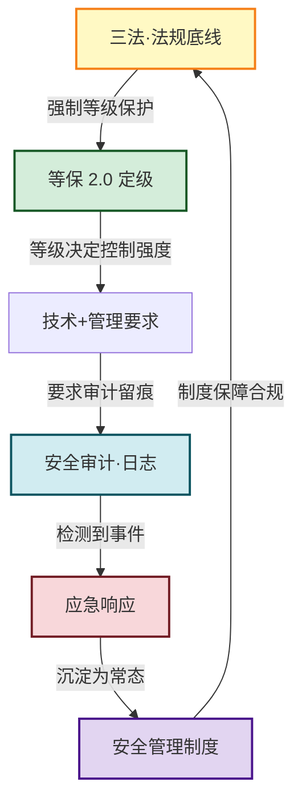

# MOC - 第8章 信息安全法律法规与运维规范

> [!info] 本章定位
> 本章是信息安全技术课程的**收尾章**，视角从前七章的"技术与算法"转向"**管理与合规**"。技术只能解决"能不能防"，而法律法规与运维规范回答"**必须怎么防、出了事怎么办、谁来负责**"。
> - **承上**：[[MOC - 第1章|第1章]] 的 CIA 三要素是法规保护目标的来源；[[MOC - 第2章|第2章 密码学]] 提供合规所需算法；[[MOC - 第6章|第6章 数据安全]] 的分级分类对接《数据安全法》《个人信息保护法》；[[MOC - 第7章|第7章 安全通信协议]] 的 TLS/VPN 是等保 2.0 通信安全要求的落地手段。
> - **核心线索**：**法规定底线 → 等保定等级 → 审计留证据 → 应急处置突 → 制度管常态**。五节构成"合规—定级—监测—响应—管理"的运维闭环。
> - **现实意义**：在我国，网络安全等级保护制度是网络运营者的**法定强制义务**；"三法"（《网络安全法》《数据安全法》《个人信息保护法》）共同构成网络空间治理的基础法律框架。
> - **安全边界**：本章涉及的法律条款均以**现行有效版本**为准，结论随立法与监管动态变化，需注意核实日期。

## 本章学习路线

```mermaid
flowchart LR
    S1["8.1 三法基础<br/>网安法·数安法·个保法"]
    S2["8.2 等保 2.0<br/>五级·定级流程·通用要求"]
    S3["8.3 安全审计·日志<br/>采集·存储·SIEM"]
    S4["8.4 应急响应<br/>六阶段·事件取证"]
    S5["8.5 安全管理制度<br/>方针→规范→流程→记录"]

    S1 -->|"法规要求等级保护"| S2
    S1 -->|"法规要求审计留痕"| S3
    S2 -->|"定级决定审计强度"| S3
    S3 -->|"日志驱动事件检测"| S4
    S2 -->|"等保要求制度建设"| S5
    S4 -->|"响应需制度支撑"| S5
    S5 -.|"制度反哺合规"| S1

    classDef law fill:#fff9c4,stroke:#f57f17,stroke-width:2px
    classDef dengbao fill:#d4edda,stroke:#155724,stroke-width:2px
    classDef audit fill:#d1ecf1,stroke:#0c5460,stroke-width:2px
    classDef ir fill:#f8d7da,stroke:#721c24,stroke-width:2px
    classDef mgmt fill:#e2d5f1,stroke:#4a148c,stroke-width:2px

    class S1 law
    class S2 dengbao
    class S3 audit
    class S4 ir
    class S5 mgmt
```

## 知识点导航

| 小节 | 文件 | 核心内容 | 关键概念/标准 |
| ---- | ---- | -------- | ------------- |
| 8.1 | [[8.1 网络安全法、数据安全法、个人信息保护法基础]] | 三法立法目的、关键概念、覆盖范围与对比 | 网络运营者、关键信息基础设施、数据分类分级、敏感个人信息、告知同意 |
| 8.2 | [[8.2 等保 2.0 基本概念]] | 等保 2.0 标准体系、五级划分、定级流程、通用要求 | GB/T 22239-2019、五级保护、定级备案、技术+管理要求 |
| 8.3 | [[8.3 安全审计、日志管理]] | 审计目的、日志内容与生命周期、收集技术、SIEM | Syslog、ELK、SIEM、日志防篡改、6 个月留存 |
| 8.4 | [[8.4 应急响应、安全事件处置流程]] | 事件分类、六阶段响应、严重等级、取证基础 | IRP、PICERL、证据链、勒索事件响应 |
| 8.5 | [[8.5 安全管理制度建设]] | 制度体系层次、核心制度、人员与物理安全、意识培训 | 安全策略、访问控制、变更管理、保密协议 |

## 核心概念速查

| 概念 | 所属小节 | 一句话定义 |
| ---- | -------- | ---------- |
| 网络运营者 | 8.1 | 网络的所有者、管理者和网络服务提供者，承担网安法主要义务 |
| 关键信息基础设施（CII） | 8.1 | 一旦遭到破坏可能严重危害国计民生的关键网络设施 |
| 数据分类分级 | 8.1 | 按属性分类、按重要度分级实施差异化保护 |
| 重要数据 | 8.1 | 影响国家安全、公共利益的数据，受数安法特别保护 |
| 敏感个人信息 | 8.1 | 一旦泄露可能导致人身、财产安全受到危害的个人信息 |
| 告知同意 | 8.1 | 处理个人信息前充分告知并取得个人明确同意 |
| 等保 2.0 | 8.2 | GB/T 22239-2019 等级保护标准体系，覆盖云/移动/物联网/工控 |
| 五级保护 | 8.2 | 自主保护级→系统审计级→安全标记级→结构化级→访问验证级 |
| 定级备案 | 8.2 | 确定系统安全保护等级并向公安机关备案的法定流程 |
| 安全审计 | 8.3 | 对系统活动进行记录、分析与审查，用于追溯与合规 |
| SIEM | 8.3 | 安全信息与事件管理，集中采集日志并关联分析告警 |
| 应急响应（IR） | 8.4 | 针对安全事件的检测、遏制、根除、恢复与总结的有序过程 |
| PICERL | 8.4 | 准备-检测-遏制-根除-恢复-总结六阶段模型 |
| 证据链（证据保全） | 8.4 | 证据从采集到呈堂全程可追溯、未篡改的保管链 |
| 安全策略 | 8.5 | 组织信息安全的顶层方针，由高层批准 |
| 最小权限原则 | 8.5 | 仅授予完成职责所需的最小访问权限 |
| 保密协议（NDA） | 8.5 | 约束接触敏感信息人员不泄露的合同条款 |

## 核心考点

> [!warning] 高频考点（8 点）
> 1. **"三法"施行时间与立法目的**：《网络安全法》2017-06-01、《数据安全法》2021-09-01、《个人信息保护法》2021-11-01；网安法管"网络与系统"、数安法管"数据本身"、个保法管"个人信息处理活动"——选择题/填空高频。
> 2. **网络运营者义务与关键信息基础设施保护**：网络安全等级保护制度是法定强制义务；CII 运营者承担更重的数据本地化、安全审查、应急演练义务。
> 3. **数据分类分级与重要数据**：数安法建立数据分类分级保护制度，重要数据出境需安全评估；区分"重要数据"与"核心数据"。
> 4. **个人信息处理原则与敏感个人信息**：合法、正当、必要、诚信原则；告知同意规则；敏感个人信息（生物识别、宗教信仰、金融账户、行踪轨迹等）需单独同意。
> 5. **等保 2.0 五级划分与定级流程**：五级名称、保护强度递增；定级→备案→建设整改→等级测评→监督检查五步法定流程；三级及以上需每年测评。
> 6. **等保 2.0 vs 等保 1.0**：2.0 新增云计算、移动互联、物联网、工控系统、大数据五个扩展；从"被动防御"转向"主动防御"。
> 7. **日志保护要求与 SIEM**：等保要求日志留存≥6 个月、防篡改、异地备份；SIEM 集中采集-关联分析-告警响应。
> 8. **应急响应六阶段（PICERL）与勒索事件处置**：准备-检测分析-遏制-根除-恢复-总结；勒索事件"先隔离、勿付赎金、留证据、从备份恢复"。

## 合规闭环：从法规到制度



## 与其他章节的关联

- [[MOC - 第1章|第1章 信息安全基础概论]]：CIA 三要素是法规保护目标的源头；安全生命周期对应本章应急响应闭环。
- [[MOC - 第2章|第2章 密码学基础]]：《密码法》与商用密码管理衔接密码学算法合规使用；数字签名为不可否认性提供法律效力。
- [[MOC - 第3章|第3章 身份认证与访问控制]]：最小权限原则、RBAC 是等保 2.0 管理要求的核心；个保法要求处理个人信息前完成身份验证与授权。
- [[MOC - 第4章|第4章 网络攻击与防御技术]]：防火墙/IDS 是等保 2.0 通信与区域安全要求的落地；攻击事件触发本章应急响应流程。
- [[MOC - 第5章|第5章 恶意代码防护]]：勒索软件事件是本章应急响应案例的典型场景；EDR 日志接入 SIEM。
- [[MOC - 第6章|第6章 数据安全与存储安全]]：数据分级分类对接《数据安全法》；脱敏、加密是个保法"最小必要"原则的技术落地。
- [[MOC - 第7章|第7章 安全通信协议]]：TLS/VPN/SSH 满足等保 2.0 通信完整性、保密性要求；传输加密是数据跨境合规的组成部分。

## 章节导航

- ⬆️ 上级：[[MOC - 信息安全技术|信息安全技术 MOC]]
- ⬅️ 上一章：[[MOC - 第7章|第7章 安全通信协议]]
- ➡️ 下一章：无（本章为课程最后一章）
- 📝 习题：[[MOC - 第8章习题|第8章 习题]]
