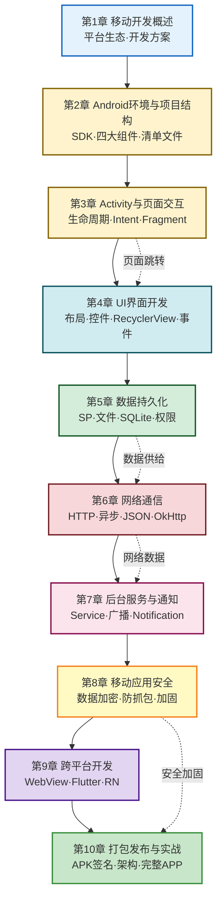

# MOC - 移动互联网开发技术

本页是本科《移动互联网开发技术》课程标准化知识库的总入口，以 **Android 原生开发**为主线，从开发环境搭建到应用发布全流程，覆盖 UI 界面、数据存储、网络通信、后台服务、移动安全与跨平台技术。

> [!abstract] 核心问题
> 移动互联网开发技术研究的是：如何在 Android/iOS 移动平台上构建高质量应用——包括 UI 界面设计与交互、数据本地持久化、网络通信与异步处理、后台服务与消息通知、应用安全防护，以及跨平台方案选型与项目工程化实践。

> [!info] 课程定位
> - 先修课程：[[MOC - 计算机网络|计算机网络A]]、Java 程序设计
> - 关联知识库：[[MOC - 信息安全技术|信息安全技术]]（第8章 移动应用安全）、[[MOC - 互联网创新|互联网创新]]（移动互联网发展）
> - 参考教材：郭霖《第一行代码》、Android 官方文档
> - 技术栈：Java/Kotlin + Android SDK + Gradle

## 课程知识地图



## 章节导航

| 章节 | 知识点 MOC | 习题 MOC | 核心内容 |
| ---- | ---------- | -------- | -------- |
| 第1章 | [[MOC - 第1章\|移动开发概述]] | [[MOC - 第1章习题\|第1章习题]] | 移动互联网发展、Android/iOS生态、原生vs跨平台、开发流程 |
| 第2章 | [[MOC - 第2章\|Android环境与项目结构]] | [[MOC - 第2章习题\|第2章习题]] | SDK搭建、工程目录、四大组件、Manifest、生命周期 |
| 第3章 | [[MOC - 第3章\|Activity与页面交互]] | [[MOC - 第3章习题\|第3章习题]] | Activity生命周期、Intent跳转、数据传递、启动模式、Fragment |
| 第4章 | [[MOC - 第4章\|UI界面开发]] | [[MOC - 第4章习题\|第4章习题]] | 布局（线性/相对/约束）、控件、RecyclerView、资源文件、事件处理 |
| 第5章 | [[MOC - 第5章\|数据持久化]] | [[MOC - 第5章习题\|第5章习题]] | SharedPreferences、文件读写、SQLite、存储权限 |
| 第6章 | [[MOC - 第6章\|网络通信]] | [[MOC - 第6章习题\|第6章习题]] | HTTP/HTTPS、异步请求、JSON解析、OkHttp、WebSocket |
| 第7章 | [[MOC - 第7章\|后台服务与通知]] | [[MOC - 第7章习题\|第7章习题]] | Service、BroadcastReceiver、Notification、任务调度 |
| 第8章 | [[MOC - 第8章\|移动应用安全]] | [[MOC - 第8章习题\|第8章习题]] | 安全风险、数据加密、防抓包、权限最小化、应用加固 |
| 第9章 | [[MOC - 第9章\|跨平台开发]] | [[MOC - 第9章习题\|第9章习题]] | WebView混合开发、Flutter、React Native、方案选型 |
| 第10章 | [[MOC - 第10章\|打包发布与实战]] | [[MOC - 第10章习题\|第10章习题]] | APK签名、版本管理、MVC/MVVM架构、完整APP开发 |

## 核心概念速查

### Android 四大组件

| 组件 | 作用 | 生命周期 | 典型场景 |
| ---- | ---- | -------- | -------- |
| Activity | 用户界面 | onCreate→onStart→onResume→onPause→onStop→onDestroy | 页面展示与交互 |
| Service | 后台运行 | onCreate→onStartCommand→onDestroy | 音乐播放、数据同步 |
| BroadcastReceiver | 接收广播 | onReceive | 系统事件监听、消息通知 |
| ContentProvider | 数据共享 | CRUD接口 | 跨应用数据访问 |

### 数据存储方案对比

| 方案 | 适用场景 | 数据量 | 持久性 | 安全性 |
| ---- | -------- | ------ | ------ | ------ |
| SharedPreferences | 配置项、登录状态 | 小（KV） | 持久 | 低（明文XML） |
| 内部存储 | 应用私有文件 | 中 | 持久 | 中（应用沙箱） |
| 外部存储 | 共享文件、媒体 | 大 | 持久 | 低（需权限） |
| SQLite | 结构化数据 | 中大 | 持久 | 中（可加密） |
| Room | SQLite封装 | 中大 | 持久 | 中 |

## 学习路径

```mermaid
flowchart TD
    Start([开始学习]) --> Ch1[第1章: 移动开发概述]
    Ch1 --> Ch2[第2章: 环境搭建与项目结构]
    Ch2 --> Ch3[第3章: Activity与页面交互]
    Ch3 --> Ch4[第4章: UI界面开发]
    Ch4 --> Ch5[第5章: 数据持久化]
    Ch5 --> Ch6[第6章: 网络通信]
    Ch6 --> Ch7[第7章: 后台服务与通知]
    Ch7 --> Ch8[第8章: 移动应用安全]
    Ch8 --> Ch9[第9章: 跨平台开发]
    Ch9 --> Ch10[第10章: 打包发布与实战])
    Ch10 --> Project([项目实战])
    
    style Start fill:#c8e6c9,stroke:#388e3c
    style Project fill:#ffcdd2,stroke:#d32f2f
```

## 考试重点速览

> [!warning] 高频考点
> 1. **Activity 生命周期**七个回调方法及状态转换（必考）
> 2. **Intent 显式与隐式**跳转机制与数据传递
> 3. **Activity 启动模式**（standard/singleTop/singleTask/singleInstance）
> 4. **RecyclerView** 与 ListView 对比及适配器实现
> 5. **SQLite** 基本CRUD操作与 SQL 语句
> 6. **异步网络请求**与主线程禁止网络操作（Handler/AsyncTask/线程）
> 7. **Service 生命周期**与启动方式（startService/bindService）
> 8. **APK 签名机制**与打包流程

---

## 相关知识库

- [[MOC - 计算机网络|计算机网络A]] — 网络协议基础，先修课程
- [[MOC - 信息安全技术|信息安全技术]] — 第7章安全通信协议、第8章移动安全关联
- [[MOC - 互联网创新|互联网创新]] — 移动互联网发展与商业模式
