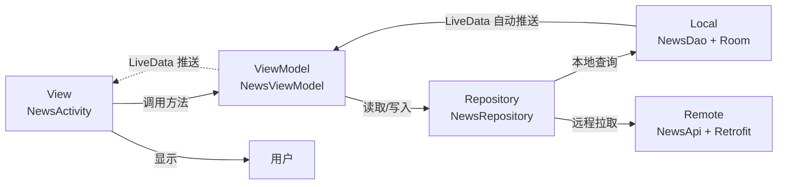

# MOC - 第10章习题

> [!info] 本章习题说明
> - 配套知识点：[[MOC - 第10章|第10章 应用打包、发布与项目实战]]
> - 题目数量：**15 题**（选择 5 + 填空 3 + 简答 4 + 综合设计 3）
> - 难度梯度：⭐基础 / ⭐⭐中等 / ⭐⭐⭐较难
> - 答案折叠在每题下方的 `<details>` 块中，建议先独立作答再展开对照
> - **本章为课程最后一章**，综合设计题会回看全课程知识点

## 一、选择题（5 题）

### 1. ⭐ 关于 APK 文件结构，下列说法错误的是？

A. `classes.dex` 是应用的 Dalvik 字节码，方法数超 64K 时启用 multidex 生成 `classes2.dex`
B. `resources.arsc` 是编译后的资源索引表，把资源 ID 映射到具体值
C. `AndroidManifest.xml` 在 APK 中保持原始 XML 文本格式，便于直接读取
D. `lib/` 目录按 ABI 分子目录存放 Native 库，如 `arm64-v8a/`、`x86_64/`

<details>
<summary>查看答案</summary>

**答案：C**

C 错：APK 中的 `AndroidManifest.xml` 与 `res/` 下的 XML 都是 **二进制 XML 格式**（由 aapt2 编译），用普通文本编辑器打开是乱码，需用 `aapt2 dump` 或 `ApkTool` 反编译查看。二进制格式体积更小、解析更快。A、B、D 描述均正确。
</details>

---

### 2. ⭐⭐ 关于 APK 签名方案，下列描述正确的是？

A. v1 签名对 APK 全文件签名，安全性最高
B. v2 签名引入了密钥轮换能力，支持更换签名密钥
C. v3 签名在 Android 9.0 引入，是当前推荐的最低签名方案
D. v4 签名配合增量安装使用，必须与 v2 或 v3 共存

<details>
<summary>查看答案</summary>

**答案：D**

- A 错：v1（JAR 签名）只对 `META-INF` 内文件签名，**不是全文件签名**，且校验慢、易被 ZIP 注入攻击
- B 错：v2 不支持密钥轮换；**密钥轮换是 v3 引入的能力**
- C 错：当前推荐的最低签名方案是 **v2**（Android 7.0+），v3 是在 v2 基础上增强
- D 对：v4 签名（Android 11）配合增量安装使用，生成 `.idsig` 文件，**必须与 v2 或 v3 共存**，v4 校验 `.idsig`，v2/v3 校验 APK 本体
</details>

---

### 3. ⭐⭐ 关于 minSdkVersion / targetSdkVersion / compileSdkVersion，下列说法错误的是？

A. minSdkVersion 决定 APP 可安装的最低 API Level，低于此版本的设备无法安装
B. targetSdkVersion 决定系统如何对待 APP，影响运行时行为（如权限、后台限制）
C. compileSdkVersion 必须 ≤ targetSdkVersion，否则编译报错
D. targetSdk ≥ 26 时通知必须使用 NotificationChannel，否则通知不显示

<details>
<summary>查看答案</summary>

**答案：C**

C 错：正确关系是 `compileSdkVersion >= targetSdkVersion >= minSdkVersion`。**compileSdkVersion 必须 ≥ targetSdkVersion**（而不是 ≤），因为编译时需要能访问到 target 用到的所有 API。若 compileSdk < target，编译器无法识别 target 用到的新 API，编译报错。A、B、D 描述均正确。

D 补充：Android 8.0（API 26）起通知必须用 Channel，否则通知不显示，这是 targetSdk 影响运行时行为的典型例子。
</details>

---

### 4. ⭐⭐ 关于 MVC、MVP、MVVM 三种架构，下列说法正确的是？

A. MVC 在 Android 中 View 与 Controller 由 XML 与 Activity 分别承担，职责清晰
B. MVP 中 Presenter 通过接口操作 View，且必须持有 View 的强引用以保证回调
C. MVVM 中 ViewModel 不持有 View 引用，通过 LiveData 等可观察数据驱动 UI
D. MVVM 中 ViewModel 的生命周期与 Activity 完全相同，Activity 销毁即销毁

<details>
<summary>查看答案</summary>

**答案：C**

- A 错：Android MVC 中 **Activity 同时承担 View 与 Controller 职责**（持有 View 引用 + 处理事件/逻辑），XML 几乎无逻辑，导致"Fat Activity"，职责并不清晰
- B 错：MVP 中 Presenter 确实通过接口操作 View，但"必须持有强引用"是错的——**应通过弱引用或在 onDestroy 中 detach**，否则会内存泄漏
- C 对：MVVM 的核心特征——ViewModel **不持有 View 引用**，通过 LiveData/Flow 等可观察数据驱动 UI 自动更新
- D 错：ViewModel 的生命周期 **长于 Activity**——配置变更（如旋转屏）后 Activity 重建，ViewModel 不销毁，数据立即可用；只在 Activity **真正 finally 销毁**时调用 `onCleared()`
</details>

---

### 5. ⭐ 关于 versionCode 与 versionName，下列说法错误的是？

A. versionCode 是内部版本号，必须为正整数且单调递增
B. versionName 是用户可见版本号，常用 `主.次.修订` 格式
C. 应用商店通过 versionName 判断是否允许升级
D. 回退版本号需要在设备上先卸载再安装低版本 APK

<details>
<summary>查看答案</summary>

**答案：C**

C 错：应用商店通过 **versionCode**（整数）判断升级/降级，而不是 versionName。versionName 仅用于用户展示，系统不据此判断版本新旧。A、B、D 描述均正确。
</details>

---

## 二、填空题（3 题）

### 6. ⭐ APK 完整打包流程的五步是：源码编译 → ________ → 资源打包 → ________ → ________。

<details>
<summary>查看答案</summary>

**答案：DEX 转换、签名、对齐（zipalign）**

完整流程：
1. 源码编译（javac/kotlinc）→ `.class`
2. **DEX 转换**（d8/r8）→ `classes.dex`
3. 资源打包（aapt2）→ `resources.arsc` + 编译后 `res/`
4. **签名**（apksigner）→ 已签名 APK
5. **对齐**（zipalign）→ 字节对齐优化后的可发布 APK

注意：使用 v2+ 签名时顺序为"先 zipalign 后 apksigner"；使用 v1（jarsigner）时顺序为"先 jarsigner 后 zipalign"。
</details>

---

### 7. ⭐⭐ Android 屏幕密度中 mdpi 的 dpi 值为 ________，1dp 在 mdpi 设备上等于 ________ px；xxhdpi 的 dpi 值为 ________，1dp 在 xxhdpi 上等于 ________ px。文字尺寸应使用 ________ 单位，它会跟随系统字号设置缩放。

<details>
<summary>查看答案</summary>

**答案：160、1、480、3、sp**

- mdpi = 160 dpi（基准密度），`1dp = (160/160) px = 1px`
- xxhdpi = 480 dpi，`1dp = (480/160) px = 3px`
- 文字尺寸用 **sp**（Scale-independent Pixel），会跟随系统字号缩放；布局尺寸用 dp

换算公式：`px = dp × (dpi / 160)`
</details>

---

### 8. ⭐⭐ MVVM 架构中，View 通过 ________ 方法订阅 ViewModel 暴露的 ________ 数据；ViewModel 不持有 View 引用，而是通过 ________ 自动推送状态变化；ViewModel 的生命周期 ________ Activity，配置变更后 Activity 重建时 ViewModel ________。

<details>
<summary>查看答案</summary>

**答案：observe、LiveData、LiveData/可观察数据、长于、不销毁（保留）**

- View 通过 `observe(LifecycleOwner, Observer)` 方法订阅 `LiveData`
- LiveData 是生命周期感知的可观察数据持有者，数据变化时自动推送给活跃的订阅者
- ViewModel **不持有 View 引用**，通过 LiveData 解耦
- ViewModel 生命周期**长于 Activity**——旋转屏等配置变更后 Activity 重建，ViewModel 保留数据立即可用
- 只在 Activity 真正 finally 销毁时调用 `onCleared()` 清理资源
</details>

---

## 三、简答题（4 题）

### 9. ⭐⭐ 简述 APK 签名 v1、v2、v3 三种方案的原理、引入版本与各自优劣，并说明现代应用的推荐签名配置。

<details>
<summary>查看答案</summary>

| 方案 | 引入版本 | 原理 | 优势 | 劣势 |
| ---- | -------- | ---- | ---- | ---- |
| v1（JAR） | Android 1.0 | 对 META-INF 内每个文件单独 SHA-1 + 签名 | 兼容所有 Android 版本 | 校验慢；META-INF 外文件不参与签名，可被篡改；易受 ZIP 注入攻击 |
| v2 | Android 7.0（API 24） | 对整个 APK 文件（除签名块）签名，签名块在 ZIP 中央目录与 EOCD 之间 | 校验快；防 ZIP 注入；完整性更强 | 不兼容 Android 7.0 以下 |
| v3 | Android 9.0（API 28） | 在 v2 基础上增加密钥谱系（lineage），支持密钥轮换 | 支持紧急换密钥、公司收购转移应用 | 不兼容 Android 9.0 以下 |

**推荐配置**：
- **同时启用 v2 + v3**（apksigner 默认行为），最低保留 v2
- 仅当 `minSdk < 24` 时必须保留 v1 以兼容旧系统
- 大型应用可启用 v4 配合增量安装
- Gradle 配置：
  ```gradle
  signingConfigs {
      release {
          enableV1Signing true   // 兼容 minSdk < 24
          enableV2Signing true
          enableV3Signing true
      }
  }
  ```

**核心要点**：v2 是当前推荐的最低方案；v3 增加密钥轮换能力；v4 是增量安装辅助方案，不独立使用。
</details>

---

### 10. ⭐⭐ 对比 minSdkVersion、targetSdkVersion、compileSdkVersion 三者的语义、影响与误配后果，并说明它们的正确关系。

<details>
<summary>查看答案</summary>

| 字段 | 语义 | 影响 | 误配后果 |
| ---- | ---- | ---- | -------- |
| minSdkVersion | APP 可安装的最低 API Level | 低于此版本系统无法安装 | 设过低：放弃新 API；设过高：损失老用户 |
| targetSdkVersion | APP 目标 API Level，告知系统已针对此版本测试 | 决定运行时行为（如权限、后台限制、通知渠道） | 设过低：商店警告；设过高：可能因新限制崩溃 |
| compileSdkVersion | 编译时使用的 API Level | 决定可用 API 与编译器检查 | 过低无法用新 API；必须 ≥ targetSdk |

**正确关系**：`compileSdkVersion >= targetSdkVersion >= minSdkVersion`

**targetSdk 影响运行时行为的典型例子**：
- targetSdk ≥ 23：必须运行时申请危险权限
- targetSdk ≥ 26：通知必须用 Channel
- targetSdk ≥ 29：分区存储强制
- targetSdk ≥ 31：含 IntentFilter 组件必须显式 exported

**实际配置建议**：
- `minSdk 21`（覆盖 99%+ 设备，Android 5.0）
- `targetSdk` 设为最新稳定版（跟随 Google 要求）
- `compileSdk` 与 targetSdk 相同或更高
</details>

---

### 11. ⭐⭐ 简述 MVC、MVP、MVVM 三种架构在 Android 中的分层职责、View 与逻辑层的耦合方式，并说明为什么 Google 推荐 MVVM。

<details>
<summary>查看答案</summary>

| 维度 | MVC | MVP | MVVM |
| ---- | --- | --- | ---- |
| **Model** | 数据 + 业务逻辑 | 数据 + 业务逻辑 | 数据 + 业务逻辑 |
| **View** | XML 布局 | Activity/Fragment 实现 View 接口 | Activity/Fragment |
| **逻辑层** | Activity 兼任 Controller | Presenter | ViewModel |
| **耦合方式** | Activity 持有 View 引用 + 处理逻辑（强耦合） | Presenter 持有 View 接口引用（手动管理生命周期） | ViewModel **不持有 View**，通过 LiveData 驱动（解耦） |
| **通信方向** | View ↔ Controller 双向 | View → Presenter，Presenter 通过接口 → View | View → ViewModel 调用方法；ViewModel 通过 LiveData 推送数据 → View |
| **可测试性** | 差（Activity 依赖 Android） | 好（Presenter 可单元测试） | 好（ViewModel 可单元测试） |
| **响应式** | 否 | 否 | 是 |
| **生命周期感知** | 无 | 需手动管理 | ViewModel 自动管理 |

**Google 推荐 MVVM 的原因**：
1. **关注点分离彻底**：ViewModel 不持有 View 引用，避免内存泄漏与回调到已销毁 View
2. **生命周期感知**：ViewModel 自动管理生命周期，配置变更（旋转屏）后数据保留；LiveData 自动取消订阅，避免崩溃
3. **响应式编程**：LiveData 数据变化自动推送 UI，无需手动调用 `setText` 等更新方法
4. **可测试性**：ViewModel 不依赖 Android 框架，可纯 JUnit 单元测试
5. **Jetpack 全家桶原生支持**：ViewModel、LiveData、Room、Navigation 等组件围绕 MVVM 设计
6. **DataBinding 减少 boilerplate**：XML 直接绑定 LiveData，省去 findViewById 与手动 observe
</details>

---

### 12. ⭐⭐⭐ 简述一个完整 APP 从需求到发布的开发流程，每个阶段的关键产物与关键决策点。

<details>
<summary>查看答案</summary>

**完整 APP 开发流程（7 阶段）**：

| 阶段 | 关键产物 | 关键决策 |
| ---- | -------- | -------- |
| 1. 需求分析 | 需求文档、功能清单 | 做什么？为谁做？MVP 范围？ |
| 2. 技术选型 | 技术方案文档 | 架构（MVC/MVP/MVVM）、网络框架、存储方案、UI 库 |
| 3. 项目结构搭建 | 工程目录、基础类、BaseActivity | 分包规范（按功能模块 vs 按类型）、Repository 抽象 |
| 4. 核心功能开发 | 可运行 APK | UI（Activity+Fragment+RecyclerView）、网络（OkHttp+JSON）、存储（SP+SQLite）、后台（Service+Notification） |
| 5. 测试 | 测试报告 | 单元测试（ViewModel/Repository）、UI 测试（Espresso）、兼容性测试（多真机） |
| 6. 打包发布 | 签名 APK、商店上架 | 签名（v2+v3）、混淆（R8+规则）、对齐、上架审核 |
| 7. 迭代维护 | 新版本 APK | Bug 修复、版本号管理、线上监控、用户反馈 |

**关键决策点**：
- **需求阶段**：MVP 范围要小而完整，避免过度设计
- **技术选型**：优先用官方推荐方案（Jetpack）；避免过度引入三方库
- **项目结构**：按功能模块分包（`ui/note`、`ui/editor`）优于按类型分包
- **测试阶段**：单元测试覆盖关键业务逻辑；Release 包必须真机测试
- **发布阶段**：keystore 多处备份；混淆规则反复测试；启动线上崩溃监控

**最佳实践**：
- 每个发布版本打 Git Tag + 维护 CHANGELOG
- 上线后立即部署 Crashlytics/Bugly 监控崩溃
- 跟随新 Android 版本做 targetSdk 升级适配
- 综合运用 [[8.2 本地数据加密、敏感信息保护|8.2]]、[[8.3 HTTPS 防抓包、证书校验|8.3]]、[[8.5 应用加固基础概念|8.5]] 安全措施
</details>

---

## 四、综合设计题（3 题）

### 13. ⭐⭐ 架构设计题：新闻 APP 的 MVVM 架构

某新闻 APP 需要实现"新闻列表页"功能，要求：
1. 支持本地缓存（离线可看）
2. 支持下拉刷新（从网络拉取最新）
3. 支持搜索（按标题关键字过滤）
4. 列表数据变化时 UI 自动更新

请用 MVVM 架构设计该页面的完整结构，画出分层关系图，并给出 Model、Repository、ViewModel、View 四层的关键代码骨架。

<details>
<summary>查看答案</summary>

**分层关系图**：



**1) Model：实体 + DAO**

```java
@Entity(tableName = "news")
public class News {
    @PrimaryKey public long id;
    public String title;
    public String content;
    public String imageUrl;
    public long publishTime;
}

@Dao
public interface NewsDao {
    @Query("SELECT * FROM news ORDER BY publishTime DESC")
    LiveData<List<News>> getAll();          // 暴露 LiveData,自动响应数据变化

    @Query("SELECT * FROM news WHERE title LIKE '%' || :kw || '%'")
    LiveData<List<News>> search(String kw);

    @Insert(onConflict = OnConflictStrategy.REPLACE)
    void insertAll(List<News> news);
}
```

**2) Repository：统一数据源**

```java
public class NewsRepository {
    private final NewsDao dao;
    private final NewsApi api;
    private final Executor executor = Executors.newSingleThreadExecutor();

    public NewsRepository(NewsDao dao, NewsApi api) {
        this.dao = dao;
        this.api = api;
    }

    /** 暴露本地数据为 LiveData,UI 自动响应 */
    public LiveData<List<News>> getNews() {
        return dao.getAll();
    }

    public LiveData<List<News>> search(String kw) {
        return dao.search(kw);
    }

    /** 从网络拉取并写入本地,LiveData 自动推送 */
    public void refresh(RefreshCallback cb) {
        executor.execute(() -> {
            try {
                Response<List<News>> resp = api.fetchLatest().execute();
                if (resp.isSuccessful() && resp.body() != null) {
                    dao.insertAll(resp.body());   // 写库后 LiveData 自动推送
                    cb.onSuccess();
                } else {
                    cb.onError("服务器错误:" + resp.code());
                }
            } catch (IOException e) {
                cb.onError("网络错误:" + e.getMessage());
            }
        });
    }
}
```

**3) ViewModel：业务逻辑 + UI 状态**

```java
public class NewsViewModel extends ViewModel {
    private final NewsRepository repo;
    private final MutableLiveData<String> keyword = new MutableLiveData<>("");
    private final MutableLiveData<Boolean> loading = new MutableLiveData<>(false);
    private final MutableLiveData<String> error = new MutableLiveData<>();
    private final LiveData<List<News>> news;

    public NewsViewModel() {
        NewsDao dao = AppDatabase.getInstance().newsDao();
        NewsApi api = RetrofitClient.create(NewsApi.class);
        repo = new NewsRepository(dao, api);

        // 关键词变化时自动重新查询
        news = Transformations.switchMap(keyword, kw ->
            kw == null || kw.isEmpty() ? repo.getNews() : repo.search(kw));
    }

    public LiveData<List<News>> getNews() { return news; }
    public LiveData<Boolean> getLoading() { return loading; }
    public LiveData<String> getError() { return error; }

    public void setKeyword(String kw) { keyword.setValue(kw); }

    public void refresh() {
        loading.setValue(true);
        repo.refresh(new RefreshCallback() {
            @Override public void onSuccess() { loading.postValue(false); }
            @Override public void onError(String msg) {
                loading.postValue(false);
                error.postValue(msg);
            }
        });
    }

    @Override
    protected void onCleared() {
        // 取消未完成的网络请求(用 LiveData 自动取消订阅,无需手动)
    }
}
```

**4) View：Activity 订阅 ViewModel**

```java
public class NewsActivity extends AppCompatActivity {
    private NewsViewModel vm;
    private NewsAdapter adapter;

    @Override
    protected void onCreate(Bundle savedInstanceState) {
        super.onCreate(savedInstanceState);
        setContentView(R.layout.activity_news);

        vm = new ViewModelProvider(this).get(NewsViewModel.class);

        RecyclerView rv = findViewById(R.id.rv_news);
        rv.setLayoutManager(new LinearLayoutManager(this));
        adapter = new NewsAdapter();
        rv.setAdapter(adapter);

        // 订阅新闻数据:数据变化自动更新 UI
        vm.getNews().observe(this, news -> adapter.setNews(news));

        // 订阅加载状态
        vm.getLoading().observe(this, isLoading ->
            findViewById(R.id.progress).setVisibility(
                isLoading ? View.VISIBLE : View.GONE));

        // 订阅错误
        vm.getError().observe(this, msg -> {
            if (msg != null) Toast.makeText(this, msg, Toast.LENGTH_SHORT).show();
        });

        // 下拉刷新
        findViewById(R.id.btn_refresh).setOnClickListener(v -> vm.refresh());

        // 搜索
        EditText etSearch = findViewById(R.id.et_search);
        etSearch.addTextChangedListener(new TextWatcher() {
            @Override public void beforeTextChanged(CharSequence s, int a, int b, int c) {}
            @Override public void onTextChanged(CharSequence s, int a, int b, int c) {}
            @Override public void afterTextChanged(Editable s) {
                vm.setKeyword(s.toString());
            }
        });
    }
}
```

**设计要点**：
- **Repository 是数据层唯一出口**：UI 不直接访问 DAO 或 Api
- **LiveData 驱动 UI**：数据变化自动推送，无需手动 `adapter.notifyDataSetChanged()`
- **本地优先**：先展示本地数据，再异步拉取网络更新本地，本地变化自动触发 UI 更新
- **搜索用 Transformations.switchMap**：关键词变化自动重新查询
- **ViewModel 不持有 View**：避免内存泄漏

参考 [[10.3 移动端项目架构基础（MVC、MVVM）|10.3]] 的 MVVM 实现细节。
</details>

---

### 14. ⭐⭐⭐ 打包配置题：Release APK 完整打包方案

某应用准备发布 1.2.0 版本到华为、小米、OPPO 三家国内应用商店。请给出完整的 Release 打包配置，包括：

1. keystore 生成命令（PKCS12 格式，有效期 25 年）
2. `keystore.properties` 文件内容（不进版本库）
3. `build.gradle` 中的签名配置与 buildType 配置
4. 完整的打包命令序列（包含对齐、签名、验证）
5. 上架前的检查清单（至少 8 项）

<details>
<summary>查看答案</summary>

**1) keystore 生成命令（PKCS12 格式，有效期 25 年 ≈ 9125 天）**

```bash
keytool -genkeypair \
    -alias myapp-release \
    -keyalg RSA \
    -keysize 2048 \
    -validity 9125 \
    -keystore myapp-release.jks \
    -storetype pkcs12 \
    -dname "CN=MyCompany, OU=Dev, O=MyOrg, L=Beijing, ST=Beijing, C=CN" \
    -storepass <strong-store-password> \
    -keypass <strong-key-password>
```

**2) `keystore.properties`（项目根目录，加入 .gitignore）**

```properties
storeFile=myapp-release.jks
storePassword=<strong-store-password>
keyAlias=myapp-release
keyPassword=<strong-key-password>
```

**3) `build.gradle` (app) 配置**

```gradle
// 读取 keystore.properties
def keystoreProperties = new Properties()
def keystoreFile = rootProject.file('keystore.properties')
if (keystoreFile.exists()) {
    keystoreProperties.load(new FileInputStream(keystoreFile))
}

android {
    compileSdk 33

    defaultConfig {
        applicationId "com.example.myapp"
        minSdk 21
        targetSdk 33
        versionCode 12         // 递增(1.0.0=1, 1.1.0=5, 1.2.0=12)
        versionName "1.2.0"
    }

    signingConfigs {
        release {
            storeFile file(keystoreProperties['storeFile'])
            storePassword keystoreProperties['storePassword']
            keyAlias keystoreProperties['keyAlias']
            keyPassword keystoreProperties['keyPassword']
            enableV1Signing true    // 兼容 minSdk < 24
            enableV2Signing true    // 必选
            enableV3Signing true    // 推荐启用
        }
    }

    buildTypes {
        release {
            signingConfig signingConfigs.release
            minifyEnabled true              // R8 混淆
            shrinkResources true            // 移除未使用资源
            proguardFiles getDefaultProguardFile('proguard-android-optimize.txt'),
                          'proguard-rules.pro'
        }
    }
}
```

**4) 完整打包命令序列**

```bash
# 1. Gradle 构建 Release APK(已签名 + 已对齐)
./gradlew assembleRelease

# 产物: app/build/outputs/apk/release/app-release.apk

# 2. 验证签名(应输出 Verified using v1/v2/v3)
apksigner verify --verbose app-release.apk

# 3. 验证对齐(应无输出表示对齐)
zipalign -c -v 4 app-release.apk

# 4. 如需加固(腾讯乐固/360):
#    上传 app-release.apk 到加固平台
#    下载加固后 APK(app-hardened.apk)
#    重新签名(加固会破坏原签名):
apksigner sign \
    --ks myapp-release.jks \
    --ks-key-alias myapp-release \
    --ks-pass pass:<strong-store-password> \
    --key-pass pass:<strong-key-password> \
    --v1-signing-enabled true \
    --v2-signing-enabled true \
    --v3-signing-enabled true \
    app-hardened.apk

# 5. 再次验证
apksigner verify --verbose app-hardened.apk
```

**5) 上架前检查清单**

| # | 检查项 | 说明 |
| - | ------ | ---- |
| 1 | versionCode 递增 | 12 > 上一版本 5 |
| 2 | versionName 更新 | "1.2.0" |
| 3 | Release keystore 签名 | 非 debug.keystore |
| 4 | 启用 v2 + v3 签名 | apksigner verify 验证通过 |
| 5 | Release 包开启混淆 + shrinkResources | minifyEnabled true |
| 6 | 混淆规则测试通过 | Gson 模型、JNI 方法、反射类已 keep |
| 7 | 多真机测试通过 | 至少 3 台不同 Android 版本（如 5.0/9/13） |
| 8 | 移除测试代码与日志 | 用 BuildConfig.DEBUG 控制 |
| 9 | 应用图标、名称、版本号显示正确 | 设置页与商店展示一致 |
| 10 | 隐私政策、权限说明完整 | 商店必填 |
| 11 | keystore 多处备份 | 公司服务器 + 离线 U 盘 |
| 12 | 加固（如需）后重新签名 | 加固破坏原签名 |

**关键提示**：
- keystore 与口令**绝不进版本库**
- 加固后必须重新签名，且用同一 keystore（保证升级校验通过）
- 三家商店使用同一签名 APK，避免版本号混乱
- 上架后立即部署 Crashlytics/Bugly 监控崩溃
- 参考 [[10.1 APK 打包、签名机制|10.1]]、[[8.5 应用加固基础概念|8.5]] 的详细说明
</details>

---

### 15. ⭐⭐⭐ 项目规划题：记事本 APP 从零到发布

某团队（2 人，2 周时间）计划开发一个"记事本 APP"，要求覆盖课程核心知识点。请完成项目规划：

1. 列出 MVP 功能清单（至少 6 项），并标注每项涉及的前序章节知识点
2. 技术选型表（架构、语言、UI 控件、网络框架、存储方案、后台任务、图片加载、安全）
3. 项目分包结构（按功能模块分包）
4. 2 周 14 天的开发排期表（每天的具体任务）
5. 上线后第一周（V1.1）的迭代计划（至少 3 项改进）

<details>
<summary>查看答案</summary>

**1) MVP 功能清单**

| 模块 | 功能 | 涉及知识点 |
| ---- | ---- | ---------- |
| 笔记管理 | 新建/编辑/删除笔记 | [[3.1 Activity 生命周期、状态切换\|3.1 Activity]]、[[5.3 SQLite 数据库基础操作\|5.3 SQLite]] |
| 列表展示 | 笔记列表、置顶、排序 | [[4.3 列表控件 ListView、RecyclerView\|4.3 RecyclerView]] |
| 搜索 | 按标题/内容关键字搜索 | [[5.3 SQLite 数据库基础操作\|5.3 SQL LIKE]] |
| 数据存储 | 本地持久化 + 敏感笔记加密 | [[5.1 SharedPreferences 轻量存储\|5.1 SP]]、[[8.2 本地数据加密、敏感信息保护\|8.2 加密]] |
| 云同步 | 网络备份（可选 MVP+） | [[6.4 OkHttp 等网络框架基础\|6.4 OkHttp]]、[[6.3 JSON 数据解析\|6.3 JSON]] |
| 提醒 | 笔记定时提醒通知 | [[7.3 Notification 通知实现\|7.3 Notification]]、[[7.4 工作任务调度基础\|7.4 WorkManager]] |
| 设置 | 主题切换、字体大小 | [[5.1 SharedPreferences 轻量存储\|5.1 SP]] |
| 安全 | HTTPS + SSL Pinning | [[8.3 HTTPS 防抓包、证书校验\|8.3 SSL Pinning]] |

**2) 技术选型表**

| 维度 | 选型 | 理由 |
| ---- | ---- | ---- |
| 架构 | MVVM | 官方推荐，[[10.3 移动端项目架构基础（MVC、MVVM）\|10.3]] 详述 |
| 语言 | Java（教学主线） | 与课程一致 |
| UI 控件 | RecyclerView + Material Components | 官方推荐，性能好 |
| 网络框架 | OkHttp + Retrofit | 主流方案，[[6.4 OkHttp 等网络框架基础\|6.4]] |
| JSON 解析 | Gson | 简单稳定 |
| 本地存储 | Room（SQLite）+ EncryptedSharedPreferences | 结构化 + 加密配置 |
| 异步处理 | ViewModel + LiveData + Executor | 生命周期感知 |
| 后台任务 | WorkManager | [[7.4 工作任务调度基础\|7.4]] 官方推荐 |
| 图片加载 | Glide | 主流、性能好 |
| 安全 | EncryptedSharedPreferences + SSL Pinning | [[8.2 本地数据加密、敏感信息保护\|8.2]]、[[8.3 HTTPS 防抓包、证书校验\|8.3]] |
| 加固 | R8 混淆（自带） | [[8.5 应用加固基础概念\|8.5]] |

**3) 项目分包结构**

```
com.example.notebook/
├── data/
│   ├── local/           # Room 数据库
│   │   ├── AppDatabase.java
│   │   ├── NoteDao.java
│   │   └── entity/Note.java
│   ├── remote/          # 网络层
│   │   ├── ApiService.java
│   │   └── dto/NoteDto.java
│   └── repository/      # 仓库
│       └── NoteRepository.java
├── ui/
│   ├── note/            # 笔记列表
│   │   ├── NoteListActivity.java
│   │   ├── NoteAdapter.java
│   │   └── NoteListViewModel.java
│   ├── editor/          # 笔记编辑
│   │   ├── NoteEditActivity.java
│   │   └── NoteEditViewModel.java
│   └── settings/        # 设置
│       └── SettingsActivity.java
├── service/             # 后台服务
│   └── NoteSyncWorker.java
├── util/                # 工具类
│   ├── SecurityUtil.java
│   └── DateUtil.java
└── App.java             # Application 入口
```

**4) 14 天开发排期表**

| 天 | 任务 | 产物 |
| -- | ---- | ---- |
| 1 | 需求评审 + 技术选型 + 项目结构搭建 | 工程框架、分包、BaseActivity |
| 2 | Room 数据库 + Note 实体 + DAO | 本地存储可跑通 |
| 3 | 笔记列表页 UI（RecyclerView + Adapter） | 列表能显示本地数据 |
| 4 | NoteListViewModel + Repository 接入 | MVVM 列表完整 |
| 5 | 笔记编辑页 UI + ViewModel | 新建/编辑/保存 |
| 6 | 删除（长按弹窗）+ 置顶 + 排序 | CRUD 完整 |
| 7 | 搜索功能（关键词防抖） | 搜索可用 |
| 8 | 网络层：Retrofit + ApiService + 同步 | 云同步可跑 |
| 9 | WorkManager 定时同步 + Notification 提醒 | 后台功能完整 |
| 10 | 安全：EncryptedSharedPreferences + SSL Pinning | 加密 + 防抓包 |
| 11 | 单元测试（ViewModel + Repository） | 测试覆盖率 > 60% |
| 12 | UI 测试（Espresso 主流程） + 真机测试 | 5 台真机通过 |
| 13 | 打包：签名 + 混淆 + 对齐 + 加固 | Release APK |
| 14 | 上架华为/小米/OPPO 商店 + 部署 Crashlytics | 上线 |

**5) V1.1（上线后第一周）迭代计划**

| 项 | 改进 | 优先级 |
| -- | ---- | ------ |
| 1 | 修复线上崩溃（Top 3 堆栈） | P0 |
| 2 | 添加夜间模式（基于崩溃反馈的疲劳问题） | P1 |
| 3 | 添加笔记分类（文件夹/标签） | P1 |
| 4 | 优化启动时间（< 1.5s） | P2 |
| 5 | 添加导入/导出（JSON 备份） | P2 |

**关键提示**：
- MVP 范围要小而完整，先做 CRUD + 列表，再做同步与提醒
- 严格按 MVVM 分层，UI 不直接访问 DAO/Api
- Release 包必须真机测试，混淆规则反复验证
- keystore 多处备份，口令不进版本库
- 上线后立即部署崩溃监控，V1.1 优先修复线上问题
- 综合 [[10.4 完整 APP 开发实战流程|10.4]] 的流程与全课程知识点
</details>

---

## 考点统计与复习建议

### 考点分布统计表

| 题号 | 题型 | 涉及考点 | 难度 | 对应小节 |
| ---- | ---- | -------- | ---- | -------- |
| 1 | 选择 | APK 文件结构 | ⭐ | [[10.1 APK 打包、签名机制\|10.1]] |
| 2 | 选择 | 签名方案 v1/v2/v3/v4 | ⭐⭐ | [[10.1 APK 打包、签名机制\|10.1]] |
| 3 | 选择 | 三 SDK 关系 | ⭐⭐ | [[10.2 版本管理、兼容性适配\|10.2]] |
| 4 | 选择 | MVC/MVP/MVVM 区别 | ⭐⭐ | [[10.3 移动端项目架构基础（MVC、MVVM）\|10.3]] |
| 5 | 选择 | versionCode/versionName | ⭐ | [[10.2 版本管理、兼容性适配\|10.2]] |
| 6 | 填空 | APK 打包五步流程 | ⭐ | [[10.1 APK 打包、签名机制\|10.1]] |
| 7 | 填空 | 屏幕密度与 dp/sp | ⭐⭐ | [[10.2 版本管理、兼容性适配\|10.2]] |
| 8 | 填空 | MVVM 核心机制 | ⭐⭐ | [[10.3 移动端项目架构基础（MVC、MVVM）\|10.3]] |
| 9 | 简答 | 签名方案对比 | ⭐⭐ | [[10.1 APK 打包、签名机制\|10.1]] |
| 10 | 简答 | 三 SDK 对比 | ⭐⭐ | [[10.2 版本管理、兼容性适配\|10.2]] |
| 11 | 简答 | 三架构对比 + MVVM 优势 | ⭐⭐ | [[10.3 移动端项目架构基础（MVC、MVVM）\|10.3]] |
| 12 | 简答 | 完整 APP 开发流程 | ⭐⭐⭐ | [[10.4 完整 APP 开发实战流程\|10.4]] |
| 13 | 综合 | MVVM 架构设计 + 代码 | ⭐⭐ | [[10.3 移动端项目架构基础（MVC、MVVM）\|10.3]] |
| 14 | 综合 | Release 打包完整配置 | ⭐⭐⭐ | [[10.1 APK 打包、签名机制\|10.1]] |
| 15 | 综合 | 记事本 APP 项目规划 | ⭐⭐⭐ | 综合 10.1~10.4 |

### 复习建议

> [!tip] 高效复习路线
> 1. **第一优先（必考）**：APK 打包流程五步 + 签名方案 v1/v2/v3 对比（见第 1、2、6、9、14 题），能默写流程图与对比表
> 2. **第二优先**：三 SDK 关系与 targetSdk 运行时行为（见第 3、10 题），理解为什么 targetSdk 影响行为
> 3. **第三优先**：MVC/MVP/MVVM 三架构对比 + MVVM 实现（见第 4、8、11、13 题），能写出 MVVM 完整代码骨架
> 4. **第四优先**：versionCode/versionName + 屏幕适配（见第 5、7 题）
> 5. **综合应用**：完整 APP 流程题（第 12、15 题）覆盖全章节，建议结合 [[10.4 完整 APP 开发实战流程|10.4]] 反复练习
> 6. **动手实践**：在 Android Studio 中完整走一遍 Release 打包流程（keystore 生成 → 签名 → 对齐 → 验证），并实现一个 MVVM 的笔记列表页

> [!note] 本章为课程最后一章
> 学完本章后，建议回看 [[MOC - 移动互联网开发技术|课程总览]] 的知识地图，把全课程知识点串联起来：
> - 第 1~4 章：环境、Activity、UI（基础设施）
> - 第 5~7 章：存储、网络、后台（数据与通信）
> - 第 8 章：安全（防护）
> - 第 9 章：跨平台（选型）
> - **第 10 章：打包发布与实战（工程化）**
>
> 期末复习时，第 10 章往往是综合题的命题背景（如"设计一个 APP 的架构与发布方案"），需要把前九章的知识点用工程化视角串起来。

## 章节导航

- 上级：[[MOC - 第10章|第10章 应用打包、发布与项目实战]]
- 上一章习题：[[MOC - 第9章习题|第9章习题]]
- 下一章习题：无（本章为课程最后一章）
- 课程总览：[[MOC - 移动互联网开发技术|移动互联网开发技术]]
