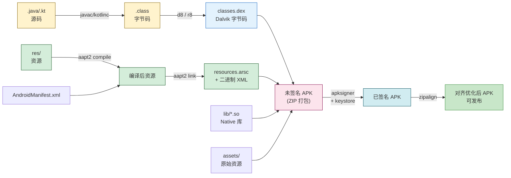
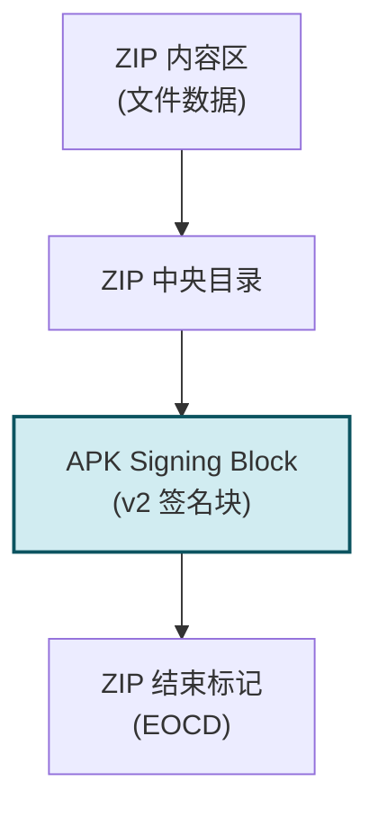

# 10.1 APK 打包、签名机制

> [!abstract] 本节概述
> 一个 Android 应用从源码到用户手机上可安装运行的产物，必须经过"编译 → DEX 转换 → 资源打包 → 签名 → 对齐"的完整流水线，最终生成 APK 文件。APK 不仅是代码与资源的压缩包，更通过签名机制保证了"完整性"与"身份不可伪造"两大安全属性——系统据此判断 APK 是否被篡改、是否来自同一开发者。本节讲解 APK 的内部结构、完整打包流程、四种签名方案（v1/v2/v3/v4）的原理与差异，以及 keystore 密钥管理实践，建立"打包不只是点一下 Build"的工程认知。

## 1. APK 文件结构

> [!definition] APK
> APK（Android Package）是 Android 应用的分发与安装单元，本质是一个 ZIP 压缩包，扩展名为 `.apk`。安装时系统解压并按规则将其中的代码、资源、清单文件部署到设备。

APK 解压后的典型结构：

| 路径 | 作用 | 说明 |
| ---- | ---- | ---- |
| `classes.dex` | 应用的可执行代码 | Dalvik 字节码；多个 dex 文件命名为 `classes2.dex`、`classes3.dex`（ multidex ） |
| `resources.arsc` | 编译后的资源索引表 | 二进制资源表，把资源 ID 映射到具体值 |
| `AndroidManifest.xml` | 应用清单 | 编译为二进制 XML，描述包名、组件、权限、版本等 |
| `res/` | 编译后的资源文件 | 布局 XML（二进制）、图片、字符串等 |
| `assets/` | 原始资源文件 | 不被编译，原样打包，通过 `AssetManager` 访问 |
| `lib/` | Native 库 | 按 ABI 分子目录：`arm64-v8a/`、`armeabi-v7a/`、`x86_64/` 等 |
| `META-INF/` | 签名信息（v1） | `MANIFEST.MF`、`CERT.SF`、`CERT.RSA` 等 |
| `kotlin/` | Kotlin 元数据 | Kotlin 反射与协程元数据 |
| `BuildConfig.class` | 编译期生成的配置 | 在 dex 中，含 DEBUG、VERSION_NAME 等 |

> [!tip] 查看 APK 内容
> APK 是 ZIP 文件，改后缀为 `.zip` 即可解压；或用 `unzip -l app.apk` 列出内容。但 `AndroidManifest.xml` 和 `res/` 中的 XML 是二进制格式，需用 `aapt2 dump` 或 `ApkTool` 反编译查看。

## 2. 完整打包流程



### 2.1 编译阶段（javac / kotlinc）

Java 源码由 `javac` 编译为 JVM 字节码（`.class`），Kotlin 源码由 `kotlinc` 编译为 `.class`。这一步与普通 Java 工程一致，产物是标准字节码，运行在 JVM 上而非 Android 设备上。

```bash
# 简化示意,实际由 Gradle 调用
javac -d build/classes -classpath android.jar src/com/example/MainActivity.java
# 产物: build/classes/com/example/MainActivity.class
```

### 2.2 DEX 转换（d8 / r8）

Android 的 ART/Dalvik 虚拟机不识别 JVM 字节码，需将其转换为 Dalvik 字节码（`.dex`）。

> [!definition] d8 与 r8
> - **d8**：Android Studio 3.1 起默认的 DEX 编译器，替代旧的 dx，速度快、产物小
> - **r8**：Android Gradle Plugin 3.4 起默认的整合工具，在 d8 基础上集成 **混淆、压缩、优化**（替代 ProGuard）
> - 当 `minifyEnabled true` 时，r8 自动执行混淆与 tree-shaking；为 false 时仅做 DEX 转换

```gradle
android {
    buildTypes {
        release {
            minifyEnabled true        // 启用 r8 混淆与压缩
            shrinkResources true      // 移除未使用资源
            proguardFiles getDefaultProguardFile('proguard-android-optimize.txt'),
                          'proguard-rules.pro'
        }
    }
}
```

> [!note] 一个 APK 多个 DEX
> 单个 dex 文件方法数上限约 65535（64K）。方法数超限时启用 multidex，生成 `classes.dex`、`classes2.dex`...，由 `MultiDexApplication` 在加载时合并。

### 2.3 资源打包（aapt2）

> [!definition] aapt2
> aapt2（Android Asset Packaging Tool 2）是 Android 资源打包工具，负责把 `res/` 下的 XML、图片、字符串等编译为二进制格式，并生成 `resources.arsc` 资源索引表。二进制格式比纯 XML 更小、解析更快。

资源打包分两步：
1. **compile**：把每个资源文件编译为二进制中间格式（`.flat`）
2. **link**：把所有 `.flat` 与 `AndroidManifest.xml` 链接，生成 `resources.arsc` 与编译后的 `res/`，同时分配资源 ID（如 `0x7f010001`）

```bash
# 简化示意
aapt2 compile --dir res -o compiled_resources.zip
aapt2 link -o app.apk \
    -I android.jar \
    --manifest AndroidManifest.xml \
    compiled_resources.zip
```

### 2.4 签名（apksigner）

未签名的 APK 无法在设备上安装。系统通过签名验证 APK 完整性与开发者身份。详见 [第 4 节](#4-签名方案对比v1--v2--v3--v4)。

### 2.5 对齐优化（zipalign）

> [!definition] zipalign
> zipalign 是 APK 字节对齐工具，将 APK 中未压缩资源（如图片、`resources.arsc`）的起始偏移对齐到 4 字节边界。这样运行时通过 `mmap` 直接映射内存访问，无需解压读取，提升启动速度与内存效率。

```bash
# 注意:zipalign 必须在签名之后(apksigner 之后)执行,否则会破坏 v2 签名
# 或使用 apksigner 的 --align 参数(推荐)
zipalign -v 4 app-unsigned.apk app-aligned.apk
# 验证对齐
zipalign -c -v 4 app-release.apk
```

> [!warning] 签名与对齐顺序
> - 使用 **v1 签名（jarsigner）**：先 `jarsigner` 签名，再 `zipalign` 对齐
> - 使用 **v2+ 签名（apksigner）**：先 `zipalign` 对齐，再 `apksigner` 签名（apksigner 不会破坏对齐）
> - 顺序错误会导致签名失效或对齐失效

## 3. 签名机制基础

> [!definition] APK 签名
> APK 签名是开发者使用私钥对 APK 内容生成数字签名，并把签名与公钥证书一并写入 APK 的过程。安装时系统用公钥校验签名，确认 APK 自签名后未被篡改，且与已安装的同包名应用出自同一密钥（升级校验）。

签名解决两个问题：
- **完整性**：APK 被修改后签名失效，系统拒绝安装
- **身份一致性**：升级必须使用同一密钥签名，防止恶意应用冒充升级覆盖

> [!info] Debug 与 Release 签名
> - **Debug 签名**：Android Studio 自动用 `~/.android/debug.keystore`（默认口令 `android`）签名，仅用于开发调试。所有开发者共享同一 debug 密钥，可直接覆盖安装
> - **Release 签名**：开发者自建 keystore，私钥严格保密，用于正式发布。**密钥丢失则无法升级应用**

## 4. 签名方案对比（v1 / v2 / v3 / v4）

### 4.1 v1 签名：JAR 签名

> [!definition] v1 签名
> v1 签名（JAR-based signing）是最早的签名方案，基于 Java JAR 签名机制，通过 `jarsigner` 工具实现。它对 APK 内每个文件单独计算 SHA-1 摘要，写入 `META-INF/MANIFEST.MF`，再对摘要签名写入 `CERT.SF` 与 `CERT.RSA`。

**META-INF 目录结构**：

| 文件 | 作用 |
| ---- | ---- |
| `MANIFEST.MF` | 列出 APK 内每个文件的 SHA-1 摘要 |
| `CERT.SF` | 对 MANIFEST.MF 每条摘要再次签名（防 MANIFEST 被篡改） |
| `*.RSA/DSA/EC` | 包含签名值与开发者公钥证书 |

**v1 的弱点**：
- **校验慢**：安装时需解压 APK 逐文件校验
- **不完整**：`META-INF` 内文件不参与签名，可被篡改（如加入恶意文件）
- **ZIP 注入攻击**：通过构造特殊 ZIP 结构绕过校验
- **Android 7+ 不再信任 v1 单独签名**：必须配合 v2+

### 4.2 v2 签名：APK 签名方案 v2

> [!definition] v2 签名
> v2 签名（APK Signature Scheme v2）是 Android 7.0（API 24）引入的方案，对整个 APK 文件（除签名块本身）计算摘要并签名。签名信息写入 ZIP 中央目录与结束标记之间的"APK Signing Block"中。

**v2 签名结构**：



**v2 优势**：
- **全文件校验**：任何字节修改都会破坏签名
- **校验快**：直接读取签名块，无需解压
- **防 ZIP 注入**：覆盖整个 ZIP 结构
- **Android 7+ 推荐最低方案**

### 4.3 v3 签名：支持密钥轮换

> [!definition] v3 签名
> v3 签名（APK Signature Scheme v3）是 Android 9.0（API 28）引入的方案，在 v2 基础上增加 **密钥轮换（key rotation）** 能力：支持用新密钥签名 APK，但系统通过"密钥谱系（lineage）"验证新密钥由旧密钥合法转授，从而允许升级时更换签名密钥。

**密钥轮换的应用场景**：
- 密钥泄露后紧急更换
- 公司收购时转移应用所有权
- 旧密钥算法被淘汰（如 SHA-1）

```bash
# 使用 apksigner 进行密钥轮换(简化)
apksigner rotate \
    --in old-keystore.jks \
    --out new-keystore.jks \
    --lineage lineage.bin
```

### 4.4 v4 签名：增量安装

> [!definition] v4 签名
> v4 签名（APK Signature Scheme v4）是 Android 11（API 30）引入的方案，配合 **增量安装（Incremental Install）** 使用。它在 APK 旁边生成一个 `.idsig` 签名文件，允许设备只下载运行所需的 APK 数据块，无需下载完整 APK 即可启动应用，大幅缩短大型应用的安装启动时间。

v4 **不独立使用**，必须与 v2 或 v3 共存（v4 校验 `.idsig`，v2/v3 校验 APK 本体）。

### 4.5 四种签名方案对比

| 维度 | v1（JAR） | v2 | v3 | v4 |
| ---- | --------- | --- | --- | --- |
| 引入版本 | Android 1.0 | Android 7.0（API 24） | Android 9.0（API 28） | Android 11（API 30） |
| 工具 | jarsigner | apksigner | apksigner | apksigner |
| 签名范围 | META-INF 内文件 | APK 全文件 | APK 全文件 | APK + .idsig |
| 校验速度 | 慢（解压） | 快 | 快 | 快 |
| 防篡改强度 | 弱 | 强 | 强 | 强（依赖 v2/v3） |
| 密钥轮换 | 不支持 | 不支持 | 支持 | 支持（继承 v3） |
| 关键能力 | 兼容旧系统 | 防 ZIP 注入 | 密钥轮换 | 增量安装 |
| 推荐策略 | 仅兼容旧系统 | 必选（7.0+） | 推荐启用 | 大型应用启用 |

> [!tip] 现代应用的签名策略
> 推荐配置：**v2 + v3 + v4**，最低保留 v2。apksigner 默认会同时启用 v1+v2+v3（按 minSdk 自动判断）。仅当 minSdk < 24 时才必须保留 v1。

## 5. 签名密钥管理

### 5.1 生成 keystore

> [!definition] keystore
> keystore 是存储私钥与公钥证书的容器文件（`.jks` 或 `.keystore`），口令保护。每个密钥条目（alias）包含一对公私钥与开发者身份证书。**Release keystore 是应用所有权的根凭证，丢失无法补发**。

```bash
# 使用 keytool 生成 keystore(JKS 格式,推荐 PKCS12)
keytool -genkeypair \
    -alias my-release-key \
    -keyalg RSA \
    -keysize 2048 \
    -validity 10000 \                # 有效期 10000 天(约 27 年)
    -keystore my-release.jks \
    -storetype pkcs12 \              # 推荐 PKCS12 格式
    -dname "CN=MyCompany, OU=Dev, O=MyOrg, L=Beijing, ST=Beijing, C=CN" \
    -storepass my-store-password \
    -keypass my-key-password

# 查看 keystore 内容
keytool -list -v -keystore my-release.jks
```

> [!warning] keystore 安全要点
> 1. **私钥不可上传版本库**：keystore、口令绝不进 Git，应加入 `.gitignore`
> 2. **有效期足够长**：推荐 ≥ 25 年，证书过期后无法用同一密钥升级应用
> 3. **多处备份**：物理隔离备份（公司服务器 + 离线 U 盘），防单点丢失
> 4. **口令强度**：storepass 与 keypass 使用高强度随机口令
> 5. **使用 Android Keystore 系统**：CI/CD 中可用 Google Play App Signing 托管上传密钥

### 5.2 Gradle 签名配置

为了避免在 `build.gradle` 中硬编码口令，推荐从环境变量或 `keystore.properties` 文件读取：

```gradle
// 1. 在项目根目录创建 keystore.properties(不进版本库)
// storeFile=my-release.jks
// storePassword=my-store-password
// keyAlias=my-release-key
// keyPassword=my-key-password

// 2. build.gradle (app) 读取并配置
def keystoreProperties = new Properties()
def keystoreFile = rootProject.file('keystore.properties')
if (keystoreFile.exists()) {
    keystoreProperties.load(new FileInputStream(keystoreFile))
}

android {
    signingConfigs {
        release {
            storeFile file(keystoreProperties['storeFile'])
            storePassword keystoreProperties['storePassword']
            keyAlias keystoreProperties['keyAlias']
            keyPassword keystoreProperties['keyPassword']
            // 启用 v2/v3 签名(默认启用)
            enableV1Signing true      // 兼容 minSdk < 24
            enableV2Signing true
            enableV3Signing true
        }
    }

    buildTypes {
        release {
            signingConfig signingConfigs.release
            minifyEnabled true
            proguardFiles getDefaultProguardFile('proguard-android-optimize.txt'),
                          'proguard-rules.pro'
        }
    }
}
```

### 5.3 命令行手动签名

```bash
# 1. 对齐(若用 apksigner,先对齐后签名)
zipalign -v 4 app-release-unsigned.apk app-aligned.apk

# 2. 签名(apksigner,推荐)
apksigner sign \
    --ks my-release.jks \
    --ks-key-alias my-release-key \
    --ks-pass pass:my-store-password \
    --key-pass pass:my-key-password \
    --v1-signing-enabled true \
    --v2-signing-enabled true \
    --v3-signing-enabled true \
    app-aligned.apk

# 3. 验证签名
apksigner verify --verbose app-aligned.apk
# 输出示例:
# Verifies
# Verified using v1 scheme (JAR signing): true
# Verified using v2 scheme (APK Signature Scheme v2): true
# Verified using v3 scheme (APK Signature Scheme v3): true
```

## 6. 综合案例：应用商店签名验证

> [!example] 案例：Google Play 与国内应用商店的签名要求
> **Google Play App Signing**：
> - 上传时使用"上传密钥"签名 APK
> - Google 用"应用签名密钥"重新签名后分发给用户
> - 好处：上传密钥丢失可申请重置；应用签名密钥由 Google 托管，更安全
> - 支持 Play App Signing 后无法回退到自管理
>
> **国内应用商店（华为、小米、OPPO、vivo 等）**：
> - 接受开发者自有 keystore 签名的 APK
> - 不托管密钥，**密钥丢失则无法升级**
> - 部分商店要求 v2 签名（防止被二次打包）
>
> **签名一致性校验**：
> - 应用商店在审核时会校验上传 APK 的签名与已上线版本签名一致
> - 签名不一致会被拒绝更新（防止恶意应用冒充升级）
> - 这就是为什么 [[8.5 应用加固基础概念|应用加固]] 后必须重新签名，且必须用同一 keystore

## 7. 易错点与最佳实践

> [!warning] 常见易错点
> 1. **Release 包未配置签名**：直接 Build → APK 生成的是 debug 签名包，不能上架
> 2. **keystore 口令硬编码进 build.gradle**：泄露后任何人可签名升级你的应用
> 3. **签名与对齐顺序错误**：v2 签名后用 jarsigner 会破坏对齐
> 4. **密钥有效期过短**：证书过期后无法升级应用
> 5. **仅用 v1 签名**：Android 7+ 不推荐，存在 ZIP 注入风险
> 6. **加固后未重新签名**：APK 无法安装
> 7. **debug keystore 用于发布**：所有开发者共享，无身份校验意义

> [!tip] 最佳实践
> - Release keystore 与口令分离存储（`keystore.properties` 不进版本库）
> - 同时启用 v2 + v3 签名，仅 minSdk < 24 时保留 v1
> - 密钥有效期 ≥ 25 年，多处物理备份
> - 使用 Google Play App Signing 托管应用签名密钥（如发布 Google Play）
> - CI/CD 中通过环境变量注入口令，不落盘
> - 加固流程：原始 APK → 签名 → 加固 → 重新签名 → 对齐 → 发布

## 章节导航

- 上级：[[MOC - 第10章|第10章 应用打包、发布与项目实战]]
- 下一节：[[10.2 版本管理、兼容性适配|10.2 版本管理、兼容性适配]]
- 习题：[[MOC - 第10章习题|第10章习题]]
