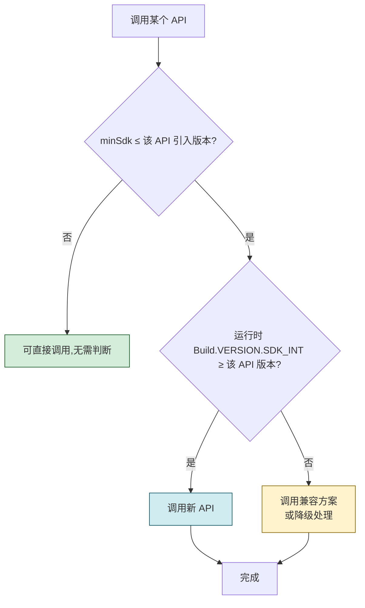
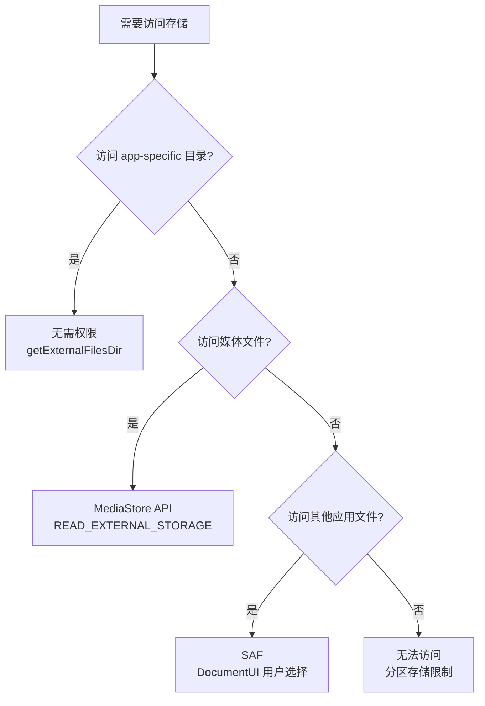

# 10.2 版本管理、兼容性适配

> [!abstract] 本节概述
> Android 生态存在严重的"碎片化"问题：不同版本的 Android 系统、不同厂商的定制 ROM、不同屏幕尺寸与密度的设备并存。一个 APP 要在数亿台设备上稳定运行，必须解决三类问题：版本号如何管理（让系统与商店识别升级）、API Level 如何适配（在不同 Android 版本上调用合适的 API）、屏幕如何适配（在多种尺寸与密度上正确显示）。本节讲解版本号语义、三 SDK 关系、运行时版本判断、AndroidX 向后兼容、屏幕适配策略，建立"写一次代码、跑在多代设备"的工程能力。

## 1. 版本号管理

### 1.1 versionCode 与 versionName

> [!definition] 版本号
> Android 应用的版本号由两个字段共同描述，定义在 `build.gradle` 或 `AndroidManifest.xml` 中：
> - **versionCode**：内部版本号，**正整数**，单调递增。系统与应用商店据此判断升级/降级。用户不可见
> - **versionName**：用户可见版本号，**字符串**，按语义化版本（如 `1.2.3`）展示给用户

```gradle
android {
    defaultConfig {
        versionCode 12         // 内部版本号:整数,每次发布递增
        versionName "1.2.0"    // 用户可见版本号:字符串
    }
}
```

| 字段 | 类型 | 用途 | 是否可见 | 规则 |
| ---- | ---- | ---- | -------- | ---- |
| versionCode | Integer | 升级判断 | 否 | 单调递增，新版本必须大于旧版本 |
| versionName | String | 用户展示 | 是（设置页、商店） | 自由格式，常用 `主.次.修订` |

> [!warning] versionCode 易错点
> 1. **versionCode 不递增**：商店拒绝升级，提示"版本号过低"
> 2. **versionCode 重复**：部分商店拒绝上传
> 3. **回退版本**：降级安装需先卸载，商店无法"回滚发布"
> 4. **用浮点数**：必须是整数，`1.5` 编译报错
> 5. **不同渠道不同 versionCode**：商店间版本号需统一，否则升级混乱

> [!tip] 语义化版本（Semantic Versioning）
> 推荐 `versionName` 使用 `MAJOR.MINOR.PATCH` 格式：
> - **MAJOR**：不兼容的 API 变更（如重构架构）
> - **MINOR**：向后兼容的功能新增
> - **PATCH**：向后兼容的 Bug 修复
> 例：`1.0.0` → `1.1.0`（新功能）→ `1.1.1`（修复）→ `2.0.0`（重大改版）

### 1.2 读取版本号

```java
public class VersionUtil {
    public static int getVersionCode(Context context) {
        try {
            PackageInfo info = context.getPackageManager()
                .getPackageInfo(context.getPackageName(), 0);
            if (Build.VERSION.SDK_INT >= Build.VERSION_CODES.P) {
                return (int) info.getLongVersionCode();   // API 28+ 用 long
            }
            return info.versionCode;                       // 旧版用 int
        } catch (PackageManager.NameNotFoundException e) {
            return -1;
        }
    }

    public static String getVersionName(Context context) {
        try {
            PackageInfo info = context.getPackageManager()
                .getPackageInfo(context.getPackageName(), 0);
            return info.versionName;
        } catch (PackageManager.NameNotFoundException e) {
            return "unknown";
        }
    }
}
```

## 2. Android 版本与 API Level

> [!definition] API Level
> API Level 是 Android 系统为每个版本分配的整数标识符（如 Android 13 = API 33）。它决定了系统提供的 API 集合。`minSdkVersion`、`targetSdkVersion`、`compileSdkVersion` 都以 API Level 为单位。

| Android 版本 | API Level | 代号 | 发布年份 | 关键变化 |
| ------------ | --------- | ---- | -------- | -------- |
| Android 6.0 | 23 | Marshmallow | 2015 | 运行时权限 |
| Android 7.0 | 24 | Nougat | 2016 | 多窗口、v2 签名 |
| Android 8.0 | 26 | Oreo | 2017 | 后台限制、通知渠道 |
| Android 9 | 28 | Pie | 2018 |刘海屏适配、v3 签名 |
| Android 10 | 29 | Q | 2019 | 分区存储（Scoped Storage） |
| Android 11 | 30 | R | 2020 | 权限单次授权、v4 签名 |
| Android 12 | 31 | S | 2021 | exported 强制声明、PendingIntent 标志 |
| Android 13 | 33 | T | 2022 | 通知权限、分区存储完善 |

## 3. 三 SDK 关系

> [!definition] 三 SDK
> Gradle 中三个核心字段共同决定 APP 的版本适配范围：
> - **minSdkVersion**：APP 可安装的**最低** API Level。低于此版本系统的设备无法安装
> - **targetSdkVersion**：APP **目标** API Level，告知系统已针对此版本测试。系统据此决定运行时行为（如是否启用新版本的安全限制）
> - **compileSdkVersion**：**编译**时使用的 API Level，决定可用 API 与编译器检查

```gradle
android {
    compileSdk 33                    // 编译用 API Level

    defaultConfig {
        minSdk 21                    // 最低支持 Android 5.0
        targetSdk 33                 // 目标 Android 13
    }
}
```

### 3.1 三 SDK 对比

| 字段 | 作用 | 影响 | 误配后果 |
| ---- | ---- | ---- | -------- |
| minSdkVersion | 最低可安装版本 | 低于此版本系统无法安装 | 设过低：放弃新 API；设过高：损失老用户 |
| targetSdkVersion | 运行时行为 | 系统按此版本应用安全限制 | 设过低：商店警告；设过高：可能因新限制崩溃 |
| compileSdkVersion | 编译期可用 API | 决定能用哪些 API | 必须 ≥ targetSdkVersion；过低无法用新 API |

> [!note] 三者关系
> `compileSdkVersion >= targetSdkVersion >= minSdkVersion`
> - **compileSdk 决定能用什么 API**：编译期检查
> - **targetSdk 决定系统如何对待你**：运行期行为
> - **minSdk 决定谁能装**：安装期限制

### 3.2 targetSdkVersion 的运行时影响

targetSdk 是三 SDK 中最容易被忽视但影响最大的字段。系统会按 targetSdk 决定是否启用各版本引入的安全限制：

| targetSdk | 系统行为变化 |
| --------- | ----------- |
| < 23 | 运行时权限不强制（安装时一次授权） |
| ≥ 23 | 必须运行时申请危险权限 |
| ≥ 24 | 不再信任仅 v1 签名；`file://` Uri 共享受限（需 FileProvider） |
| ≥ 26 | 后台 Service 限制；通知必须用 Channel |
| ≥ 29 | 分区存储强制（访问外部存储需 Scoped Storage） |
| ≥ 31 | 含 IntentFilter 组件必须显式 exported；PendingIntent 必须声明可变标志 |

## 4. 运行时版本判断适配

### 4.1 Build.VERSION.SDK_INT

> [!definition] Build.VERSION.SDK_INT
> `Build.VERSION.SDK_INT` 是当前设备系统的 API Level 整数值。运行时通过 `if (Build.VERSION.SDK_INT >= Build.VERSION_CODES.M)` 判断版本，调用对应 API，实现向下兼容。

```java
public class VersionAdapter {

    /** 安全地设置状态栏颜色,仅在 API 21+ 可用 */
    public static void setStatusBarColor(Window window, int color) {
        if (Build.VERSION.SDK_INT >= Build.VERSION_CODES.LOLLIPOP) {
            window.setStatusBarColor(color);    // API 21+
        }
        // 低版本忽略或用其他方式实现
    }

    /** 安全获取主目录 */
    public static File getExternalStorageDir(Context context) {
        if (Build.VERSION.SDK_INT >= Build.VERSION_CODES.Q) {
            // Android 10+:分区存储,用 MediaStore 或 app-specific 目录
            return context.getExternalFilesDir(null);
        } else {
            // Android 10-:用 Environment.getExternalStorageDirectory()
            return Environment.getExternalStorageDirectory();
        }
    }

    /** 通知渠道(必须 API 26+) */
    public static void createNotificationChannel(Context context) {
        if (Build.VERSION.SDK_INT >= Build.VERSION_CODES.O) {
            NotificationChannel channel = new NotificationChannel(
                "default", "默认渠道",
                NotificationManager.IMPORTANCE_DEFAULT);
            NotificationManager nm = context.getSystemService(NotificationManager.class);
            nm.createNotificationChannel(channel);
        }
    }
}
```

### 4.2 版本适配决策流程



> [!warning] 适配易错点
> 1. **直接调用高版本 API**：在低版本设备上 `NoClassDefFoundError` 或 `NoSuchMethodError`
> 2. **判断顺序错误**：`if (SDK_INT >= M) {申请权限} else {直接操作}` — 顺序正确；若写反则崩溃
> 3. **使用 `@RequiresApi` 注解但不判断**：lint 不报错但运行时崩
> 4. **只判断版本不降级**：判断后未提供 fallback，低版本进入死路

## 5. AndroidX 向后兼容

> [!definition] AndroidX
> AndroidX（原 Support Library）是 Google 提供的向后兼容库，封装了大量"在旧版本上使用新版本 API"的实现。例如 `AndroidX AppCompatActivity` 让旧版 Android 也能用新版 Material 配色与 Toolbar；`AndroidX Fragment` 提供统一的 Fragment 实现。

### 5.1 Support Library 与 AndroidX

| 维度 | Support Library（旧） | AndroidX（新） |
| ---- | -------------------- | -------------- |
| 包名 | `android.support.v4`、`android.support.v7` | `androidx.*` |
| 维护状态 | 已停止维护 | 持续更新 |
| 版本号 | 与 API Level 绑定（v4 = API 4） | 独立语义化版本 |
| 引入 | compile 'com.android.support:appcompat-v7:28.0.0' | implementation 'androidx.appcompat:appcompat:1.6.1' |

### 5.2 常用 AndroidX 库

| 库 | 作用 |
| -- | ---- |
| `androidx.appcompat:appcompat` | AppCompatActivity、兼容版 ActionBar |
| `androidx.recyclerview:recyclerview` | RecyclerView |
| `androidx.fragment:fragment` | Fragment |
| `androidx.lifecycle:lifecycle-viewmodel` | ViewModel |
| `androidx.lifecycle:lifecycle-livedata` | LiveData |
| `androidx.room:room-runtime` | Room 数据库 |
| `androidx.navigation:navigation-fragment` | 导航组件 |
| `androidx.work:work-runtime` | WorkManager 后台任务 |
| `androidx.security:security-crypto` | EncryptedSharedPreferences |

> [!tip] 迁移到 AndroidX
> 在 `gradle.properties` 中开启：
> ```properties
> android.useAndroidX=true
> android.enableJetifier=true   // 把旧依赖自动转为 AndroidX
> ```

## 6. 屏幕适配

### 6.1 屏幕密度与单位

> [!definition] 屏幕密度（Density）
> 屏幕密度指单位面积内的像素数，单位为 **dpi**（dots per inch）。Android 把屏幕密度分为 6 个等级，每等级对应一个 `densityDpi` 值：

| 密度等级 | 简称 | dpi | 比例（相对 mdpi） | 典型设备 |
| -------- | ---- | --- | ----------------- | -------- |
| low | ldpi | 120 | 0.75 | 早期小屏 |
| medium | mdpi | 160 | 1.0（基准） | HVGA |
| high | hdpi | 240 | 1.5 | WVGA |
| extra-high | xhdpi | 320 | 2.0 | 多数中端机 |
| extra-extra-high | xxhdpi | 480 | 3.0 | 旗舰机 |
| extra-extra-extra-high | xxxhdpi | 640 | 4.0 | 2K 屏 |

### 6.2 dp 与 sp

> [!definition] dp 与 sp
> - **dp（Density-independent Pixel）**：密度无关像素。`1dp = (dpi / 160) px`。在不同密度屏幕上，1dp 对应的物理尺寸相同，用于布局尺寸
> - **sp（Scale-independent Pixel）**：缩放无关像素。与 dp 类似，但会跟随系统字体大小设置缩放，**仅用于文字大小**

```xml
<!-- 布局用 dp,文字用 sp -->
<TextView
    android:layout_width="120dp"
    android:layout_height="48dp"
    android:textSize="16sp"
    android:padding="8dp"/>
```

> [!warning] 单位使用易错点
> 1. **布局用 px**：在不同密度屏幕上显示尺寸不一致，应改用 dp
> 2. **文字用 dp**：用户调整系统字号后不缩放，应改用 sp
> 3. **sp 用于布局**：用户调大字体会撑破布局

### 6.3 多分辨率资源适配

Android 通过资源限定符自动选择对应密度的资源。在 `res/` 下建立多个目录：

```
res/
├── drawable-mdpi/        @1.0x
│   └── icon.png          48x48
├── drawable-hdpi/        @1.5x
│   └── icon.png          72x72
├── drawable-xhdpi/       @2.0x
│   └── icon.png          96x96
├── drawable-xxhdpi/      @3.0x
│   └── icon.png          144x144
└── drawable-xxxhdpi/     @4.0x
    └── icon.png          192x192
```

> [!tip] 资源适配策略
> - **切图原则**：从最高密度（xxxhdpi）切起，向下缩放
> - **矢量图优先**：VectorDrawable（SVG）任意密度不模糊，体积小
> - **最小一套**：资源有限时只提供 xxhdpi，系统自动缩放其他密度（轻微失真）
> - **文字适配**：用 sp + 多套 `values/dimens.xml` 适配不同屏幕

## 7. 综合案例：适配 Android 6.0 权限与 Android 11 存储

> [!example] 案例：从 Android 5 升级 targetSdk 到 30 的适配

某 APP 原本 `targetSdk 22`（不强制运行时权限），升级到 `targetSdk 30`（分区存储）需做以下适配：

**阶段 1：targetSdk 22 → 23（运行时权限）**

```java
// 旧代码:AndroidManifest 声明即可
// <uses-permission android:name="android.permission.WRITE_EXTERNAL_STORAGE"/>

// 新代码:运行时申请
public void requestStoragePermission() {
    if (Build.VERSION.SDK_INT >= Build.VERSION_CODES.M) {
        if (ContextCompat.checkSelfPermission(this,
            Manifest.permission.WRITE_EXTERNAL_STORAGE)
            != PackageManager.PERMISSION_GRANTED) {
            ActivityCompat.requestPermissions(this,
                new String[]{Manifest.permission.WRITE_EXTERNAL_STORAGE},
                REQ_STORAGE);
        } else {
            // 已授权
            doStorageOperation();
        }
    } else {
        // Android 6 以下:声明即授权
        doStorageOperation();
    }
}

@Override
public void onRequestPermissionsResult(int requestCode, String[] permissions,
                                       int[] grantResults) {
    super.onRequestPermissionsResult(requestCode, permissions, grantResults);
    if (requestCode == REQ_STORAGE) {
        if (grantResults.length > 0 && grantResults[0] == PackageManager.PERMISSION_GRANTED) {
            doStorageOperation();
        } else {
            Toast.makeText(this, "需要存储权限", Toast.LENGTH_SHORT).show();
        }
    }
}
```

**阶段 2：targetSdk 29+（分区存储 Scoped Storage）**

```java
// 旧代码:直接写外部存储根目录
File file = new File(Environment.getExternalStorageDirectory(),
                     "MyApp/data.txt");

// 新代码:写到 app-specific 目录(无需权限)
File file = new File(context.getExternalFilesDir(null), "data.txt");
// 或访问共享媒体用 MediaStore
```

```xml
<!-- AndroidManifest.xml -->
<!-- targetSdk 29 加上 requestLegacyExternalStorage 临时兼容 -->
<application
    android:requestLegacyExternalStorage="true">

<!-- targetSdk 30+ 移除上述属性,完全遵循分区存储 -->
```

**适配决策流程**：



## 8. 易错点与最佳实践

> [!warning] 常见易错点
> 1. **targetSdk 多年不升级**：商店会下架或限制推荐
> 2. **直接调用新 API 不判断版本**：低版本设备崩溃
> 3. **minSdk 设过低**：浪费精力适配极少数老设备
> 4. **minSdk 设过高**：损失大量潜在用户（参考 Android Studio 推荐值）
> 5. **仍用 Support Library**：Google 已停止维护，应迁移 AndroidX
> 6. **布局用 px**：高密度屏看起来过小
> 7. **忘记多密度切图**：图标在 xxxhdpi 屏模糊
> 8. **未适配平板/折叠屏**：UI 拉伸或留白

> [!tip] 最佳实践
> - 跟随 Google 推荐：`minSdk 21`（覆盖 99%+ 设备）、`targetSdk` 设为最新稳定版
> - 用 `Build.VERSION.SDK_INT` + `@RequiresApi` 注解管理版本分支
> - 全面迁移 AndroidX，禁用 Support Library
> - 布局尺寸用 dp、文字用 sp、避免 px
> - 资源从高密度切起，向下缩放；优先用 VectorDrawable
> - 每年跟随新 Android 版本做一次 targetSdk 升级适配
> - 用 Android Studio 的 Layout Preview 验证多分辨率显示

## 章节导航

- 上级：[[MOC - 第10章|第10章 应用打包、发布与项目实战]]
- 上一节：[[10.1 APK 打包、签名机制|10.1 APK 打包、签名机制]]
- 下一节：[[10.3 移动端项目架构基础（MVC、MVVM）|10.3 移动端项目架构基础]]
- 习题：[[MOC - 第10章习题|第10章习题]]
