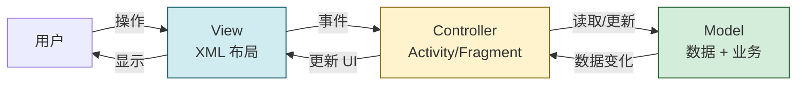
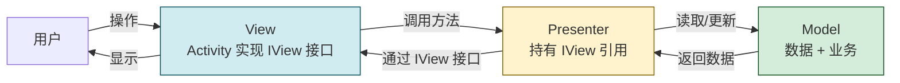
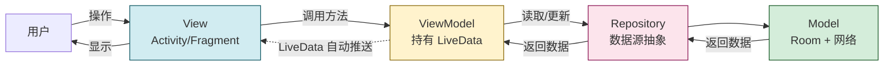
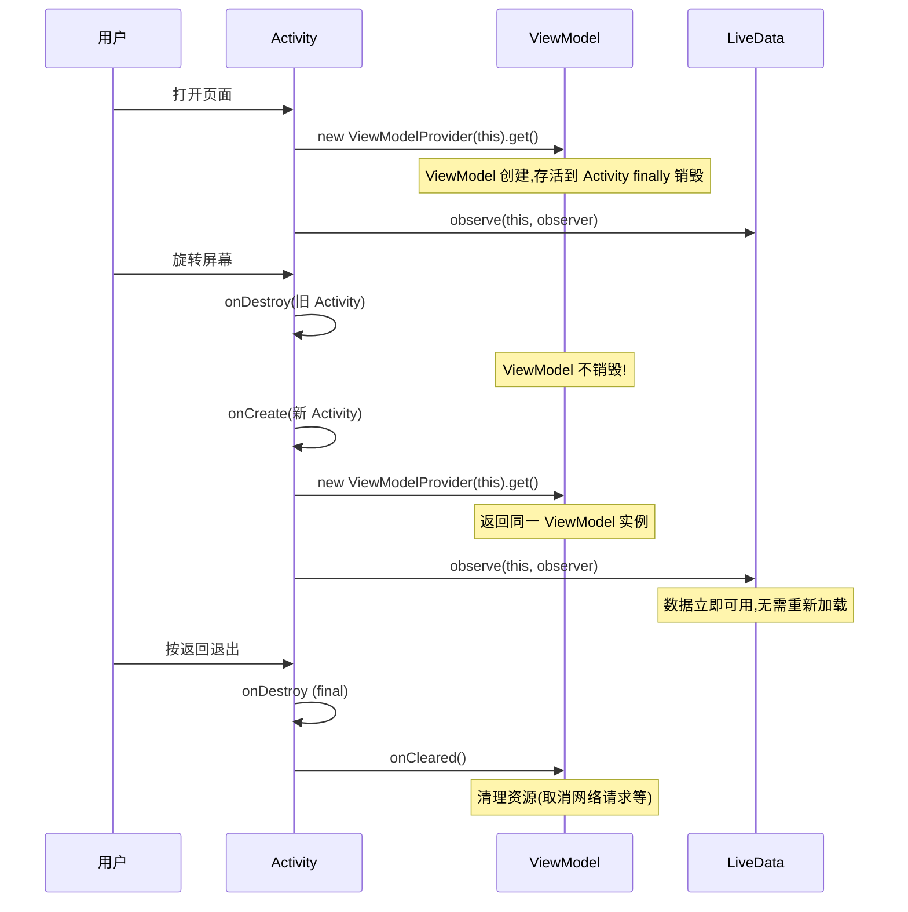
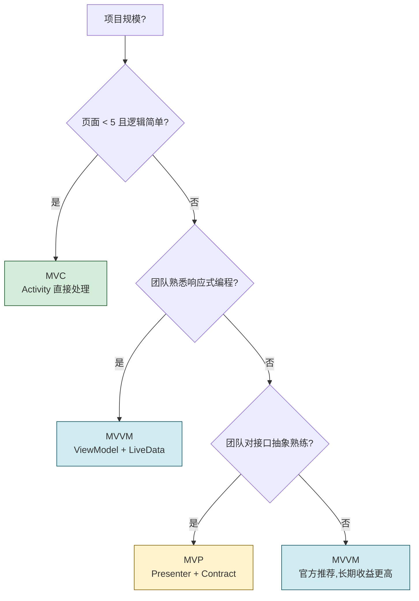

# 10.3 移动端项目架构基础（MVC、MVVM）

> [!abstract] 本节概述
> 当 APP 从一个页面扩展到几十个页面、从几百行代码扩展到几万行后，"把所有逻辑塞进 Activity"的模式会迅速崩溃——Activity 臃肿、逻辑无法测试、改动一处波及全局。架构模式（Architecture Pattern）就是约定"代码按什么维度切分、各部分如何通信"的规则。本节讲解 Android 上三种主流架构：MVC（最早）、MVP（解耦）、MVVM（响应式、官方推荐），对比它们的优劣，并给出 MVVM 的完整实现。理解架构不是为了用名词装点代码，而是为了让代码可读、可测、可维护。

## 1. 为什么需要架构模式

### 1.1 无架构的"全能 Activity"问题

```java
// 反例:全能 Activity
public class NoteActivity extends AppCompatActivity {
    private EditText etTitle, etContent;
    private NoteDao noteDao;
    private OkHttpClient client;

    @Override
    protected void onCreate(Bundle savedInstanceState) {
        super.onCreate(savedInstanceState);
        setContentView(R.layout.activity_note);

        // 1. View 初始化(UI 层)
        etTitle = findViewById(R.id.et_title);
        etContent = findViewById(R.id.et_content);

        // 2. 数据库初始化(数据层)
        noteDao = new NoteDao(this);

        // 3. 网络初始化(网络层)
        client = new OkHttpClient();

        // 4. 业务逻辑(逻辑层)
        findViewById(R.id.btn_save).setOnClickListener(v -> {
            String title = etTitle.getText().toString();
            String content = etContent.getText().toString();
            if (title.isEmpty()) {
                Toast.makeText(this, "标题不能为空", Toast.LENGTH_SHORT).show();
                return;
            }
            // 5. 本地保存
            noteDao.insert(new Note(title, content));
            // 6. 网络同步
            RequestBody body = RequestBody.create(JSON, "...", MediaType.parse("application/json"));
            client.newCall(new Request.Builder().url("...").post(body).build())
                .enqueue(new Callback() {
                    @Override
                    public void onResponse(Call call, Response response) {
                        runOnUiThread(() -> Toast.makeText(NoteActivity.this, "保存成功", Toast.LENGTH_SHORT).show());
                    }
                    @Override
                    public void onFailure(Call call, IOException e) {
                        runOnUiThread(() -> Toast.makeText(NoteActivity.this, "网络失败", Toast.LENGTH_SHORT).show());
                    }
                });
        });
    }
}
```

> [!warning] 全能 Activity 的问题
> 1. **代码膨胀**：单个 Activity 数千行，难以维护
> 2. **职责混杂**：UI、业务、数据、网络全揉在一起
> 3. **不可测试**：业务逻辑依赖 Android 框架，无法单元测试
> 4. **改动波及广**：改一处 UI 可能影响网络逻辑
> 5. **无法复用**：相似逻辑在多个 Activity 中复制粘贴

### 1.2 架构模式的目标

- **关注点分离**（Separation of Concerns）：UI、业务、数据各司其职
- **可测试性**：业务逻辑可脱离 Android 框架独立测试
- **可复用性**：业务逻辑可被多个页面复用
- **可维护性**：改动范围可控

## 2. MVC 架构

> [!definition] MVC
> MVC（Model-View-Controller）是最经典的架构模式，把应用分为三层：
> - **Model**：数据与业务逻辑（如 JavaBean、DAO）
> - **View**：UI 显示（XML 布局）
> - **Controller**：处理用户输入、协调 Model 与 View

### 2.1 Android 中的 MVC



在 Android 中：
- **View** = XML 布局文件
- **Controller** = Activity / Fragment
- **Model** = JavaBean、DAO、网络请求类

### 2.2 MVC 的局限

> [!warning] Android MVC 的核心问题
> Activity 在 Android 中**同时承担 View 与 Controller 职责**：
> - 它持有所有 View 引用（findViewById、setText）→ View 角色
> - 它处理事件、调度业务、更新 UI → Controller 角色
>
> 这导致 Activity **臃肿**（Fat Activity），XML 几乎无逻辑，所有控制逻辑堆在 Activity 中。MVC 在 Android 中并未真正实现关注点分离。

## 3. MVP 架构

> [!definition] MVP
> MVP（Model-View-Presenter）是 MVC 的改进，把 Controller 替换为 Presenter，并强制 View 通过接口与 Presenter 通信：
> - **Model**：数据与业务逻辑
> - **View**：纯粹的 UI（Activity/Fragment 实现 View 接口）
> - **Presenter**：处理逻辑，通过接口操作 View，不依赖 Android UI



### 3.1 MVP 实现示例

```java
// 1. View 接口:只描述 UI 行为,不依赖 Android
public interface NoteContract {
    interface View {
        void showNote(Note note);
        void showError(String msg);
        void showSaveSuccess();
    }
    interface Presenter {
        void loadNote(long id);
        void saveNote(String title, String content);
    }
}

// 2. Presenter:处理逻辑,持有 View 引用
public class NotePresenter implements NoteContract.Presenter {
    private final NoteContract.View view;
    private final NoteRepository repository;

    public NotePresenter(NoteContract.View view, NoteRepository repository) {
        this.view = view;
        this.repository = repository;
    }

    @Override
    public void loadNote(long id) {
        repository.getNote(id, new NoteRepository.Callback() {
            @Override
            public void onSuccess(Note note) {
                view.showNote(note);
            }
            @Override
            public void onError(String msg) {
                view.showError(msg);
            }
        });
    }

    @Override
    public void saveNote(String title, String content) {
        if (title == null || title.isEmpty()) {
            view.showError("标题不能为空");
            return;
        }
        repository.save(new Note(title, content), () -> view.showSaveSuccess());
    }
}

// 3. View 实现:Activity 只做 UI
public class NoteActivity extends AppCompatActivity implements NoteContract.View {
    private NotePresenter presenter;

    @Override
    protected void onCreate(Bundle savedInstanceState) {
        super.onCreate(savedInstanceState);
        setContentView(R.layout.activity_note);
        presenter = new NotePresenter(this, new NoteRepository());
        findViewById(R.id.btn_save).setOnClickListener(v ->
            presenter.saveNote(
                ((EditText) findViewById(R.id.et_title)).getText().toString(),
                ((EditText) findViewById(R.id.et_content)).getText().toString()
            )
        );
    }

    @Override public void showNote(Note note) { /* 更新 UI */ }
    @Override public void showError(String msg) {
        Toast.makeText(this, msg, Toast.LENGTH_SHORT).show();
    }
    @Override public void showSaveSuccess() {
        Toast.makeText(this, "保存成功", Toast.LENGTH_SHORT).show();
    }
}
```

### 3.2 MVP 的优劣

| 优点 | 缺点 |
| ---- | ---- |
| View 与逻辑解耦，可测试 Presenter | 接口爆炸（每个页面一个 Contract） |
| Presenter 不依赖 Android，可单元测试 | Presenter 持有 View 引用，需手动防内存泄漏 |
| 职责清晰，便于团队分工 | 手动管理生命周期，容易回调到已销毁的 View |
| 改造现有 MVC 代码相对简单 | 没有响应式，数据变化需手动调用 View |

> [!warning] MVP 易错点：生命周期
> Presenter 持有 View（Activity）引用，若 Activity 销毁时未释放，会内存泄漏；若异步回调在 Activity 销毁后触发，会崩溃。需在 `onDestroy` 中 `presenter.detach()` 置空 View 引用。

## 4. MVVM 架构

> [!definition] MVVM
> MVVM（Model-View-ViewModel）是 Google 官方推荐的架构。与 MVP 的关键区别：ViewModel **不持有 View 引用**，而是通过 **可观察的数据**（LiveData/StateFlow）向 View 推送状态；View 订阅这些数据并自动更新。ViewModel 与 View 解耦，且 **生命周期感知**——配置变更（如旋转屏）后 ViewModel 仍存活。



### 4.1 MVVM 的核心组件

| 组件 | 职责 | 关键特性 |
| ---- | ---- | -------- |
| **View**（Activity/Fragment） | UI 显示、用户事件分发 | 订阅 ViewModel 的 LiveData，不持有业务逻辑 |
| **ViewModel** | 处理业务逻辑、维护 UI 状态 | 不持有 View 引用；生命周期长于 Activity（旋转屏不销毁） |
| **LiveData** | 可观察的数据持有者 | 生命周期感知，自动取消订阅 |
| **Repository** | 数据源抽象 | 统一本地（Room）与远程（网络）数据访问 |
| **DataBinding**（可选） | XML 中绑定数据 | 自动观察 LiveData 更新 UI，减少 findViewById |

### 4.2 MVVM 完整实现：新闻列表

> [!example] 案例：新闻列表页的 MVVM 实现

**1) Model：数据类与数据源**

```java
// 数据类
public class News {
    public long id;
    public String title;
    public String content;
    public String imageUrl;
    public long publishTime;
}

// 本地数据源(Room)
@Dao
public interface NewsDao {
    @Query("SELECT * FROM news ORDER BY publishTime DESC")
    LiveData<List<News>> getAllNews();

    @Insert
    void insertAll(List<News> news);
}

// 远程数据源(网络)
public class NewsApi {
    public void fetchNews(int page, Callback<List<News>> callback) {
        // OkHttp 请求
    }
}
```

**2) Repository：统一数据源**

```java
public class NewsRepository {
    private final NewsDao localDao;
    private final NewsApi remoteApi;
    private final Executor executor = Executors.newFixedThreadPool(4);

    public NewsRepository(NewsDao dao, NewsApi api) {
        this.localDao = dao;
        this.remoteApi = api;
    }

    /** 暴露本地数据为 LiveData,UI 自动响应数据库变化 */
    public LiveData<List<News>> getNews() {
        return localDao.getAllNews();
    }

    /** 从网络拉取并写入本地数据库 */
    public void refreshNews() {
        executor.execute(() -> {
            remoteApi.fetchNews(1, new NewsApi.Callback<List<News>>() {
                @Override
                public void onSuccess(List<News> news) {
                    localDao.insertAll(news);   // 写库后 LiveData 自动推送
                }
                @Override
                public void onError(String msg) {
                    // 可通过另一个 LiveData 暴露错误状态
                }
            });
        });
    }
}
```

**3) ViewModel：业务逻辑 + UI 状态**

```java
public class NewsViewModel extends ViewModel {
    private final NewsRepository repository;
    private final MediatorLiveData<List<News>> newsLiveData = new MediatorLiveData<>();
    private final MutableLiveData<Boolean> loadingLiveData = new MutableLiveData<>(false);
    private final MutableLiveData<String> errorLiveData = new MutableLiveData<>();

    public NewsViewModel() {
        NewsDao dao = AppDatabase.getInstance().newsDao();
        NewsApi api = new NewsApi();
        repository = new NewsRepository(dao, api);

        // 订阅 Repository 的数据
        newsLiveData.addSource(repository.getNews(), news -> {
            if (news != null && !news.isEmpty()) {
                newsLiveData.setValue(news);
            }
        });
    }

    public LiveData<List<News>> getNews() { return newsLiveData; }
    public LiveData<Boolean> getLoading() { return loadingLiveData; }
    public LiveData<String> getError() { return errorLiveData; }

    public void refresh() {
        loadingLiveData.setValue(true);
        repository.refreshNews();
        // 实际项目应在 Repository 回调中关闭 loading
    }
}
```

**4) View：Activity 订阅 ViewModel**

```java
public class NewsActivity extends AppCompatActivity {
    private NewsViewModel viewModel;
    private NewsAdapter adapter;

    @Override
    protected void onCreate(Bundle savedInstanceState) {
        super.onCreate(savedInstanceState);
        setContentView(R.layout.activity_news);

        // 获取 ViewModel:生命周期绑定到 Activity
        viewModel = new ViewModelProvider(this).get(NewsViewModel.class);

        adapter = new NewsAdapter();
        RecyclerView rv = findViewById(R.id.rv_news);
        rv.setAdapter(adapter);

        // 订阅新闻数据:数据变化自动更新 UI
        viewModel.getNews().observe(this, news -> {
            adapter.setNews(news);
        });

        // 订阅加载状态
        viewModel.getLoading().observe(this, isLoading -> {
            findViewById(R.id.progressBar).setVisibility(
                isLoading ? View.VISIBLE : View.GONE);
        });

        // 订阅错误
        viewModel.getError().observe(this, msg -> {
            if (msg != null) Toast.makeText(this, msg, Toast.LENGTH_SHORT).show();
        });

        // 下拉刷新
        findViewById(R.id.btn_refresh).setOnClickListener(v -> viewModel.refresh());
    }
}
```

### 4.3 ViewModel 的生命周期



> [!info] ViewModel 的关键特性
> - **生命周期长于 Activity**：旋转屏等配置变更后 Activity 重建，ViewModel 不销毁，数据立即可用
> - **不持有 View 引用**：避免内存泄漏与回调到已销毁的 View
> - **`onCleared()`**：Activity 真正销毁时调用，用于取消网络请求、关闭资源
> - **不可在 ViewModel 中持有 Activity/Context**：会内存泄漏；如需 Context 用 `AndroidViewModel`

### 4.4 DataBinding（可选）

DataBinding 让 XML 直接绑定 LiveData，省去 `findViewById` 与手动 `observe`：

```xml
<!-- activity_news.xml -->
<layout xmlns:android="http://schemas.android.com/apk/res/android">
    <data>
        <variable name="vm" type="com.example.NewsViewModel"/>
    </data>
    <LinearLayout>
        <ProgressBar
            android:visibility="@{vm.loading ? View.VISIBLE : View.GONE}"/>
        <TextView android:text="@{vm.error}"/>
        <androidx.recyclerview.widget.RecyclerView
            android:adapter="@{adapter}"/>
    </LinearLayout>
</layout>
```

```java
// Activity 中
ActivityNewsBinding binding = DataBindingUtil.setContentView(this, R.layout.activity_news);
binding.setVm(viewModel);
binding.setLifecycleOwner(this);   // 让 LiveData 自动更新 UI
```

> [!warning] DataBinding 注意
> - XML 中不要写复杂逻辑（只做简单三元、null 判断）
> - 编译期检查类型，但表达式错误会编译失败
> - 与 ViewBinding（仅替代 findViewById，无数据绑定）不要混淆

## 5. 三种架构对比

| 维度 | MVC | MVP | MVVM |
| ---- | --- | --- | ---- |
| **Controller/Presenter/ViewModel** | Activity 兼任 | Presenter | ViewModel |
| **View 与逻辑耦合** | 高（Activity 兼职） | 低（接口分离） | 低（数据驱动） |
| **逻辑层持有 View 引用** | 是 | 是（需手动释放） | 否（自动解耦） |
| **可测试性** | 差 | 好（Presenter 可测） | 好（ViewModel 可测） |
| **响应式** | 否 | 否 | 是（LiveData/Flow） |
| **生命周期感知** | 无 | 需手动管理 | ViewModel 自动管理 |
| **配置变更（旋转屏）** | 重建丢失数据 | 重建丢失数据 | ViewModel 保留数据 |
| **代码量** | 少 | 多（接口爆炸） | 中等 |
| **学习成本** | 低 | 中 | 中高 |
| **官方推荐** | 否 | 否 | 是（Guide to App Architecture） |
| **适用场景** | 简单 Demo | 中型项目 | 中大型项目 |

## 6. 架构选型建议



> [!tip] 架构选型原则
> 1. **新项目优先 MVVM**：官方推荐，Jetpack 全家桶原生支持
> 2. **Demo 或学习项目可用 MVC**：快速验证想法，不必过度设计
> 3. **遗留 MVP 项目可逐步迁移 MVVM**：不必一次性重写
> 4. **架构不是银弹**：再好的架构也救不了糟糕的代码风格
> 5. **避免过度架构**：3 个页面的 APP 用 MVVM + Repository + UseCase 是过度设计

## 7. 易错点与最佳实践

> [!warning] 常见易错点
> 1. **ViewModel 中持有 View/Activity**：内存泄漏
> 2. **ViewModel 中做 UI 操作**（Toast、startActivity）：违反关注点分离
> 3. **LiveData 中存大对象**：旋转屏后 LiveData 缓存数据，可能 OOM
> 4. **Repository 写成 DAO 透传**：失去抽象意义，应封装业务规则
> 5. **MVP 中不释放 View 引用**：Activity 销毁后回调崩溃
> 6. **MVC 把网络/数据库直接写在 Activity**：无法测试与复用
> 7. **DataBinding 中写复杂逻辑**：XML 难调试，应放 ViewModel

> [!tip] 最佳实践
> - ViewModel 不持有 Context；如必须用 `AndroidViewModel`
> - 用 `LiveData` 暴露状态，避免直接暴露 `MutableLiveData`（用 `private MutableLiveData` + `public LiveData getXxx()`）
> - Repository 是数据源的唯一出口，统一本地与远程
> - 用 Kotlin 协程/Flow 替代 LiveData 做更复杂的数据流（Kotlin 项目）
> - ViewModel 中只放 UI 状态与轻量逻辑；重业务逻辑放 UseCase/Domain 层
> - 配合 [[6.4 OkHttp 等网络框架基础|OkHttp]] + [[5.3 SQLite 数据库基础操作|Room]] + [[7.1 Service 服务基础、前台服务|Service]] 实现完整工程

## 章节导航

- 上级：[[MOC - 第10章|第10章 应用打包、发布与项目实战]]
- 上一节：[[10.2 版本管理、兼容性适配|10.2 版本管理、兼容性适配]]
- 下一节：[[10.4 完整 APP 开发实战流程|10.4 完整 APP 开发实战流程]]
- 习题：[[MOC - 第10章习题|第10章习题]]
