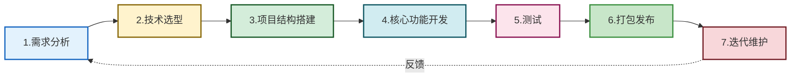
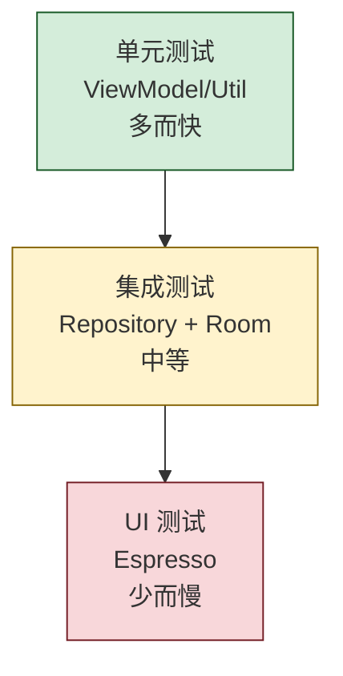
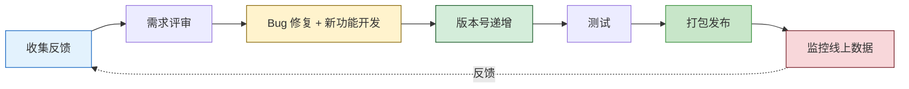

# 10.4 完整 APP 开发实战流程

> [!abstract] 本节概述
> 前三节分别讲了打包签名、版本适配、架构模式——它们都是"工程能力"的零件。本节把这些零件装配成一条完整的开发流水线：从需求分析、技术选型、项目结构搭建，到核心功能开发、测试、打包发布、迭代维护，走完一个 APP 从零到上线的全生命周期。本节以一个"记事本 APP"为案例，把全课程的知识点（Activity、UI、存储、网络、Service、安全、架构、打包）串成一个可落地的工程实践，是课程的总结性章节。

## 1. 完整 APP 开发流程总览



| 阶段 | 关键产物 | 关键决策 |
| ---- | -------- | -------- |
| 1. 需求分析 | 需求文档、功能清单 | 做什么？为谁做？做到什么程度？ |
| 2. 技术选型 | 技术方案文档 | 架构、网络框架、存储方案、UI 库 |
| 3. 项目结构搭建 | 工程目录、基础类 | 分包规范、BaseActivity、Repository |
| 4. 核心功能开发 | 可运行 APK | UI、网络、存储、后台 |
| 5. 测试 | 测试报告 | 单元测试、UI 测试、兼容性测试 |
| 6. 打包发布 | 签名 APK、商店上架 | 签名、混淆、上架审核 |
| 7. 迭代维护 | 新版本 APK | Bug 修复、功能迭代、版本管理 |

## 2. 项目选题与需求分析

### 2.1 选题原则

- **明确边界**：功能可在一两周内完成 MVP，避免"什么都要做"
- **覆盖核心知识点**：能用到 Activity、UI、存储、网络、后台等多章知识
- **有真实场景**：解决实际问题，便于设计测试用例
- **可扩展**：留出迭代空间，便于后续添加功能

### 2.2 需求分析示例：记事本 APP

> [!example] 案例：记事本 APP 需求分析

**目标用户**：需要快速记录笔记、待办的个人用户

**核心功能（MVP）**：

| 模块 | 功能 | 涉及知识点 |
| ---- | ---- | ---------- |
| 笔记管理 | 新建/编辑/删除笔记 | [[3.1 Activity 生命周期、状态切换\|Activity]]、[[5.3 SQLite 数据库基础操作\|SQLite]] |
| 列表展示 | 笔记列表、搜索 | [[4.3 列表控件 ListView、RecyclerView\|RecyclerView]] |
| 数据存储 | 本地持久化 | [[5.1 SharedPreferences 轻量存储\|SP]]、SQLite |
| 云同步 | 网络备份（可选） | [[6.4 OkHttp 等网络框架基础\|OkHttp]]、JSON |
| 提醒 | 笔记提醒通知 | [[7.1 Service 服务基础、前台服务\|Service]]、[[7.3 Notification 通知实现\|Notification]] |
| 设置 | 主题、字体 | [[5.1 SharedPreferences 轻量存储\|SP]] |

**非功能性需求**：
- 启动时间 < 2 秒
- 兼容 Android 5.0+（API 21+）
- 数据加密存储敏感笔记
- 无崩溃（ANR 率 < 0.1%）

## 3. 技术选型

> [!info] 技术选型原则
> - **优先用主流方案**：社区活跃、文档齐全、问题可搜
> - **优先用官方推荐**：Jetpack 全家桶，长期维护有保障
> - **避免过度引入三方库**：每个依赖都是潜在的安全与维护风险
> - **考虑团队熟悉度**：用团队熟悉的栈能降低风险

### 3.1 技术选型表

| 维度 | 选型 | 理由 |
| ---- | ---- | ---- |
| 架构 | MVVM | 官方推荐，[[10.3 移动端项目架构基础（MVC、MVVM）\|10.3]] 详述 |
| 语言 | Java（教学）/ Kotlin（生产） | 课程主线为 Java |
| UI 控件 | RecyclerView + Material Components | 官方推荐，性能好 |
| 网络框架 | OkHttp + Retrofit | [[6.4 OkHttp 等网络框架基础\|6.4]] 主流方案 |
| JSON 解析 | Gson | 简单稳定 |
| 本地存储 | Room（SQLite） + EncryptedSharedPreferences | 结构化数据 + 敏感配置 |
| 异步处理 | ViewModel + LiveData + Executor | 生命周期感知 |
| 后台任务 | WorkManager | [[7.4 工作任务调度基础\|7.4]] 官方推荐 |
| 图片加载 | Glide | 主流、性能好 |
| 依赖注入 | 手动构造（小项目）/ Hilt（大项目） | 避免过度设计 |
| 安全 | EncryptedSharedPreferences + SSL Pinning | [[8.2 本地数据加密、敏感信息保护\|8.2]]、[[8.3 HTTPS 防抓包、证书校验\|8.3]] |

### 3.2 依赖清单

```gradle
dependencies {
    // AndroidX 基础
    implementation 'androidx.appcompat:appcompat:1.6.1'
    implementation 'androidx.recyclerview:recyclerview:1.3.0'
    implementation 'com.google.android.material:material:1.9.0'

    // MVVM 架构
    implementation 'androidx.lifecycle:lifecycle-viewmodel:2.6.1'
    implementation 'androidx.lifecycle:lifecycle-livedata:2.6.1'

    // Room 数据库
    implementation 'androidx.room:room-runtime:2.5.1'
    annotationProcessor 'androidx.room:room-compiler:2.5.1'

    // 网络
    implementation 'com.squareup.okhttp3:okhttp:4.11.0'
    implementation 'com.squareup.retrofit2:retrofit:2.9.0'
    implementation 'com.squareup.retrofit2:converter-gson:2.9.0'

    // 图片加载
    implementation 'com.github.bumptech.glide:glide:4.15.1'

    // 安全存储
    implementation 'androidx.security:security-crypto:1.1.0-alpha06'

    // 后台任务
    implementation 'androidx.work:work-runtime:2.8.1'
}
```

## 4. 项目结构搭建

### 4.1 分包规范

```
com.example.notebook/
├── data/                       # 数据层
│   ├── local/                  # 本地数据
│   │   ├── AppDatabase.java    # Room 数据库
│   │   ├── NoteDao.java        # 笔记 DAO
│   │   └── entity/             # 实体
│   │       └── Note.java
│   ├── remote/                 # 远程数据
│   │   ├── ApiService.java     # Retrofit 接口
│   │   └── dto/                # 网络传输对象
│   │       └── NoteDto.java
│   └── repository/             # 仓库(统一数据源)
│       └── NoteRepository.java
├── ui/                         # UI 层(按功能模块分包)
│   ├── note/                   # 笔记列表
│   │   ├── NoteListActivity.java
│   │   ├── NoteListAdapter.java
│   │   └── NoteListViewModel.java
│   ├── editor/                 # 笔记编辑
│   │   ├── NoteEditActivity.java
│   │   └── NoteEditViewModel.java
│   └── settings/               # 设置
│       └── SettingsActivity.java
├── service/                    # 后台服务
│   └── NoteSyncService.java    # 同步服务
├── util/                       # 工具类
│   ├── DateUtil.java
│   ├── SecurityUtil.java
│   └── LogUtil.java
├── App.java                    # Application 入口
└── BuildConfig.java            # 编译期配置(自动生成)
```

> [!tip] 分包原则
> - **按功能模块分包**（`ui/note`、`ui/editor`）优于按类型分包（`activities`、`fragments`）
> - **data 层独立**：UI 改动不影响数据逻辑
> - **Repository 是数据层唯一出口**：UI 不直接访问 DAO 或 Api

### 4.2 Application 入口

```java
public class App extends Application {
    private static App instance;
    private AppDatabase database;
    private SharedPreferences securePrefs;

    @Override
    public void onCreate() {
        super.onCreate();
        instance = this;

        // 初始化数据库
        database = Room.databaseBuilder(this, AppDatabase.class, "notebook.db")
            .fallbackToDestructiveMigration()
            .build();

        // 初始化加密 SharedPreferences
        try {
            MasterKey key = new MasterKey.Builder(this)
                .setKeyScheme(MasterKey.KeyScheme.AES256_GCM)
                .build();
            securePrefs = EncryptedSharedPreferences.create(
                this, "secret", key,
                EncryptedSharedPreferences.PrefKeyEncryptionScheme.AES256_SIV,
                EncryptedSharedPreferences.PrefValueEncryptionScheme.AES256_GCM);
        } catch (Exception e) {
            LogUtil.e("App", "init secure prefs failed", e);
        }

        // 全局崩溃捕获
        Thread.setDefaultUncaughtExceptionHandler((t, e) -> {
            LogUtil.e("Crash", "uncaught exception", e);
            // 上报到风控
        });
    }

    public static App getInstance() { return instance; }
    public AppDatabase getDatabase() { return database; }
    public SharedPreferences getSecurePrefs() { return securePrefs; }
}
```

## 5. 核心功能开发

### 5.1 UI 页面实现：笔记列表

```java
// 1. 实体类
@Entity(tableName = "notes")
public class Note {
    @PrimaryKey(autoGenerate = true) public long id;
    public String title;
    public String content;
    public long updateTime;
    public boolean pinned;
}

// 2. DAO
@Dao
public interface NoteDao {
    @Query("SELECT * FROM notes ORDER BY pinned DESC, updateTime DESC")
    LiveData<List<Note>> getAllNotes();

    @Query("SELECT * FROM notes WHERE title LIKE '%' || :kw || '%' OR content LIKE '%' || :kw || '%'")
    LiveData<List<Note>> search(String kw);

    @Insert
    long insert(Note note);

    @Update
    void update(Note note);

    @Delete
    void delete(Note note);
}

// 3. ViewModel
public class NoteListViewModel extends ViewModel {
    private final NoteRepository repo;
    private final MutableLiveData<String> keyword = new MutableLiveData<>("");
    private final LiveData<List<Note>> notes;

    public NoteListViewModel() {
        repo = new NoteRepository(App.getInstance().getDatabase().noteDao());
        // 搜索关键词变化时自动重新查询
        notes = Transformations.switchMap(keyword, kw ->
            kw.isEmpty() ? repo.getAllNotes() : repo.search(kw));
    }

    public LiveData<List<Note>> getNotes() { return notes; }
    public void setKeyword(String kw) { keyword.setValue(kw); }
    public void delete(Note note) { repo.delete(note); }
}

// 4. Activity
public class NoteListActivity extends AppCompatActivity {
    private NoteListViewModel vm;
    private NoteAdapter adapter;

    @Override
    protected void onCreate(Bundle savedInstanceState) {
        super.onCreate(savedInstanceState);
        setContentView(R.layout.activity_note_list);

        vm = new ViewModelProvider(this).get(NoteListViewModel.class);

        RecyclerView rv = findViewById(R.id.rv_notes);
        rv.setLayoutManager(new LinearLayoutManager(this));
        adapter = new NoteAdapter();
        adapter.setOnItemClick(note ->
            startActivity(new Intent(this, NoteEditActivity.class)
                .putExtra("note_id", note.id)));
        adapter.setOnItemLongClick(note -> {
            new AlertDialog.Builder(this)
                .setTitle("删除").setMessage("删除该笔记?")
                .setPositiveButton("删除", (d, w) -> vm.delete(note))
                .show();
        });
        rv.setAdapter(adapter);

        // 订阅数据
        vm.getNotes().observe(this, notes -> adapter.setNotes(notes));

        // 搜索
        EditText etSearch = findViewById(R.id.et_search);
        etSearch.addTextChangedListener(new TextWatcher() {
            @Override public void beforeTextChanged(CharSequence s, int a, int b, int c) {}
            @Override public void onTextChanged(CharSequence s, int a, int b, int c) {}
            @Override public void afterTextChanged(Editable s) {
                vm.setKeyword(s.toString());
            }
        });

        // 新建笔记
        findViewById(R.id.fab_add).setOnClickListener(v ->
            startActivity(new Intent(this, NoteEditActivity.class)));
    }
}
```

### 5.2 网络请求：云同步

```java
// 1. API 接口(Retrofit)
public interface NoteApi {
    @POST("notes/sync")
    Call<SyncResponse> syncNotes(@Body SyncRequest request);

    @GET("notes/list")
    Call<List<NoteDto>> fetchNotes(@Query("since") long since);
}

// 2. Repository 网络部分
public class NoteRepository {
    private final NoteApi api;

    public void syncToCloud(List<Note> localNotes, Callback<SyncResponse> cb) {
        SyncRequest req = new SyncRequest(localNotes);
        api.syncNotes(req).enqueue(new retrofit2.Callback<SyncResponse>() {
            @Override
            public void onResponse(Call<SyncResponse> call, Response<SyncResponse> resp) {
                if (resp.isSuccessful() && resp.body() != null) {
                    cb.onSuccess(resp.body());
                } else {
                    cb.onError("同步失败:" + resp.code());
                }
            }
            @Override
            public void onFailure(Call<SyncResponse> call, Throwable t) {
                cb.onError("网络错误:" + t.getMessage());
            }
        });
    }
}
```

> [!info] 网络请求要点
> - **主线程禁止网络操作**：必须异步（[[6.2 异步网络请求、主线程禁止网络操作\|6.2]]）
> - **超时设置**：连接 10s、读取 15s
> - **HTTPS + SSL Pinning**：[[8.3 HTTPS 防抓包、证书校验\|8.3]] 防抓包
> - **失败重试**：指数退避，避免连续请求

### 5.3 数据存储：本地持久化

```java
// 普通笔记存 Room(明文即可)
// 敏感笔记(如带密码的)单独加密字段
public class SecurityUtil {
    public static String encrypt(String plain, SecretKey key) throws Exception {
        Cipher cipher = Cipher.getInstance("AES/GCM/NoPadding");
        byte[] iv = new byte[12];
        new SecureRandom().nextBytes(iv);
        cipher.init(Cipher.ENCRYPT_MODE, key, new IvParameterSpec(iv));
        byte[] cipherText = cipher.doFinal(plain.getBytes(StandardCharsets.UTF_8));
        // iv + cipherText 拼接存储
        byte[] out = new byte[iv.length + cipherText.length];
        System.arraycopy(iv, 0, out, 0, iv.length);
        System.arraycopy(cipherText, 0, out, iv.length, cipherText.length);
        return Base64.encodeToString(out, Base64.NO_WRAP);
    }

    public static String decrypt(String encrypted, SecretKey key) throws Exception {
        byte[] data = Base64.decode(encrypted, Base64.NO_WRAP);
        byte[] iv = Arrays.copyOfRange(data, 0, 12);
        byte[] cipherText = Arrays.copyOfRange(data, 12, data.length);
        Cipher cipher = Cipher.getInstance("AES/GCM/NoPadding");
        cipher.init(Cipher.DECRYPT_MODE, key, new IvParameterSpec(iv));
        return new String(cipher.doFinal(cipherText), StandardCharsets.UTF_8);
    }
}
```

### 5.4 后台功能：定时同步与提醒

```java
// 用 WorkManager 定时同步(官方推荐)
public class NoteSyncWorker extends Worker {
    public NoteSyncWorker(Context context, WorkerParameters params) {
        super(context, params);
    }

    @Override
    public Result doWork() {
        try {
            // 拉取远程最新笔记
            List<NoteDto> remote = App.getInstance().getApi().fetchNotes(0).execute().body();
            // 合并到本地数据库
            // ...
            return Result.success();
        } catch (Exception e) {
            LogUtil.e("SyncWorker", "sync failed", e);
            return Result.retry();   // 失败重试(指数退避)
        }
    }
}

// 注册定时任务
PeriodicWorkRequest syncWork = new PeriodicWorkRequest.Builder(
        NoteSyncWorker.class, 15, TimeUnit.MINUTES).build();
WorkManager.getInstance(this).enqueueUniquePeriodicWork(
    "note_sync", ExistingPeriodicWorkPolicy.KEEP, syncWork);

// 提醒通知(使用 NotificationChannel)
public void showReminder(Note note) {
    NotificationManager nm = getSystemService(NotificationManager.class);
    if (Build.VERSION.SDK_INT >= Build.VERSION_CODES.O) {
        NotificationChannel ch = new NotificationChannel(
            "reminder", "提醒", NotificationManager.IMPORTANCE_HIGH);
        nm.createNotificationChannel(ch);
    }
    Notification n = new NotificationCompat.Builder(this, "reminder")
        .setSmallIcon(R.drawable.ic_note)
        .setContentTitle("笔记提醒:" + note.title)
        .setContentText(note.content)
        .setAutoCancel(true)
        .build();
    nm.notify((int) note.id, n);
}
```

## 6. 测试

### 6.1 测试金字塔



### 6.2 单元测试示例

```java
// 测试 ViewModel 业务逻辑
@RunWith(RobolectricTestRunner.class)
public class NoteListViewModelTest {

    @Test
    public void search_shouldFilterByKeyword() {
        // Given
        NoteDao fakeDao = new FakeNoteDao(Arrays.asList(
            new Note(1, "Java 笔记", "...", 0, false),
            new Note(2, "Kotlin 笔记", "...", 0, false)
        ));
        NoteListViewModel vm = new NoteListViewModel(new NoteRepository(fakeDao));

        // When
        vm.setKeyword("Java");
        // 等待 LiveData 异步更新
        List<Note> result = LiveDataTestUtil.getValue(vm.getNotes());

        // Then
        assertEquals(1, result.size());
        assertEquals("Java 笔记", result.get(0).title);
    }
}
```

### 6.3 UI 测试示例

```java
@RunWith(AndroidJUnit4.class)
public class NoteListActivityTest {

    @Rule
    public ActivityScenarioRule<NoteListActivity> rule =
        new ActivityScenarioRule<>(NoteListActivity.class);

    @Test
    public void clickFab_shouldOpenEditor() {
        onView(withId(R.id.fab_add)).perform(click());
        // 验证跳转到编辑页
        onView(withId(R.id.et_title)).check(matches(isDisplayed()));
    }

    @Test
    public void search_shouldFilterList() {
        onView(withId(R.id.et_search)).perform(typeText("Java"), closeSoftKeyboard());
        // 验证列表只剩 Java 笔记
        onView(withId(R.id.rv_notes)).check(
            ViewAssertions.matches(withRecyclerViewSize(1)));
    }
}
```

### 6.4 测试要点

| 测试类型 | 工具 | 关注点 |
| -------- | ---- | ------ |
| 单元测试 | JUnit + Robolectric | ViewModel 业务逻辑、Repository 数据合并 |
| UI 测试 | Espresso | 跳转、列表交互、表单提交 |
| 兼容性测试 | Firebase Test Lab | 多机型多版本崩溃检查 |
| 性能测试 | Macrobenchmark | 启动时间、列表滚动帧率 |
| 安全测试 | 模拟抓包/逆向 | [[8.2 本地数据加密、敏感信息保护\|数据加密]]、[[8.3 HTTPS 防抓包、证书校验\|SSL Pinning]] |

## 7. 打包发布

### 7.1 发布前检查清单

- [ ] `versionCode` 递增，`versionName` 更新
- [ ] `targetSdkVersion` 升到最新稳定版
- [ ] Release 包开启 `minifyEnabled` + `shrinkResources`
- [ ] 混淆规则测试通过（Gson 模型 keep）
- [ ] 用 Release keystore 签名（非 debug）
- [ ] 启用 v2 + v3 签名
- [ ] 移除测试代码与日志
- [ ] 应用图标、名称、版本号显示正确
- [ ] 在多台真机（不同 Android 版本、屏幕）测试通过
- [ ] 加固（如需）：[[8.5 应用加固基础概念\|8.5]]
- [ ] 隐私政策、权限说明完整

### 7.2 打包命令

```bash
# 1. 命令行打包 Release APK
./gradlew assembleRelease

# 2. 产物位置
# app/build/outputs/apk/release/app-release.apk

# 3. 验证签名
apksigner verify --verbose app-release.apk

# 4. 验证对齐
zipalign -c -v 4 app-release.apk

# 5. 加固(可选,如腾讯乐固)
# 上传到加固平台 -> 下载加固后 APK -> 重新签名
apksigner sign --ks my-release.jks ... app-hardened.apk
```

### 7.3 应用商店上架

| 商店 | 流程 | 关键要求 |
| ---- | ---- | -------- |
| Google Play | 注册开发者 → 上传 AAB → 审核 → 上架 | 收 25 美元注册费；需 AAB 格式 |
| 华为 AppGallery | 注册 → 上传 APK → 审核 → 上架 | 需签名一致性 |
| 小米应用商店 | 注册 → 上传 APK → 审核 → 上架 | 需软著 |
| OPPO 软件商店 | 注册 → 上传 APK → 审核 → 上架 | 需软著 |
| vivo 应用商店 | 注册 → 上传 APK → 审核 → 上架 | 需软著 |

> [!info] AAB 与 APK
> Google Play 自 2021 年 8 月起强制要求新应用使用 **AAB（Android App Bundle）** 格式上传。AAB 是发布格式，Google Play 服务器根据用户设备生成最小化的 APK 分发。国内商店仍接受 APK。

## 8. 迭代维护

### 8.1 版本迭代流程



### 8.2 版本管理实践

```gradle
android {
    defaultConfig {
        // 1.0.0
        versionCode 1
        versionName "1.0.0"
    }
}

// 修复 Bug 后:
versionCode 2
versionName "1.0.1"

// 新增功能后:
versionCode 5
versionName "1.1.0"

// 重大改版后:
versionCode 10
versionName "2.0.0"
```

> [!tip] 版本管理建议
> - **不要跳版本号**：保持单调递增，便于追溯
> - **release 分支管理**：每个发布版本建 release 分支，便于 hotfix
> - **保留旧 APK**：用于回滚或对比 Bug
> - **使用 Git Tag**：每个发布版本打 tag（如 `v1.2.0`）
> - **变更日志**：维护 CHANGELOG.md

### 8.3 线上监控

| 维度 | 工具 | 关注指标 |
| ---- | ---- | -------- |
| 崩溃监控 | Firebase Crashlytics / Bugly | 崩溃率、ANR 率、Top 崩溃堆栈 |
| 性能监控 | Firebase Performance / 自研 | 启动时间、API 响应时间 |
| 用户行为 | Firebase Analytics / 神策 | DAU、留存、关键路径转化 |
| 网络监控 | 自研 + APM | 请求成功率、超时率 |

## 9. 综合案例：记事本 APP 完整流程

> [!example] 案例：从零到发布的完整流程

| 阶段 | 时间 | 产物 |
| ---- | ---- | ---- |
| 需求分析 | 第 1 周 | 功能清单：CRUD + 搜索 + 同步 + 提醒 |
| 技术选型 | 第 1 周末 | MVVM + Room + OkHttp + WorkManager |
| 项目结构 | 第 2 天 | 分包规范、BaseActivity、Repository |
| 笔记列表页 | 第 1-3 天 | RecyclerView + ViewModel + LiveData |
| 笔记编辑页 | 第 4-5 天 | 编辑、保存、删除 |
| 搜索功能 | 第 6 天 | 关键词搜索、防抖 |
| 云同步 | 第 7-8 天 | OkHttp + Retrofit + 后台 WorkManager |
| 提醒通知 | 第 9 天 | Notification + AlarmManager |
| 安全加固 | 第 10 天 | EncryptedSharedPreferences + SSL Pinning |
| 单元测试 | 第 11 天 | ViewModel + Repository 测试 |
| UI 测试 | 第 12 天 | Espresso 主流程 |
| 真机测试 | 第 13 天 | 5 台不同 Android 版本真机 |
| 打包发布 | 第 14 天 | 签名 APK + 上架华为/小米商店 |
| 迭代 V1.1 | 第 4 周 | 修复崩溃 + 添加夜间模式 |

## 10. 易错点与最佳实践

> [!warning] 常见易错点
> 1. **需求未明确就开发**：返工严重
> 2. **过度设计架构**：3 个页面的 APP 用 Clean Architecture 是浪费
> 3. **UI 与业务逻辑混杂**：Activity 中直接写网络请求
> 4. **未测试 Release 包**：Debug 跑通 ≠ Release 跑通（混淆后行为变化）
> 5. **混淆规则不全**：Gson 模型被混淆导致解析失败
> 6. **未备份 keystore**：丢失无法升级应用
> 7. **未做线上崩溃监控**：用户反馈才发现崩溃
> 8. **版本号管理混乱**：跨商店版本不一致

> [!tip] 最佳实践
> - 需求先做 MVP，按用户反馈迭代
> - 架构选型匹配项目规模：小项目 MVC，中大型 MVVM
> - 严格分包：UI / ViewModel / Repository / Data 分离
> - 测试驱动：关键业务逻辑写单元测试
> - Release 包必须在多真机测试
> - keystore 多处备份，口令不进版本库
> - 上线后立即部署崩溃监控
> - 每个发布版本打 Git Tag + 维护 CHANGELOG
> - 综合运用 [[8.2 本地数据加密、敏感信息保护\|8.2]]、[[8.3 HTTPS 防抓包、证书校验\|8.3]]、[[8.5 应用加固基础概念\|8.5]] 安全措施

## 章节导航

- 上级：[[MOC - 第10章|第10章 应用打包、发布与项目实战]]
- 上一节：[[10.3 移动端项目架构基础（MVC、MVVM）|10.3 移动端项目架构基础]]
- 习题：[[MOC - 第10章习题|第10章习题]]
- 课程总览：[[MOC - 移动互联网开发技术|移动互联网开发技术]]（本章为课程最后一章）
