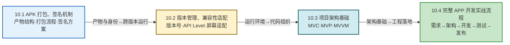

# MOC - 第10章 应用打包、发布与项目实战

前九章的知识都聚焦在"如何写出能跑的代码"，本章则把视角从"代码"提升到"工程化交付与项目落地"：APK 是如何从源码变成可安装分发的产物、签名机制如何保证完整性与身份、版本号与兼容性如何让 APP 跨越多代 Android 系统稳定运行、MVC/MVP/MVVM 等架构模式如何让代码可维护可测试，最终用一个完整 APP 的从零到发布流程把全部知识串起来。本章是课程的收尾章，目标是从"会写功能"走向"能交付产品"。

> [!info] 本章定位
> - **核心对象**：APK 产物、签名身份、版本与兼容性、项目架构、完整 APP 工程化流程
> - **关键能力**：理解 APK 打包与签名机制、规划版本号与适配策略、选择并实现 MVC/MVP/MVVM 架构、独立完成一个 APP 从需求到发布的全流程
> - **承前启后**：综合运用第3章 Activity、第5章存储、第6章网络、第7章后台服务、第8章安全的知识，在工程层面整合落地
> - **考试权重**：APK 签名机制（v1/v2/v3）、版本号管理、MVC/MVP/MVVM 对比为高频考点；完整 APP 流程为综合设计题背景
> - **本章为最后一章**：无下一章，复习时应注意回看全课程知识地图

> [!abstract] 本章核心问题
> 1. APK 内部由哪些文件组成？从源码到 APK 要经过哪些步骤？
> 2. APK 签名 v1/v2/v3/v4 各解决什么问题？为什么 Android 7+ 推荐使用 v2 及以上？
> 3. versionCode 与 versionName 有何区别？minSdkVersion/targetSdkVersion/compileSdkVersion 各自的语义是什么？
> 4. MVC、MVP、MVVM 三种架构的差别是什么？为什么 Android 官方推荐 MVVM？
> 5. 一个完整的 APP 从需求分析到上线发布需要经历哪些阶段？每个阶段的关键产物是什么？

## 本章学习路线

## 知识点导航

| 序号 | 知识点 | 核心内容 | 重点等级 |
| ---- | ------ | -------- | -------- |
| 10.1 | [[10.1 APK 打包、签名机制\|APK 打包、签名机制]] | APK 文件结构、编译→DEX→打包→签名→对齐流程、v1/v2/v3/v4 签名方案对比、keystore 管理 | ⭐⭐⭐⭐⭐ |
| 10.2 | [[10.2 版本管理、兼容性适配\|版本管理、兼容性适配]] | versionCode/versionName、minSdk/targetSdk/compileSdk、Build.VERSION 适配、AndroidX、屏幕适配 | ⭐⭐⭐⭐ |
| 10.3 | [[10.3 移动端项目架构基础（MVC、MVVM）\|项目架构基础]] | MVC/MVP/MVVM 三种架构原理与对比、ViewModel+LiveData+Repository 实现 | ⭐⭐⭐⭐⭐ |
| 10.4 | [[10.4 完整 APP 开发实战流程\|完整 APP 开发实战流程]] | 需求分析、技术选型、项目结构、核心功能开发、测试、打包发布、迭代维护 | ⭐⭐⭐⭐ |

## 核心考点速览

> [!warning] 高频考点（7 点）
> 1. **APK 打包流程**：编译 → DEX → 资源打包 → 签名 → 对齐 五步的产物与工具链（**必考**）
> 2. **APK 文件结构**：classes.dex、resources.arsc、AndroidManifest.xml、res、lib、META-INF 各自作用
> 3. **签名方案对比**：v1（JAR）/v2（全文件）/v3（密钥轮换）/v4（增量安装）的原理与差异（**必考**）
> 4. **版本号语义**：versionCode（整数、升级判断）与 versionName（字符串、用户展示）的区别
> 5. **三 SDK 关系**：minSdkVersion / targetSdkVersion / compileSdkVersion 的语义与适配策略
> 6. **架构模式对比**：MVC/MVP/MVVM 的分层职责、耦合度、可测试性、Android 推荐方案
> 7. **完整 APP 流程**：从需求到发布的关键阶段与产物（综合设计题背景）

## 关键概念速查

### APK 打包工具链

| 阶段 | 工具 | 输入 | 输出 |
| ---- | ---- | ---- | ---- |
| Java 编译 | javac | .java 源码 | .class 字节码 |
| DEX 编译 | d8 / r8 | .class 字节码 | classes.dex |
| 资源打包 | aapt2 | res/、AndroidManifest.xml | resources.arsc、编译资源 |
| 签名 | apksigner | 未签名 APK、keystore | 已签名 APK |
| 对齐 | zipalign | 已签名 APK | 字节对齐 APK |

### 签名方案对比速查

| 方案 | 引入版本 | 签名范围 | 校验速度 | 防篡改强度 | 关键能力 |
| ---- | -------- | -------- | -------- | ---------- | -------- |
| v1（JAR） | Android 1.0 | META-INF 内文件 | 慢（解压校验） | 弱（可篡改未校验项） | 兼容旧系统 |
| v2 | Android 7.0（API 24） | APK 全文件 | 快 | 强 | 防 ZIP 注入 |
| v3 | Android 9.0（API 28） | APK 全文件 | 快 | 强 | 密钥轮换 |
| v4 | Android 11（API 30） | APK +增量文件 | 快 | 强（依赖 v2/v3） | 增量安装 |

### 三大架构模式对比速查

| 维度 | MVC | MVP | MVVM |
| ---- | --- | --- | ---- |
| Controller/Presenter/ViewModel | Activity 兼任 | Presenter | ViewModel |
| View 与逻辑耦合 | 高 | 低（接口分离） | 低（数据驱动） |
| 可测试性 | 差 | 好 | 好 |
| 响应式 | 否 | 否 | 是（LiveData/Flow） |
| 生命周期感知 | 无 | 需手动管理 | ViewModel 自动管理 |

### 版本适配核心字段

| 字段 | 含义 | 影响 |
| ---- | ---- | ---- |
| minSdkVersion | 最低支持 API Level | 低于此版本系统不安装 |
| targetSdkVersion | 目标 API Level | 决定运行时行为（如权限、广播） |
| compileSdkVersion | 编译用 API Level | 决定可用 API 与编译检查 |
| versionCode | 内部版本号（整数） | 应用商店升级判断 |
| versionName | 用户可见版本号（字符串） | 用户展示 |

## 全课程回顾

> [!note] 本章为课程收尾
> 学完本章后，应能将前九章的知识串成完整的工程能力：
> - 第1章 移动开发概述 → 理解 APP 在生态中的定位
> - 第2章 环境与项目结构 → 创建工程、配置 Gradle
> - 第3章 Activity 与页面交互 → 实现页面与导航
> - 第4章 UI 界面开发 → 实现列表、布局、事件
> - 第5章 数据持久化 → 本地存储
> - 第6章 网络通信 → 远程数据交互
> - 第7章 后台服务与通知 → 后台任务与消息
> - 第8章 移动应用安全 → 数据加密、防抓包、加固
> - 第9章 跨平台开发 → 选型对比
> - **第10章 打包发布与实战 → 工程化交付**

## 章节导航

- 上级：[[MOC - 移动互联网开发技术|移动互联网开发技术总览]]
- 上一章：[[MOC - 第9章|第9章 跨平台开发技术基础]]
- 习题：[[MOC - 第10章习题|第10章习题]]
- 下一章：无（本章为课程最后一章）
