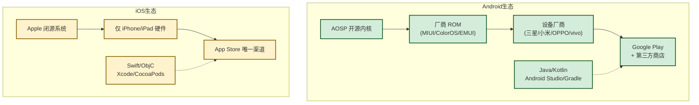

# 1.2 Android、iOS 生态对比

> [!abstract] 本节概述
> 本节从开发语言、工具链、应用分发、审核机制、碎片化、收益模式六个维度对比 Android 与 iOS 两大生态。理解这两端差异，是后续做技术选型、双端开发与发布策略的前提，也是 [[1.3 原生开发、跨平台开发方案对比|1.3]] 讨论跨平台方案必要性的现实基础。

## 1.2.1 生态总览

Android 与 iOS 是当前全球市场份额最大的两大移动平台，但生态哲学截然不同：

- **Android**：开源、开放、设备多样 → 生态广度优先
- **iOS**：闭源、封闭、设备统一 → 体验一致性优先



> [!note] 图释
> Android 生态由开源 AOSP 衍生出众多厂商 ROM 与设备，应用分发渠道多元；iOS 生态由 Apple 独家掌控硬件、系统与商店，呈现高度统一的纵向整合特征。

## 1.2.2 开发语言对比

| 维度 | Android | iOS |
| ---- | ------- | --- |
| 官方推荐语言 | Kotlin（2017 起官方首选） | Swift（2014 起取代 Objective-C） |
| 历史语言 | Java | Objective-C |
| 语言范式 | 静态类型、JVM 运行、与 Java 互操作 | 静态类型、LLVM 编译、与 Objective-C 互操作 |
| 空安全 | Kotlin 内置 nullable 类型 | Swift 内置 Optional 类型 |
| 协程支持 | Kotlin Coroutines | Swift async/await（5.5+） |

> [!tip] Java vs Kotlin
> Kotlin 与 Java 都运行于 JVM，可互操作。Kotlin 优势：
> - 简洁：消除样板代码（`findViewById` → `viewBinding`/`synthesize`）
> - 安全：内置空安全，减少 NPE
> - 互操作：可直接调用 Java 库
>
> 本课程示例以 **Java** 为主（与先修课程衔接），关键处补充 Kotlin 对照。

> [!tip] Swift vs Objective-C
> Swift 是 Apple 推出的现代语言，语法接近现代脚本语言，安全性更高。Objective-C 仍是大量历史库与系统框架的底层语言，新项目通常首选 Swift。

## 1.2.3 工具链对比

| 工具 | Android | iOS |
| ---- | ------- | --- |
| IDE | Android Studio（基于 IntelliJ） | Xcode |
| 构建工具 | Gradle（Groovy/Kotlin DSL） | Xcode Build / xcodebuild |
| 包管理 | Maven Central + jitpack | CocoaPods / Swift Package Manager |
| UI 设计 | XML 布局 + Compose | Storyboard / SwiftUI |
| 调试 | Android Studio Debugger + Logcat | Xcode Debugger + Console |
| 性能分析 | Android Profiler | Instruments |
| 模拟器 | Android Emulator（x86/ARM） | iOS Simulator（仅 x86/ARM Mac） |

> [!warning] iOS 开发的硬件要求
> iOS 应用编译与签名必须依赖 macOS + Xcode 环境。Windows/Linux 下只能借助跨平台方案（如 Flutter、React Native）或云 Mac 服务。这是双端原生开发成本高昂的关键原因之一。

### Gradle 构建示例（Android）

```gradle
// app/build.gradle (Groovy DSL)
plugins {
    id 'com.android.application'
    id 'org.jetbrains.kotlin.android'
}

android {
    namespace 'com.example.myapp'
    compileSdk 34

    defaultConfig {
        applicationId "com.example.myapp"
        minSdk 24
        targetSdk 34
        versionCode 1
        versionName "1.0"
    }
}

dependencies {
    implementation 'androidx.appcompat:appcompat:1.6.1'
    implementation 'com.google.android.material:material:1.9.0'
}
```

说明：`compileSdk` 决定编译时可用 API；`minSdk` 决定最低支持系统版本；`targetSdk` 表示已针对该版本测试通过。

### Podfile 示例（iOS）

```ruby
# ios/Podfile
platform :ios, '15.0'
use_frameworks!

target 'MyApp' do
  pod 'Alamofire', '~> 5.6'
  pod 'SnapKit', '~> 5.6'
end
```

说明：CocoaPods 是 iOS 主流依赖管理工具，`platform :ios, '15.0'` 声明最低部署版本。

## 1.2.4 应用分发与审核

| 维度 | Android | iOS |
| ---- | ------- | --- |
| 官方商店 | Google Play | App Store |
| 第三方分发 | 允许（国内厂商商店/直接安装 APK） | 不允许（除企业证书/MDM） |
| 审核 | 相对宽松，几小时到数天 | 严格，1—7 天，常被拒 |
| 上架费用 | 一次性 $25 注册费 | 年费 $99（企业 $299） |
| 抽成 | 15%—30%（部分情况可降至 10%） | 15%—30%（"苹果税"） |

> [!warning] 中国大陆 Android 分发的特殊性
> Google Play 在中国大陆不可用，主流分发渠道为华为、小米、OPPO、vivo、应用宝等厂商商店。一个应用上线需同时提交至 5—10 家商店，且各商店审核规则、签名要求、隐私政策模板不一致，这是国内 Android 发布的主要工作量来源。

## 1.2.5 碎片化对比

| 碎片化维度 | Android | iOS |
| ---------- | ------- | --- |
| 设备型号 | 数千种 | 每年新增 3—5 款 |
| 屏幕尺寸 | 4 寸—7 寸+ 折叠屏 | 有限尺寸集合 |
| 系统版本 | 8.0—14 并存（更新滞后） | 更新率高，2—3 个版本并存 |
| 厂商定制 | MIUI/ColorOS/EMUI 等差异大 | 无 |
| 适配成本 | 高 | 低 |

> [!example] 案例：同一应用在 Android 与 iOS 的开发差异
> 以一个简单"扫描二维码登录"功能为例：
> - **iOS**：调用 `AVCaptureSession`，权限弹窗统一，主流机型行为一致，1—2 周可完成双端适配
> - **Android**：Camera/Camera2/CameraX 三套 API 并存；需处理动态权限、厂商省电策略（小米"神隐模式"）、多摄像头（双摄/三摄/折叠屏）、不同厂商通知图标白名单等；同一功能往往需要 2 倍以上工时
>
> 这种差异是 [[1.3 原生开发、跨平台开发方案对比|1.3]] 跨平台方案兴起的核心动因之一。

## 1.2.6 收益模式对比

| 模式 | Android 适合度 | iOS 适合度 |
| ---- | -------------- | ---------- |
| 应用付费下载 | 低（用户付费习惯弱） | 中 |
| 应用内购买（IAP） | 中 | 高（系统级支持完善） |
| 广告变现 | 高（用户基数大） | 中 |
| 订阅制 | 中 | 高 |
| 国内渠道分发 | 必需 | 不适用 |

> [!note] 收益差异
> 同一应用在 iOS 用户的 ARPU（每用户平均收入）通常高于 Android，因此中小开发者常优先发布 iOS 版本验证商业模式，再扩展 Android。但国内市场因 Android 用户基数大，整体收入常反超 iOS。

## 1.2.7 生态对比总结表

| 维度 | Android | iOS |
| ---- | ------- | --- |
| 开源状态 | 开源（AOSP） | 闭源 |
| 开发语言 | Java/Kotlin | Swift/Objective-C |
| 构建工具 | Gradle | Xcode Build |
| IDE | Android Studio | Xcode |
| 包管理 | Maven/jitpack | CocoaPods/SPM |
| 应用商店 | Google Play + 第三方 | App Store 唯一 |
| 审核严格度 | 较宽松 | 严格 |
| 碎片化程度 | 高 | 低 |
| 开发硬件 | 任意平台 | macOS |
| 用户付费意愿 | 中 | 高 |
| 全球市场份额 | 第一 | 第二 |

## 本节小结

- Android 与 iOS 在开源哲学、开发语言、工具链、分发审核、碎片化、收益模式上存在系统性差异
- Android 优势在生态广度与开放性，挑战在碎片化与适配成本
- iOS 优势在体验一致性与付费能力，挑战在闭源、审核严格与硬件依赖
- 双端差异是跨平台方案兴起的核心动因，详见 [[1.3 原生开发、跨平台开发方案对比|1.3]]

## 章节导航

- 上级：[[MOC - 第1章|第1章 MOC]]
- 上一节：[[1.1 移动互联网发展、主流移动平台|1.1 移动互联网发展、主流移动平台]]
- 下一节：[[1.3 原生开发、跨平台开发方案对比|1.3 原生开发、跨平台开发方案对比]]
- 习题：[[MOC - 第1章习题|第1章习题]]
