# 1.3 原生开发、跨平台开发方案对比

> [!abstract] 本节概述
> 本节对比原生开发与三大主流跨平台方案（Flutter、React Native、WebView 混合）的架构与取舍，给出不同场景的选型建议。本节是 [[1.2 Android、iOS 生态对比|1.2]] 双端差异的直接回应，也是 [[MOC - 第9章|第9章]] 跨平台开发实践的理论基础。

## 1.3.1 原生开发

> [!definition] 原生开发
> 原生开发（Native Development）指使用平台官方语言与 SDK 直接构建应用的方式。Android 端使用 Java/Kotlin + Android SDK，iOS 端使用 Swift/Objective-C + Cocoa Touch。

### 原生开发的优势

- **性能最优**：直接编译为机器码（Android ART/AOT、iOS LLVM），无中间层开销
- **API 完整**：可访问全部系统能力（蓝牙、传感器、后台服务、推送等）
- **体验最佳**：UI 控件由系统渲染，符合平台设计规范（Material Design / Human Interface Guidelines）
- **调试便利**：官方 IDE 提供完整调试、性能分析工具链

### 原生开发的劣势

- **双端开发**：同一应用需维护 Android 与 iOS 两套代码，人力成本高
- **技能要求高**：开发者需精通两套语言与框架
- **迭代慢**：双端联调、测试、发布周期长

## 1.3.2 跨平台开发方案

### Flutter

> [!definition] Flutter
> Flutter 是 Google 推出的开源 UI 框架，使用 Dart 语言，通过自绘引擎（Skia/Impeller）直接绘制 UI，不依赖平台原生控件。

- **语言**：Dart
- **渲染**：自绘引擎（Skia/Impeller）
- **架构**：Flutter Engine（C++）+ Framework（Dart）+ 应用层
- **优势**：高性能（接近原生）、UI 高度一致、热重载
- **劣势**：包体积大、原生能力需通过 Plugin 桥接、Dart 学习成本

### React Native

> [!definition] React Native
> React Native（RN）是 Facebook 推出的跨平台框架，使用 JavaScript/TypeScript，通过 Bridge/JSI 将 JS 组件映射到原生控件。

- **语言**：JavaScript/TypeScript
- **渲染**：原生组件映射（非自绘）
- **架构**：JS 引擎（Hermes）+ Bridge/JSI + 原生模块
- **优势**：前端技能复用、生态成熟、热更新可行
- **劣势**：性能略逊 Flutter、Bridge 通信开销、复杂动画受限

### WebView 混合开发

> [!definition] WebView 混合开发
> WebView 混合开发指以原生应用为容器，内嵌 WebView 加载 H5 页面，通过 JSBridge 与原生能力交互的方式。典型代表为 Cordova、Ionic，以及大量自研 Hybrid 框架（如微信小程序、支付宝 H5 容器）。

- **语言**：HTML/CSS/JS（H5）+ 原生壳
- **渲染**：浏览器内核
- **优势**：开发快、可热更新、前端技能复用
- **劣势**：性能最差、体验割裂、原生能力受 JSBridge 限制

## 1.3.3 架构对比图

```mermaid
flowchart TB
    subgraph Native["原生开发"]
        N1["业务代码<br/>(Kotlin/Swift)"] --> N2["平台 SDK"]
        N2 --> N3["系统渲染<br/>(原生控件)"]
    end

    subgraph Flutter["Flutter"]
        F1["业务代码<br/>(Dart)"] --> F2["Flutter Framework"]
        F2 --> F3["Flutter Engine(C++)"]
        F3 --> F4["自绘渲染<br/>(Skia/Impeller)"]
    end

    subgraph RN["React Native"]
        R1["业务代码<br/>(JS/TS)"] --> R2["JS 引擎(Hermes)"]
        R2 --> R3["Bridge/JSI"]
        R3 --> R4["原生控件<br/>(映射渲染)"]
    end

    subgraph Hybrid["WebView 混合"]
        H1["业务代码<br/>(HTML/CSS/JS)"] --> H2["WebView 容器"]
        H2 --> H3["浏览器内核渲染"]
        H3 -.->|"JSBridge"| H4["原生能力"]
    end

    classDef native fill:#d4edda,stroke:#155724,stroke-width:2px
    classDef flutter fill:#e3f2fd,stroke:#1565c0,stroke-width:2px
    classDef rn fill:#fff3cd,stroke:#856404,stroke-width:2px
    classDef hybrid fill:#f8d7da,stroke:#721c24,stroke-width:2px

    class N1,N2,N3 native
    class F1,F2,F3,F4 flutter
    class R1,R2,R3,R4 rn
    class H1,H2,H3,H4 hybrid
```

> [!note] 图释
> - **原生**：业务代码直达系统渲染，无中间层
> - **Flutter**：自绘引擎绕过原生控件，UI 一致性最强
> - **RN**：JS 通过 Bridge 调用原生控件，体验接近原生但有通信开销
> - **WebView**：浏览器内核渲染，性能最弱但热更新最灵活

## 1.3.4 综合对比表

| 维度 | 原生 | Flutter | React Native | WebView 混合 |
| ---- | ---- | ------- | ------------- | ------------ |
| 性能 | ★★★★★ | ★★★★ | ★★★ | ★★ |
| 开发效率 | ★★ | ★★★★ | ★★★★ | ★★★★★ |
| 双端一致性 | ★★ | ★★★★★ | ★★★ | ★★★★ |
| 原生能力访问 | ★★★★★ | ★★★（需 Plugin） | ★★★（需 Native Module） | ★★（需 JSBridge） |
| 维护成本 | ★★（双端） | ★★★★ | ★★★★ | ★★★★ |
| 热更新 | 不支持 | 不支持（动态化需自研） | 支持（CodePush） | 支持（H5 直接更新） |
| 包体积 | 小 | 大（含 Engine） | 中 | 小 |
| 适合场景 | 高性能/系统级应用 | 双端一致性要求高 | 团队前端为主 | 内容型/活动页 |

## 1.3.5 选型建议

> [!tip] 选型决策树
> 1. **是否需要深度系统能力**（如后台服务、传感器、AR）？→ 是 → **原生开发**
> 2. **是否为内容展示型应用**（资讯、营销活动）？→ 是 → **WebView 混合**或**小程序**
> 3. **是否要求双端 UI 高度一致**（如复杂动画、自定义绘制）？→ 是 → **Flutter**
> 4. **团队是否以 Web/前端为主**？→ 是 → **React Native**
> 5. **以上都不满足**？→ **原生开发**

| 应用类型 | 推荐方案 | 理由 |
| -------- | -------- | ---- |
| 系统工具、游戏、AR 应用 | 原生 | 性能与 API 完整性 |
| 高一致性业务应用（电商、金融） | Flutter 或 原生 + Flutter 模块 | 性能与一致性的平衡 |
| 已有 Web 团队快速试错 | React Native | 技能复用、热更新 |
| 营销活动页、内容频道 | WebView 混合 / 小程序 | 迭代快、可热更新 |
| 超级 APP（如微信/支付宝） | 原生壳 + 多方案混合 | 主框架原生，业务模块按场景选型 |

## 1.3.6 案例：主流 APP 的技术选型

> [!example] 案例
> - **微信**：原生主框架（保证性能与基础体验） + 小程序容器（Web 变体，业务动态化） + 部分模块 Flutter
> - **抖音**：原生主框架 + 部分跨端模块；视频编解码等核心能力必须原生
> - **淘宝**：原生壳 + Weex（阿里自研跨端框架，类 RN）+ 大量 H5 活动页
> - **闲鱼**：Flutter 早期实践者，部分核心页面 Flutter 重写
> - **Airbnb**：曾用 RN，后因性能与维护问题部分回归原生（公开技术反思）
>
> 行业实践表明：**大型 APP 几乎不存在"纯单一方案"，而是按模块分层选型**——主框架与性能敏感模块用原生，业务模块按一致性/迭代速度需求选择 Flutter 或 RN，营销与活动页面用 WebView/小程序。

## 本节小结

- 原生开发性能与体验最优，但双端成本高
- Flutter 通过自绘引擎实现高一致性与高性能，是当前最热门的跨平台方案
- React Native 借助 JS 生态与热更新能力，适合 Web 团队
- WebView 混合开发性能最弱，但开发最快、热更新最灵活
- 选型应基于场景，大型 APP 普遍采用多方案混合架构

## 章节导航

- 上级：[[MOC - 第1章|第1章 MOC]]
- 上一节：[[1.2 Android、iOS 生态对比|1.2 Android、iOS 生态对比]]
- 下一节：[[1.4 移动应用开发流程与工程规范|1.4 移动应用开发流程与工程规范]]
- 习题：[[MOC - 第1章习题|第1章习题]]
