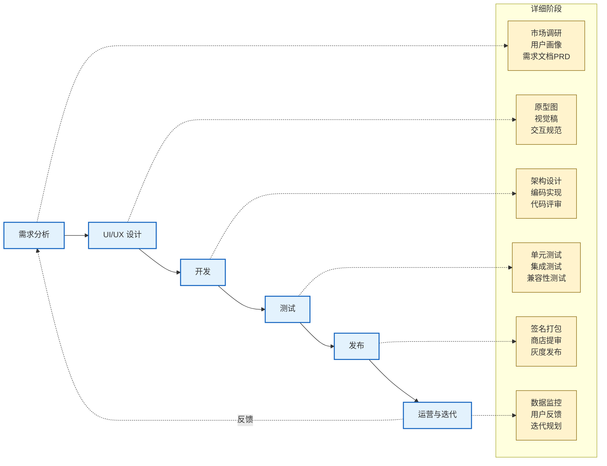

# 1.4 移动应用开发流程与工程规范

> [!abstract] 本节概述
> 本节梳理移动应用从需求到上线的完整开发流程，介绍命名规范、代码规范、目录结构、版本管理等工程化要求，并简介 Android Studio 项目工程结构与 Git 在移动开发中的实践。本节是 [[MOC - 第2章|第2章]] 动手编码前的工程化准备。

## 1.4.1 移动应用开发流程

移动应用开发是一个迭代式工程过程，典型流程如下：



> [!note] 流程说明
> 该流程并非线性，而是**敏捷迭代**：每 1—4 周完成一个小版本循环。`运营与迭代 → 需求分析` 的反馈回路是移动应用区别于传统软件的关键——基于用户行为数据快速调整产品方向。

| 阶段 | 主要产物 | 关键角色 | 工程关注点 |
| ---- | -------- | -------- | ---------- |
| 需求分析 | PRD、用户故事 | PM、用研 | 需求边界、可行性评估 |
| UI/UX 设计 | 原型、视觉稿、切图 | 设计师 | 多分辨率适配、设计规范 |
| 开发 | 源码、架构文档 | 开发 | 分层架构、代码规范、版本管理 |
| 测试 | 测试报告、缺陷清单 | QA | 单元/集成/UI/兼容性测试 |
| 发布 | 签名包、商店素材 | 发布、运营 | 签名、灰度、商店审核 |
| 运营与迭代 | 数据报告、版本计划 | 运营、PM | 监控、A/B 测试、需求回流 |

## 1.4.2 工程规范

### 命名规范

| 类型 | 规范 | 示例 |
| ---- | ---- | ---- |
| 包名 | 全小写，反向域名 | `com.example.myapp` |
| 类名 | 大驼峰 | `MainActivity`、`UserService` |
| 方法名 | 小驼峰 | `getUserInfo()`、`calculateTotal()` |
| 变量名 | 小驼峰 | `userName`、`itemCount` |
| 常量 | 全大写下划线 | `MAX_RETRY_COUNT`、`BASE_URL` |
| 资源文件 | 小写下划线 | `activity_main.xml`、`ic_launcher.png` |
| 布局 ID | `控件类型_功能` | `btn_login`、`et_username` |

> [!warning] 资源命名常见错误
> Android 资源文件名不能包含大写字母，否则编译报错。例如 `ActivityMain.xml` 是非法的，应为 `activity_main.xml`。

### 代码规范要点

- **单一职责**：每个类/方法只做一件事
- **避免魔法数**：常量集中定义在 `Constants` 类或资源文件
- **注释**：复杂逻辑必注释，公开 API 使用 JavaDoc/KDoc
- **异常处理**：不要吞掉异常，至少记录日志
- **内存安全**：避免内存泄漏（如长生命周期对象持有 Activity）

```java
// Java 示例：规范的登录方法
public class LoginService {
    private static final String TAG = "LoginService";
    private static final int MAX_RETRY = 3;

    public Result login(String username, String password) {
        if (TextUtils.isEmpty(username) || TextUtils.isEmpty(password)) {
            Log.w(TAG, "login: 参数为空");
            return Result.fail("用户名或密码不能为空");
        }
        // ... 实际登录逻辑
        return Result.success();
    }
}
```

```kotlin
// Kotlin 示例：等价写法
class LoginService {
    companion object {
        private const val TAG = "LoginService"
        private const val MAX_RETRY = 3
    }

    fun login(username: String?, password: String?): Result {
        require(!username.isNullOrEmpty() && !password.isNullOrEmpty()) {
            Log.w(TAG, "login: 参数为空")
            "用户名或密码不能为空"
        }
        // ... 实际登录逻辑
        return Result.success()
    }
}
```

### 推荐目录结构（Android）

```
app/
├── src/
│   ├── main/
│   │   ├── java/com/example/myapp/
│   │   │   ├── ui/              # UI 层：Activity/Fragment/Adapter
│   │   │   │   ├── activity/
│   │   │   │   └── fragment/
│   │   │   ├── data/            # 数据层：Model/DAO/Repository
│   │   │   ├── network/         # 网络层：Retrofit/OkHttp/Interceptor
│   │   │   ├── service/         # Service 组件
│   │   │   ├── utils/           # 工具类
│   │   │   └── MyApp.java        # Application 入口
│   │   ├── res/                 # 资源
│   │   │   ├── layout/          # 布局 XML
│   │   │   ├── drawable/         # 图片/矢量
│   │   │   ├── values/          # 字符串、颜色、尺寸
│   │   │   └── mipmap-*/        # 启动图标
│   │   └── AndroidManifest.xml  # 清单文件
│   ├── test/                    # 单元测试
│   └── androidTest/             # 仪器测试
└── build.gradle                 # 模块构建脚本
```

> [!tip] 分层架构建议
> 推荐采用 **MVVM** 或 **MVP** 分层：UI 层只负责显示与交互，业务逻辑下沉到 ViewModel/Presenter，数据访问通过 Repository 模式统一。这有助于后续测试与维护，详见 [[MOC - 第10章|第10章]]。

## 1.4.3 Android Studio 项目工程结构简介

Android Studio 是基于 IntelliJ IDEA 的官方 IDE。新建项目后典型结构：

| 目录/文件 | 作用 |
| --------- | ---- |
| `app/` | 主应用模块 |
| `gradle/` | Gradle Wrapper 配置 |
| `build.gradle` (Project) | 项目级构建配置 |
| `build.gradle` (app) | 模块级构建配置 |
| `settings.gradle` | 模块声明 |
| `local.properties` | 本地 SDK 路径（不入库） |
| `.idea/` | IDE 配置（不入库） |
| `AndroidManifest.xml` | 应用清单：组件、权限、版本 |

### 关键配置示例

```xml
<!-- AndroidManifest.xml 示例 -->
<manifest xmlns:android="http://schemas.android.com/apk/res/android"
    package="com.example.myapp">

    <!-- 权限声明 -->
    <uses-permission android:name="android.permission.INTERNET" />
    <uses-permission android:name="android.permission.ACCESS_NETWORK_STATE" />

    <application
        android:allowBackup="true"
        android:icon="@mipmap/ic_launcher"
        android:label="@string/app_name"
        android:theme="@style/Theme.MyApp">

        <activity
            android:name=".MainActivity"
            android:exported="true">
            <intent-filter>
                <action android:name="android.intent.action.MAIN" />
                <category android:name="android.intent.category.LAUNCHER" />
            </intent-filter>
        </activity>
    </application>
</manifest>
```

> [!note] Manifest 关键点
> - `package` 属性声明应用包名（Gradle 8+ 中迁移到 `build.gradle` 的 `namespace`）
> - `<uses-permission>` 声明所需权限，敏感权限需运行时动态申请（详见 [[MOC - 第5章|第5章]]）
> - `<intent-filter>` 中 `MAIN` + `LAUNCHER` 标识应用启动入口 Activity

## 1.4.4 Git 在移动开发中的使用

### 基本 Git 工作流

```bash
# Bash/PowerShell 通用命令
git init                          # 初始化仓库
git clone <url>                   # 克隆远程仓库
git checkout -b feature/login     # 新建特性分支
git add .                         # 暂存变更
git commit -m "feat: 实现登录页面" # 提交
git push origin feature/login     # 推送
git checkout main && git pull     # 切回主分支并更新
git merge feature/login           # 合并特性分支
```

> [!warning] 提交信息规范（Conventional Commits）
> 推荐使用约定式提交：
> - `feat: 新功能`
> - `fix: 修复 bug`
> - `docs: 文档变更`
> - `style: 代码格式（不影响功能）`
> - `refactor: 重构`
> - `test: 测试相关`
> - `chore: 构建/工具变更`
>
> 规范的提交信息便于自动生成 CHANGELOG 与版本管理。

### 分支策略

主流分支策略：

| 策略 | 模型 | 适用规模 |
| ---- | ---- | -------- |
| GitHub Flow | main + feature 分支 | 小团队/快速迭代 |
| Git Flow | main + develop + feature + release + hotfix | 中大型/正式发布 |
| Trunk-Based | 单主干 + 短期特性分支 | 大型团队/CI 强依赖 |

> [!tip] 移动开发的分支建议
> 移动应用发布存在"商店审核"延迟，建议采用 **Git Flow 变体**：
> - `main` 跟随线上版本（打 tag）
> - `develop` 集成开发主线
> - `feature/*` 开发新功能
> - `release/*` 准备发版（冻结功能，专注测试）
> - `hotfix/*` 线上紧急修复

### 移动开发特有的 Git 注意事项

- **必须忽略**：`local.properties`、`.idea/`、`build/`、`.gradle/`、签名密钥文件
- **必须提交**：`gradle/wrapper/`（保证构建版本一致）、`gradle.properties`、共享密钥之外的项目配置

```gitignore
# .gitignore 示例（Android）
*.iml
.gradle/
local.properties
.idea/
.DS_Store
build/
captures/
*.jks
*.keystore
```

> [!warning] 签名密钥切勿入库
> 签名密钥（`.jks`/`.keystore`）一旦泄露，攻击者可发布同名应用覆盖你的应用，是严重安全事故。密钥应通过 CI 环境变量或密钥管理服务注入，**绝对不入库**。

## 1.4.5 案例：一个完整 APP 从需求到上线

> [!example] 案例：记账 APP「随手记」开发流程
> 1. **需求分析**：PM 调研个人记账痛点，输出 PRD，确定核心功能（记账、统计、分类、云同步）
> 2. **UI 设计**：设计师产出 Figma 高保真稿，覆盖主流屏幕尺寸
> 3. **开发**：
>    - 架构选型：MVVM + Room + Retrofit
>    - 分支管理：Git Flow，3 人协作
>    - 周迭代：每周一个功能模块（首页、统计、设置、云同步）
> 4. **测试**：
>    - 单元测试覆盖核心逻辑
>    - 真机测试覆盖主流厂商（小米/华为/OPPO/vivo）
>    - 兼容性测试覆盖 Android 8—14
> 5. **发布**：
>    - 生成签名 APK/AAB
>    - 提交 Google Play 与国内主流商店
>    - 通过灰度（10% → 50% → 全量）逐步放量
> 6. **运营与迭代**：
>    - 接入埋点监控崩溃率、启动速度
>    - 收集用户反馈，规划 v1.1 功能
>
> 整个流程体现了"**需求 → 设计 → 开发 → 测试 → 发布 → 运营**"的完整闭环，每 2—4 周完成一次小版本迭代。

## 本节小结

- 移动应用开发是迭代式工程过程，包含需求、设计、开发、测试、发布、运营六阶段
- 工程规范涵盖命名、代码、目录、版本管理，是协作与维护的基础
- Android Studio 项目由 `app/`、`gradle/`、`res/`、`AndroidManifest.xml` 等构成
- Git 是移动开发版本管理事实标准，需注意忽略构建产物与签名密钥
- 完整 APP 的上线流程体现了工程化思维，是后续章节实践的总纲

## 章节导航

- 上级：[[MOC - 第1章|第1章 MOC]]
- 上一节：[[1.3 原生开发、跨平台开发方案对比|1.3 原生开发、跨平台开发方案对比]]
- 下一节：—（本章末，进入 [[MOC - 第2章|第2章]]）
- 习题：[[MOC - 第1章习题|第1章习题]]
