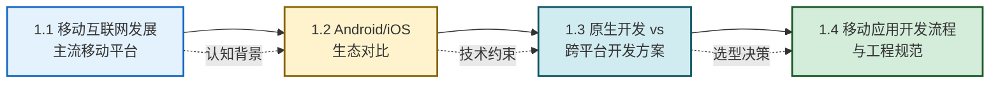

# MOC - 第1章 移动互联网与移动开发概述

本章是《移动互联网开发技术》课程的入门章节，解决的核心问题是：**移动互联网从何而来、当前有哪些主流平台与开发方案、移动应用是如何被工程化生产出来的**。本章不深入具体编码细节，而是为后续 9 章建立平台认知、技术选型视野与工程化思维。

> [!info] 本章定位
> - **章节性质**：概述性章节，建立全局视野
> - **先修知识**：[[计算机网络]]、Java 程序设计、操作系统基础
> - **后续衔接**：[[MOC - 第2章|第2章]] 将进入 Android Studio 实操与工程结构
> - **学习目标**：理解移动互联网发展脉络、Android/iOS 生态差异、原生与跨平台方案选型、移动应用开发全流程与工程规范
> - **学时建议**：理论 2 学时

## 本章学习路线

学习路线说明：先建立移动互联网发展的纵向认知（1.1），再横向对比两大平台生态（1.2），在平台认知基础上引入开发方案选型（1.3），最终落到工程化流程与规范（1.4），为第 2 章动手实践做铺垫。

## 知识点导航

| 小节 | 主题 | 核心内容 | 难度 |
| ---- | ---- | -------- | ---- |
| [[1.1 移动互联网发展、主流移动平台\|1.1]] | 移动互联网发展、主流移动平台 | 发展历程、Android/iOS/HarmonyOS 平台、移动互联网特点 | ★★ |
| [[1.2 Android、iOS 生态对比\|1.2]] | Android、iOS 生态对比 | 开发语言、工具链、应用分发、碎片化、收益模式 | ★★★ |
| [[1.3 原生开发、跨平台开发方案对比\|1.3]] | 原生开发、跨平台开发方案对比 | 原生/Flutter/RN/WebView 架构与选型 | ★★★★ |
| [[1.4 移动应用开发流程与工程规范\|1.4]] | 移动应用开发流程与工程规范 | 开发流程、命名规范、目录结构、Git、Android Studio 工程 | ★★ |

## 核心考点

> [!warning] 高频考点（6 点）
> 1. **移动互联网特点**：随身性、定位能力、传感器丰富、碎片化（必背）
> 2. **三大主流移动平台**：Android、iOS、HarmonyOS 的归属与生态特征
> 3. **Android 与 iOS 生态对比**：开发语言、工具链、分发渠道、碎片化程度
> 4. **原生开发 vs 跨平台开发**：性能、开发效率、维护成本、原生能力的取舍
> 5. **主流跨平台方案架构差异**：Flutter（自绘引擎）vs RN（原生组件映射）vs WebView（H5 容器）
> 6. **移动应用开发流程**：需求 → 设计 → 开发 → 测试 → 发布 → 迭代

## 关键概念速查

| 概念 | 一句话定义 |
| ---- | ---------- |
| 移动互联网 | 移动通信与互联网融合形成的、以移动设备为终端的网络应用形态 |
| 超级 APP | 集成社交、支付、内容、生活服务等众多子能力的单体应用 |
| 原生开发 | 使用平台官方语言与 SDK 直接开发应用的方式 |
| 跨平台开发 | 一套代码同时运行于 Android 与 iOS 的开发方式 |
| 碎片化 | 设备型号、屏幕尺寸、系统版本、厂商定制并存导致的兼容性问题 |
| 应用分发 | 通过应用商店或企业渠道将应用交付到用户的过程 |

## 跨章关联

- **后续深化**：[[MOC - 第2章|第2章]] Android 环境与项目结构 — 1.2/1.4 的概念在此落地为实际工程
- **选型延伸**：[[MOC - 第9章|第9章]] 跨平台开发技术基础 — 1.3 中跨平台方案的深入实践
- **流程闭环**：[[MOC - 第10章|第10章]] 应用打包、发布与项目实战 — 1.4 开发流程的发布与上线环节
- **安全关联**：[[MOC - 第8章|第8章]] 移动应用安全 — 1.2 应用审核机制的安全意义
- **先修课程**：[[计算机网络]] — 理解移动互联网的通信基础

## 章节导航

- 上级：[[MOC - 移动互联网开发技术|课程总览 MOC]]
- 下一章：[[MOC - 第2章|第2章 Android 基础环境与项目结构]]
- 习题：[[MOC - 第1章习题|第1章习题]]
