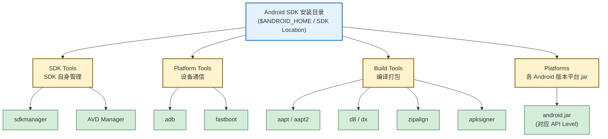

# 2.1 Android SDK、开发工具环境搭建

> [!abstract] 本节概述
> 本节解决“用什么工具、怎么把一个 Android 工程跑起来”的问题。先拆解 Android SDK 的三件套（SDK Tools / Platform Tools / Build Tools），再说明 Android Studio 的安装与配置、SDK 版本与 API Level 的对应关系、模拟器（AVD）与真机调试两种运行方式，最后引入 Gradle 构建系统并给出 `build.gradle` 的基本配置示例。掌握本节后应能独立完成开发环境搭建并读懂一份 Gradle 配置。

## 2.1.1 Android SDK 组成

> [!definition] Android SDK
> Android SDK（Software Development Kit）是开发 Android 应用所需的工具、库、文档和示例的集合。它并非单一工具，而是由多个工具集分层组合而成，对应编译期、设备通信期和打包期的不同职责。

Android SDK 在历史上被拆分为三套核心工具，理解它们的职责分工是排查环境问题的前提：

| 工具集 | 主要职责 | 典型命令/工具 | 是否随 Android Studio 安装 |
| ------ | -------- | ------------- | -------------------------- |
| SDK Tools | 旧版顶层管理工具，负责 SDK 自身的管理与版本切换 | `sdkmanager`（旧版）、AVD/SDK 管理器界面 | 是（部分已被 Build Tools 取代） |
| Platform Tools | 与设备/模拟器通信的跨平台工具 | `adb`（Android Debug Bridge）、`fastboot` | 是 |
| Build Tools | 编译、资源处理、dex 转换、签名、对齐等构建期工具 | `aapt`/`aapt2`、`d8`/`dx`、`zipalign`、`apksigner` | 是（按 Platform 版本号独立下载） |

> [!tip] 区分要点
> - **Platform Tools** 解决“怎么和设备说话”——`adb install`、`adb logcat` 都属于这一层。
> - **Build Tools** 解决“怎么把源码变成 APK”——资源编译、dex 转换、签名对齐都在这一层。
> - **SDK Tools** 是历史包袱，新版本 Android Studio 中很多功能已被 Gradle 插件与 Build Tools 接管，但仍保留 SDK 管理入口。



## 2.1.2 Android Studio 安装与配置

Android Studio 是 Google 官方推荐的集成开发环境（IDE），基于 IntelliJ IDEA，内置 Gradle、SDK Manager、AVD Manager 与 Logcat 等工具链。

安装与初次配置的关键步骤：

1. **下载**：从 [developer.android.com/studio](https://developer.android.com/studio) 下载对应平台的安装包。
2. **安装时勾选组件**：Android SDK、Android SDK Platform、Android Virtual Device（AVD）三项默认勾选。
3. **指定 SDK 路径**：避免中文与空格路径（如 `D:\Android\Sdk`），后续 Gradle 与命令行工具都依赖此路径。
4. **首次启动**：Setup Wizard 会自动下载所需 Platform 与 Build Tools 版本。

> [!warning] 常见坑
> - SDK 路径含中文或空格会导致 Gradle 构建异常。
> - 国内网络环境下，SDK 下载需配置代理或使用镜像源，否则会卡在 “Downloading Components”。
> - JDK 版本需与 AGP（Android Gradle Plugin）版本匹配：AGP 7.x 推荐 JDK 11，AGP 8.x 推荐 JDK 17。

## 2.1.3 SDK 版本与 API Level 对应关系

> [!definition] API Level
> API Level 是一个整数，标识 Android 平台框架 API 的版本。每发布一个引入新 API 的 Android 版本，API Level 就递增一次。它比“Android 版本号”更稳定地用于工程配置。

| Android 版本 | API Level | 版本代号 | 发布年份 | 备注 |
| ------------ | --------- | -------- | -------- | ---- |
| Android 6.0 | 23 | Marshmallow | 2015 | 运行时权限引入 |
| Android 7.0 | 24 | Nougat | 2016 | 多窗口 |
| Android 8.0 | 26 | Oreo | 2017 | 后台限制加强 |
| Android 9 | 28 | Pie | 2018 | 限制明文 HTTP |
| Android 10 | 29 | Q | 2019 | 分区存储 |
| Android 11 | 30 | R | 2020 | 单次权限 |
| Android 12 | 31 | S | 2021 | 新主题 API |
| Android 13 | 33 | Tiramisu | 2022 | 通知权限 |
| Android 14 | 34 | UpsideDownCake | 2023 | 前台服务类型 |

> [!note] 工程中三个版本字段
> 在 `build.gradle` 中常出现三个看似相近的字段，它们的职责完全不同：
> - `minSdkVersion`：最低支持版本，应用商店据此过滤设备，低于此值的设备无法安装。
> - `targetSdkVersion`：目标版本，告知系统“我已针对该版本适配”，系统据此决定是否启用新行为（如运行时权限）。
> - `compileSdkVersion`：编译版本，决定编译期能调用哪些 API，通常 ≥ targetSdkVersion。

## 2.1.4 模拟器（AVD）创建与使用

> [!definition] AVD
> AVD（Android Virtual Device）是模拟器使用的设备配置，定义了屏幕尺寸、分辨率、API Level、内存等参数。一个 AVD 对应一台“虚拟设备”。

创建 AVD 的关键步骤：

1. 打开 Android Studio → **Device Manager** → **Create Device**。
2. 选择硬件 Profile（如 Pixel 6），可自定义分辨率与内存。
3. 选择系统镜像（System Image），需先通过 SDK Manager 下载对应 API Level 的镜像。
4. 确认配置并启动，首次启动较慢，后续可Snapshot 加速。

> [!tip] 加速建议
> - 优先使用 **x86_64** 系统镜像（而非 ARM），配合 HAXM（Intel）或 WHPX（Windows）硬件加速，速度可接近真机。
> - 启用 **Quick Boot / Cold Boot**，避免每次重启模拟器都走完整开机流程。
> - macOS Apple Silicon 需选择 ARM 镜像，性能同样良好。

## 2.1.5 真机调试

真机调试相比模拟器更贴近真实环境（传感器、GPU、功耗、网络制式），是发布前必经环节。

> [!example] 真机调试准备流程
> 1. **手机端**：设置 → 关于手机 → 连续点击“版本号” 7 次，开启“开发者模式”。
> 2. 返回设置 → 系统 → 开发者选项 → 开启“USB 调试”。
> 3. **连接电脑**：用数据线连接，手机弹出“允许 USB 调试？”对话框，勾选“始终允许”并确定。
> 4. **验证**：在终端执行 `adb devices`，应看到设备序列号及 `device` 状态。

> [!warning] 常见问题
> - 设备显示 `unauthorized`：手机端未确认授权，重新插拔并点击允许。
> - 设备未识别：Windows 下需安装对应厂商的 USB 驱动；macOS 通常免驱。
> - 部分国产 ROM 需额外开启“USB 安装”或“仅充电模式下允许 ADB”选项。

## 2.1.6 Gradle 构建系统基础

> [!definition] Gradle
> Gradle 是基于 Groovy/Kotlin DSL 的自动化构建工具。Android 通过 **Android Gradle Plugin（AGP）** 把 Gradle 适配为 Android 工程的构建系统，承担依赖管理、资源合并、dex 转换、签名打包等任务。

Gradle 工程的三类关键文件：

| 文件 | 作用域 | 典型内容 |
| ---- | ------ | -------- |
| `settings.gradle` | 整个工程 | 声明包含哪些模块（`include ':app'`）、插件管理、仓库地址 |
| `build.gradle`（项目级） | 整个工程 | Gradle 与 AGP 版本、全局仓库 |
| `build.gradle`（模块级） | 单个模块（如 `app`） | SDK 版本、应用 ID、依赖、构建类型、签名配置 |

> [!example] 模块级 build.gradle 基本配置
> 以下是一份典型的模块级 `build.gradle`（Groovy DSL），注释标注关键字段：

```gradle
plugins {
    id 'com.android.application'  // 声明这是一个 Android 应用模块
}

android {
    namespace 'com.example.myapp'              // 应用包名（AGP 7.0+ 由 namespace 决定 R 包路径）
    compileSdk 34                              // 编译版本，决定能用哪些 API

    defaultConfig {
        applicationId "com.example.myapp"      // 应用唯一标识，应用商店据此区分
        minSdk 24                              // 最低支持版本
        targetSdk 34                           // 目标版本
        versionCode 1                          // 版本号（整数，用于升级判断）
        versionName "1.0"                      // 版本名（展示给用户）
        testInstrumentationRunner "androidx.test.runner.AndroidJUnitRunner"
    }

    buildTypes {
        release {
            minifyEnabled true                 // 开启代码混淆
            proguardFiles getDefaultProguardFile('proguard-android-optimize.txt'),
                          'proguard-rules.pro'
        }
        debug {
            // 默认 debug 类型，含调试签名、可调试
        }
    }

    compileOptions {
        sourceCompatibility JavaVersion.VERSION_17
        targetCompatibility JavaVersion.VERSION_17
    }
}

dependencies {
    implementation 'androidx.appcompat:appcompat:1.6.1'
    implementation 'com.google.android.material:material:1.9.0'
    implementation 'androidx.constraintlayout:constraintlayout:2.1.4'
    testImplementation 'junit:junit:4.13.2'
    androidTestImplementation 'androidx.test.ext:junit:1.1.5'
}
```

> [!note] 依赖关键字区别
> - `implementation`：依赖仅在当前模块编译与运行可见，**不会泄露给上游模块**，推荐使用。
> - `api`：依赖会泄露给上游模块，会增加编译时间，仅在确实需要暴露 API 时使用。
> - `testImplementation` / `androidTestImplementation`：分别用于单元测试与仪器测试。

## 2.1.7 小结

本节建立了开发环境的整体认知：SDK 三件套各司其职，Android Studio 把它们整合为可视化工作流，AVD 与真机分别承担“快速验证”和“真实环境”两种运行场景，Gradle 则把源码、资源、依赖编译为可安装的 APK。下一节 [[2.2 Android 工程目录结构解析|2.2 工程目录结构解析]] 将进入工程内部，逐层拆解这些目录与文件的职责。

---

## 章节导航

- 上级：[[MOC - 第2章|第2章 MOC]]
- 上一节：[[MOC - 第1章|第1章 移动开发概述]]
- 下一节：[[2.2 Android 工程目录结构解析|2.2 工程目录结构解析]]
- 习题：[[MOC - 第2章习题|第2章习题]]
