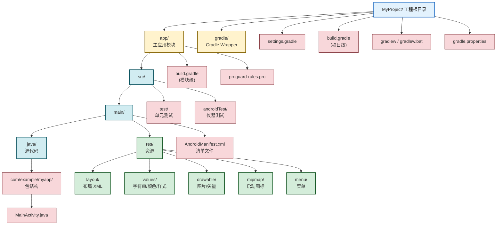

# 2.2 Android 工程目录结构解析

> [!abstract] 本节概述
> 本节回答“一个 Android 工程由哪些目录和文件构成、各自承担什么职责”。从工程根目录出发，逐层拆解 `app/src/main/` 下的源码目录、资源目录、清单文件，以及项目级与模块级两个 `build.gradle` 的分工。掌握本节后，看到一个陌生工程能快速定位“改哪里、看哪里、配置在哪里”。

## 2.2.1 工程目录整体结构

Android Studio 创建的工程遵循 Gradle 标准布局，一个典型工程的目录树如下：



## 2.2.2 源代码目录：app/src/main/java

`app/src/main/java/` 下存放 Java/Kotlin 源代码，按包名（package）组织成目录层级。

> [!note] 包名与 namespace
> - AGP 7.0 之前，包名同时由 `AndroidManifest.xml` 根标签的 `package` 属性决定。
> - AGP 7.0 之后，`package` 属性被废弃，改由模块级 `build.gradle` 中的 `namespace` 决定 R 类、BuildConfig 类的生成包路径，而 `applicationId` 仅决定应用在系统与应用商店中的唯一标识。两者可以不同。

典型结构示例：

```text
app/src/main/java/com/example/myapp/
├── MainActivity.java          // 主界面 Activity
├── SecondActivity.java        // 第二个页面
├── adapter/
│   └── MyAdapter.java         // 列表适配器
├── model/
│   └── User.java              // 数据模型
└── util/
    └── NetworkUtils.java      // 工具类
```

## 2.2.3 资源目录：app/src/main/res

`res/` 目录存放所有“会被打包进 APK 的非代码资源”，每个子目录按资源类型区分，编译时由 `aapt2` 转换为 `R` 类中的整数 ID。

| 子目录 | 存放内容 | 在代码中访问 | 在 XML 中访问 |
| ------ | -------- | ------------ | ------------- |
| `layout/` | 布局文件（描述界面结构） | `R.layout.activity_main` | `@layout/activity_main` |
| `values/` | 字符串、颜色、尺寸、样式、数组等简单值 | `R.string.app_name` | `@string/app_name` |
| `drawable/` | 图片（PNG/JPEG）、矢量图（VectorDrawable）、形状（ShapeDrawable） | `R.drawable.ic_logo` | `@drawable/ic_logo` |
| `mipmap/` | 启动图标，按密度分文件夹（mdpi/hdpi/xhdpi/xxhdpi/xxxhdpi） | `R.mipmap.ic_launcher` | `@mipmap/ic_launcher` |
| `menu/` | 菜单资源（选项菜单、上下文菜单） | `R.menu.main` | `@menu/main` |
| `raw/` | 原始文件（音频、视频、JSON 等），不经过 aapt 压缩 | `R.raw.intro` | — |
| `font/` | 字体资源 | `R.font.my_font` | `@font/my_font` |

> [!tip] drawable vs mipmap
> - `mipmap/` 专用于启动图标，系统会保留多密度版本以提升启动图渲染质量，**不要把普通图片放这里**。
> - `drawable/` 用于普通图片与矢量图，按密度可细分为 `drawable-hdpi/` 等。
> - 矢量图（VectorDrawable）优先放 `drawable/` 任意密度目录，因为它与密度无关。

> [!example] values 目录下的典型文件
> `values/` 通常拆分为多个文件以利于维护：

```xml
<!-- values/strings.xml -->
<resources>
    <string name="app_name">我的应用</string>
    <string name="login">登录</string>
</resources>

<!-- values/colors.xml -->
<resources>
    <color name="purple_500">#FF6200EE</color>
    <color name="white">#FFFFFFFF</color>
</resources>

<!-- values/themes.xml -->
<resources>
    <style name="Theme.MyApp" parent="Theme.MaterialComponents.DayNight.DarkActionBar">
        <item name="colorPrimary">@color/purple_500</item>
    </style>
</resources>
```

## 2.2.4 清单文件：app/src/main/AndroidManifest.xml

清单文件位于 `app/src/main/AndroidManifest.xml`，是整个应用的“身份证”，声明组件、权限与应用属性。详见 [[2.4 AndroidManifest 清单文件作用|2.4 AndroidManifest 清单文件作用]]。

> [!info] 位置约定
> 清单文件路径固定为 `src/main/AndroidManifest.xml`，AGP 在打包时会自动合并各模块、各 build variant 的清单文件。不要随意改名或移动。

## 2.2.5 Gradle 配置文件

Android 工程同时存在 **项目级** 与 **模块级** 两个 `build.gradle`，分工明确。

### 项目级 build.gradle

位于工程根目录，负责全局配置：

```gradle
// 项目级 build.gradle
plugins {
    id 'com.android.application' version '8.1.0' apply false
    id 'com.android.library' version '8.1.0' apply false
    id 'org.jetbrains.kotlin.android' version '1.9.0' apply false
}

// 旧式写法（buildscript 块）仍在大量老工程中使用
// buildscript {
//     dependencies {
//         classpath 'com.android.tools.build:gradle:8.1.0'
//     }
// }
```

> [!note] 新版 plugins DSL
> AGP 7+ 推荐使用 `plugins {}` DSL 声明插件版本，配合 `settings.gradle` 中的 `pluginManagement` 统一管理仓库；`apply false` 表示在此处仅声明版本、不实际应用，实际应用在各模块级 `build.gradle` 中。

### 模块级 build.gradle

位于 `app/` 目录下，负责本模块的具体构建配置（SDK 版本、依赖、构建类型等），完整示例见 [[2.1 Android SDK、开发工具环境搭建#2.1.6 Gradle 构建系统基础|2.1 节]]。

### settings.gradle

声明工程包含哪些模块与全局仓库：

```gradle
pluginManagement {
    repositories {
        google()
        mavenCentral()
        gradlePluginPortal()
    }
}
dependencyResolutionManagement {
    repositories {
        google()
        mavenCentral()
    }
}
rootProject.name = "MyProject"
include ':app'
// include ':library'   // 多模块时按需 include
```

## 2.2.6 其他常见目录与文件

| 路径 | 作用 |
| ---- | ---- |
| `gradle/wrapper/gradle-wrapper.properties` | 声明 Gradle 版本，决定下载哪个版本的 Gradle |
| `gradlew` / `gradlew.bat` | Gradle Wrapper 启动脚本，无需本机预装 Gradle |
| `gradle.properties` | Gradle 与 JVM 参数（如内存、AndroidX 开关、并行构建） |
| `proguard-rules.pro` | ProGuard / R8 混淆规则 |
| `app/src/test/` | 运行在本机 JVM 的单元测试 |
| `app/src/androidTest/` | 运行在设备/模拟器的仪器测试 |
| `.idea/` | Android Studio 项目配置，一般不手动修改 |
| `local.properties` | 本机 SDK 路径，**不应提交到版本库** |

> [!warning] local.properties 的特殊性
> `local.properties` 由 Android Studio 自动生成本机 SDK 路径，**不要提交到 Git**，否则在他人机器上会因路径不一致导致构建失败。应将其加入 `.gitignore`。

## 2.2.7 小结

本节把 Android 工程拆解为“源码 + 资源 + 清单 + Gradle 配置”四类核心内容，并给出了完整目录树。记住一个原则：**代码放 `java/`、资源放 `res/`、组件声明放 `AndroidManifest.xml`、构建配置放 `build.gradle`**。下一节 [[2.3 Android 四大组件概述|2.3 四大组件概述]] 将聚焦 `java/` 里最关键的四类组件。

---

## 章节导航

- 上级：[[MOC - 第2章|第2章 MOC]]
- 上一节：[[2.1 Android SDK、开发工具环境搭建|2.1 SDK 与工具环境搭建]]
- 下一节：[[2.3 Android 四大组件概述|2.3 四大组件概述]]
- 习题：[[MOC - 第2章习题|第2章习题]]
