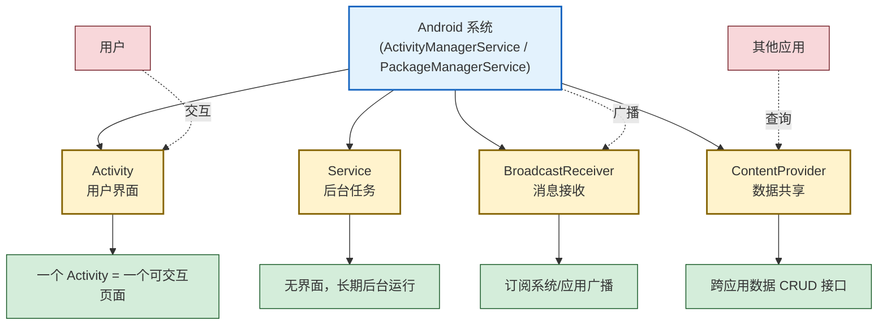

# 2.3 Android 四大组件概述

> [!abstract] 本节概述
> 本节回答“Android 为什么把应用拆成四类组件、它们各自解决什么问题”。四大组件是 Android 应用架构的基石——Activity 提供界面、Service 处理后台、BroadcastReceiver 响应消息、ContentProvider 暴露数据。本节给出每个组件的定位、生命周期特征与典型场景，并以对比表格与 Mermaid 图建立整体认知，为后续各章深入单个组件做准备。

## 2.3.1 为什么是四大组件

Android 设计了一套“组件化”的应用模型：应用的入口不是 `main()` 函数，而是由系统根据 Intent、广播、数据请求等“事件”唤醒对应的组件。这样每个组件只对自己的生命周期负责，系统也能在资源紧张时按需回收。

> [!definition] 四大组件
> Android 四大组件指 **Activity、Service、BroadcastReceiver、ContentProvider** 四类必须由系统管理的核心组件。它们都需要在 `AndroidManifest.xml` 中声明（动态注册的广播除外），并由系统按各自的生命周期调度。



## 2.3.2 Activity

> [!definition] Activity
> Activity 是一个提供用户可交互界面的组件。一个 Activity 通常对应一个“页面”，负责承载 UI 控件、处理用户输入并管理页面级生命周期。

- **核心职责**：构建界面、响应用户操作、管理页面状态。
- **生命周期**：`onCreate → onStart → onResume → onPause → onStop → onDestroy`，详见 [[MOC - 第3章|第3章]]。
- **典型场景**：登录页、列表页、详情页、设置页。
- **通信方式**：通过 `Intent` 启动另一个 Activity 并传递数据。

> [!example] Activity 基本声明
> 在 Manifest 中声明：

```xml
<activity
    android:name=".MainActivity"
    android:exported="true">
    <intent-filter>
        <action android:name="android.intent.action.MAIN" />
        <category android:name="android.intent.category.LAUNCHER" />
    </intent-filter>
</activity>
```

`MAIN` + `LAUNCHER` 的组合表示这是应用的启动入口，桌面图标点击后会打开此 Activity。

## 2.3.3 Service

> [!definition] Service
> Service 是一种没有界面、可在后台长期运行的组件，适合执行音乐播放、文件下载、数据同步等需要持续进行的任务。

- **核心职责**：后台任务执行，不阻塞用户当前界面。
- **生命周期**：`onCreate → onStartCommand → onDestroy`（启动式）；`onCreate → onBind → onUnbind → onDestroy`（绑定式）。
- **两种启动方式**：
  - `startService()`：启动后独立运行，与调用者无生命周期绑定，需自行 `stopService()` / `stopSelf()`。
  - `bindService()`：与调用者绑定，调用者销毁时 Service 也会被解绑，适合组件间交互。
- **典型场景**：音乐播放器后台播放、心跳保活、长连接维护。

> [!warning] Service 不是“万能后台”
> - Android 8.0（API 26）起对后台 Service 严格限制：应用进入后台后，系统会在几分钟内停止其后台 Service。需使用**前台 Service**（Foreground Service，需显示通知）才能稳定运行。
> - Service 默认运行在**主线程**，耗时操作仍需新建子线程，否则会触发 ANR。

> [!example] Service 基本声明

```xml
<service android:name=".PlaybackService" android:exported="false" />
```

```java
public class PlaybackService extends Service {
    @Override
    public int onStartCommand(Intent intent, int flags, int startId) {
        // 在这里执行后台任务；注意耗时任务应另起线程
        return START_STICKY;  // 被杀后系统会尝试重建
    }

    @Override
    public IBinder onBind(Intent intent) {
        return null;  // 启动式 Service 不提供绑定，返回 null
    }
}
```

## 2.3.4 BroadcastReceiver

> [!definition] BroadcastReceiver
> BroadcastReceiver（广播接收器）是一种用于接收系统或应用发出的广播消息的组件。它不提供界面，只在消息到达时被系统短暂唤醒执行 `onReceive()`。

- **核心职责**：订阅并响应“一对多”的事件通知。
- **生命周期**：只有 `onReceive()`，执行完即销毁，**不可执行耗时操作**（超过 10 秒会 ANR）。
- **两种注册方式**：
  - **静态注册**：在 `AndroidManifest.xml` 中声明，应用安装后即可接收（Android 8.0 后受限）。
  - **动态注册**：在代码中调用 `registerReceiver()`，跟随注册组件的生命周期，灵活但需手动 `unregisterReceiver()`。
- **典型场景**：开机完成、网络变化、电量变化、自定义应用内事件。

> [!example] 动态注册网络变化广播

```java
public class MainActivity extends AppCompatActivity {
    private final BroadcastReceiver networkReceiver = new BroadcastReceiver() {
        @Override
        public void onReceive(Context context, Intent intent) {
            // 处理网络变化，注意不要在此执行耗时操作
            Log.d("Net", "网络状态发生变化");
        }
    };

    @Override
    protected void onStart() {
        super.onStart();
        IntentFilter filter = new IntentFilter(ConnectivityManager.CONNECTIVITY_ACTION);
        registerReceiver(networkReceiver, filter);  // 动态注册
    }

    @Override
    protected void onStop() {
        super.onStop();
        unregisterReceiver(networkReceiver);  // 必须解注册，否则会泄漏
    }
}
```

## 2.3.5 ContentProvider

> [!definition] ContentProvider
> ContentProvider（内容提供者）是 Android 提供的跨应用数据共享组件，对外暴露一套统一的 CRUD（增删改查）接口，底层可对接 SQLite、文件、网络等任意数据源。

- **核心职责**：跨进程/跨应用数据共享，统一数据访问出口。
- **访问方式**：通过 `ContentResolver` + `Uri` 进行 `query/insert/update/delete`。
- **典型场景**：通讯录、相册、系统设置等系统数据的访问；多应用共享数据。
- **核心属性**：`authorities`（唯一标识，类似域名）、`exported`（是否允许外部访问）。

> [!example] ContentProvider 基本声明

```xml
<provider
    android:name=".UserProvider"
    android:authorities="com.example.myapp.user"
    android:exported="false" />
```

```java
public class UserProvider extends ContentProvider {
    @Override
    public boolean onCreate() {
        // 初始化数据源（如打开 SQLite 数据库）
        return true;
    }

    @Nullable
    @Override
    public Cursor query(@NonNull Uri uri, @Nullable String[] projection,
                        @Nullable String selection, @Nullable String[] selectionArgs,
                        @Nullable String sortOrder) {
        // 返回查询结果 Cursor
        return null;
    }
    // 其余 insert/update/delete/getType 方法略
}
```

## 2.3.6 四大组件对比

| 维度 | Activity | Service | BroadcastReceiver | ContentProvider |
| ---- | -------- | ------- | ------------------ | --------------- |
| 主要职责 | 用户界面 | 后台任务 | 接收广播消息 | 跨应用数据共享 |
| 是否有界面 | 是 | 否 | 否 | 否 |
| 生命周期复杂度 | 高（7 个回调） | 中（启动式/绑定式两套） | 低（仅 onReceive） | 低（随进程） |
| 启动方式 | `startActivity()` | `startService()` / `bindService()` | `sendBroadcast()` | `ContentResolver.query()` |
| 是否需 Manifest 声明 | 是 | 是 | 静态注册需要，动态注册不需要 | 是 |
| 跨应用能力 | 通过 exported Activity | 较少直接跨应用 | 系统广播天然跨应用 | 是（核心能力） |
| 典型场景 | 登录页、列表页 | 音乐播放、下载 | 网络变化、开机启动 | 通讯录、相册 |

> [!tip] 一句话记忆
> - **Activity** 管你“看什么”
> - **Service** 管你“后台做什么”
> - **BroadcastReceiver** 管你“听到什么消息”
> - **ContentProvider** 管你“给谁什么数据”

## 2.3.7 小结

四大组件不是孤立的四块代码，而是 Android 应用与系统交互的四种“入口模式”：用户操作触发 Activity、系统事件触发广播、长期任务交给 Service、数据共享交给 ContentProvider。它们都需要在 [[2.4 AndroidManifest 清单文件作用|清单文件]] 中声明（动态广播除外），其生命周期也会影响 [[2.5 应用生命周期基础概念|应用进程的优先级]]。后续 [[MOC - 第3章|第3章]] 会深入 Activity，[[MOC - 第7章|第7章]] 会展开 Service 与广播。

---

## 章节导航

- 上级：[[MOC - 第2章|第2章 MOC]]
- 上一节：[[2.2 Android 工程目录结构解析|2.2 工程目录结构解析]]
- 下一节：[[2.4 AndroidManifest 清单文件作用|2.4 AndroidManifest 清单文件作用]]
- 习题：[[MOC - 第2章习题|第2章习题]]
