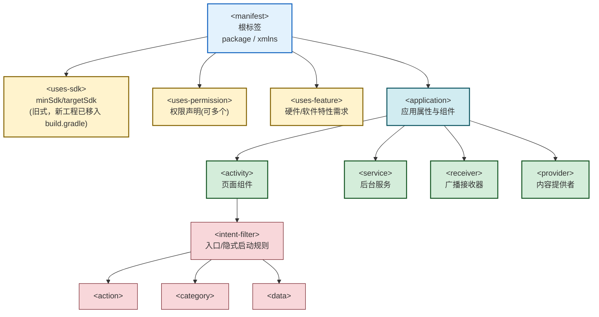

# 2.4 AndroidManifest 清单文件作用

> [!abstract] 本节概述
> 本节回答“为什么每个 Android 应用都必须有一个清单文件、它里面都写了什么”。`AndroidManifest.xml` 是应用的“身份证 + 户口本”，向系统声明组件、权限、应用属性与硬件需求，系统据此安装、运行、调度应用。本节梳理 Manifest 的整体结构、四大组件声明、权限声明与应用属性，并给出一份完整示例。

## 2.4.1 Manifest 的作用

> [!definition] AndroidManifest.xml
> AndroidManifest.xml 是每个 Android 应用必须包含的清单文件，位于 `app/src/main/AndroidManifest.xml`。它向 Android 系统声明应用的结构、组件、权限、应用属性与运行需求，是系统安装、运行、调度应用的依据。

Manifest 的核心作用可概括为五点：

1. **声明组件**：告诉系统本应用有哪些 Activity / Service / BroadcastReceiver / ContentProvider，详见 [[2.3 Android 四大组件概述|2.3 节]]。
2. **声明权限**：声明本应用需要的系统权限（如网络、相机、定位），以及对外暴露组件所需的权限。
3. **声明应用属性**：应用图标、名称、主题、SDK 版本要求、硬件/软件特性需求。
4. **声明入口**：通过 Intent Filter 指定启动入口 Activity（`MAIN` + `LAUNCHER`）。
5. **声明兼容性**：`minSdkVersion`、`uses-feature` 等决定设备适配范围。

> [!info] Manifest 合并机制
> AGP 在打包时会自动合并多个来源的 Manifest：主模块、各库模块、build variant、SDK。合并规则按优先级与 `tools:replace` 等属性处理冲突，最终生成一份合并后的清单文件。可在 Android Studio 的 `Merged Manifest` 视图查看合并结果。

## 2.4.2 Manifest 整体结构



## 2.4.3 根标签 `<manifest>`

`<manifest>` 是清单文件的根标签，主要属性：

| 属性 | 作用 | 备注 |
| ---- | ---- | ---- |
| `package` | 应用包名 | AGP 7.0 后已废弃，改用 `build.gradle` 的 `namespace` |
| `android:versionCode` | 版本号（整数） | AGP 7.0 后移入 `build.gradle` |
| `android:versionName` | 版本名（字符串） | 同上 |
| `xmlns:android` | 命名空间 | 固定 `http://schemas.android.com/apk/res/android` |
| `xmlns:tools` | tools 命名空间 | 用于合并冲突处理，如 `tools:replace` |

> [!note] 包名迁移
> 新工程不再在 `<manifest>` 写 `package`，而是统一在模块级 `build.gradle` 中通过 `namespace` 与 `applicationId` 配置。Manifest 中只保留 `xmlns` 与组件声明。

## 2.4.4 应用标签 `<application>`

`<application>` 是应用级配置的容器，包含所有组件声明与应用属性。常用属性：

| 属性 | 作用 | 示例 |
| ---- | ---- | ---- |
| `android:icon` | 应用图标（所有 Activity 默认图标） | `@mipmap/ic_launcher` |
| `android:roundIcon` | 圆形图标（部分启动器使用） | `@mipmap/ic_launcher_round` |
| `android:label` | 应用名称（显示在桌面与设置） | `@string/app_name` |
| `android:theme` | 应用默认主题 | `@style/Theme.MyApp` |
| `android:allowBackup` | 是否允许备份 | `true` / `false` |
| `android:supportsRtl` | 是否支持 RTL 布局 | `true` |
| `android:name` | 自定义 Application 类 | `.MyApp`（用于初始化全局状态） |
| `android:networkSecurityConfig` | 网络安全配置（如允许明文） | `@xml/network_security_config` |

## 2.4.5 四大组件声明

四大组件都必须在 `<application>` 内部声明，标签名与组件一一对应。

| 标签 | 组件 | 必填属性 | 常见子标签 |
| ---- | ---- | -------- | ---------- |
| `<activity>` | Activity | `android:name` | `<intent-filter>` |
| `<service>` | Service | `android:name` | `<intent-filter>` |
| `<receiver>` | BroadcastReceiver（静态注册） | `android:name` | `<intent-filter>` |
| `<provider>` | ContentProvider | `android:name`、`android:authorities` | `<grant-uri-permission>` |

> [!example] 四大组件声明示例

```xml
<application
    android:icon="@mipmap/ic_launcher"
    android:label="@string/app_name"
    android:theme="@style/Theme.MyApp"
    android:allowBackup="true">

    <!-- Activity：声明启动入口 -->
    <activity
        android:name=".MainActivity"
        android:exported="true">
        <intent-filter>
            <action android:name="android.intent.action.MAIN" />
            <category android:name="android.intent.category.LAUNCHER" />
        </intent-filter>
    </activity>

    <activity android:name=".SecondActivity" android:exported="false" />

    <!-- Service：后台服务 -->
    <service android:name=".PlaybackService" android:exported="false" />

    <!-- BroadcastReceiver：静态注册开机广播 -->
    <receiver
        android:name=".BootReceiver"
        android:exported="true">
        <intent-filter>
            <action android:name="android.intent.action.BOOT_COMPLETED" />
        </intent-filter>
    </receiver>

    <!-- ContentProvider：跨应用数据共享 -->
    <provider
        android:name=".UserProvider"
        android:authorities="com.example.myapp.user"
        android:exported="false" />
</application>
```

> [!warning] exported 属性
> - `android:exported` 决定组件是否能被其他应用访问。
> - **Android 12（API 31）起强制要求**所有带 `<intent-filter>` 的组件显式声明 `exported`，否则安装失败。
> - 原则：仅本应用使用设为 `false`，需被外部启动（如入口 Activity、对外暴露的 Provider）设为 `true`。这是 [[MOC - 第8章|第8章 移动应用安全]] 的最小权限实践之一。

## 2.4.6 权限声明

### 声明所需权限

应用需要的权限通过 `<uses-permission>` 声明，位于 `<manifest>` 内、`<application>` 之外：

```xml
<uses-permission android:name="android.permission.INTERNET" />
<uses-permission android:name="android.permission.ACCESS_NETWORK_STATE" />
<uses-permission android:name="android.permission.CAMERA" />
<uses-permission android:name="android.permission.READ_EXTERNAL_STORAGE" />
```

> [!note] 普通权限 vs 危险权限
> - **普通权限**（如 `INTERNET`）：安装时自动授予，无需运行时申请。
> - **危险权限**（如 `CAMERA`、`READ_EXTERNAL_STORAGE`、`ACCESS_FINE_LOCATION`）：Android 6.0（API 23）起需在运行时动态申请，否则即使声明也无法使用。详见 [[MOC - 第5章|第5章 数据持久化]] 的存储权限部分。

### 声明自定义权限（可选）

应用可自定义权限，限制其他应用对本应用组件的访问：

```xml
<permission
    android:name="com.example.myapp.PERMISSION_ACCESS"
    android:protectionLevel="normal"
    android:label="访问我的应用数据" />
```

## 2.4.7 应用属性与 SDK 版本

### 旧式 uses-sdk（已迁移）

旧工程在 Manifest 中通过 `<uses-sdk>` 声明 SDK 版本：

```xml
<uses-sdk
    android:minSdkVersion="24"
    android:targetSdkVersion="34" />
```

> [!warning] 新工程已迁移
> AGP 7.0+ 不再使用 `<uses-sdk>`，改为在模块级 `build.gradle` 中配置 `minSdk` / `targetSdk` / `compileSdk`。详见 [[2.1 Android SDK、开发工具环境搭建#2.1.3 SDK 版本与 API Level 对应关系|2.1 节]]。在旧工程中仍可能看到该标签。

### uses-feature 声明硬件需求

```xml
<!-- 声明需要摄像头（不影响安装，仅用于过滤） -->
<uses-feature android:name="android.hardware.camera" android:required="true" />

<!-- 声明支持 OpenGL ES 2.0 -->
<uses-feature android:glEsVersion="0x00020000" android:required="true" />
```

`uses-feature` 与 `uses-permission` 的区别：`uses-permission` 是“我要这个权限”，`uses-feature` 是“我需要这个硬件能力”——后者用于应用商店过滤设备，`required="false"` 表示没有该硬件也能装。

## 2.4.8 完整 AndroidManifest 示例

> [!example] 完整 Manifest 配置
> 下面是一份综合了组件声明、权限、应用属性的完整示例：

```xml
<?xml version="1.0" encoding="utf-8"?>
<manifest xmlns:android="http://schemas.android.com/apk/res/android"
    xmlns:tools="http://schemas.android.com/tools">

    <!-- 权限声明 -->
    <uses-permission android:name="android.permission.INTERNET" />
    <uses-permission android:name="android.permission.ACCESS_NETWORK_STATE" />
    <uses-permission android:name="android.permission.CAMERA" />
    <uses-permission android:name="android.permission.READ_EXTERNAL_STORAGE" />

    <!-- 硬件特性（不强制，仅过滤） -->
    <uses-feature android:name="android.hardware.camera" android:required="false" />

    <application
        android:allowBackup="true"
        android:icon="@mipmap/ic_launcher"
        android:roundIcon="@mipmap/ic_launcher_round"
        android:label="@string/app_name"
        android:supportsRtl="true"
        android:theme="@style/Theme.MyApp"
        android:networkSecurityConfig="@xml/network_security_config">

        <!-- 启动入口 Activity -->
        <activity
            android:name=".MainActivity"
            android:exported="true">
            <intent-filter>
                <action android:name="android.intent.action.MAIN" />
                <category android:name="android.intent.category.LAUNCHER" />
            </intent-filter>
        </activity>

        <activity android:name=".SecondActivity" android:exported="false" />

        <service android:name=".PlaybackService" android:exported="false" />

        <receiver
            android:name=".BootReceiver"
            android:exported="true">
            <intent-filter>
                <action android:name="android.intent.action.BOOT_COMPLETED" />
            </intent-filter>
        </receiver>

        <provider
            android:name=".UserProvider"
            android:authorities="com.example.myapp.user"
            android:exported="false" />
    </application>

</manifest>
```

## 2.4.9 小结

Manifest 是应用与系统的契约：组件在这里被“注册”才能被系统调度，权限在这里被声明才能被授予，应用属性在这里被定义才能被显示。记住三大要素——**组件（`<application>` 内）、权限（`<uses-permission>`）、应用属性（`<application>` 标签上）**。下一节 [[2.5 应用生命周期基础概念|2.5 应用生命周期基础概念]] 将从应用整体视角理解这些组件运行时的进程行为。

---

## 章节导航

- 上级：[[MOC - 第2章|第2章 MOC]]
- 上一节：[[2.3 Android 四大组件概述|2.3 四大组件概述]]
- 下一节：[[2.5 应用生命周期基础概念|2.5 应用生命周期基础概念]]
- 习题：[[MOC - 第2章习题|第2章习题]]
