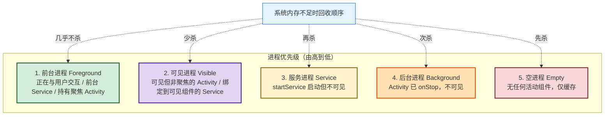
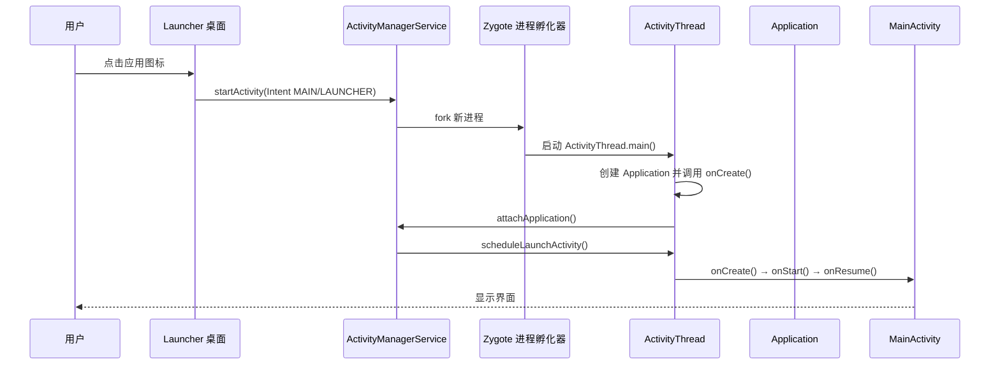

# 2.5 应用生命周期基础概念

> [!abstract] 本节概述
> 本节回答“应用作为一个整体，在系统中是如何被启动、调度与回收的”。Android 不像桌面系统那样由用户决定进程生死，而是由系统按进程优先级在内存紧张时自动回收。本节先建立进程优先级的五级模型，再梳理应用启动流程，最后明确“应用级生命周期”与“Activity 生命周期”的区别，为理解 ANR、保活、低内存行为等工程现象打基础。

## 2.5.1 为什么需要应用级生命周期

Android 设备内存有限，系统允许同时运行多个应用，但不可能让所有进程都常驻内存。Android 采用**按需启动、按优先级回收**的策略：组件被使用时进程被拉起，资源紧张时按优先级从低到高回收进程。

> [!definition] 应用生命周期
> 应用生命周期指**进程从创建、运行到被系统回收的整个过程**，由系统根据组件状态与内存压力决定。它与单个组件（如 Activity）的生命周期是不同层次的概念：前者描述进程级存亡，后者描述组件级状态转换。

## 2.5.2 进程优先级五级模型

Android 把应用进程按其承载的组件状态划分为五个优先级层次，从高到低依次为：

### 五级进程详细说明

| 优先级 | 名称 | 判定条件（满足任一） | 回收可能性 |
| ------ | ---- | -------------------- | ---------- |
| 1 | 前台进程 Foreground | ① 用户正在交互的 Activity（已 onResume）；② 前台 Service（已 `startForeground`）；③ 正在执行 `onReceive` 的广播；④ 绑定到前两者的 Service | 极低（仅当系统崩溃级内存不足才回收） |
| 2 | 可见进程 Visible | ① Activity 可见但非聚焦（已 onPause，如被对话框遮挡）；② 绑定到可见 Activity 的 Service | 低 |
| 3 | 服务进程 Service | 通过 `startService` 启动且不属于前两类的 Service | 中（内存紧张时回收） |
| 4 | 后台进程 Background | Activity 已 `onStop` 不可见，无运行中的 Service | 高 |
| 5 | 空进程 Empty | 进程内所有组件都已销毁，仅作为缓存保留以加速下次启动 | 最高（最先被回收） |

> [!tip] 优先级跃迁
> 进程的优先级**会随组件状态变化动态跃迁**。例如：
> - 用户按 Home 键离开 → Activity 进入 `onStop`，进程从“前台”降为“后台”。
> - 后台 Service 启动 → 进程从“后台”升为“服务”。
> - 收到广播执行 `onReceive` → 进程短暂升为“前台”。
> 这一机制解释了“为什么听音乐时切到后台不会被杀”——Service 把进程托举到了“服务进程”级别。

## 2.5.3 应用启动流程

> [!definition] 应用启动
> 应用启动指用户点击桌面图标到首个 Activity 显示的过程。系统会先创建进程、加载 Application，再依次调用首个 Activity 的生命周期。

启动流程的关键步骤：

1. **Launcher 触发**：桌面图标点击触发 `startActivity`，目标 Intent 的 action 为 `MAIN`、category 为 `LAUNCHER`（详见 [[2.4 AndroidManifest 清单文件作用|2.4 节]]）。
2. **AMS 校验**：`ActivityManagerService` 校验 Intent、查找目标 Activity 与对应进程。
3. **进程创建**：若进程不存在，AMS 请求 **Zygote** fork 一个新进程，新进程入口是 `ActivityThread.main()`。
4. **Application 初始化**：`ActivityThread` 创建 `Application` 实例，依次调用 `attachBaseContext()` → `onCreate()`，这是应用级初始化的最早时机。
5. **首个 Activity 创建**：`ActivityThread` 通过 Handler 调度首个 Activity 的 `onCreate → onStart → onResume`，界面显示。

> [!note] ActivityThread
> `ActivityThread` 是应用主线程的入口类，它管理主线程的 MessageQueue 与应用进程内所有组件的创建与生命周期调度。它不是组件，但它是“组件能运行的前提”——四大组件的回调最终都由 `ActivityThread` 通过 Handler 投递到主线程执行。

## 2.5.4 应用退出与进程回收

### 应用退出

Android 没有“关闭应用”的标准 API，常见退出方式：

| 方式 | 行为 | 适用场景 |
| ---- | ---- | -------- |
| `finish()` 所有 Activity | 仅销毁 Activity，进程可能仍存在（成为空进程） | 常规退出 |
| `System.exit(0)` | 直接终止 JVM，进程立即结束 | 调试或异常退出 |
| `killProcess` | 终止本进程 | 极少使用 |
| 系统回收 | 内存不足时由系统自动回收 | 不可控 |

> [!warning] 不要滥用 System.exit
> Android 设计上不鼓励应用主动结束进程，系统会保留“空进程”作为缓存以加速下次启动。`System.exit(0)` 会破坏这一机制，且可能导致 `Application` 状态丢失，仅在调试或处理不可恢复异常时使用。

### 系统回收

当系统内存不足时，**Low Memory Killer（LMK）** 按进程优先级从低到高回收：

1. 优先回收**空进程**；
2. 其次回收**后台进程**（`onStop` 的 Activity）；
3. 内存仍不足时回收**服务进程**；
4. 极端情况下才回收**可见进程**与**前台进程**。

> [!example] 低内存回收案例
> 假设设备同时运行以下应用：
> - 应用 A：正在播放音乐（前台 Service）→ **前台进程**
> - 应用 B：地图导航，被来电遮挡（Activity `onPause`）→ **可见进程**
> - 应用 C：后台下载任务（`startService`）→ **服务进程**
> - 应用 D：用户切到后台看微信，原 Activity `onStop` → **后台进程**
> - 应用 E：刚 finish 所有 Activity，未退出 → **空进程**
>
> 当系统内存紧张时，回收顺序大致为：**E → D → C → B → A**。这就是为什么后台挂着的浏览器最容易被杀，而正在播放音乐的应用通常能存活。

## 2.5.5 应用级 vs 页面级生命周期

> [!warning] 关键区分
> - **应用级生命周期**：描述**进程**的存亡，由系统按内存压力与进程优先级决定，开发者只能通过组件状态间接影响。
> - **Activity 生命周期**：描述**单个页面**的状态转换，由用户操作（切换、返回、Home 键）触发，开发者可在 7 个回调中响应。
>
> 二者层次不同：一个进程内可以有多个 Activity，进程存活不代表所有 Activity 都在前台；Activity 销毁也不意味着进程被杀。

| 维度 | 应用级生命周期 | Activity 生命周期 |
| ---- | -------------- | ----------------- |
| 主体 | 进程 | 单个页面 |
| 控制方 | 系统（LMK / AMS） | 用户操作 + 系统 |
| 关键回调 | `Application.onCreate` | `onCreate / onStart / onResume / onPause / onStop / onDestroy` |
| 触发场景 | 内存回收、组件状态变化 | 页面跳转、Home 键、返回键 |
| 开发者可控度 | 间接（通过组件状态） | 直接（重写回调） |

> [!note] Application.onCreate 的作用
> `Application.onCreate()` 是进程创建后最早执行的应用级回调，常用于：
> - 初始化全局 SDK（如埋点、推送、日志）
> - 创建全局单例（如数据库、缓存）
> - 注册全局监听（如网络状态、内存警告）
> 它**只执行一次**，且在首个 Activity 的 `onCreate` 之前。注意不要在此执行耗时操作，否则会拖慢应用启动。

## 2.5.6 工程实践要点

> [!tip] 让应用“活得更久”的合规做法
> - **使用前台 Service**：长期后台任务（如音乐、导航）应调用 `startForeground()` 并显示通知，把进程托举到“前台进程”级别。
> - **避免空进程浪费**：不要无意义地持有进程，让系统按需回收。
> - **响应 onTrimMemory**：在 `Application.onTrimMemory()` 中释放缓存，降低被回收概率。
> - **不要绕过系统保活**：1 像素 Activity、双进程互拉等黑科技违反规范，且在 Android 9+ 已基本失效。

> [!warning] ANR 与生命周期
> - 主线程（即 `ActivityThread` 所在线程）阻塞过久会触发 **ANR（Application Not Responding）**：前台 5 秒、广播 10 秒、Service 20 秒。
> - ANR 是生命周期异常的外在表现，本质是主线程被阻塞，系统认为应用“卡死”。
> - 规避方法：所有耗时操作（网络、数据库、大文件）放到子线程，主线程只做 UI 与轻量逻辑。

## 2.5.7 小结

本节建立了应用级生命周期的整体认知：进程优先级五级模型决定回收顺序，应用启动走 `Launcher → AMS → Zygote → ActivityThread → Application → Activity` 流程，应用级生命周期与 Activity 生命周期是不同层次的概念。这些知识将在 [[MOC - 第3章|第3章 Activity 生命周期]] 与 [[MOC - 第7章|第7章 Service]] 中继续深化。

---

## 章节导航

- 上级：[[MOC - 第2章|第2章 MOC]]
- 上一节：[[2.4 AndroidManifest 清单文件作用|2.4 AndroidManifest 清单文件作用]]
- 下一章：[[MOC - 第3章|第3章 Activity 与页面交互]]
- 习题：[[MOC - 第2章习题|第2章习题]]
