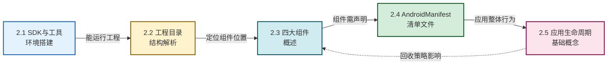

# MOC - 第2章 Android 基础环境与项目结构

本章是 Android 原生开发的工程起点，解决“从零搭建可运行工程并理解其骨架”这一问题：搭好 SDK 与 Android Studio、读懂工程目录、掌握四大组件定位、熟悉清单文件配置、建立应用级生命周期的整体认识，为后续 UI、存储、网络各章奠定工程基础。

> [!info] 本章定位
> - **前置**：[[MOC - 第1章|第1章 移动开发概述]]（已建立 Android 生态与开发流程的整体认知）
> - **本章**：从“能跑起来”到“看得懂骨架”——SDK 环境、工程目录、四大组件、Manifest、应用生命周期
> - **后续**：[[MOC - 第3章|第3章 Activity 与页面交互]] 将深入 Activity 这个最常用组件
> - **核心线索**：环境 → 目录 → 组件 → 配置 → 生命周期，五节构成一个完整的工程认知闭环

## 本章学习路线

## 知识点导航

| 序号 | 知识点 | 核心问题 | 关键产出 |
| ---- | ------ | -------- | -------- |
| 2.1 | [[2.1 Android SDK、开发工具环境搭建\|SDK 与工具环境搭建]] | 用什么工具开发？SDK 由哪几部分组成？ | 能独立配置 Android Studio 与 AVD，读懂 build.gradle |
| 2.2 | [[2.2 Android 工程目录结构解析\|工程目录结构解析]] | 一个 Android 工程由哪些目录和文件构成？ | 看到工程树能说出每个目录的职责 |
| 2.3 | [[2.3 Android 四大组件概述\|四大组件概述]] | Activity/Service/BroadcastReceiver/ContentProvider 各做什么？ | 能区分四者的职责、生命周期特征与典型场景 |
| 2.4 | [[2.4 AndroidManifest 清单文件作用\|AndroidManifest 清单文件]] | 应用的“身份证”都写了什么？ | 能读懂并写出基本的 Manifest 配置 |
| 2.5 | [[2.5 应用生命周期基础概念\|应用生命周期基础概念]] | 应用级生命周期与 Activity 生命周期有何不同？ | 理解进程优先级与系统回收顺序 |

## 核心考点

> [!warning] 高频考点（6-8 点）
> 1. **SDK 三件套职责**：SDK Tools / Platform Tools / Build Tools 的区别与典型命令（adb、aapt、d8）
> 2. **API Level 与版本号对应**：minSdkVersion / targetSdkVersion / compileSdkVersion 三者关系
> 3. **工程目录职责**：`java/`、`res/`（layout/values/drawable/mipmap）、`AndroidManifest.xml`、`build.gradle`（项目级 vs 模块级）
> 4. **四大组件定位与对比**：界面/后台/广播/数据共享四类的职责、是否有界面、生命周期特征
> 5. **Manifest 必备配置**：包名、四大组件声明、`<uses-permission>`、application 属性（icon/label/theme）
> 6. **进程优先级五级**：前台 → 可见 → 服务 → 后台 → 空，以及低内存回收顺序
> 7. **应用级 vs 页面级生命周期**：进程生命周期与 Activity 生命周期的区别与联系
> 8. **真机调试准备**：开发者模式开启、USB 调试授权流程

## 关键概念速查

### SDK 三件套速记

| 工具集 | 主要内容 | 典型命令/用途 |
| ------ | -------- | ------------- |
| SDK Tools | 旧版顶层工具（已被拆分） | sdkmanager（旧）、AVD 管理 |
| Platform Tools | 与设备/模拟器通信 | `adb` 设备调试、`fastboot` 刷机 |
| Build Tools | 编译打包工具链 | `aapt` 资源处理、`d8`/`dx` dex、`zipalign` 对齐 |

### 四大组件一句话定位

| 组件 | 一句话 | 有界面？ |
| ---- | ------ | -------- |
| Activity | 一个用户可交互的页面 | 是 |
| Service | 后台长期运行的任务 | 否 |
| BroadcastReceiver | 系统或应用消息的订阅者 | 否 |
| ContentProvider | 跨应用数据的统一访问出口 | 否 |

### 三种 SDK 版本字段

| 字段 | 作用 | 影响阶段 |
| ---- | ---- | -------- |
| minSdkVersion | 最低支持版本，决定能装的设备范围 | 安装时校验 |
| targetSdkVersion | 目标版本，决定系统是否启用新行为 | 运行时行为 |
| compileSdkVersion | 编译版本，决定能用哪些 API | 编译期 |

## 与其他章节的关联

- **上行**：[[MOC - 第1章|第1章]] 给出“为什么要原生开发”，本章给出“原生工程长什么样”
- **下行**：[[MOC - 第3章|第3章]] 会把 Activity 这一组件讲透；[[MOC - 第7章|第7章]] 会展开 Service 与广播
- **横向**：[[MOC - 第5章|第5章]] 数据持久化会用到本章 ContentProvider 的思路；[[MOC - 第8章|第8章]] 安全会回到 Manifest 权限最小化

---

## 章节导航

- 上级：[[MOC - 移动互联网开发技术|移动互联网开发技术 MOC]]
- 上一章：[[MOC - 第1章|第1章 移动开发概述]]
- 下一章：[[MOC - 第3章|第3章 Activity 与页面交互]]
- 习题：[[MOC - 第2章习题|第2章习题]]
- 首节：[[2.1 Android SDK、开发工具环境搭建|2.1 SDK 与工具环境搭建]]
