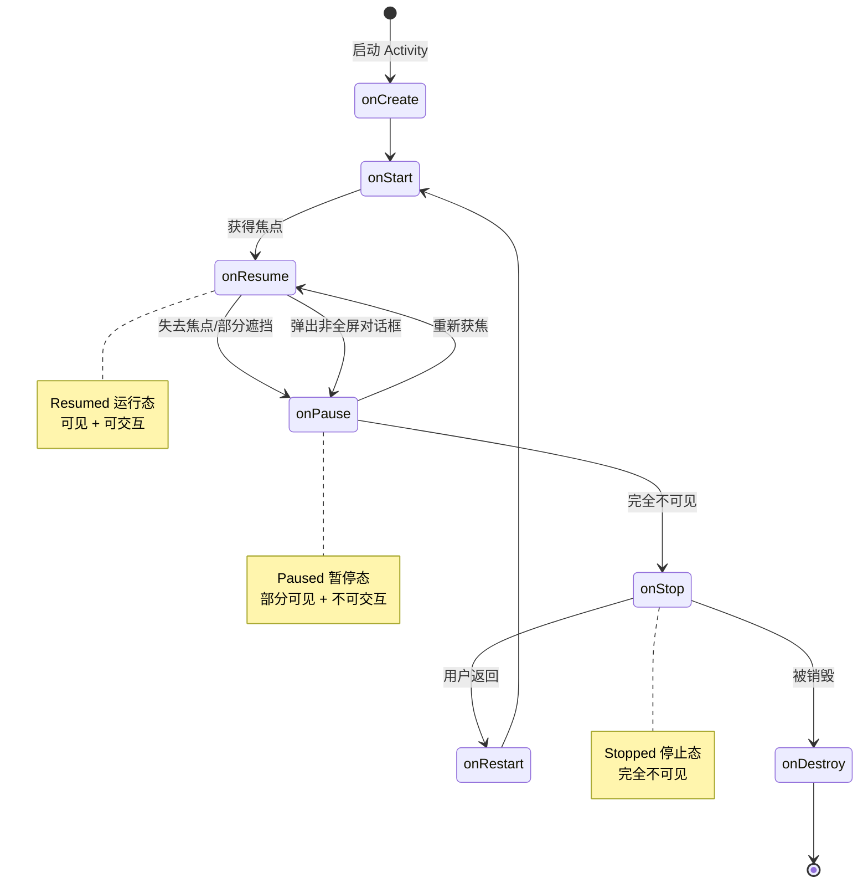
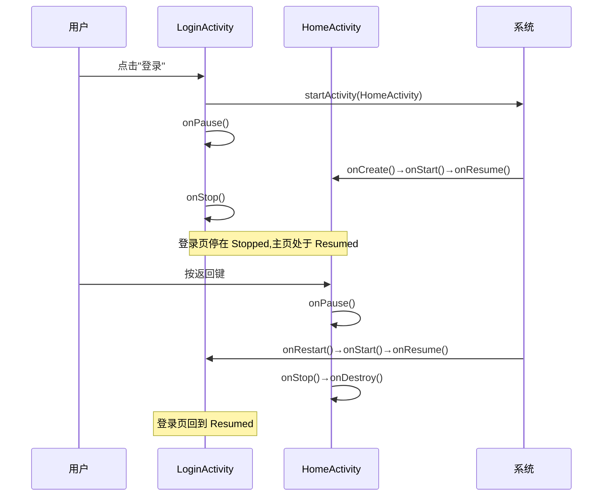

# 3.1 Activity 生命周期、状态切换

> [!abstract] 本节概述
> Activity 是 Android 中承载用户界面的核心组件，由于移动设备资源有限、用户随时可能切换应用，系统需要一套机制在 Activity 被创建、可见、获焦、不可见、销毁等不同阶段通知开发者。**生命周期（Lifecycle）**就是这套回调机制：通过按序调用七个回调方法，让开发者在合适的时机初始化 UI、释放资源、保存状态。掌握生命周期是正确编写不崩溃、不泄漏、能恢复的 Activity 的前提。

## 1. 三种基本状态

> [!definition] Activity 的三种生存状态
> Android 系统通过"可见性"与"前台焦点"两个维度，将 Activity 归为三种状态：
> - **运行态（Resumed / Active）**：Activity 位于栈顶，可见且获得焦点，可响应用户交互。
> - **暂停态（Paused）**：Activity 仍部分可见（如被半透明或非全屏对话框遮挡），但失去焦点，无法接收用户输入。
> - **停止态（Stopped）**：Activity 完全不可见（被另一个 Activity 完全覆盖或切到后台），但仍保留所有状态和成员变量，可能被系统在内存不足时回收。

> [!note] 状态判定要点
> - "可见但失焦"→ Paused；"完全不可见"→ Stopped；"可见且有焦点"→ Resumed。
> - Paused 状态下 Activity 仍可能在内存中维持 UI 渲染，但不可交互。
> - Stopped 状态下若系统内存紧张，该 Activity 可能被直接销毁而不调用 onPause 之后的部分回调，因此必须在 onStop 中保存关键数据。

## 2. 七个回调方法

> [!definition] 七个生命周期回调
> | 回调方法 | 触发时机 | 典型用途 |
> | -------- | -------- | -------- |
> | `onCreate()` | Activity 首次创建时调用一次 | 加载布局、初始化视图与数据、恢复已保存状态 |
> | `onStart()` | Activity 即将变为可见 | 注册广播、开启动画 |
> | `onResume()` | Activity 已获焦点可交互 | 开启摄像头、定位、传感器 |
> | `onPause()` | Activity 即将失去焦点 | 持久化关键数据、停止耗CPU操作、释放摄像头 |
> | `onStop()` | Activity 完全不可见 | 释放重型资源、停止动画、保存草稿 |
> | `onDestroy()` | Activity 被销毁 | 释放所有资源、反注册广播、解除绑定 |
> | `onRestart()` | Activity 由 Stopped 重新进入可见前 | 复用已有数据，无需重新加载 |

```java
public class MainActivity extends AppCompatActivity {
    private static final String TAG = "LifecycleDemo";

    @Override
    protected void onCreate(Bundle savedInstanceState) {
        super.onCreate(savedInstanceState);
        setContentView(R.layout.activity_main);
        Log.d(TAG, "onCreate: 初始化视图与数据");
        // 从 savedInstanceState 恢复旋转屏前的状态
        if (savedInstanceState != null) {
            String text = savedInstanceState.getString("key_text", "");
            Log.d(TAG, "恢复数据: " + text);
        }
    }

    @Override protected void onStart()  { super.onStart();  Log.d(TAG, "onStart"); }
    @Override protected void onResume() { super.onResume(); Log.d(TAG, "onResume: 开启摄像头/定位"); }
    @Override protected void onPause()  { super.onPause();  Log.d(TAG, "onPause: 释放摄像头"); }
    @Override protected void onStop()   { super.onStop();   Log.d(TAG, "onStop: 保存草稿"); }
    @Override protected void onDestroy(){ super.onDestroy();Log.d(TAG, "onDestroy: 释放全部资源"); }
    @Override protected void onRestart(){ super.onRestart();Log.d(TAG, "onRestart"); }

    @Override
    protected void onSaveInstanceState(Bundle outState) {
        super.onSaveInstanceState(outState);
        outState.putString("key_text", "需要保留的临时数据");
        Log.d(TAG, "onSaveInstanceState: 保存临时状态");
    }
}
```

> [!tip] onSaveInstanceState 与 onRestoreInstanceState
> - `onSaveInstanceState(Bundle)` 在 onStop 之前调用，用于保存"用户输入但未持久化"的临时状态（如表单内容、滚动位置）。
> - 系统因内存不足杀掉 Activity 后重建，会通过 `onCreate` 的 `savedInstanceState` 参数或 `onRestoreInstanceState(Bundle)` 回调返回数据。
> - 该机制只适合保存轻量、可序列化的数据，不能替代数据库或文件持久化。

## 3. 生命周期状态转换图



## 4. 典型场景的回调顺序

> [!example] 五种典型场景生命周期调用顺序
> 
> | 场景 | 回调顺序 | 说明 |
> | ---- | -------- | ---- |
> | **首次启动** | `onCreate → onStart → onResume` | Activity 由无到可见再到可交互 |
> | **按 Home 键回桌面** | `onPause → onStop` | 仍存活但完全不可见，不调 onDestroy |
> | **从桌面返回应用** | `onRestart → onStart → onResume` | 复用已有实例，跳过 onCreate |
> | **旋转屏幕** | `onPause → onStop → onDestroy → onCreate → onStart → onResume` | 默认会销毁重建，需用 onSaveInstanceState 恢复 |
> | **弹出非全屏对话框** | `onPause`（不调 onStop） | 仅失去焦点，仍部分可见；关闭对话框后回调 onResume |

> [!warning] 旋转屏幕的常见误区
> - 默认配置下旋转屏幕会**完全销毁并重建** Activity，所有未保存的成员变量会丢失。
> - 解决方案二选一：
>   1. 在 `onSaveInstanceState` 中保存临时状态，在 `onCreate` 中恢复。
>   2. 在 `AndroidManifest.xml` 中为该 Activity 配置 `android:configChanges="orientation|screenSize"`，让其只调 `onConfigurationChanged` 而不重建。
> - 方案 2 适合简单页面；复杂页面建议方案 1，让系统按新尺寸重新布局。

## 5. 案例：登录页→主页的生命周期变化

> [!example] 登录页 LoginActivity → 主页 HomeActivity 切换
> 用户在 LoginActivity 输入账号点击"登录"按钮，跳转到 HomeActivity，再按返回键回到 LoginActivity。整个过程回调顺序：
> 
> 1. **点击登录跳转**：
>    - LoginActivity: `onPause`（失去焦点）
>    - HomeActivity: `onCreate → onStart → onResume`（新建并显示）
>    - LoginActivity: `onStop`（被完全覆盖）
> 2. **按返回键回到登录页**：
>    - HomeActivity: `onPause`
>    - LoginActivity: `onRestart → onStart → onResume`（重新可见可交互）
>    - HomeActivity: `onStop → onDestroy`（被弹出栈销毁）



## 6. 易错点与最佳实践

> [!warning] 常见易错点
> 1. **在 `onCreate` 之外初始化视图引用**：Fragment 视图在 `onDestroyView` 后失效，再使用会 NPE。
> 2. **在 `onPause` 中执行耗时操作**：会阻塞下一个 Activity 显示，应只在 onPause 中做轻量持久化。
> 3. **未在 `onStop/onDestroy` 释放资源**：导致摄像头、定位、广播接收器泄漏，引发崩溃或耗电。
> 4. **依赖成员变量保存状态**：旋转屏或系统回收后变量清零，必须用 `savedInstanceState` 或 ViewModel。
> 5. **混淆 onPause 与 onStop**：非全屏对话框只触发 onPause，把停止动画写在 onPause 会导致页面仍可见时动画被错误停止。

> [!tip] 最佳实践
> - **资源获取/释放成对**：onResume 申请 → onPause 释放；onStart 注册 → onStop 解除。
> - **数据保存分层**：临时数据用 `savedInstanceState`/ViewModel，重要数据用数据库/文件持久化。
> - **避免在生命周期中做长任务**：耗时操作应放到工作线程或 Service 中。

## 章节导航

- 上级：[[MOC - 第3章|第3章 Activity 与页面交互]]
- 上一节：本章首节
- 下一节：[[3.2 Intent 显式跳转、隐式意图|3.2 Intent 显式跳转、隐式意图]]
- 习题：[[MOC - 第3章习题|第3章习题]]
