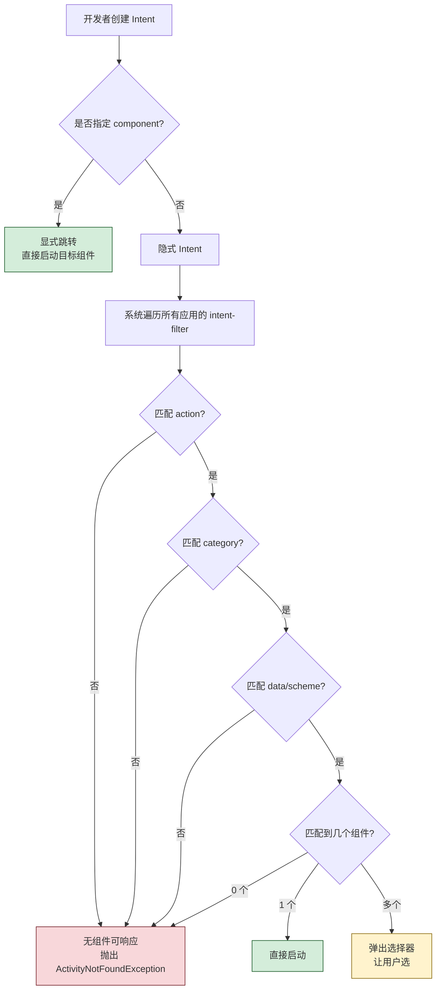

# 3.2 Intent 显式跳转、隐式意图

> [!abstract] 本节概述
> Intent（意图）是 Android 组件间通信的"信使"对象，可携带动作、数据和类别信息请求系统启动另一个组件。Intent 既能完成应用内 Activity 跳转，也能跨应用调用浏览器、拨号、短信等系统功能。Intent 分为**显式 Intent**（直接指定目标组件类名）和**隐式 Intent**（通过 action/category/data 匹配系统注册的组件）两种使用方式。

## 1. Intent 的本质

> [!definition] Intent 是什么
> Intent 是一个描述"要执行什么操作"的消息对象，主要字段：
> - **action**：要执行的动作，如 `ACTION_VIEW`、`ACTION_DIAL`，对应字符串常量。
> - **data**：操作所针对的数据，通常是 Uri，如 `tel:10086`、`http://...`。
> - **category**：附加类别信息，用于进一步筛选目标组件。
> - **extras**：附加数据 Bundle，用于在组件间传递键值对。
> - **type**：MIME 类型，显式指定数据类型。
> - **component**：显式指定的目标组件类名（仅显式 Intent 使用）。

> [!info] Intent 三大用途
> 1. **启动 Activity**：`startActivity(intent)` 或 `startActivityForResult(intent, code)`。
> 2. **启动 Service**：`startService(intent)` 或 `bindService(...)`。
> 3. **发送广播**：`sendBroadcast(intent)` 触发匹配的 BroadcastReceiver。

## 2. 显式 Intent

> [!definition] 显式 Intent
> 显式 Intent 通过直接指定目标组件的 `ComponentName`（包名 + 类名）告诉系统"我要启动这个具体的 Activity"。系统无需匹配，直接跳转，常用于**应用内部**已知目标的跳转。

```java
// Java 写法：从当前 Activity 跳转到 SecondActivity
Intent intent = new Intent(MainActivity.this, SecondActivity.class);
startActivity(intent);
```

```kotlin
// Kotlin 写法
val intent = Intent(this, SecondActivity::class.java)
startActivity(intent)
```

> [!tip] 显式 Intent 适用场景
> - 应用内页面跳转（登录→主页、列表→详情）
> - 已明确知道目标 Activity 类名的场合
> - 不希望被其他应用劫持的内部跳转

## 3. 隐式 Intent

> [!definition] 隐式 Intent
> 隐式 Intent 不指定具体目标组件，而是通过 `action`、`category`、`data` 描述"要做的事"，由系统在所有应用的 `AndroidManifest.xml` 注册的 `<intent-filter>` 中匹配能响应的组件，再让用户选择或自动启动最匹配的组件。

### 3.1 在 AndroidManifest 中注册 intent-filter

```xml
<!-- 让 SecondActivity 可被隐式 Intent 启动 -->
<activity android:name=".SecondActivity">
    <intent-filter>
        <action android:name="com.example.app.ACTION_SECOND" />
        <category android:name="android.intent.category.DEFAULT" />
        <data android:scheme="myapp" android:host="second" />
    </intent-filter>
</activity>
```

### 3.2 发送隐式 Intent

```java
// 启动能响应 ACTION_SECOND 的 Activity
Intent intent = new Intent("com.example.app.ACTION_SECOND");
intent.addCategory(Intent.CATEGORY_DEFAULT);
intent.setData(Uri.parse("myapp://second"));
startActivity(intent);
```

> [!note] intent-filter 匹配规则
> - 一个 `<intent-filter>` 须同时匹配 **action**、**category**、**data** 三部分才能被选中。
> - **action**：Intent 必须包含至少一个与 filter 中声明的 action 字符串相同者。
> - **category**：Intent 中每个 category 都必须在 filter 中存在；filter 默认隐含 `android.intent.category.DEFAULT`。
> - **data**：比对 URI 的 scheme/host/port/path 与 MIME type。

## 4. 隐式 Intent 的常见系统用途

> [!example] 隐式 Intent 调用系统应用
> 
> | 用途 | action | data 示例 |
> | ---- | ------ | --------- |
> | 打开网页 | `ACTION_VIEW` | `http://www.example.com` |
> | 拨打电话（界面） | `ACTION_DIAL` | `tel:10086` |
> | 直接拨号（需权限） | `ACTION_CALL` | `tel:10086` |
> | 发送短信 | `ACTION_SENDTO` | `smsto:10086` |
> | 分享文本 | `ACTION_SEND` | extra: `EXTRA_TEXT` |
> | 打开地图 | `ACTION_VIEW` | `geo:39.9,116.4` |

```java
// 案例：通过隐式 Intent 打开浏览器
Uri webpage = Uri.parse("https://developer.android.com");
Intent intent = new Intent(Intent.ACTION_VIEW, webpage);

// 安全检查：是否已有应用能响应该 Intent
if (intent.resolveActivity(getPackageManager()) != null) {
    startActivity(intent);
} else {
    Toast.makeText(this, "未找到可打开网页的应用", Toast.LENGTH_SHORT).show();
}
```

> [!warning] Android 11+ 包可见性限制
> - 从 Android 11（API 30）起，应用默认只能查询到部分系统组件，调用 `resolveActivity` 可能返回 null。
> - 需在 `AndroidManifest.xml` 中通过 `<queries>` 元素声明要查询的包或 intent-filter，否则隐式跳转可能失败。

## 5. 显式 Intent vs 隐式 Intent

> [!note] 对比分析
> 
> | 维度 | 显式 Intent | 隐式 Intent |
> | ---- | ----------- | ----------- |
> | 目标指定 | 类名（`TargetActivity.class`） | action + category + data 匹配 |
> | 应用范围 | 通常应用内 | 跨应用、系统应用 |
> | 匹配机制 | 无需匹配，直接跳转 | 系统按 intent-filter 匹配 |
> | 安全性 | 高，不会被劫持 | 低，可能被恶意 Activity 接管 |
> | 典型场景 | 登录→主页 | 打开网页、拨号、分享 |
> | 性能 | 直接、快 | 需查询 PackageManager |

## 6. Intent 匹配流程图



## 7. 案例：通过隐式 Intent 打开浏览器

> [!example] 完整案例：点击按钮打开指定 URL
> ```java
> public class OpenBrowserActivity extends AppCompatActivity {
>     @Override
>     protected void onCreate(Bundle savedInstanceState) {
>         super.onCreate(savedInstanceState);
>         setContentView(R.layout.activity_open_browser);
>         findViewById(R.id.btn_open).setOnClickListener(v -> openWebPage("https://www.baidu.com"));
>     }
> 
>     private void openWebPage(String url) {
>         Uri uri = Uri.parse(url);
>         Intent intent = new Intent(Intent.ACTION_VIEW, uri);
>         // 创建选择器，强制用户选择浏览器（可选）
>         // Intent chooser = Intent.createChooser(intent, "请选择浏览器");
>         if (intent.resolveActivity(getPackageManager()) != null) {
>             startActivity(intent);
>         } else {
>             Toast.makeText(this, "未安装浏览器", Toast.LENGTH_SHORT).show();
>         }
>     }
> }
> ```

## 8. 易错点

> [!warning] 常见易错点
> 1. **隐式 Intent 无匹配组件**：未做 `resolveActivity` 检查直接 `startActivity` 会抛 `ActivityNotFoundException` 崩溃。
> 2. **intent-filter 漏写 `DEFAULT` category**：通过 `startActivity` 启动的隐式 Intent 默认带 `CATEGORY_DEFAULT`，filter 必须声明该类别才能被匹配。
> 3. **data scheme 不一致**：filter 中声明了 `android:scheme="myapp"`，但 Intent 没设置对应 Uri，会匹配失败。
> 4. **Android 11+ 未声明 queries**：导致 `resolveActivity` 返回 null。
> 5. **显式 Intent 跨包名错误**：跨应用跳转时类名要写全限定名，否则找不到类。

## 章节导航

- 上级：[[MOC - 第3章|第3章 Activity 与页面交互]]
- 上一节：[[3.1 Activity 生命周期、状态切换|3.1 Activity 生命周期、状态切换]]
- 下一节：[[3.3 Activity 之间数据传递、回传数据|3.3 Activity 之间数据传递、回传数据]]
- 习题：[[MOC - 第3章习题|第3章习题]]
