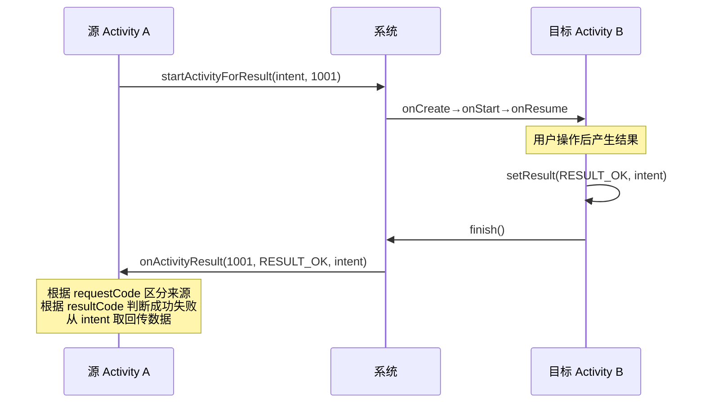

# 3.3 Activity 之间数据传递、回传数据

> [!abstract] 本节概述
> Activity 之间跳转通常需要携带数据：登录页要把账号传给主页、列表页要把选中项传给详情页。Android 通过 Intent 的 `putExtra` / `getExtras` 实现正向数据传递，通过 `startActivityForResult` + `onActivityResult` 实现目标 Activity 把结果回传给源 Activity。本节聚焦这两套机制，并对比 Serializable 与 Parcelable 两种对象传递方案。

## 1. 正向数据传递

> [!definition] Intent.putExtra 与 Bundle
> - `Intent.putExtra(key, value)`：以键值对形式向 Intent 写入基本类型、字符串、可序列化对象。
> - `Intent.putExtras(Bundle)`：用 Bundle 容器批量携带多个键值对。
> - 接收方通过 `getIntent().getXxxExtra(key)` 取出数据，Xxx 对应 String/Int/Boolean 等。

### 1.1 基本类型传递

```java
// 发送方：MainActivity 跳转到 DetailActivity 并携带数据
Intent intent = new Intent(this, DetailActivity.class);
intent.putExtra("title", "Android 教程");
intent.putExtra("price", 59.0);
intent.putExtra("is_free", false);
startActivity(intent);
```

```java
// 接收方：DetailActivity
Intent intent = getIntent();
String title  = intent.getStringExtra("title");         // 默认 null
double price  = intent.getDoubleExtra("price", 0.0);    // 提供默认值
boolean free  = intent.getBooleanExtra("is_free", true);
```

### 1.2 批量传递（Bundle）

```java
Intent intent = new Intent(this, DetailActivity.class);
Bundle bundle = new Bundle();
bundle.putString("title", "Android 教程");
bundle.putInt("chapter_count", 10);
intent.putExtras(bundle);
startActivity(intent);
```

## 2. 传递对象：Serializable vs Parcelable

> [!note] 两种序列化方案对比
> 
> | 维度 | Serializable（Java） | Parcelable（Android） |
> | ---- | -------------------- | --------------------- |
> | 实现成本 | 实现接口即可，几乎无代码 | 需重写 writeToParcel / 创建 CREATOR |
> | 性能 | 慢（反射 + 磁盘 IO） | 快（内存序列化，约 10 倍提升） |
> | 适用场景 | 小对象、低频传递 | 高频传递、复杂对象（推荐） |
> | 跨进程 | 可 | 可 |
> | 平台 | Java 通用 | Android 专用 |

### 2.1 Serializable 方式

```java
// 实体类：实现 Serializable 接口
public class Book implements java.io.Serializable {
    private String title;
    private double price;
    // 构造方法、getter/setter 略
}

// 发送方
Book book = new Book("Android 教程", 59.0);
Intent intent = new Intent(this, DetailActivity.class);
intent.putExtra("book", book);   // Serializable 也可直接传
startActivity(intent);

// 接收方
Book book = (Book) getIntent().getSerializableExtra("book");
```

### 2.2 Parcelable 方式

```java
// 实体类：实现 Parcelable 接口
public class Book implements android.os.Parcelable {
    private String title;
    private double price;

    public Book(String title, double price) {
        this.title = title;
        this.price = price;
    }

    protected Book(Parcel in) {
        title = in.readString();
        price = in.readDouble();
    }

    public static final Creator<Book> CREATOR = new Creator<Book>() {
        @Override public Book createFromParcel(Parcel in) { return new Book(in); }
        @Override public Book[] newArray(int size) { return new Book[size]; }
    };

    @Override public int describeContents() { return 0; }

    @Override
    public void writeToParcel(Parcel dest, int flags) {
        dest.writeString(title);
        dest.writeDouble(price);
    }
}

// 发送方
intent.putExtra("book", book);
// 接收方
Book book = getIntent().getParcelableExtra("book");
```

> [!tip] 选型建议
> - 应用内、对象小、传递不频繁：`Serializable` 即可，代码简洁。
> - 跨进程或高频传递（如列表项→详情）：使用 `Parcelable`，避免反射开销。
> - Kotlin 中可用 `@Parcelize` 注解自动生成实现，几乎零代码。

## 3. 回传数据：startActivityForResult

> [!definition] 回传机制
> 当目标 Activity 关闭时需要把结果回传给源 Activity（如选择联系人、拍照返回缩略图），使用 `startActivityForResult(intent, requestCode)` 启动；目标 Activity 调用 `setResult(resultCode, intent)` + `finish()` 回传；源 Activity 在 `onActivityResult` 中接收。

### 3.1 回传数据流程时序图



### 3.2 完整代码示例：登录页→主页传数据、主页返回结果

```java
// ============ 源 Activity：MainActivity ============
public class MainActivity extends AppCompatActivity {
    private static final int REQ_LOGIN = 1001;

    @Override
    protected void onCreate(Bundle savedInstanceState) {
        super.onCreate(savedInstanceState);
        setContentView(R.layout.activity_main);
        findViewById(R.id.btn_login).setOnClickListener(v -> {
            Intent intent = new Intent(this, LoginActivity.class);
            intent.putExtra("welcome", "请输入账号密码");
            startActivityForResult(intent, REQ_LOGIN);   // 期望返回结果
        });
    }

    @Override
    protected void onActivityResult(int requestCode, int resultCode, @Nullable Intent data) {
        super.onActivityResult(requestCode, resultCode, data);
        if (requestCode == REQ_LOGIN && resultCode == RESULT_OK && data != null) {
            String username = data.getStringExtra("username");
            boolean success = data.getBooleanExtra("success", false);
            Toast.makeText(this, "登录用户：" + username, Toast.LENGTH_SHORT).show();
        }
    }
}
```

```java
// ============ 目标 Activity：LoginActivity ============
public class LoginActivity extends AppCompatActivity {
    @Override
    protected void onCreate(Bundle savedInstanceState) {
        super.onCreate(savedInstanceState);
        setContentView(R.layout.activity_login);
        // 接收正向传来的数据
        String welcome = getIntent().getStringExtra("welcome");

        findViewById(R.id.btn_confirm).setOnClickListener(v -> {
            EditText etUser = findViewById(R.id.et_username);
            Intent result = new Intent();
            result.putExtra("username", etUser.getText().toString());
            result.putExtra("success", true);
            setResult(RESULT_OK, result);   // 设置回传结果
            finish();                       // 关闭当前 Activity，触发源 Activity 的 onActivityResult
        });

        findViewById(R.id.btn_cancel).setOnClickListener(v -> {
            setResult(RESULT_CANCELED);     // 取消，无数据
            finish();
        });
    }
}
```

> [!note] resultCode 三种取值
> - `RESULT_OK = -1`：操作成功，携带数据。
> - `RESULT_CANCELED = 0`：用户取消或操作失败。
> - `RESULT_FIRST_USER = 1`：自定义结果码起点，可定义 `RESULT_FIRST_USER + N` 表示多种自定义结果。

## 4. 注意事项与易错点

> [!warning] 常见易错点
> 1. **requestCode 重复**：多个跳转都期望回传时，requestCode 必须互不相同，否则 `onActivityResult` 无法区分来源。
> 2. **未调用 finish()**：`setResult` 后不调用 `finish()` 不会触发回传。
> 3. **resultCode 默认值**：未显式调用 `setResult` 直接 `finish()`，resultCode 默认为 `RESULT_CANCELED`。
> 4. **onActivityResult 废弃**：Android 推荐使用 `Activity Result API`（`registerForActivityResult`），但旧代码仍广泛使用 `onActivityResult`，考试以旧 API 为主。
> 5. **Parcelable 字段顺序**：`writeToParcel` 与构造方法 `Parcel in` 的读写顺序必须严格一致，否则数据错乱。
> 6. **传递大数据**：Intent 体积有限（约 1MB Binder 缓冲），不要传大图、长列表，应通过数据库或文件中转。

> [!tip] Activity Result API（补充了解）
> ```java
> // 新 API：在 onCreate 之前注册
> private final ActivityResultLauncher<Intent> loginLauncher =
>     registerForActivityResult(new ActivityResultContracts.StartActivityForResult(), result -> {
>         if (result.getResultCode() == RESULT_OK && result.getData() != null) {
>             String username = result.getData().getStringExtra("username");
>         }
>     });
> // 触发
> loginLauncher.launch(new Intent(this, LoginActivity.class));
> ```

## 章节导航

- 上级：[[MOC - 第3章|第3章 Activity 与页面交互]]
- 上一节：[[3.2 Intent 显式跳转、隐式意图|3.2 Intent 显式跳转、隐式意图]]
- 下一节：[[3.4 任务栈、启动模式|3.4 任务栈、启动模式]]
- 习题：[[MOC - 第3章习题|第3章习题]]
