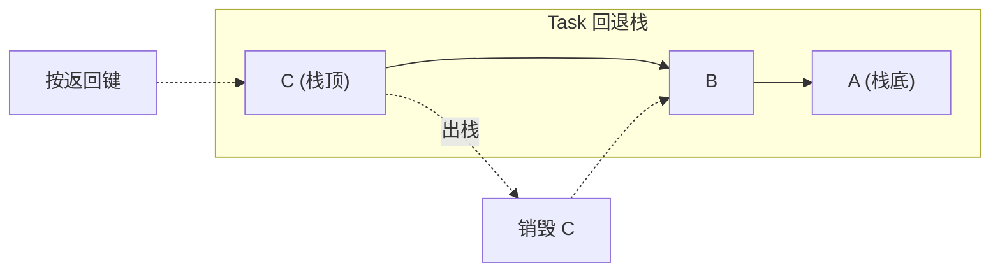

# 3.4 任务栈、启动模式

> [!abstract] 本节概述
> Android 通过**任务栈（Task / Back Stack）**管理一组相关 Activity 实例，遵循"后进先出"原则决定回退顺序。当用户多次跳转到同一 Activity 时，是否新建实例、是否清掉上方页面，由**启动模式（launchMode）**控制。本节阐述任务栈结构、四种启动模式的行为差异及典型应用场景，是理解多页面回退逻辑的关键。

## 1. 任务栈概念

> [!definition] Task 与 Back Stack
> - **Task（任务）**：一组为了完成某个目标而启动的 Activity 集合，按启动顺序排列在 Back Stack 中。
> - **Back Stack（回退栈）**：栈结构，**后进先出（LIFO）**。新启动的 Activity 入栈成为栈顶，按返回键时栈顶出栈并销毁，露出上一个 Activity。
> - 同一应用可包含多个 Task；同一 Task 可包含来自不同应用的 Activity（如隐式 Intent 跳到浏览器再返回）。

> [!example] 任务栈示例
> 假设依次启动 A→B→C，则栈结构（顶→底）为 C, B, A。用户按返回键依次出栈：C→B→A→退出应用。



## 2. 四种启动模式

> [!definition] launchMode 四种取值
> 
> | 启动模式 | 行为 | 栈内实例 | 典型场景 |
> | -------- | ---- | -------- | -------- |
> | **standard**（默认） | 每次启动都新建实例并入栈 | 可有多个 | 普通详情页、列表页 |
> | **singleTop** | 栈顶已是该 Activity 则复用（调 `onNewIntent`），否则新建 | 可有多个但栈顶唯一 | 推送通知页、消息列表 |
> | **singleTask** | 栈中已有该 Activity 实例则复用并清掉其上方所有 Activity | 全栈唯一 | 主界面、登录页 |
> | **singleInstance** | 独占一个新 Task，全局唯一实例 | 全局唯一 | 系统级全局页（如电话拨号） |

### 2.1 在 AndroidManifest 中配置

```xml
<activity
    android:name=".MainActivity"
    android:launchMode="singleTask" />
```

### 2.2 Intent 标志位补充

```java
// 也可在代码中通过 Intent flag 临时改变行为
intent.addFlags(Intent.FLAG_ACTIVITY_NEW_TASK);
intent.addFlags(Intent.FLAG_ACTIVITY_CLEAR_TOP);
intent.addFlags(Intent.FLAG_ACTIVITY_SINGLE_TOP);
```

## 3. 不同启动模式下的栈变化

### 3.1 standard（默认）

> [!example] standard：每次都新建
> 当前栈：A → B（顶）。再次启动 B：
> - 新建 B 实例入栈，栈变为 A → B → B'。
> - 返回键依次出栈 B' → B → A。

### 3.2 singleTop：栈顶复用

> [!example] singleTop：栈顶有则复用
> 当前栈：A → B（顶，B 已设为 singleTop）。再次启动 B：
> - **不新建**，直接复用栈顶 B，回调其 `onNewIntent(intent)`。
> - 栈保持 A → B。
> 
> 若栈为 A → B → C（顶为 C），启动 B：
> - B 不在栈顶，仍会新建 B 实例入栈，栈变为 A → B → C → B'。

### 3.3 singleTask：栈中唯一

> [!example] singleTask：清掉上方所有
> 当前栈：A → B → C（B 已设为 singleTask）。再次启动 B：
> - 系统找到栈中已有 B，**清掉其上方的 C**，复用 B，回调 `onNewIntent`。
> - 栈变为 A → B。
> - 适合"返回主页"场景：从任意深层页跳回主页时，自动清掉中间页。

### 3.4 singleInstance：独占任务栈

> [!example] singleInstance：全局唯一独占 Task
> Activity B 设为 singleInstance：
> - 系统为 B 单独创建一个 Task，B 是该 Task 中**唯一**的 Activity。
> - 其他 Activity 仍在原 Task 中。从 B 再启动 C，C 进入原 Task（不是 B 的 Task）。
> - 适合全局唯一页面，如系统拨号界面、地图主界面。

### 3.5 四种模式栈变化对比图

```mermaid
flowchart TB
    subgraph ST["standard"]
        direction LR
        ST1["A→B"] --> ST2["启动 B"] --> ST3["A→B→B'"]
    end
    subgraph SP["singleTop"]
        direction LR
        SP1["A→B(B是singleTop)"] --> SP2["启动 B"] --> SP3["A→B<br/>复用栈顶, 调 onNewIntent"]
    end
    subgraph SK["singleTask"]
        direction LR
        SK1["A→B→C(B是singleTask)"] --> SK2["启动 B"] --> SK3["A→B<br/>清掉 C, 调 onNewIntent"]
    end
    subgraph SI["singleInstance"]
        direction LR
        SI1["Task1: A→C<br/>Task2: B"] --> SI2["启动 B"] --> SI3["Task2: B<br/>全局唯一, 复用"]
    end

    style ST3 fill:#f8d7da,stroke:#721c24
    style SP3 fill:#d4edda,stroke:#155724
    style SK3 fill:#d4edda,stroke:#155724
    style SI3 fill:#d1ecf1,stroke:#0c5460
```



## 4. onNewIntent 回调

> [!note] 复用实例时的回调
> 当 singleTop / singleTask / singleInstance 的 Activity 被复用时，**不会调用 onCreate**，而是回调 `onNewIntent(Intent)`：
> ```java
> @Override
> protected void onNewIntent(Intent intent) {
>     super.onNewIntent(intent);
>     // 取出新的 Intent 数据
>     String data = intent.getStringExtra("key");
>     // 必须调用 setIntent 保留新 intent, 否则 getIntent() 仍是旧的
>     setIntent(intent);
> }
> ```

## 5. 案例：消息推送场景使用 singleTask

> [!example] 推送通知点击回到主页
> 应用处于深层页面 A→B→C→D，用户收到推送通知点击后希望"回到主页 MainActivity 并显示消息"。
> 
> - 若 MainActivity 设为 **standard**，会新建实例入栈 A→B→C→D→Main，回退时仍要经过 D/C/B/A，体验差。
> - 若 MainActivity 设为 **singleTask**，系统找到已有 MainActivity 实例，**清掉其上方的 B/C/D**，栈变为 A→Main，并通过 `onNewIntent` 传入新消息数据。
> 
> ```xml
> <activity android:name=".MainActivity" android:launchMode="singleTask" />
> ```
> ```java
> public class MainActivity extends AppCompatActivity {
>     @Override
>     protected void onNewIntent(Intent intent) {
>         super.onNewIntent(intent);
>         setIntent(intent);
>         String msg = intent.getStringExtra("push_msg");
>         Toast.makeText(this, "推送：" + msg, Toast.LENGTH_SHORT).show();
>     }
> }
> ```

## 6. 易错点与最佳实践

> [!warning] 常见易错点
> 1. **混淆 singleTop 与 singleTask**：singleTop 只看栈顶，singleTask 看整个栈并清上方。
> 2. **复用实例未重写 onNewIntent**：导致新 Intent 数据丢失，界面不更新。
> 3. **滥用 singleInstance**：独占 Task 会让回退逻辑混乱，只在确有全局唯一需求时使用。
> 4. **startActivityForResult + singleTask 冲突**：singleTask 启动会立即触发源 Activity 的 onActivityResult（resultCode = 0），因为系统认为目标不在同一 Task。
> 5. **依赖 launchMode 解决一切**：复杂回退需求应结合 `FLAG_ACTIVITY_*` 标志位和 `taskAffinity` 综合控制。

> [!tip] 选型建议
> - 默认 standard，绝大多数页面无需特殊配置。
> - 主界面、登录页用 singleTask，便于"回到主页"清栈。
> - 推送、通知点击页用 singleTop，避免多次新建。
> - 系统级唯一页面（极少）才用 singleInstance。

## 章节导航

- 上级：[[MOC - 第3章|第3章 Activity 与页面交互]]
- 上一节：[[3.3 Activity 之间数据传递、回传数据|3.3 Activity 之间数据传递、回传数据]]
- 下一节：[[3.5 Fragment 碎片基础使用|3.5 Fragment 碎片基础使用]]
- 习题：[[MOC - 第3章习题|第3章习题]]
