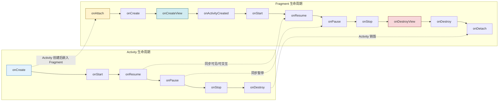

# 3.5 Fragment 碎片基础使用

> [!abstract] 本节概述
> Fragment（碎片）是 Android 3.0 引入的 Activity 内模块化 UI 片段，它有自己的布局和生命周期，可被嵌入 Activity 中实现"页面内分区"和"动态切换"。Fragment 解决了平板大屏布局复用、底部导航切换、标签页等场景，让 UI 组件更灵活、可复用。本节介绍 Fragment 的定义、生命周期、静态/动态添加方式及与 Activity 通信。

## 1. Fragment 是什么

> [!definition] Fragment 定义
> - Fragment 是 Activity 的一段模块化 UI，**必须寄生于 Activity**，不能独立运行。
> - 一个 Activity 可同时承载多个 Fragment，一个 Fragment 也可被多个 Activity 复用。
> - Fragment 拥有独立的布局、生命周期和输入事件，可接收自己的输入事件。
> - Fragment 让大屏（平板）和小屏（手机）共用一套业务逻辑成为可能。

> [!info] Fragment vs Activity
> 
> | 维度 | Activity | Fragment |
> | ---- | -------- | -------- |
> | 独立性 | 独立组件，由系统管理 | 必须寄生于 Activity |
> | 生命周期 | 7 个回调 | 11 个回调（更细粒度） |
> | 启动方式 | Intent | FragmentManager + Transaction |
> | UI 容器 | 占满屏幕 | 嵌入 Activity 的 ViewGroup |
> | 复用粒度 | 整页 | 页面分区、模块化块 |

## 2. Fragment 生命周期

> [!definition] Fragment 11 个回调方法
> 
> | 回调方法 | 触发时机 |
> | -------- | -------- |
> | `onAttach()` | Fragment 与 Activity 关联时 |
> | `onCreate()` | Fragment 初始化（非视图） |
> | `onCreateView()` | 创建 Fragment 的视图布局 |
> | `onActivityCreated()` | 宿主 Activity 的 onCreate 完成（已废弃，新版用 onViewCreated） |
> | `onStart()` | Fragment 可见 |
> | `onResume()` | Fragment 可交互 |
> | `onPause()` | Fragment 失去焦点 |
> | `onStop()` | Fragment 不可见 |
> | `onDestroyView()` | Fragment 视图销毁 |
> | `onDestroy()` | Fragment 销毁 |
> | `onDetach()` | Fragment 与 Activity 解除关联 |

### Fragment 与 Activity 生命周期对应图



> [!note] Fragment 生命周期关键点
> - Fragment 比 Activity 多出与"视图创建/销毁"相关的回调：`onCreateView` / `onDestroyView` / `onActivityCreated`。
> - 当 Fragment 被 replace 替换时，会触发 `onDestroyView`，但若 Fragment 实例仍保留在回退栈中，则不会调 `onDestroy`/`onDetach`，再次显示时只重新 `onCreateView`。
> - `onActivityCreated` 在 Android 24+ 已废弃，建议用 `onViewCreated(view, savedInstanceState)` 替代。

## 3. Fragment 静态添加（XML 布局）

> [!definition] 静态添加
> 在 Activity 的布局 XML 中通过 `<fragment>` 标签直接声明 Fragment，运行时不可替换。适合**布局固定不变**的场景。

```xml
<!-- res/layout/activity_main.xml -->
<LinearLayout xmlns:android="http://schemas.android.com/apk/res/android"
    android:orientation="horizontal"
    android:layout_width="match_parent"
    android:layout_height="match_parent">

    <fragment
        android:name="com.example.app.LeftFragment"
        android:id="@+id/fragment_left"
        android:layout_width="0dp"
        android:layout_height="match_parent"
        android:layout_weight="1" />

    <fragment
        android:name="com.example.app.RightFragment"
        android:id="@+id/fragment_right"
        android:layout_width="0dp"
        android:layout_height="match_parent"
        android:layout_weight="2" />
</LinearLayout>
```

## 4. Fragment 动态添加（FragmentManager + FragmentTransaction）

> [!definition] 动态添加
> 通过 Java 代码在运行时把 Fragment 替换到 Activity 中的容器（通常是 FrameLayout），适合**需要切换**的场景（如底部导航、标签页）。

### 4.1 Fragment 类的实现

```java
public class HomeFragment extends Fragment {
    @Override
    public View onCreateView(LayoutInflater inflater, ViewGroup container,
                             Bundle savedInstanceState) {
        // 加载 Fragment 自己的布局
        View view = inflater.inflate(R.layout.fragment_home, container, false);
        TextView tv = view.findViewById(R.id.tv_title);
        tv.setText("首页");
        return view;
    }
}
```

### 4.2 Activity 中动态添加与切换

```java
public class MainActivity extends AppCompatActivity {
    @Override
    protected void onCreate(Bundle savedInstanceState) {
        super.onCreate(savedInstanceState);
        setContentView(R.layout.activity_main);

        // 默认显示首页 Fragment
        switchFragment(new HomeFragment());

        // 底部导航点击切换
        BottomNavigationView nav = findViewById(R.id.bottom_nav);
        nav.setOnItemSelectedListener(item -> {
            Fragment fragment = null;
            int id = item.getItemId();
            if (id == R.id.nav_home)        fragment = new HomeFragment();
            else if (id == R.id.nav_find)   fragment = new FindFragment();
            else if (id == R.id.nav_mine)   fragment = new MineFragment();
            if (fragment != null) {
                switchFragment(fragment);
                return true;
            }
            return false;
        });
    }

    private void switchFragment(Fragment fragment) {
        getSupportFragmentManager().beginTransaction()
            .replace(R.id.fragment_container, fragment)   // 替换容器中的 Fragment
            .addToBackStack(null)                         // 加入回退栈,允许按返回键回到上一个 Fragment
            .commit();                                    // 提交事务（异步执行）
    }
}
```

```xml
<!-- activity_main.xml 中的 Fragment 容器 -->
<FrameLayout
    android:id="@+id/fragment_container"
    android:layout_width="match_parent"
    android:layout_height="match_parent" />
```

> [!note] FragmentTransaction 常用方法
> - `add(containerId, fragment)`：把 Fragment 添加到容器。
> - `replace(containerId, fragment)`：先移除容器中现有 Fragment，再添加新 Fragment。
> - `remove(fragment)`：移除 Fragment。
> - `hide(fragment)` / `show(fragment)`：隐藏/显示，不重建视图，适合切换频繁场景。
> - `addToBackStack(name)`：把这次事务加入回退栈，按返回键可回退。
> - `commit()`：异步提交；`commitNow()` 同步提交。

## 5. Fragment 与 Activity 通信

> [!definition] 三种通信方式
> 1. **Fragment 获取 Activity**：`getActivity()` 或 `requireActivity()`。
> 2. **Activity 获取 Fragment**：`getSupportFragmentManager().findFragmentById(R.id.xxx)` 或 `findFragmentByTag("tag")`。
> 3. **推荐方式：接口回调**，由 Activity 实现接口，Fragment 调用接口方法通知 Activity。

```java
// Fragment 中定义接口
public class HomeFragment extends Fragment {
    public interface OnFragmentClickListener {
        void onFragmentClick(String msg);
    }
    private OnFragmentClickListener listener;

    @Override
    public void onAttach(Context context) {
        super.onAttach(context);
        // 强制宿主 Activity 实现该接口
        if (context instanceof OnFragmentClickListener) {
            listener = (OnFragmentClickListener) context;
        } else {
            throw new RuntimeException(context.toString() + " 须实现 OnFragmentClickListener");
        }
    }

    @Override
    public View onCreateView(LayoutInflater inflater, ViewGroup container, Bundle savedInstanceState) {
        View view = inflater.inflate(R.layout.fragment_home, container, false);
        view.findViewById(R.id.btn).setOnClickListener(v -> {
            if (listener != null) listener.onFragmentClick("来自 Fragment 的消息");
        });
        return view;
    }

    @Override
    public void onDetach() {
        super.onDetach();
        listener = null;   // 防止内存泄漏
    }
}
```

```java
// Activity 实现接口
public class MainActivity extends AppCompatActivity
        implements HomeFragment.OnFragmentClickListener {
    @Override
    public void onFragmentClick(String msg) {
        Toast.makeText(this, msg, Toast.LENGTH_SHORT).show();
    }
}
```

> [!tip] 推荐使用 ViewModel + 共享数据
> - 接口回调适合简单场景；复杂多 Fragment 共享数据时，使用 `ViewModel`（同一 Activity 范围内共享）更解耦。
> - Jetpack 的 `Fragment Result API`（`setFragmentResult` / `setFragmentResultListener`）也可在 Fragment 间传递结果。

## 6. 案例：底部导航栏 + Fragment 切换

> [!example] 完整业务场景
> 应用首页底部有三个 Tab：首页、发现、我的。点击不同 Tab 切换对应 Fragment，且 Fragment 不重建（用 hide/show 而非 replace）。
> 
> ```java
> public class MainActivity extends AppCompatActivity {
>     private Fragment homeFrag = new HomeFragment();
>     private Fragment findFrag = new FindFragment();
>     private Fragment mineFrag = new MineFragment();
>     private Fragment activeFrag = homeFrag;
> 
>     @Override
>     protected void onCreate(Bundle savedInstanceState) {
>         super.onCreate(savedInstanceState);
>         setContentView(R.layout.activity_main);
> 
>         // 初始化：把三个 Fragment 都 add, 但只显示首页
>         getSupportFragmentManager().beginTransaction()
>             .add(R.id.fragment_container, mineFrag).hide(mineFrag)
>             .add(R.id.fragment_container, findFrag).hide(findFrag)
>             .add(R.id.fragment_container, homeFrag)
>             .commit();
> 
>         BottomNavigationView nav = findViewById(R.id.bottom_nav);
>         nav.setOnItemSelectedListener(item -> {
>             Fragment target = null;
>             int id = item.getItemId();
>             if (id == R.id.nav_home)      target = homeFrag;
>             else if (id == R.id.nav_find) target = findFrag;
>             else if (id == R.id.nav_mine) target = mineFrag;
>             if (target != null) {
>                 getSupportFragmentManager().beginTransaction()
>                     .hide(activeFrag).show(target).commit();
>                 activeFrag = target;
>                 return true;
>             }
>             return false;
>         });
>     }
> }
> ```
> 这种 hide/show 方式避免 Fragment 切换时反复 `onCreateView`，性能更优。

## 7. 易错点

> [!warning] 常见易错点
> 1. **Fragment 构造方法不能有参数**：系统重建 Fragment 时调用无参构造，传参应通过 `setArguments(Bundle)` + `getArguments()`。
> 2. **在 `onCreateView` 之前操作 view**：会 NPE。
> 3. **`getActivity()` 返回 null**：Fragment 已 onDetach 后调用，应改用 `requireActivity()`（会抛异常而非返回 null）。
> 4. **未 `addToBackStack` 就 `replace`**：按返回键直接退出 Activity 而非回到上一个 Fragment。
> 5. **重复 commit**：`commit` 后未等事务完成又调用一次会抛 `IllegalStateException`。
> 6. **Fragment 持有 Activity 的 View 引用**：导致内存泄漏，应在 `onDestroyView` 中置 null。

## 章节导航

- 上级：[[MOC - 第3章|第3章 Activity 与页面交互]]
- 上一节：[[3.4 任务栈、启动模式|3.4 任务栈、启动模式]]
- 下一节：本章末节（下一章：[[MOC - 第4章|第4章 Android UI 界面开发]]）
- 习题：[[MOC - 第3章习题|第3章习题]]
