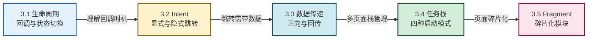

# MOC - 第3章 Activity 与页面交互

本章是 Android 四大组件学习的起点，也是 UI 与交互逻辑的核心载体。围绕 Activity 这一用户界面承载单元，串起生命周期管理、页面跳转、数据流转、任务栈控制和 Fragment 模块化碎片五个主题。

> [!info] 本章定位
> - **核心对象**：Activity 作为四大组件之一，承担界面展示与用户交互职责
> - **关键能力**：生命周期回调、Intent 组件通信、Activity 间数据传递、任务栈与启动模式控制、Fragment 模块化
> - **承前启后**：在第2章 Android 工程结构基础上展开，为第4章 UI 控件与第5章数据持久化提供页面承载环境
> - **考试权重**：Activity 生命周期是 Android 部分必考重点，Intent 与启动模式次高频

> [!abstract] 本章核心问题
> 1. 用户在不同操作（启动、回退、旋转屏幕、按 Home 键）下，Activity 经历哪些状态变化？开发者应在哪个回调中保存/恢复数据？
> 2. 不同 Activity 之间如何相互跳转、如何携带数据、如何回传结果？
> 3. 任务栈如何决定页面回退顺序？四种启动模式在何种业务场景下使用？
> 4. Fragment 与 Activity 是什么关系？Fragment 如何实现模块化 UI 与动态切换？

## 本章学习路线

## 知识点导航

| 序号 | 知识点 | 核心内容 | 重点等级 |
| ---- | ------ | -------- | -------- |
| 3.1 | [[3.1 Activity 生命周期、状态切换\|生命周期、状态切换]] | 七个回调方法、三种状态、典型场景调用顺序 | ⭐⭐⭐⭐⭐ |
| 3.2 | [[3.2 Intent 显式跳转、隐式意图\|Intent 显式与隐式]] | Intent 作用、显式跳转、隐式匹配、intent-filter | ⭐⭐⭐⭐ |
| 3.3 | [[3.3 Activity 之间数据传递、回传数据\|数据传递与回传]] | putExtra、Serializable/Parcelable、startActivityForResult | ⭐⭐⭐⭐ |
| 3.4 | [[3.4 任务栈、启动模式\|任务栈与启动模式]] | 后进先出、standard/singleTop/singleTask/singleInstance | ⭐⭐⭐⭐ |
| 3.5 | [[3.5 Fragment 碎片基础使用\|Fragment 基础]] | 生命周期、静态/动态添加、与 Activity 通信 | ⭐⭐⭐ |

## 核心考点速览

> [!warning] 高频考点（8 点）
> 1. **Activity 生命周期七个回调**：onCreate→onStart→onResume→onPause→onStop→onDestroy + onRestart（**必考**）
> 2. **三种状态**：Resumed（运行态）、Paused（暂停态）、Stopped（停止态）的判定条件
> 3. **典型场景回调顺序**：首次启动、按 Home、返回、旋转屏幕、对话框弹出
> 4. **显式 Intent vs 隐式 Intent**：使用方式、匹配机制、典型用途对比
> 5. **Intent 数据传递**：基本类型 putExtra、对象传递 Serializable 与 Parcelable 对比
> 6. **startActivityForResult 回传流程**：onActivityResult 回调与 resultCode 处理
> 7. **四种启动模式**：standard、singleTop、singleTask、singleInstance 的栈行为差异
> 8. **Fragment 生命周期**：与 Activity 生命周期的对应关系及动态添加流程

## 关键概念速查

### 生命周期回调与典型场景

| 场景 | 回调顺序 |
| ---- | -------- |
| 首次启动 | onCreate→onStart→onResume |
| 按 Home 键 | onPause→onStop |
| 返回应用 | onRestart→onStart→onResume |
| 旋转屏幕 | onPause→onStop→onDestroy→onCreate→onStart→onResume |
| 对话框弹出（不遮全屏） | onPause（不调 onStop） |

### 四种启动模式速查

| 启动模式 | 栈内实例 | 典型场景 |
| -------- | -------- | -------- |
| standard | 每次新建 | 普通页面（默认） |
| singleTop | 栈顶复用 | 推送通知页、消息列表 |
| singleTask | 栈中唯一、清上方 | 主界面、登录页 |
| singleInstance | 独占任务栈 | 系统级全局唯一页面 |

## 章节导航

- 上级：[[MOC - 移动互联网开发技术|移动互联网开发技术总览]]
- 上一章：[[MOC - 第2章|第2章 Android 基础环境与项目结构]]
- 下一章：[[MOC - 第4章|第4章 Android UI 界面开发]]
- 习题：[[MOC - 第3章习题|第3章习题]]
