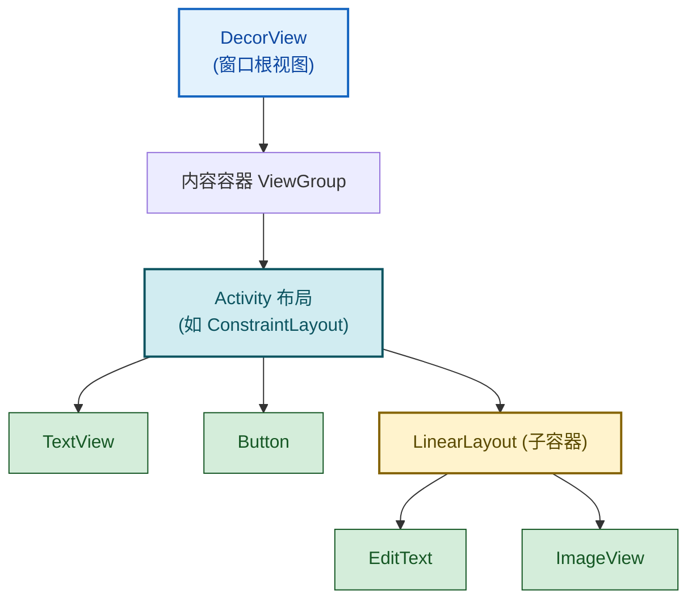

# 4.1 Layout 布局：线性、相对、约束布局

> [!abstract] 本节概述
> Android 的界面由一棵 View 树构成，其中 **ViewGroup**（容器）负责组织子 View 的位置与尺寸，**View**（控件）负责显示内容。布局（Layout）就是各类 ViewGroup 的具体实现：它们用不同的策略摆放子控件——线性排列、相对定位、约束求解或简单叠加。本节介绍四种常用布局 LinearLayout、RelativeLayout、ConstraintLayout、FrameLayout 的定位规则、关键属性、性能差异与选型原则，并用一个登录页案例串联实践。

## 1. View 与 ViewGroup 体系

> [!definition] View 树模型
> - **View**：所有 UI 组件的基类，占据屏幕一块矩形区域，负责绘制自身内容（如 TextView、Button）。
> - **ViewGroup**：继承自 View，同时是"容器"，可包含若干子 View，并决定它们的位置与尺寸（如 LinearLayout、ConstraintLayout）。
> - 整个界面是一棵以 DecorView 为根、由 ViewGroup 嵌套 View 构成的 **View 树**；系统自顶向下依次 measure（测量）→ layout（定位）→ draw（绘制）。



> [!note] 尺寸单位的两个核心值
> - `match_parent`：填满父容器剩余空间。
> - `wrap_content`：按自身内容大小包裹。
> - `0dp`：配合 `layout_weight` 使用，由权重计算最终尺寸。

## 2. LinearLayout 线性布局

> [!definition] LinearLayout
> 让子 View 沿**单一方向**（水平或垂直）依次排列的布局。通过 `android:orientation` 指定方向，通过 `android:layout_weight` 按比例分配剩余空间。结构简单直观，是早期 Android 最常用的布局。

### 2.1 方向与权重

| 属性 | 作用 | 取值 |
| ---- | ---- | ---- |
| `android:orientation` | 排列方向 | `horizontal`（默认）/ `vertical` |
| `android:layout_weight` | 子 View 权重，分配父容器剩余空间 | 数字（如 1、2） |
| `android:weightSum` | 父容器总权重（可选） | 数字 |
| `android:gravity` | 子 View 在父容器中的对齐方式 | `center`/`center_vertical`/`center_horizontal`/`left`/`right` 等 |
| `android:layout_gravity` | 子 View 自身在父容器中的对齐 | 同上 |

> [!warning] weight 计算规则（必考点）
> 当子 View 使用 `layout_weight` 时，其最终尺寸公式为：
> 
> $$\text{最终尺寸} = \text{layout\_width（或 height）} + \frac{\text{weight}}{\sum \text{weight}} \times \text{剩余空间}$$
> 
> - 若把对应方向的尺寸设为 `0dp`，则公式简化为按权重比例直接分配：`最终尺寸 = (weight / 总权重) × 父容器尺寸`。
> - 若把对应方向的尺寸设为 `wrap_content`，则先按内容占一份，再把剩余空间按权重分配，结果不直观，**不推荐**。
> - **结论**：使用 weight 时，对应方向尺寸应写 `0dp`。

### 2.2 线性布局 XML 示例

```xml
<!-- 垂直方向 + 权重分配 -->
<LinearLayout xmlns:android="http://schemas.android.com/apk/res/android"
    android:orientation="vertical"
    android:layout_width="match_parent"
    android:layout_height="match_parent">

    <TextView
        android:layout_width="match_parent"
        android:layout_height="0dp"
        android:layout_weight="1"
        android:gravity="center"
        android:text="上半区（占 1/3）" />

    <TextView
        android:layout_width="match_parent"
        android:layout_height="0dp"
        android:layout_weight="2"
        android:gravity="center"
        android:text="下半区（占 2/3）" />
</LinearLayout>
```

```xml
<!-- 水平方向 + 权重（注意 width 用 0dp） -->
<LinearLayout
    android:orientation="horizontal"
    android:layout_width="match_parent"
    android:layout_height="wrap_content">

    <Button
        android:layout_width="0dp"
        android:layout_height="wrap_content"
        android:layout_weight="1"
        android:text="取消" />

    <Button
        android:layout_width="0dp"
        android:layout_height="wrap_content"
        android:layout_weight="1"
        android:text="确定" />
</LinearLayout>
```

> [!tip] gravity 与 layout_gravity 区别
> - `android:gravity`：作用于**自身**，规定自身内部内容（如 TextView 的文字）的对齐。
> - `android:layout_gravity`：作用于**自身在父容器中**的对齐位置。
> - 二者都是子级属性，但 `gravity` 影响自己内部，`layout_gravity` 影响自己在外部。

## 3. RelativeLayout 相对布局

> [!definition] RelativeLayout
> 让子 View 通过"相对父容器"或"相对兄弟组件"的方式定位的布局。无需嵌套即可表达复杂的相对关系，是早期 Android 复杂界面的首选，现已逐步被 ConstraintLayout 取代。

### 3.1 相对父容器定位

| 属性 | 作用 |
| ---- | ---- |
| `android:layout_alignParentTop` | 顶部贴齐父容器顶部 |
| `android:layout_alignParentBottom` | 底部贴齐父容器底部 |
| `android:layout_alignParentLeft` / `Start` | 左侧贴齐父容器左侧 |
| `android:layout_alignParentRight` / `End` | 右侧贴齐父容器右侧 |
| `android:layout_centerHorizontal` | 水平居中于父容器 |
| `android:layout_centerVertical` | 垂直居中于父容器 |
| `android:layout_centerInParent` | 完全居中于父容器 |

### 3.2 相对兄弟组件定位

| 属性 | 作用 |
| ---- | ---- |
| `android:layout_above` | 位于指定 ID 控件的上方 |
| `android:layout_below` | 位于指定 ID 控件的下方 |
| `android:layout_toLeftOf` / `toStartOf` | 位于指定 ID 控件的左侧 |
| `android:layout_toRightOf` / `toEndOf` | 位于指定 ID 控件的右侧 |
| `android:layout_alignTop` | 顶部对齐指定 ID 控件顶部 |
| `android:layout_alignBottom` | 底部对齐指定 ID 控件底部 |

### 3.3 相对布局 XML 示例

```xml
<RelativeLayout xmlns:android="http://schemas.android.com/apk/res/android"
    android:layout_width="match_parent"
    android:layout_height="match_parent">

    <!-- 标题：水平居中、贴顶 -->
    <TextView
        android:id="@+id/tv_title"
        android:layout_width="wrap_content"
        android:layout_height="wrap_content"
        android:layout_centerHorizontal="true"
        android:layout_alignParentTop="true"
        android:layout_marginTop="16dp"
        android:text="用户登录" />

    <!-- 输入框：位于标题下方 -->
    <EditText
        android:id="@+id/et_account"
        android:layout_width="match_parent"
        android:layout_height="wrap_content"
        android:layout_below="@id/tv_title"
        android:layout_marginTop="16dp"
        android:hint="请输入账号" />

    <!-- 确定按钮：贴右下角 -->
    <Button
        android:id="@+id/btn_ok"
        android:layout_width="wrap_content"
        android:layout_height="wrap_content"
        android:layout_alignParentRight="true"
        android:layout_alignParentBottom="true"
        android:text="确定" />

    <!-- 取消按钮：位于确定按钮左侧、底部对齐 -->
    <Button
        android:id="@+id/btn_cancel"
        android:layout_width="wrap_content"
        android:layout_height="wrap_content"
        android:layout_toLeftOf="@id/btn_ok"
        android:layout_alignBottom="@id/btn_ok"
        android:layout_marginRight="8dp"
        android:text="取消" />
</RelativeLayout>
```

> [!warning] RelativeLayout 易错点
> - 引用兄弟组件 ID 时，**被引用的控件必须先声明**（XML 顺序在前）。
> - 循环依赖（A 相对 B、B 相对 A）会布局失败。
> - `alignParentLeft` 与 `toRightOf` 同时使用可能产生冲突，需注意语义。

## 4. ConstraintLayout 约束布局

> [!definition] ConstraintLayout
> Android 官方主推的布局（随 Constraint Layout 库发布），通过"约束"（Constraint）描述控件之间的相对关系，由求解器在运行时计算每个控件的位置与尺寸。**最大优势是用扁平结构替代多层嵌套**，显著减少 View 树层级，提升测量与布局性能，是复杂界面的首选。

### 4.1 约束（Constraint）

> [!definition] 约束的本质
> 约束描述"控件某条边与另一对象（父容器、其他控件、Guideline）的同向边对齐关系"。每个控件需在水平与垂直两个方向上各至少有一个约束，才能确定唯一位置。

| 属性 | 作用 |
| ---- | ---- |
| `app:layout_constraintLeft_toLeftOf` | 自身左边对齐目标左边 |
| `app:layout_constraintLeft_toRightOf` | 自身左边对齐目标右边 |
| `app:layout_constraintRight_toLeftOf` | 自身右边对齐目标左边 |
| `app:layout_constraintRight_toRightOf` | 自身右边对齐目标右边 |
| `app:layout_constraintTop_toTopOf` | 自身顶边对齐目标顶边 |
| `app:layout_constraintTop_toBottomOf` | 自身顶边对齐目标底边 |
| `app:layout_constraintBottom_toTopOf` | 自身底边对齐目标顶边 |
| `app:layout_constraintBottom_toBottomOf` | 自身底边对齐目标底边 |

> [!note] 命名空间
> ConstraintLayout 属性使用 `app:` 命名空间（非 `android:`），需在根标签声明 `xmlns:app="http://schemas.android.com/apk/res-auto"`。目标可以是 `@id/xxx`、`parent`（父容器）或 `@id/guideline`。

### 4.2 Bias 偏向

> [!definition] Bias
> 当控件在某方向上两端都有约束时，默认居中（0.5）。`bias` 让控件在两端之间偏向某一侧，取值 0~1。

| 属性 | 作用 | 默认 |
| ---- | ---- | ---- |
| `app:layout_constraintHorizontal_bias` | 水平偏向（0=最左，1=最右） | 0.5 |
| `app:layout_constraintVertical_bias` | 垂直偏向（0=最上，1=最下） | 0.5 |

```xml
<TextView
    android:layout_width="wrap_content"
    android:layout_height="wrap_content"
    android:text="偏左 30%"
    app:layout_constraintLeft_toLeftOf="parent"
    app:layout_constraintRight_toRightOf="parent"
    app:layout_constraintHorizontal_bias="0.3" />
```

### 4.3 Chain 链

> [!definition] Chain 链
> 当一组控件在某一方向上首尾相连、形成环状约束时，构成一条 **Chain**。链头（第一个控件）的 `chainStyle` 决定整链的分布方式。

| 链样式 | 分布方式 | 属性 |
| ------ | -------- | ---- |
| `spread`（默认） | 均匀分布，两端留空隙，控件间等距 | `app:layout_constraintHorizontal_chainStyle="spread"` |
| `spread_inside` | 两端贴边，中间均匀分布 | `app:layout_constraintHorizontal_chainStyle="spread_inside"` |
| `packed` | 控件紧凑聚拢居中 | `app:layout_constraintHorizontal_chainStyle="packed"` |

```xml
<!-- 三个按钮水平 packed 链 -->
<Button android:id="@+id/btn1"
    android:layout_width="wrap_content"
    android:layout_height="wrap_content"
    android:text="A"
    app:layout_constraintLeft_toLeftOf="parent"
    app:layout_constraintRight_toLeftOf="@id/btn2"
    app:layout_constraintHorizontal_chainStyle="packed" />

<Button android:id="@+id/btn2"
    android:layout_width="wrap_content"
    android:layout_height="wrap_content"
    android:text="B"
    app:layout_constraintLeft_toRightOf="@id/btn1"
    app:layout_constraintRight_toLeftOf="@id/btn3" />

<Button android:id="@+id/btn3"
    android:layout_width="wrap_content"
    android:layout_height="wrap_content"
    android:text="C"
    app:layout_constraintLeft_toRightOf="@id/btn2"
    app:layout_constraintRight_toRightOf="parent" />
```

### 4.4 Guideline 参考线

> [!definition] Guideline
> Guideline 是一条**不可见**的辅助线（垂直或水平），本身不参与绘制，仅作为约束目标，便于在复杂布局中对齐。位置可用 `dp` 起始值、百分比或距边界距离指定。

| 属性 | 作用 |
| ---- | ---- |
| `android:orientation` | `vertical` / `horizontal` |
| `app:layout_constraintGuide_begin` | 距起始边距离（dp） |
| `app:layout_constraintGuide_end` | 距结束边距离（dp） |
| `app:layout_constraintGuide_percent` | 百分比位置（0~1） |

```xml
<androidx.constraintlayout.widget.Guideline
    android:id="@+id/guide_v50"
    android:layout_width="wrap_content"
    android:layout_height="wrap_content"
    android:orientation="vertical"
    app:layout_constraintGuide_percent="0.5" />
```

## 5. FrameLayout 帧布局

> [!definition] FrameLayout
> 最简单的布局：所有子 View 默认从左上角开始**叠加**绘制，后声明的控件覆盖在先声明的控件之上。常用于 Fragment 容器、图层叠加、占位等场景。

| 属性 | 作用 |
| ---- | ---- |
| `android:layout_gravity` | 子 View 在父容器中的对齐位置 |
| `android:foreground` | 前景图（覆盖所有子 View） |
| `android:foregroundGravity` | 前景图对齐 |

```xml
<FrameLayout xmlns:android="http://schemas.android.com/apk/res/android"
    android:layout_width="match_parent"
    android:layout_height="200dp">

    <ImageView
        android:layout_width="match_parent"
        android:layout_height="match_parent"
        android:scaleType="centerCrop"
        android:src="@drawable/bg" />

    <TextView
        android:layout_width="wrap_content"
        android:layout_height="wrap_content"
        android:layout_gravity="bottom|center_horizontal"
        android:layout_marginBottom="12dp"
        android:text="覆盖在图片上的文字" />
</FrameLayout>
```

## 6. 四种布局对比

> [!example] 四种布局对比表
> 
> | 维度 | LinearLayout | RelativeLayout | ConstraintLayout | FrameLayout |
> | ---- | ------------ | -------------- | ---------------- | ----------- |
> | 定位方式 | 单方向顺序排列 | 相对父容器/兄弟 | 约束求解 | 左上角叠加 |
> | 嵌套倾向 | 高（复杂结构需多层） | 低 | **极低（扁平）** | 低 |
> | 性能 | 中 | 中（双趟测量） | 高（求解器优化） | 高 |
> | 比例分配 | weight 支持 | 不直接支持 | 通过 Guideline/百分比支持 | 不支持 |
> | 学习成本 | 低 | 中 | 高 | 低 |
> | 典型场景 | 简单表单、按钮行 | 中等复杂相对关系 | 复杂界面、扁平化首选 | Fragment 容器、图层 |
> | 推荐度 | 简单场景可用 | 旧项目兼容 | **官方主推** | 容器专用 |

> [!tip] 选型原则
> - **首选 ConstraintLayout**：复杂界面用它扁平化，减少嵌套层级，提升测量性能。
> - **简单线性结构**用 LinearLayout（如一行按钮、一列表单项）。
> - **Fragment 容器**固定用 FrameLayout。
> - 旧项目维护时保留 RelativeLayout，新项目不再优先选用。

## 7. 案例：登录页面布局实现

> [!example] 用 ConstraintLayout 实现登录页
> 需求：顶部 Logo 居中、Logo 下方账号输入框（占满宽度）、再下方密码输入框、最底部"登录"按钮贴右下、"注册"按钮位于登录按钮左侧。

```xml
<!-- res/layout/activity_login.xml -->
<androidx.constraintlayout.widget.ConstraintLayout
    xmlns:android="http://schemas.android.com/apk/res/android"
    xmlns:app="http://schemas.android.com/apk/res-auto"
    android:layout_width="match_parent"
    android:layout_height="match_parent"
    android:padding="24dp">

    <!-- Logo：水平居中、距顶 64dp -->
    <ImageView
        android:id="@+id/iv_logo"
        android:layout_width="96dp"
        android:layout_height="96dp"
        android:src="@mipmap/ic_launcher"
        app:layout_constraintTop_toTopOf="parent"
        app:layout_constraintLeft_toLeftOf="parent"
        app:layout_constraintRight_toRightOf="parent"
        android:layout_marginTop="64dp" />

    <!-- 账号输入框：Logo 下方 -->
    <EditText
        android:id="@+id/et_account"
        android:layout_width="0dp"
        android:layout_height="wrap_content"
        android:hint="请输入账号"
        android:inputType="text"
        app:layout_constraintTop_toBottomOf="@id/iv_logo"
        app:layout_constraintLeft_toLeftOf="parent"
        app:layout_constraintRight_toRightOf="parent"
        android:layout_marginTop="32dp" />

    <!-- 密码输入框：账号下方 -->
    <EditText
        android:id="@+id/et_password"
        android:layout_width="0dp"
        android:layout_height="wrap_content"
        android:hint="请输入密码"
        android:inputType="textPassword"
        app:layout_constraintTop_toBottomOf="@id/et_account"
        app:layout_constraintLeft_toLeftOf="parent"
        app:layout_constraintRight_toRightOf="parent"
        android:layout_marginTop="16dp" />

    <!-- 登录按钮：贴右下角 -->
    <Button
        android:id="@+id/btn_login"
        android:layout_width="wrap_content"
        android:layout_height="wrap_content"
        android:text="登录"
        app:layout_constraintBottom_toBottomOf="parent"
        app:layout_constraintRight_toRightOf="parent"
        android:layout_marginBottom="24dp" />

    <!-- 注册按钮：位于登录按钮左侧 -->
    <Button
        android:id="@+id/btn_register"
        android:layout_width="wrap_content"
        android:layout_height="wrap_content"
        android:text="注册"
        app:layout_constraintBottom_toBottomOf="@id/btn_login"
        app:layout_constraintRight_toLeftOf="@id/btn_login"
        android:layout_marginRight="12dp" />
</androidx.constraintlayout.widget.ConstraintLayout>
```

```java
// LoginActivity.java 中绑定事件
public class LoginActivity extends AppCompatActivity {
    @Override
    protected void onCreate(Bundle savedInstanceState) {
        super.onCreate(savedInstanceState);
        setContentView(R.layout.activity_login);

        EditText etAccount  = findViewById(R.id.et_account);
        EditText etPassword = findViewById(R.id.et_password);
        findViewById(R.id.btn_login).setOnClickListener(v -> {
            String account = etAccount.getText().toString().trim();
            String pwd = etPassword.getText().toString().trim();
            if (account.isEmpty() || pwd.isEmpty()) {
                Toast.makeText(this, "账号或密码不能为空", Toast.LENGTH_SHORT).show();
                return;
            }
            // TODO: 校验账号密码并跳转主页
        });
    }
}
```

> [!note] 案例要点
> - 整个登录页**仅一层布局**，没有嵌套，体现了 ConstraintLayout 的扁平化优势。
> - 输入框宽度用 `0dp` + 左右约束，等价于 `match_parent`，但更符合约束布局规范。
> - 按钮间通过 `toLeftOf` / `Bottom_toBottomOf` 形成相对关系，注册按钮自动与登录按钮底部对齐。

## 8. 易错点与最佳实践

> [!warning] 常见易错点
> 1. **LinearLayout 使用 weight 时对应方向尺寸未写 0dp**：导致按 `wrap_content` 计算后再分配剩余空间，结果与预期不符。
> 2. **RelativeLayout 引用未声明的兄弟 ID**：XML 顺序错误导致找不到目标，布局错乱。
> 3. **ConstraintLayout 控件缺少某个方向的约束**：该方向位置不确定，IDE 会标红警告，运行时位置错乱。
> 4. **混淆 `gravity` 与 `layout_gravity`**：前者控制自身内部内容对齐，后者控制自身在父容器中的对齐。
> 5. **过度嵌套 LinearLayout**：每多一层嵌套就多一趟测量，复杂界面应改用 ConstraintLayout 扁平化。
> 6. **在 ConstraintLayout 中仍用 `match_parent`**：约束布局推荐用 `0dp` + 约束替代 `match_parent`，避免与约束求解冲突。

> [!tip] 最佳实践
> - 新项目默认根布局选 ConstraintLayout，借助 Android Studio Layout Editor 拖拽生成约束。
> - 公共尺寸、颜色、字符串统一抽到 `res/values/` 下，避免硬编码（详见 [[4.4 资源文件：图片、字符串、尺寸资源|4.4 资源文件]]）。
> - 复杂 Item 布局（如列表项）也优先 ConstraintLayout，减少嵌套层级提升列表滚动性能。

## 章节导航

- 上级：[[MOC - 第4章|第4章 Android UI 界面开发]]
- 上一章：[[MOC - 第3章|第3章 Activity 与页面交互]]
- 下一节：[[4.2 基础控件：TextView、Button、EditText|4.2 基础控件]]
- 习题：[[MOC - 第4章习题|第4章习题]]
