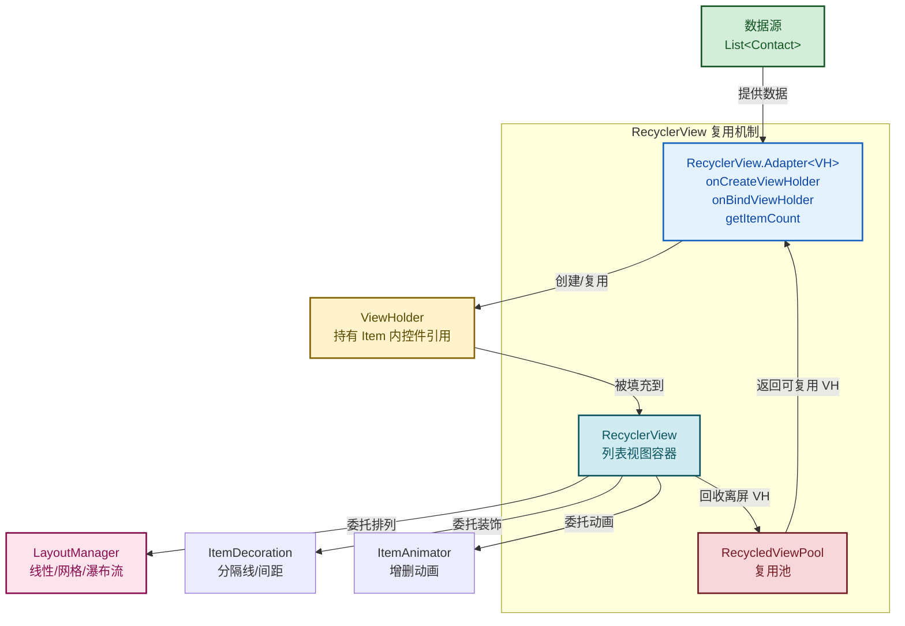

# 4.3 列表控件 ListView、RecyclerView

> [!abstract] 本节概述
> 当数据项数量动态变化（如通讯录、消息列表、商品流）时，逐个写控件不可行，需要"列表控件 + 适配器"的模式：列表本身只持有少量可见的 Item 视图，由适配器把数据"绑定"到这些视图上，并在滚动时**复用**离开屏幕的视图。本节先讲 ListView 的 Adapter 模式及其缺陷，再重点介绍 RecyclerView 的四大组件、三种 LayoutManager 与适配器实现——这是本章最重要、最高频的代码考点。

## 1. 列表控件的核心问题

> [!definition] 列表控件为何需要 Adapter
> - 屏幕一次只能显示几个到十几个 Item，但数据可能有成千上万条。
> - 若为每条数据都创建一个 View，内存会被瞬间撑爆、滚动卡顿。
> - **解法**：列表只创建 N 个可见 + 缓存几个的 View（**复用池**），滚动时离开屏幕的 View 被回收进复用池，新进入屏幕的 Item 从池中取 View 并由 Adapter **重新绑定数据**。
> - Adapter（适配器）就是连接"数据源"与"列表视图"的中间层：它知道数据有多少条、每条数据长什么样、如何把数据填到 View 上。

## 2. ListView 基本用法

> [!definition] ListView
> Android 早期的列表控件。通过 `setAdapter(Adapter)` 绑定数据源，内部维护一个由 `View` 组成的复用池（叫 RecyclerBin），滚动时复用离开屏幕的视图。已逐步被 RecyclerView 取代，但旧项目仍广泛使用。

### 2.1 三种内置 Adapter

| Adapter | 适用场景 |
| ------- | -------- |
| `ArrayAdapter<T>` | 单行文本、数据是数组或 List 的简单列表 |
| `SimpleAdapter` | 每项由多个控件组成，数据是 `List<Map<String,?>>` |
| `BaseAdapter` | 自定义最灵活，需实现 4 个方法，适合复杂场景 |

### 2.2 ArrayAdapter 示例

```xml
<ListView
    android:id="@+id/lv_cities"
    android:layout_width="match_parent"
    android:layout_height="match_parent" />
```

```java
ListView listView = findViewById(R.id.lv_cities);
String[] cities = {"北京", "上海", "广州", "深圳", "杭州", "成都"};
ArrayAdapter<String> adapter = new ArrayAdapter<>(
    this,                                   // Context
    android.R.layout.simple_list_item_1,    // 系统内置单行文本布局
    cities);                                // 数据
listView.setAdapter(adapter);

listView.setOnItemClickListener((parent, view, position, id) -> {
    Toast.makeText(this, "点击：" + cities[position], Toast.LENGTH_SHORT).show();
});
```

### 2.3 自定义 BaseAdapter

> [!definition] BaseAdapter 四个抽象方法
> 实现 BaseAdapter 必须重写以下四个方法：
> 
> | 方法 | 作用 |
> | ---- | ---- |
> | `getCount()` | 返回数据条数 |
> | `getItem(int position)` | 返回指定位置的数据对象 |
> | `getItemId(int position)` | 返回指定位置的行 ID（通常直接返回 position） |
> | `getView(int position, View convertView, ViewGroup parent)` | **核心**：返回每个位置显示的 View |

```java
public class ContactAdapter extends BaseAdapter {
    private List<Contact> data;
    private LayoutInflater inflater;

    public ContactAdapter(Context ctx, List<Contact> data) {
        this.data = data;
        this.inflater = LayoutInflater.from(ctx);
    }

    @Override public int getCount() { return data.size(); }
    @Override public Contact getItem(int position) { return data.get(position); }
    @Override public long getItemId(int position) { return position; }

    @Override
    public View getView(int position, View convertView, ViewGroup parent) {
        ViewHolder holder;
        if (convertView == null) {
            // 没有可复用视图，加载布局并创建 ViewHolder
            convertView = inflater.inflate(R.layout.item_contact, parent, false);
            holder = new ViewHolder();
            holder.tvName  = convertView.findViewById(R.id.tv_name);
            holder.tvPhone = convertView.findViewById(R.id.tv_phone);
            convertView.setTag(holder);            // 把 holder 缓存到 View 上
        } else {
            // 复用已有视图，直接取出 holder
            holder = (ViewHolder) convertView.getTag();
        }
        // 绑定数据
        Contact c = getItem(position);
        holder.tvName.setText(c.getName());
        holder.tvPhone.setText(c.getPhone());
        return convertView;
    }

    // ViewHolder：缓存 Item 内部控件引用，避免每次 findViewById
    static class ViewHolder {
        TextView tvName;
        TextView tvPhone;
    }
}
```

> [!tip] ListView 的 ViewHolder 模式
> `findViewById` 是性能开销较大的操作（遍历 View 树）。ListView 本身**不强制** ViewHolder 模式，需开发者手动实现：用 `convertView.getTag()` 缓存控件引用，避免每次 `getView` 都查找。这是 ListView 优化的关键技巧。

## 3. ListView 的缺点

> [!warning] ListView 的主要缺陷
> 1. **复用机制不强制 ViewHolder**：开发者不写就会反复 `findViewById`，性能差。
> 2. **不支持多样化 Item**：默认只有一种 Item 布局，多种类型 Item 实现繁琐。
> 3. **不支持横向滚动**：只能纵向列表。
> 4. **不支持瀑布流**：无法实现不等高网格。
> 5. **动画支持弱**：增删改 Item 默认无动画。
> 6. **数据更新需手动调 `notifyDataSetChanged()`**：且默认全量刷新，无差分能力。

## 4. RecyclerView 概述

> [!definition] RecyclerView
> Android 5.0 引入（位于 `androidx.recyclerview` 库）的高级列表控件，强制使用 ViewHolder 模式，通过组合不同的 LayoutManager 支持纵向、网格、瀑布流等多种排列，并提供 Item 增删动画与差分更新。**RecyclerView 不再关心"如何排列"，而是把排列职责交给 LayoutManager**，把分隔线职责交给 ItemDecoration，把增删动画职责交给 ItemAnimator，实现了关注点分离。

## 5. RecyclerView 四大核心组件

> [!definition] 四大组件职责
> 
> | 组件 | 职责 | 是否必需 |
> | ---- | ---- | -------- |
> | **Adapter** | 把数据绑定到 ViewHolder（创建 VH、绑定数据） | 是 |
> | **ViewHolder** | 持有 Item 内部控件引用，避免反复 findViewById | 是 |
> | **LayoutManager** | 决定 Item 的排列方式（线性/网格/瀑布流） | 是 |
> | **ItemDecoration** | Item 之间的分隔线、间距装饰 | 否 |
> | **ItemAnimator** | Item 增删改的动画 | 否（有默认实现） |

### 5.1 RecyclerView 架构图



## 6. 三种 LayoutManager

> [!definition] LayoutManager 决定排列方式
> RecyclerView 把"如何排列 Item"完全交给 LayoutManager，换 LayoutManager 即可改变列表外观，Adapter 无需修改。

| LayoutManager | 排列方式 | 典型场景 | 设置代码 |
| ------------- | -------- | -------- | -------- |
| `LinearLayoutManager` | 纵向或横向线性列表 | 通讯录、消息列表、聊天记录 | `new LinearLayoutManager(this)` |
| `GridLayoutManager` | 网格（等宽等高） | 相册、应用商店、分类宫格 | `new GridLayoutManager(this, 3)`（3 列） |
| `StaggeredGridLayoutManager` | 瀑布流（不等高） | 电商商品流、Pinterest、小红书 | `new StaggeredGridLayoutManager(2, VERTICAL)`（2 列纵向） |

```java
RecyclerView rv = findViewById(R.id.rv_list);

// 1. 纵向线性
rv.setLayoutManager(new LinearLayoutManager(this));

// 2. 网格（3 列）
rv.setLayoutManager(new GridLayoutManager(this, 3));

// 3. 瀑布流（2 列纵向）
rv.setLayoutManager(
    new StaggeredGridLayoutManager(2, StaggeredGridLayoutManager.VERTICAL));
```

## 7. RecyclerView 适配器实现（重点）

> [!definition] RecyclerView.Adapter 三个必须重写的方法
> 
> | 方法 | 作用 |
> | ---- | ---- |
> | `onCreateViewHolder(parent, viewType)` | 当没有可复用 ViewHolder 时调用，加载 Item 布局并创建 ViewHolder |
> | `onBindViewHolder(holder, position)` | 把 position 位置的数据绑定到 holder 上（**复用时也调这里**） |
> | `getItemCount()` | 返回数据总条数 |

### 7.1 完整适配器实现

```java
// ============ Contact 实体类 ============
public class Contact {
    private String name;
    private String phone;
    public Contact(String name, String phone) {
        this.name = name; this.phone = phone;
    }
    public String getName()  { return name; }
    public String getPhone() { return phone; }
}
```

```java
// ============ RecyclerView 适配器 ============
public class ContactAdapter extends RecyclerView.Adapter<ContactAdapter.ContactViewHolder> {

    private List<Contact> data;
    private OnItemClickListener listener;   // 点击事件回调

    public interface OnItemClickListener {
        void onItemClick(int position);
    }

    public ContactAdapter(List<Contact> data, OnItemClickListener listener) {
        this.data = data;
        this.listener = listener;
    }

    // 1. 创建 ViewHolder：加载 Item 布局
    @NonNull
    @Override
    public ContactViewHolder onCreateViewHolder(@NonNull ViewGroup parent, int viewType) {
        View view = LayoutInflater.from(parent.getContext())
                .inflate(R.layout.item_contact, parent, false);
        return new ContactViewHolder(view);
    }

    // 2. 绑定数据到 ViewHolder
    @Override
    public void onBindViewHolder(@NonNull ContactViewHolder holder, int position) {
        Contact c = data.get(position);
        holder.tvName.setText(c.getName());
        holder.tvPhone.setText(c.getPhone());

        // 绑定点击事件
        holder.itemView.setOnClickListener(v -> {
            if (listener != null) listener.onItemClick(holder.getAdapterPosition());
        });
    }

    // 3. 返回数据总数
    @Override
    public int getItemCount() {
        return data == null ? 0 : data.size();
    }

    // ViewHolder：必须继承 RecyclerView.ViewHolder
    static class ContactViewHolder extends RecyclerView.ViewHolder {
        TextView tvName;
        TextView tvPhone;

        ContactViewHolder(@NonNull View itemView) {
            super(itemView);
            tvName  = itemView.findViewById(R.id.tv_name);
            tvPhone = itemView.findViewById(R.id.tv_phone);
        }
    }
}
```

```xml
<!-- res/layout/item_contact.xml -->
<LinearLayout xmlns:android="http://schemas.android.com/apk/res/android"
    android:orientation="horizontal"
    android:layout_width="match_parent"
    android:layout_height="wrap_content"
    android:padding="12dp">

    <LinearLayout
        android:layout_width="0dp"
        android:layout_height="wrap_content"
        android:layout_weight="1"
        android:orientation="vertical">
        <TextView
            android:id="@+id/tv_name"
            android:layout_width="wrap_content"
            android:layout_height="wrap_content"
            android:textSize="16sp"
            android:textStyle="bold" />
        <TextView
            android:id="@+id/tv_phone"
            android:layout_width="wrap_content"
            android:layout_height="wrap_content"
            android:textSize="14sp"
            android:textColor="#666666" />
    </LinearLayout>

    <Button
        android:layout_width="wrap_content"
        android:layout_height="wrap_content"
        android:text="拨打" />
</LinearLayout>
```

### 7.2 在 Activity 中使用

```java
public class ContactListActivity extends AppCompatActivity {
    @Override
    protected void onCreate(Bundle savedInstanceState) {
        super.onCreate(savedInstanceState);
        setContentView(R.layout.activity_contact_list);

        RecyclerView rv = findViewById(R.id.rv_contacts);
        rv.setLayoutManager(new LinearLayoutManager(this));

        // 准备数据
        List<Contact> contacts = new ArrayList<>();
        contacts.add(new Contact("张三", "13800138000"));
        contacts.add(new Contact("李四", "13900139000"));
        contacts.add(new Contact("王五", "13700137000"));

        // 设置适配器
        ContactAdapter adapter = new ContactAdapter(contacts, position -> {
            Toast.makeText(this, "点击：" + contacts.get(position).getName(),
                    Toast.LENGTH_SHORT).show();
        });
        rv.setAdapter(adapter);

        // 添加默认分隔线
        rv.addItemDecoration(
            new DividerItemDecoration(this, DividerItemDecoration.VERTICAL));
    }
}
```

### 7.3 添加依赖

```groovy
// app/build.gradle
dependencies {
    implementation 'androidx.recyclerview:recyclerview:1.3.2'
}
```

> [!warning] RecyclerView 需要单独引入依赖
> RecyclerView 不在 Android SDK 自带类库中，需在 `app/build.gradle` 添加 `androidx.recyclerview:recyclerview` 依赖，否则编译报错。

### 7.4 数据更新与动画

```java
// 增删改后必须通知 Adapter
contacts.add(new Contact("赵六", "13600136000"));
adapter.notifyItemInserted(contacts.size() - 1);   // 增（带动画）

contacts.remove(0);
adapter.notifyItemRemoved(0);                       // 删（带动画）

adapter.notifyItemChanged(2);                       // 改单条

adapter.notifyDataSetChanged();                     // 全量刷新（无动画）
```

> [!tip] 局部刷新优于全量刷新
> - `notifyDataSetChanged()` 全量刷新，无动画、性能差。
> - `notifyItemInserted/Removed/Changed(position)` 精准刷新，自带默认动画，性能更好。
> - 复杂差分场景可使用 `DiffUtil` 或 `ListAdapter`（自动计算差异）。

## 8. ListView vs RecyclerView 对比

> [!example] 对比表
> 
> | 维度 | ListView | RecyclerView |
> | ---- | -------- | ------------ |
> | ViewHolder | 不强制，需手动实现 | **强制**，编译期保证 |
> | 复用机制 | RecyclerBin（按 Item 类型粗粒度复用） | RecycledViewPool（多类型精细复用，可跨 RecyclerView 共享） |
> | 排列方式 | 仅纵向列表 | 线性 / 网格 / 瀑布流（换 LayoutManager） |
> | 横向滚动 | 不支持 | 支持 |
> | 多类型 Item | 支持但繁琐 | 通过 `getItemViewType` 标准支持 |
> | 分隔线 | `setDivider` XML 属性 | ItemDecoration（更灵活，可绘制任意装饰） |
> | 增删动画 | 无 | ItemAnimator（默认带增删动画） |
> | 局部刷新 | 仅 `notifyDataSetChanged` | `notifyItemInserted/Removed/Changed` + DiffUtil |
> | 点击事件 | `setOnItemClickListener` 内置 | **需自己在 Adapter 中绑定** |
> | 推荐度 | 旧项目维护 | **新项目首选** |

> [!note] RecyclerView 没有内置 Item 点击事件
> ListView 内置了 `setOnItemClickListener`，但 RecyclerView 取消了它——因为"点击"通常涉及 Item 内多个子控件分别响应（如点击整个 Item 跳详情、点击 Item 内按钮点赞），统一回调不够灵活。标准做法是**在 Adapter 内部为 `holder.itemView` 设置点击监听，并通过自定义接口回调把 position 传回 Activity**。

## 9. 案例：通讯录列表

> [!example] 完整通讯录实现
> 需求：展示联系人列表（姓名 + 电话 + 头像首字母），点击 Item 弹出详情，长按 Item 弹删除菜单。整体使用 RecyclerView + LinearLayoutManager + ItemDecoration 分隔线。

```java
public class ContactListActivity extends AppCompatActivity {

    private List<Contact> contacts = new ArrayList<>();
    private ContactAdapter adapter;

    @Override
    protected void onCreate(Bundle savedInstanceState) {
        super.onCreate(savedInstanceState);
        setContentView(R.layout.activity_contact_list);

        initData();

        RecyclerView rv = findViewById(R.id.rv_contacts);
        rv.setLayoutManager(new LinearLayoutManager(this));
        rv.addItemDecoration(new DividerItemDecoration(this,
                DividerItemDecoration.VERTICAL));

        adapter = new ContactAdapter(contacts, new ContactAdapter.OnItemClickListener() {
            @Override
            public void onItemClick(int position) {
                Contact c = contacts.get(position);
                Toast.makeText(ContactListActivity.this,
                    "详情：" + c.getName() + " / " + c.getPhone(),
                    Toast.LENGTH_SHORT).show();
            }
        });
        // 长按监听：通过 Adapter 暴露的方法设置
        adapter.setOnItemLongClickListener(position -> {
            new AlertDialog.Builder(ContactListActivity.this)
                .setTitle("删除联系人")
                .setMessage("确认删除 " + contacts.get(position).getName() + "？")
                .setPositiveButton("删除", (d, w) -> {
                    contacts.remove(position);
                    adapter.notifyItemRemoved(position);
                    adapter.notifyItemRangeChanged(position, contacts.size() - position);
                })
                .setNegativeButton("取消", null)
                .show();
        });
        rv.setAdapter(adapter);
    }

    private void initData() {
        contacts.add(new Contact("张三", "13800138000"));
        contacts.add(new Contact("李四", "13900139000"));
        contacts.add(new Contact("王五", "13700137000"));
        contacts.add(new Contact("赵六", "13600136000"));
    }
}
```

```java
// ContactAdapter 增加长按支持（接 7.1 节代码扩展）
public class ContactAdapter extends RecyclerView.Adapter<ContactAdapter.ContactViewHolder> {
    // ... 已有代码 ...

    private OnItemLongClickListener longListener;
    public interface OnItemLongClickListener { void onItemLongClick(int position); }
    public void setOnItemLongClickListener(OnItemLongClickListener l) { this.longListener = l; }

    @Override
    public void onBindViewHolder(@NonNull ContactViewHolder holder, int position) {
        // ... 已有绑定代码 ...
        holder.itemView.setOnLongClickListener(v -> {
            if (longListener != null) longListener.onItemLongClick(holder.getAdapterPosition());
            return true;   // 返回 true 表示消费长按事件
        });
    }
}
```

> [!note] 删除后通知的两个方法
> - `notifyItemRemoved(position)` 通知 Adapter 该位置被移除（触发滑出动画）。
> - `notifyItemRangeChanged(position, count)` 通知后续位置数据下标变化，避免点击错位。
> - 二者配合才能保证删除后点击 position 准确。

## 10. 易错点与最佳实践

> [!warning] 常见易错点
> 1. **忘了设置 LayoutManager**：RecyclerView 不显示任何内容，日志会警告 "No layout manager attached"。
> 2. **忘了调 `setAdapter`**：列表空白。
> 3. **数据更新后没调 `notifyXXX`**：界面不刷新。
> 4. **Adapter 用 `position` 而非 `holder.getAdapterPosition()` 处理点击**：在有增删时 position 与实际下标不一致，导致点击错位。
> 5. **在 `onBindViewHolder` 中 `new OnClickListener`**：每次绑定都创建新对象，应该让 ViewHolder 持有监听器、绑定数据时只更新 position 引用。
> 6. **未引入 recyclerview 依赖**：编译报错 `cannot find symbol class RecyclerView`。

> [!tip] 最佳实践
> - Item 布局优先用 ConstraintLayout 扁平化，减少层级提升滚动性能。
> - 头像/图片加载用 Glide / Picasso 等库，自动异步、缓存、占位图。
> - 复杂列表用 `DiffUtil` 或继承 `ListAdapter`，自动计算差分并精准刷新。
> - 多类型 Item 通过重写 `getItemViewType(position)`，在 `onCreateViewHolder` 中按 viewType 加载不同布局。

## 章节导航

- 上级：[[MOC - 第4章|第4章 Android UI 界面开发]]
- 上一节：[[4.2 基础控件：TextView、Button、EditText|4.2 基础控件]]
- 下一节：[[4.4 资源文件：图片、字符串、尺寸资源|4.4 资源文件]]
- 习题：[[MOC - 第4章习题|第4章习题]]
