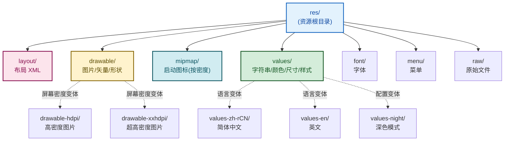

# 4.4 资源文件：图片、字符串、尺寸资源

> [!abstract] 本节概述
> Android 工程的 `res/` 目录专门存放"与代码解耦的资源"：图片、字符串、尺寸、颜色、样式、主题、布局等都按类型分目录组织。把内容从代码中抽到资源文件有三个好处：**多语言/多屏幕适配**、**复用与统一修改**、**编译期校验**。本节介绍 `res/` 目录结构、各类资源文件的写法与引用方式，重点辨析 dp/sp/px 三种尺寸单位，并用多语言适配案例串联实践。

## 1. res 目录结构

> [!definition] res 目录与子目录职责
> Android 工程的 `res/` 目录按资源类型分子目录，编译期由 AAPT 工具生成 `R` 类，每个资源在 `R` 中对应一个整型 ID。



> [!note] 限定符命名规则
> 资源目录可通过追加限定符提供变体，如 `values-zh-rCN`（简体中文）、`values-night`（深色模式）、`drawable-hdpi`（高密度屏幕）。多个限定符必须按 **官方顺序** 排列：MCC/MNC → 语言 → 区域 → 布局方向 → 最小宽度 → 屏幕宽度 → 屏幕方向 → 夜间模式 → 屏幕密度 → 触摸屏 → 键盘 → 平台版本。顺序错误会导致编译错误。

## 2. 图片资源

### 2.1 drawable 与 mipmap

> [!definition] drawable 与 mipmap 的区别
> 
> | 目录 | 用途 | 特点 |
> | ---- | ---- | ---- |
> | `drawable/` | 通用图片资源（PNG/JPEG/WebP/VectorDrawable/Shape XML） | 不按密度缩放（除非加密度限定符） |
> | `mipmap/` | **仅用于启动器图标**（应用桌面图标） | 系统会按密度自动选择，且支持启动器上采样，保证图标清晰 |

> [!warning] mipmap 仅放启动图标
> 不要把业务用图（如头像、Banner）放进 `mipmap/`。mipmap 由系统启动器特殊处理（可上采样），只服务于应用图标；业务图应放在 `drawable/` 或密度变体目录中。

### 2.2 图片格式对比

| 格式 | 特点 | 适用场景 |
| ---- | ---- | -------- |
| **PNG** | 无损、支持透明、体积大 | 需要透明的图标、插画 |
| **JPEG** | 有损、不支持透明、体积小 | 照片、背景大图 |
| **WebP** | 同等质量体积更小（Android 4.0+） | 替代 PNG/JPEG 降包体 |
| **VectorDrawable** | 矢量 XML，任意缩放不模糊，体积小 | 简单线条图标（如 Material Icon） |
| **Shape Drawable** | XML 描述的几何形状（圆角矩形、渐变） | 背景、分隔线、按钮形状 |

### 2.3 VectorDrawable 示例

```xml
<!-- res/drawable/ic_heart.xml -->
<vector xmlns:android="http://schemas.android.com/apk/res/android"
    android:width="24dp"
    android:height="24dp"
    android:viewportWidth="24"
    android:viewportHeight="24">
    <path
        android:fillColor="#FF5252"
        android:pathData="M12,21.35l-1.45,-1.32C5.4,15.36 2,12.28 2,8.5
                          2,5.42 4.42,3 7.5,3c1.74,0 3.41,0.81 4.5,2.09
                          C13.09,3.81 14.76,3 16.5,3 19.58,3 22,5.42 22,8.5
                          c0,3.78 -3.4,6.86 -8.55,11.54L12,21.35z" />
</vector>
```

### 2.4 Shape Drawable 示例

```xml
<!-- res/drawable/bg_rounded.xml：圆角矩形背景 -->
<shape xmlns:android="http://schemas.android.com/apk/res/android"
    android:shape="rectangle">
    <solid android:color="#FFFFFF" />
    <corners android:radius="8dp" />
    <stroke android:width="1dp" android:color="#DDDDDD" />
</shape>
```

```xml
<!-- 在布局中引用 -->
<View
    android:layout_width="match_parent"
    android:layout_height="48dp"
    android:background="@drawable/bg_rounded" />
```

## 3. 字符串资源

> [!definition] strings.xml
> 集中存放所有界面文字的 XML 文件，位于 `res/values/strings.xml`。代码与布局中通过 `@string/xxx` 或 `R.string.xxx` 引用，便于多语言适配与统一修改。

```xml
<!-- res/values/strings.xml -->
<resources>
    <string name="app_name">移动互联网开发</string>
    <string name="login">登录</string>
    <string name="hint_account">请输入账号</string>
    <!-- 带格式化参数：%1$s 第一个字符串参数，%2$d 第二个整数参数 -->
    <string name="welcome_user">欢迎您，%1$s！您有 %2$d 条新消息</string>
</resources>
```

```xml
<!-- 布局中引用 -->
<Button
    android:layout_width="wrap_content"
    android:layout_height="wrap_content"
    android:text="@string/login" />
```

```java
// Java 中引用
String login = getString(R.string.login);
String hint  = getString(R.string.hint_account);
// 带参数格式化
String msg = getString(R.string.welcome_user, "张三", 5);  // 欢迎您，张三！您有 5 条新消息
```

### 3.1 多语言适配

> [!definition] 多语言（国际化 i18n）机制
> 通过建立不同语言的 `values-语言-r区域/strings.xml` 变体，系统按设备当前语言自动加载对应版本。`values/strings.xml` 作为**默认/兜底**资源，未匹配语言时使用。

```xml
<!-- res/values/strings.xml（默认：中文兜底） -->
<resources>
    <string name="login">登录</string>
    <string name="hint_account">请输入账号</string>
</resources>
```

```xml
<!-- res/values-en/strings.xml（英文） -->
<resources>
    <string name="login">Login</string>
    <string name="hint_account">Enter your account</string>
</resources>
```

```xml
<!-- res/values-ja/strings.xml（日文） -->
<resources>
    <string name="login">ログイン</string>
    <string name="hint_account">アカウントを入力</string>
</resources>
```

> [!note] 限定符目录命名
> - `values-en`：英语（仅语言）
> - `values-en-rUS`：美式英语（语言 + 区域，`r` 前缀表示 region）
> - `values-zh-rCN`：简体中文
> - `values-zh-rTW`：繁体中文（台湾）
> - 设备匹配时优先选"语言 + 区域"完全匹配，退化为"仅语言"匹配，再退化为默认 `values/`。

## 4. 尺寸资源

> [!definition] dimens.xml
> 集中存放尺寸数值的 XML 文件，位于 `res/values/dimens.xml`。通过 `@dimen/xxx` 引用，便于不同屏幕密度统一调整、统一修改间距体系。

```xml
<!-- res/values/dimens.xml -->
<resources>
    <dimen name="spacing_small">8dp</dimen>
    <dimen name="spacing_medium">16dp</dimen>
    <dimen name="spacing_large">24dp</dimen>
    <dimen name="text_caption">12sp</dimen>
    <dimen name="text_body">14sp</dimen>
    <dimen name="text_title">20sp</dimen>
    <dimen name="button_height">48dp</dimen>
</resources>
```

```xml
<!-- 布局中引用 -->
<Button
    android:layout_width="match_parent"
    android:layout_height="@dimen/button_height"
    android:layout_marginStart="@dimen/spacing_medium"
    android:layout_marginEnd="@dimen/spacing_medium"
    android:textSize="@dimen/text_body" />
```

### 4.1 dp / sp / px 三种单位

> [!definition] 屏幕密度无关单位
> 
> | 单位 | 全称 | 含义 | 是否随密度缩放 | 典型用途 |
> | ---- | ---- | ---- | -------------- | -------- |
> | `px` | pixel | 屏幕物理像素 | 否（不同设备 1px 物理大小不同） | 几乎不用 |
> | `dp` / `dip` | density-independent pixel | 密度无关像素，1dp = 1px on mdpi（160dpi） | 是 | 控件尺寸、间距、边距 |
> | `sp` | scale-independent pixel | 缩放无关像素，**dp 基础上还随系统字号设置缩放** | 是 + 字号缩放 | **所有文字大小** |
> | `pt` | point | 1/72 英寸 | 是 | 印刷场景，少用 |
> | `in` / `mm` | inch / millimeter | 物理英寸/毫米 | 是 | 极少用 |

> [!warning] dp / sp / px 必考点
> - **dp** 用于控件尺寸与间距：在不同密度屏幕上 1dp 对应的物理像素数 = density × 1px，保证视觉大小一致。
> - **sp** 用于文字大小：除随密度缩放外，还会跟随系统"字号设置"放大，适配无障碍需求。
> - **px** 不应直接使用：在高密度屏幕（如 xxhdpi）上 100px 的控件物理尺寸远小于在 mdpi 上。
> - 换算公式：$px = dp \times \frac{dpi}{160}$，其中 dpi 是屏幕密度（mdpi=160、hdpi=240、xhdpi=320、xxhdpi=480）。

### 4.2 屏幕密度分级

| 限定符 | 密度（dpi） | density 倍数 | 1dp = ?px |
| ------ | ---------- | ----------- | --------- |
| `ldpi` | 120 | 0.75 | 0.75px |
| `mdpi` | 160（基准） | 1.0 | 1px |
| `hdpi` | 240 | 1.5 | 1.5px |
| `xhdpi` | 320 | 2.0 | 2px |
| `xxhdpi` | 480 | 3.0 | 3px |
| `xxxhdpi` | 640 | 4.0 | 4px |

> [!tip] 切图适配策略
> 设计师通常按 xxhdpi（3x）出图，放到 `drawable-xxhdpi/` 即可，系统自动为低密度屏幕缩小、为高密度屏幕放大。需要极致清晰时可补 `drawable-xxxhdpi/` 版本。优先用 VectorDrawable 避免多套切图。

## 5. 颜色资源

> [!definition] colors.xml
> 集中存放颜色值的 XML 文件，位于 `res/values/colors.xml`。颜色值用 `#AARRGGBB` 或 `#RRGGBB` 表示，AA 为透明度（FF 不透明、00 全透明）。

```xml
<!-- res/values/colors.xml -->
<resources>
    <color name="colorPrimary">#1976D2</color>
    <color name="colorPrimaryDark">#0D47A1</color>
    <color name="colorAccent">#FF4081</color>
    <color name="white">#FFFFFFFF</color>
    <color name="black">#FF000000</color>
    <color name="text_secondary">#FF666666</color>
    <color name="transparent">#00000000</color>
    <color name="half_transparent">#80000000</color>
</resources>
```

```xml
<!-- 布局中引用 -->
<TextView
    android:layout_width="wrap_content"
    android:layout_height="wrap_content"
    android:text="@string/login"
    android:textColor="@color/colorPrimary"
    android:background="@color/white" />
```

```java
// Java 中引用
int primary = ContextCompat.getColor(this, R.color.colorPrimary);
view.setBackgroundColor(primary);
```

## 6. 样式与主题

### 6.1 样式 style

> [!definition] style 样式
> 样式是**单个控件**的属性集合（如字号、颜色、内边距），存放在 `res/values/styles.xml`。通过 `style="@style/xxx"` 应用到控件，避免重复属性堆砌、便于统一修改。

```xml
<!-- res/values/styles.xml -->
<resources>
    <style name="TitleText">
        <item name="android:textSize">20sp</item>
        <item name="android:textColor">@color/colorPrimary</item>
        <item name="android:textStyle">bold</item>
    </style>

    <!-- 通过 parent 继承扩展 -->
    <style name="TitleText.Large">
        <item name="android:textSize">28sp</item>
    </style>
</resources>
```

```xml
<!-- 使用样式 -->
<TextView
    android:layout_width="wrap_content"
    android:layout_height="wrap_content"
    android:text="@string/app_name"
    style="@style/TitleText" />

<!-- 使用继承样式 -->
<TextView
    android:layout_width="wrap_content"
    android:layout_height="wrap_content"
    android:text="@string/app_name"
    style="@style/TitleText.Large" />
```

### 6.2 主题 theme

> [!definition] theme 主题
> 主题是**整个 Activity 或 Application** 级别的样式，作用于所有子控件。声明在 `res/values/themes.xml`（或旧版 `styles.xml`），通过 `AndroidManifest.xml` 中 `<activity android:theme="...">` 或 `<application android:theme="...">` 应用。

> [!note] style 与 theme 的区别
> 
> | 维度 | style 样式 | theme 主题 |
> | ---- | ---------- | ---------- |
> | 作用范围 | 单个 View | Activity / Application 全部 View |
> | 应用方式 | `style="@style/xxx"` 在 View 标签 | `android:theme="@style/xxx"` 在 Manifest |
> | 属性类型 | 控件具体属性（textSize、margin） | 主题级属性（colorPrimary、windowNoTitle） |
> | 继承 | 通过 parent 继承 | 同 style |

```xml
<!-- res/values/themes.xml -->
<resources>
    <!-- 继承 MaterialComponents 主题 -->
    <style name="Theme.MyApp" parent="Theme.MaterialComponents.Light.NoActionBar">
        <item name="colorPrimary">@color/colorPrimary</item>
        <item name="colorPrimaryDark">@color/colorPrimaryDark</item>
        <item name="colorAccent">@color/colorAccent</item>
        <item name="android:windowBackground">@color/white</item>
        <item name="android:statusBarColor">@color/colorPrimaryDark</item>
    </style>

    <!-- 深色模式变体：res/values-night/themes.xml -->
</resources>
```

```xml
<!-- AndroidManifest.xml 中应用主题 -->
<application
    android:allowBackup="true"
    android:icon="@mipmap/ic_launcher"
    android:label="@string/app_name"
    android:theme="@style/Theme.MyApp">
    <!-- ... -->
</application>
```

## 7. 资源在代码与 XML 中的引用方式

> [!example] 三种引用语法
> 
> | 引用场景 | XML 中语法 | Java 中语法 |
> | ------- | ---------- | ----------- |
> | 引用字符串 | `@string/login` | `getString(R.string.login)` 或 `getResources().getString(...)` |
> | 引用颜色 | `@color/colorPrimary` | `ContextCompat.getColor(this, R.color.colorPrimary)` |
> | 引用尺寸 | `@dimen/spacing_medium` | `getResources().getDimension(R.dimen.spacing_medium)` |
> | 引用图片 | `@drawable/ic_heart` | `ContextCompat.getDrawable(this, R.drawable.ic_heart)` |
> | 引用布局 | `@layout/item_contact` | `R.layout.item_contact` |
> | 引用样式 | `style="@style/TitleText"` | （代码中极少用） |
> | 引用主题 | `android:theme="@style/Theme.MyApp"` | `setTheme(R.style.Theme_MyApp)` |
> | 引用自身 ID | `@+id/btn_login`（创建）/ `@id/btn_login`（引用） | `R.id.btn_login` |

> [!warning] @+id 与 @id 的区别
> - `@+id/xxx`：**创建**一个新 ID（若不存在则注册到 R 类）。
> - `@id/xxx`：**引用**已存在的 ID（若不存在会编译报错）。
> - RelativeLayout 中引用兄弟组件 ID 时应用 `@id/`，确保被引用的先于本控件声明。

## 8. 案例：多语言适配实践

> [!example] 实现中英文双语登录页
> 需求：登录页在中英文设备上自动切换界面文字、按钮文字、提示语。

**步骤 1：建立默认 strings.xml（中文兜底）**

```xml
<!-- res/values/strings.xml -->
<resources>
    <string name="app_name">移动应用</string>
    <string name="login_title">用户登录</string>
    <string name="hint_account">请输入账号</string>
    <string name="hint_password">请输入密码</string>
    <string name="btn_login">登录</string>
    <string name="btn_register">注册</string>
    <string name="toast_empty">账号或密码不能为空</string>
</resources>
```

**步骤 2：建立英文变体**

```xml
<!-- res/values-en/strings.xml -->
<resources>
    <string name="app_name">Mobile App</string>
    <string name="login_title">User Login</string>
    <string name="hint_account">Enter account</string>
    <string name="hint_password">Enter password</string>
    <string name="btn_login">Login</string>
    <string name="btn_register">Register</string>
    <string name="toast_empty">Account or password cannot be empty</string>
</resources>
```

**步骤 3：布局中全部用 `@string/` 引用**

```xml
<!-- res/layout/activity_login.xml -->
<LinearLayout xmlns:android="http://schemas.android.com/apk/res/android"
    android:orientation="vertical"
    android:layout_width="match_parent"
    android:layout_height="match_parent"
    android:padding="@dimen/spacing_medium">

    <TextView
        android:layout_width="wrap_content"
        android:layout_height="wrap_content"
        android:layout_gravity="center"
        android:text="@string/login_title"
        style="@style/TitleText" />

    <EditText
        android:id="@+id/et_account"
        android:layout_width="match_parent"
        android:layout_height="wrap_content"
        android:hint="@string/hint_account"
        android:inputType="text"
        android:layout_marginTop="@dimen/spacing_medium" />

    <EditText
        android:id="@+id/et_password"
        android:layout_width="match_parent"
        android:layout_height="wrap_content"
        android:hint="@string/hint_password"
        android:inputType="textPassword" />

    <Button
        android:id="@+id/btn_login"
        android:layout_width="match_parent"
        android:layout_height="@dimen/button_height"
        android:layout_marginTop="@dimen/spacing_medium"
        android:text="@string/btn_login" />

    <Button
        android:id="@+id/btn_register"
        android:layout_width="match_parent"
        android:layout_height="@dimen/button_height"
        android:text="@string/btn_register" />
</LinearLayout>
```

**步骤 4：Java 中也用 `getString`**

```java
Toast.makeText(this, getString(R.string.toast_empty), Toast.LENGTH_SHORT).show();
```

> [!note] 适配效果
> - 设备语言为中文 → 加载 `values/strings.xml`，显示"用户登录"、"登录"。
> - 设备语言为英文 → 加载 `values-en/strings.xml`，显示"User Login"、"Login"。
> - 设备语言为日文（无对应变体）→ 兜底加载 `values/strings.xml`，显示中文。
> - 切换系统语言后回到应用，界面文字立即更新（Activity 重建会触发资源重载）。

> [!tip] 多语言适配要点
> 1. **绝不在代码或布局中硬编码文字字面量**，一律 `@string/` 或 `getString`。
> 2. **默认 `values/strings.xml` 是兜底**，必须覆盖所有 key，避免某些语言下 `MissingTranslation`。
> 3. **翻译时注意长度差异**：英文通常比中文长，留足控件宽度（用 `wrap_content` 或预留 margin）。
> 4. **格式化参数用 `%1$s` %2$d**，避免拼接字符串破坏语序。

## 9. 易错点与最佳实践

> [!warning] 常见易错点
> 1. **硬编码字符串**：`android:text="登录"` 直接写中文字面量，无法多语言适配。
> 2. **文字大小用 dp 或 px**：不会随系统字号缩放，应改用 sp。
> 3. **业务图片放 mipmap**：mipmap 仅放启动图标，业务图应放 `drawable`。
> 4. **限定符顺序错误**：如 `values-en-night` 应为 `values-night-en`（夜间模式优先于语言？需按官方表查；多数情况遵循"语言优先"原则，正确写法 `values-en-night`，具体顺序以官方文档为准）。
> 5. **资源名包含非法字符**：资源名只能用小写字母、数字、下划线，不能有大写字母或特殊符号。
> 6. **修改资源后未重新编译**：`R` 类未更新导致引用失效，需 rebuild。

> [!tip] 最佳实践
> - 建立统一的 `dimens.xml` 间距体系（small/medium/large），全应用统一引用，便于整体调整密度。
> - 主题色全部抽到 `colors.xml`，深色模式用 `values-night/` 覆盖，无需改业务代码。
> - 简单图标优先用 VectorDrawable，体积小且任意缩放不模糊。
> - 启动图标用 Android Studio 的 Image Asset Studio 生成，自动覆盖所有 mipmap 密度目录。

## 章节导航

- 上级：[[MOC - 第4章|第4章 Android UI 界面开发]]
- 上一节：[[4.3 列表控件 ListView、RecyclerView|4.3 列表控件]]
- 下一节：[[4.5 事件处理：点击事件、触摸事件|4.5 事件处理]]
- 习题：[[MOC - 第4章习题|第4章习题]]
