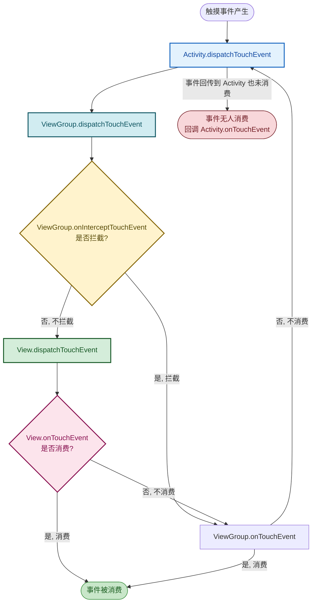

# 4.5 事件处理：点击事件、触摸事件

> [!abstract] 本节概述
> 界面不仅要"显示"，还要能"响应"用户的操作。Android 把用户的输入操作抽象为一系列 **事件（Event）**：点击、长按、触摸滑动等。本节介绍四类常用事件——点击事件、长按事件、触摸事件与事件分发机制。其中**事件分发机制**（dispatchTouchEvent → onInterceptTouchEvent → onTouchEvent）是理解列表嵌套滑动、自定义 View 内外层冲突的难点，也是本章理论深度最高的考点。

## 1. 事件类型概览

> [!definition] Android 常用事件类型
> 
> | 事件类型 | 触发条件 | 监听接口 / 回调方法 |
> | -------- | -------- | ------------------ |
> | 点击事件 | 用户按下并快速抬起（在某 View 上） | `View.OnClickListener` → `onClick(View v)` |
> | 长按事件 | 按住超过阈值（约 500ms）未抬起 | `View.OnLongClickListener` → `onLongClick(View v)` |
> | 触摸事件 | 按下、移动、抬起等完整过程 | `View.OnTouchListener` → `onTouch(View v, MotionEvent e)` |
> | 按键事件 | 物理按键（返回键、音量键等） | `View.OnKeyListener` / Activity `onKeyDown` |
> | 焦点变化 | View 获取或失去焦点 | `View.OnFocusChangeListener` |

> [!note] 事件传递方向
> - **Activity → ViewGroup → View**：事件由顶层 Activity 接收，沿 View 树自顶向下分发，直到某个 View 消费。
> - **消费向上回传**：底层 View 处理后通过返回值告知上层"已消费"，上层不再处理。

## 2. 点击事件

> [!definition] View.OnClickListener
> 点击事件是最常用的用户交互。绑定方式有两种：XML `android:onClick` 属性、Java `setOnClickListener`。

### 2.1 Java 绑定（推荐）

```java
Button btnLogin = findViewById(R.id.btn_login);
btnLogin.setOnClickListener(new View.OnClickListener() {
    @Override
    public void onClick(View v) {
        // v 即被点击的 View
        Toast.makeText(v.getContext(), "已点击", Toast.LENGTH_SHORT).show();
    }
});

// Lambda 简写（Java 8+）
btnLogin.setOnClickListener(v ->
    Toast.makeText(this, "已点击", Toast.LENGTH_SHORT).show());
```

### 2.2 XML onClick 属性绑定

```xml
<Button
    android:layout_width="wrap_content"
    android:layout_height="wrap_content"
    android:text="登录"
    android:onClick="onLoginClick" />
```

```java
// 方法签名必须为 public void xxx(View)
public void onLoginClick(View view) {
    Toast.makeText(this, "XML 绑定点击", Toast.LENGTH_SHORT).show();
}
```

### 2.3 多个按钮共用一个监听器

```java
public class MainActivity extends AppCompatActivity
        implements View.OnClickListener {

    @Override
    protected void onCreate(Bundle savedInstanceState) {
        super.onCreate(savedInstanceState);
        setContentView(R.layout.activity_main);
        findViewById(R.id.btn_login).setOnClickListener(this);
        findViewById(R.id.btn_register).setOnClickListener(this);
        findViewById(R.id.btn_forget).setOnClickListener(this);
    }

    @Override
    public void onClick(View v) {
        int id = v.getId();
        if (id == R.id.btn_login) {
            // 登录逻辑
        } else if (id == R.id.btn_register) {
            // 注册逻辑
        } else if (id == R.id.btn_forget) {
            // 忘记密码
        }
    }
}
```

> [!tip] 共用监听器的优势
> 多个按钮共用一个 `OnClickListener` 实现，避免为每个按钮写一个匿名内部类（每new一个监听器都占一份内存）。适合按钮较多、且需要根据 ID 分流的场景。

## 3. 长按事件

> [!definition] OnLongClickListener
> 长按事件在用户按住控件超过阈值（约 500ms）未抬起时触发。`onLongClick` 返回 `true` 表示消费该事件，**消费后不会再触发 onClick**；返回 `false` 表示不消费，松手后仍会触发 onClick。

```java
Button btnLong = findViewById(R.id.btn_long);
btnLong.setOnLongClickListener(v -> {
    Toast.makeText(this, "长按触发", Toast.LENGTH_SHORT).show();
    return true;   // 返回 true：消费事件，不再触发 onClick
    // 返回 false：长按后松手仍会触发 onClick
});

// 同时设置点击和长按
btnLong.setOnClickListener(v ->
    Toast.makeText(this, "短按点击", Toast.LENGTH_SHORT).show());
```

> [!note] 长按返回值对点击事件的影响
> - `onLongClick` 返回 `true`：长按消费后，松手不会触发 `onClick`。
> - `onLongClick` 返回 `false`：长按不消费，松手时**仍会**触发 `onClick`。
> - 这是常见面试题与易错点。

## 4. 触摸事件

> [!definition] View.OnTouchListener 与 MotionEvent
> 触摸事件比点击事件更底层，能感知完整触摸过程：按下、移动、抬起、取消。通过 `MotionEvent` 对象获取坐标、时间、动作类型。

### 4.1 MotionEvent 常量

| 常量 | 含义 |
| ---- | ---- |
| `MotionEvent.ACTION_DOWN` | 手指按下 |
| `MotionEvent.ACTION_MOVE` | 手指移动 |
| `MotionEvent.ACTION_UP` | 手指抬起 |
| `MotionEvent.ACTION_CANCEL` | 事件被取消（如被父容器拦截） |
| `MotionEvent.ACTION_POINTER_DOWN` | 第二个手指按下（多点触控） |

### 4.2 MotionEvent 常用方法

| 方法 | 作用 |
| ---- | ---- |
| `getAction()` | 获取动作类型（含 pointer index） |
| `getActionMasked()` | 获取动作类型（不含 pointer index，多点触控用） |
| `getX()` / `getY()` | 相对当前 View 左上角的坐标 |
| `getRawX()` / `getRawY()` | 相对屏幕左上角的坐标 |
| `getEventTime()` | 事件发生时间（毫秒） |
| `getDownTime()` | 按下时刻（毫秒） |

### 4.3 触摸事件示例

```java
View touchView = findViewById(R.id.view_touch);
touchView.setOnTouchListener((v, event) -> {
    float x = event.getX();      // 相对 View
    float y = event.getY();
    float rawX = event.getRawX(); // 相对屏幕
    float rawY = event.getRawY();
    int action = event.getActionMasked();
    switch (action) {
        case MotionEvent.ACTION_DOWN:
            Log.d("Touch", "按下: (" + x + ", " + y + ")");
            break;
        case MotionEvent.ACTION_MOVE:
            Log.d("Touch", "移动: (" + x + ", " + y + ")");
            break;
        case MotionEvent.ACTION_UP:
            Log.d("Touch", "抬起: (" + x + ", " + y + ")");
            break;
        case MotionEvent.ACTION_CANCEL:
            Log.d("Touch", "取消");
            break;
    }
    return true;   // 返回 true 表示消费事件
});
```

> [!warning] onTouch 返回值的关键作用
> - `onTouch` 返回 `true`：表示**消费**该事件，后续 `onClick`、`onLongClick` 都不会触发。
> - `onTouch` 返回 `false`：表示不消费，事件继续传递给 View 的 `onTouchEvent`，由其判断是否触发点击/长按。
> - 因此 onTouch 是比 onClick 更底层的事件，能拦截点击。

## 5. 事件分发机制

> [!definition] 事件分发机制（必考难点）
> 当一个触摸事件产生时，它的传递顺序是：**Activity → 顶层 ViewGroup → 子 ViewGroup → 子 View**。三个核心方法控制事件的流向：
> 
> | 方法 | 所在对象 | 作用 |
> | ---- | -------- | ---- |
> | `dispatchTouchEvent(MotionEvent ev)` | Activity / ViewGroup / View | **分发**事件：决定事件交给自己处理还是向下分发 |
> | `onInterceptTouchEvent(MotionEvent ev)` | **仅 ViewGroup** | **拦截**事件：判断是否把事件拦截给自己处理，不传给子 View |
> | `onTouchEvent(MotionEvent event)` | Activity / ViewGroup / View | **处理**事件：消费触摸事件的具体逻辑 |

> [!note] 三个方法的拥有关系
> - **Activity**：有 `dispatchTouchEvent` 和 `onTouchEvent`，**没有** `onInterceptTouchEvent`（Activity 是顶层，无需拦截）。
> - **ViewGroup**：三个方法都有。
> - **View**：有 `dispatchTouchEvent` 和 `onTouchEvent`，**没有** `onInterceptTouchEvent`（View 是叶子节点，没有子 View 可拦截）。

### 5.1 事件分发流程图



### 5.2 分发流程要点

> [!definition] 分发流程详解
> 1. **Activity.dispatchTouchEvent** 接收事件，调用顶层 ViewGroup 的 dispatchTouchEvent。
> 2. **ViewGroup.dispatchTouchEvent** 调用 `onInterceptTouchEvent` 判断是否拦截：
>    - 返回 `true`：拦截，调用本 ViewGroup 的 `onTouchEvent` 处理。
>    - 返回 `false`：不拦截，把事件分发给命中（点击区域内）的子 View。
> 3. **子 View.dispatchTouchEvent** 调用 `onTouchListener.onTouch`（若设置了）：
>    - `onTouch` 返回 `true`：消费，事件结束。
>    - `onTouch` 返回 `false`：调 View 自身的 `onTouchEvent`，再判断是否触发 `onClick`/`onLongClick`。
> 4. **若子 View 不消费**：事件**回传**给父 ViewGroup 的 `onTouchEvent`，逐层向上回传，最终到 Activity 的 `onTouchEvent`。

> [!tip] 三个返回值的口诀
> - `dispatchTouchEvent` 返回 `true`：表示本层"消费"（自行处理或不传），事件不再向下传。
> - `onInterceptTouchEvent` 返回 `true`：拦截，不传给子 View，自己处理。
> - `onTouchEvent` 返回 `true`：消费事件；返回 `false`：不消费，回传给上层。

### 5.3 滑动冲突处理场景

> [!example] 典型滑动冲突
> - **外层 ViewPager + 内层 ListView**：左右滑切换页 vs 上下滑滚动列表。父容器拦截左右滑动、子 View 处理上下滑动，通过重写 `onInterceptTouchEvent` 按滑动方向判定。
> - **外层 ScrollView + 内层 RecyclerView**：都支持纵向滚动，需确定谁消费纵向滑动。
> - 解决思路：在父容器 `onInterceptTouchEvent` 中按 dx/dy 比较判定方向，决定是否拦截。

```java
// ViewPager 父容器按方向拦截示例
public class CustomViewPager extends ViewPager {
    private float downX, downY;

    @Override
    public boolean onInterceptTouchEvent(MotionEvent ev) {
        switch (ev.getActionMasked()) {
            case MotionEvent.ACTION_DOWN:
                downX = ev.getX();
                downY = ev.getY();
                break;
            case MotionEvent.ACTION_MOVE:
                float dx = Math.abs(ev.getX() - downX);
                float dy = Math.abs(ev.getY() - downY);
                if (dx > dy) {
                    return true;   // 横向滑动更明显, 父容器拦截
                }
                break;
        }
        return super.onInterceptTouchEvent(ev);
    }
}
```

## 6. 不同事件类型对比

> [!example] 事件类型对比表
> 
> | 维度 | 点击事件 onClick | 长按事件 onLongClick | 触摸事件 onTouch |
> | ---- | ---------------- | ------------------- | ---------------- |
> | 触发时机 | 按下并快速抬起 | 按住 ≥ 500ms | 按下/移动/抬起全过程 |
> | 监听接口 | OnClickListener | OnLongClickListener | OnTouchListener |
> | 回调方法 | `onClick(View)` | `onLongClick(View)` 返回 boolean | `onTouch(View, MotionEvent)` 返回 boolean |
> | 粒度 | 粗（只知点击） | 粗（只知长按） | 细（每个动作都有） |
> | 坐标信息 | 无 | 无 | 有（getX/getY/getRawX/getRawY） |
> | 拦截能力 | 不能拦截 onTouch | 不能拦截 onTouch | **能拦截** onClick/onLongClick（返回 true 时） |
> | 典型场景 | 按钮提交 | 弹出菜单、删除确认 | 滑动手势、拖拽、自定义反馈 |

## 7. 案例：自定义按钮触摸反馈

> [!example] 用触摸事件实现按压变色
> 需求：自定义一个 Button，按下时背景变深、抬起时恢复；同时仍保留点击事件响应。

```java
public class PressEffectButton extends androidx.appcompat.widget.AppCompatButton {

    private int normalColor  = Color.parseColor("#1976D2");
    private int pressedColor = Color.parseColor("#0D47A1");

    public PressEffectButton(Context context, AttributeSet attrs) {
        super(context, attrs);
        setBackgroundColor(normalColor);
        setTextColor(Color.WHITE);
    }

    // 方式一：重写 onTouchEvent
    @Override
    public boolean onTouchEvent(MotionEvent event) {
        switch (event.getActionMasked()) {
            case MotionEvent.ACTION_DOWN:
                setBackgroundColor(pressedColor);   // 按下变深
                break;
            case MotionEvent.ACTION_UP:
            case MotionEvent.ACTION_CANCEL:
                setBackgroundColor(normalColor);    // 抬起恢复
                break;
        }
        return super.onTouchEvent(event);  // 让父类继续处理, 保留 onClick
    }
}
```

```xml
<!-- 在布局中使用自定义按钮 -->
<com.example.app.widget.PressEffectButton
    android:id="@+id/btn_custom"
    android:layout_width="match_parent"
    android:layout_height="48dp"
    android:text="自定义按压按钮" />
```

```java
// Activity 中设置点击监听
PressEffectButton btn = findViewById(R.id.btn_custom);
btn.setOnClickListener(v ->
    Toast.makeText(this, "点击触发", Toast.LENGTH_SHORT).show());
```

> [!note] 案例要点
> - 重写 `onTouchEvent` 后调 `super.onTouchEvent(event)`，让父类继续触发 `onClick`，**保留点击事件**。
> - 若不调 super 直接返回 true，会消费事件导致 `onClick` 不触发。
> - 这是"消费 vs 透传"的典型应用：**消费视觉反馈，透传逻辑点击**。

## 8. 易错点与最佳实践

> [!warning] 常见易错点
> 1. **`onLongClick` 返回值错误**：返回 `false` 时松手会再触发 `onClick`，造成意外行为。
> 2. **`onTouch` 返回 `true` 后 `onClick` 不触发**：onTouch 优先级高于 onClick，返回 true 会消费整个事件序列。
> 3. **混淆 `onInterceptTouchEvent` 与 `onTouchEvent`**：前者是 ViewGroup 决定"是否拦截不传给子"，后者是"自己消费事件"。
> 4. **Activity 没有 `onInterceptTouchEvent`**：Activity 是顶层分发者，不需要拦截，只有 dispatch 和 onTouchEvent。
> 5. **滑动冲突不处理**：外层 ScrollView 嵌套 RecyclerView 时双方都想消费纵向滑动，需明确归属。
> 6. **在 `onClick` 中读取的 `v` 不是点击的子 View**：共用监听器时应用 `v.getId()` 区分，而不是直接强转。

> [!tip] 最佳实践
> - 简单点击用 `setOnClickListener`，复杂手势（拖拽、滑动）用 `OnTouchListener`。
> - 自定义复杂手势识别用 `GestureDetector`（识别单击、双击、长按、Fling 等）。
> - 列表嵌套滑动冲突优先用 `NestedScrollingChild` / `NestedScrollingParent` 机制（RecyclerView 已内置支持）。
> - 事件分发调试可在三个方法中加日志，观察事件流向。

## 章节导航

- 上级：[[MOC - 第4章|第4章 Android UI 界面开发]]
- 上一节：[[4.4 资源文件：图片、字符串、尺寸资源|4.4 资源文件]]
- 下一章：[[MOC - 第5章|第5章 数据持久化存储]]
- 习题：[[MOC - 第4章习题|第4章习题]]
