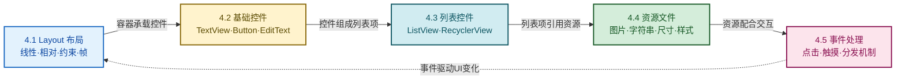

# MOC - 第4章 Android UI 界面开发

本章在第3章 Activity 的页面承载能力之上，进入"页面里画什么、怎么画、怎么响应用户操作"的层面。围绕布局组织、基础控件、列表控件、资源文件和事件处理五个主题，构成 Android UI 开发的完整基础闭环。

> [!info] 本章定位
> - **核心对象**：View/ViewGroup 体系、布局容器、常用控件、RecyclerView 列表、资源文件、事件分发
> - **关键能力**：用 XML 描述界面结构、用 Adapter 驱动列表、用资源文件解耦内容、用事件回调响应用户交互
> - **承前启后**：在第3章 Activity 的基础上填充界面内容，为第5章数据持久化提供数据展示载体，为第6章网络通信结果渲染做准备
> - **考试权重**：RecyclerView 适配器实现与布局对比是高频考点，事件分发机制为难点

> [!abstract] 本章核心问题
> 1. Android 提供了哪些布局容器？它们各自适合组织什么样的界面结构？登录页、列表页、卡片流应当分别选哪种布局？
> 2. TextView、Button、EditText、ImageView 等基础控件的关键属性有哪些？如何在 XML 中配置、在 Java 中操作？
> 3. ListView 为什么效率低？RecyclerView 通过哪些组件解决这些问题？如何编写一个完整的 RecyclerView 适配器？
> 4. 图片、字符串、尺寸、颜色、样式和主题为什么要放到 `res/` 目录？如何利用资源文件实现多语言、多屏幕适配？
> 5. 用户点击、触摸、长按屏幕时，事件是如何从顶层的 ViewGroup 一层层分发到具体 View 的？在哪个环节消费事件最合适？

## 本章学习路线

## 知识点导航

| 序号 | 知识点 | 核心内容 | 重点等级 |
| ---- | ------ | -------- | -------- |
| 4.1 | [[4.1 Layout 布局：线性、相对、约束布局\|Layout 布局]] | LinearLayout 方向与权重、RelativeLayout 定位、ConstraintLayout 约束/Chain/Guideline、FrameLayout 叠加 | ⭐⭐⭐⭐ |
| 4.2 | [[4.2 基础控件：TextView、Button、EditText\|基础控件]] | TextView/Button/EditText/ImageView 属性与操作、CheckBox/RadioButton/Switch/ProgressBar | ⭐⭐⭐ |
| 4.3 | [[4.3 列表控件 ListView、RecyclerView\|列表控件]] | ListView 与 Adapter 模式、RecyclerView 四大组件、三种 LayoutManager、适配器实现 | ⭐⭐⭐⭐⭐ |
| 4.4 | [[4.4 资源文件：图片、字符串、尺寸资源\|资源文件]] | drawable/mipmap、strings.xml、dimens.xml、colors.xml、styles/themes、dp/sp/px | ⭐⭐⭐ |
| 4.5 | [[4.5 事件处理：点击事件、触摸事件\|事件处理]] | OnClickListener、OnTouchListener、MotionEvent、事件分发三方法、OnLongClickListener | ⭐⭐⭐⭐ |

## 核心考点速览

> [!warning] 高频考点（8 点）
> 1. **四种布局的特点与选型**：LinearLayout/RelativeLayout/ConstraintLayout/FrameLayout 的差异与适用场景（**必考**）
> 2. **LinearLayout 的 orientation 与 layout_weight**：权重计算公式与按比例分配空间的写法
> 3. **RecyclerView 四大核心组件**：Adapter/ViewHolder/LayoutManager/ItemDecoration 的职责分工
> 4. **RecyclerView 适配器实现**：`onCreateViewHolder`/`onBindViewHolder`/`getItemCount` 三方法（**重点代码题**）
> 5. **三种 LayoutManager**：LinearLayoutManager/GridLayoutManager/StaggeredGridLayoutManager 的差异
> 6. **ListView vs RecyclerView 对比**：复用机制、多样化 Item、动画、横向滚动支持
> 7. **资源文件体系**：drawable/mipmap/values 的职责，dp/sp/px 区别，多语言适配
> 8. **事件分发机制**：`dispatchTouchEvent → onInterceptTouchEvent → onTouchEvent` 的调用顺序与消费判定

## 关键概念速查

### 四种布局对比速查

| 布局 | 定位方式 | 性能 | 典型场景 |
| ---- | -------- | ---- | -------- |
| LinearLayout | 单方向排列 + 权重 | 中 | 简单线性结构、表单行 |
| RelativeLayout | 相对父容器/兄弟 | 中 | 控件间有相对关系 |
| ConstraintLayout | 约束关系 + Bias + Chain | 高（减少嵌套） | 复杂界面、扁平化首选 |
| FrameLayout | 后入叠加 | 高 | Fragment 容器、图层叠加 |

### dp / sp / px 速查

| 单位 | 含义 | 是否随密度缩放 | 典型用途 |
| ---- | ---- | -------------- | -------- |
| px | 像素 | 否 | 几乎不用 |
| dp / dip | 密度无关像素 | 是 | 控件尺寸、间距 |
| sp | 缩放无关像素 | 是 + 跟随系统字号 | 文字大小 |

### RecyclerView 三种 LayoutManager 速查

| LayoutManager | 排列方式 | 典型场景 |
| ------------- | -------- | -------- |
| LinearLayoutManager | 纵向/横向线性列表 | 通讯录、消息列表 |
| GridLayoutManager | 网格 | 相册、应用商店 |
| StaggeredGridLayoutManager | 瀑布流（不等高） | 电商商品流、Pinterest |

## 章节导航

- 上级：[[MOC - 移动互联网开发技术|移动互联网开发技术总览]]
- 上一章：[[MOC - 第3章|第3章 Activity 与页面交互]]
- 下一章：[[MOC - 第5章|第5章 数据持久化存储]]
- 习题：[[MOC - 第4章习题|第4章习题]]
