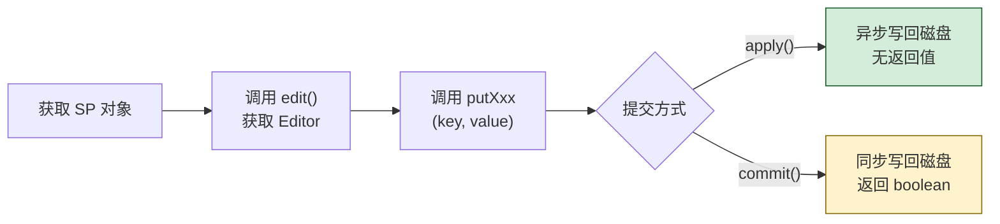

# 5.1 SharedPreferences 轻量存储

> [!abstract] 本节概述
> 应用在运行过程中常会产生一些"轻量、零散、需要跨启动保留"的数据：用户是否已登录、夜间模式开关、上次播放进度、是否首次进入引导页等。这些数据量小、结构简单（一个键对应一个值），用数据库显得过重、用文件又得自己解析。Android 提供了 **SharedPreferences（简称 SP）** 这套轻量级键值对存储方案：底层以 XML 文件保存，提供 `putXxx/getXxx` 风格 API，自动持久化到内部存储，无需权限。本节解决"如何用最简方式保存少量配置类数据"的问题。

## 1. SharedPreferences 的特点

> [!definition] SharedPreferences 核心特征
> SharedPreferences 是 Android 提供的轻量级持久化方案，具有以下特征：
> - **键值对模型**：以 `String` 键存取 `int/long/float/boolean/String/Set<String>` 六种基本类型值
> - **XML 文件存储**：底层以 XML 格式保存到 `/data/data/<包名>/shared_prefs/<name>.xml`
> - **轻量单进程**：适合小数据量（建议 < 1 MB），不适合存放大文本或列表
> - **应用私有**：默认仅本应用可访问，无需申请存储权限
> - **随应用卸载删除**：保存在内部存储沙箱中，卸载即清
> - **全量读写**：每次加载会把整个 XML 读入内存，每次提交会全量重写文件

> [!warning] 不适合用 SP 的场景
> - 存放大段文本或图片字节：会导致 XML 膨胀、内存占用飙升
> - 高频写入：每次 `apply/commit` 都是全量重写，频繁写会引发卡顿与 I/O 抖动
> - 跨进程共享：SP 不是进程安全的，多进程并发写会丢数据，应改用 `ContentProvider` 或 `DataStore`
> - 结构化数据：需要按条件查询的表状数据应使用 SQLite/Room

## 2. 获取 SharedPreferences 对象

Android 提供三种获取 SP 对象的方式，区别在于"文件名由谁指定"与"作用域"：

| 方法 | 文件名 | 作用域 | 典型用途 |
| ---- | ------ | ------ | -------- |
| `getSharedPreferences(name, mode)` | 自定义 `name` | 同一应用内多文件共享 | 多个配置文件（如 `user_prefs`、`app_config`） |
| `getPreferences(mode)` | 以当前 Activity 类名为文件名 | 当前 Activity 私有 | 单个页面专属的临时状态 |
| `PreferenceManager.getDefaultSharedPreferences(context)` | `包名_preferences` | 应用默认配置文件 | 配合 `PreferenceFragment` 设置页 |

> [!info] mode 参数说明
> 自 Android 7.0（API 24）起，`MODE_PRIVATE` 是唯一推荐的模式（仅本应用可读写）。历史上曾存在 `MODE_WORLD_READABLE` 和 `MODE_WORLD_WRITEABLE` 用于跨应用共享，但因安全风险已废弃，调用会抛 `SecurityException`。跨应用共享数据应改用 `ContentProvider`。

```java
// 方式 1：指定文件名（最常用）
SharedPreferences sp = getSharedPreferences("user_prefs", MODE_PRIVATE);

// 方式 2：使用 Activity 类名作为文件名
SharedPreferences sp2 = getPreferences(MODE_PRIVATE);

// 方式 3：默认配置文件（配合设置页）
SharedPreferences sp3 = PreferenceManager.getDefaultSharedPreferences(this);
```

## 3. 写入数据：edit → putXxx → apply/commit

SP 对象本身是**只读**的，写入必须通过 `SharedPreferences.Editor` 接口。完整的写入三步：



```java
SharedPreferences sp = getSharedPreferences("user_prefs", MODE_PRIVATE);
SharedPreferences.Editor editor = sp.edit();

// 写入六种基本类型
editor.putString("username", "alice");
editor.putInt("age", 20);
editor.putLong("login_time", System.currentTimeMillis());
editor.putFloat("score", 95.5f);
editor.putBoolean("is_login", true);
Set<String> tags = new HashSet<>(Arrays.asList("vip", "android"));
editor.putStringSet("tags", tags);

// 一次性提交所有修改
editor.apply();   // 推荐：异步写入，不阻塞 UI 线程
```

> [!tip] 链式调用
> `putXxx` 方法返回 `Editor` 对象本身，可链式书写：
> ```java
> sp.edit()
>   .putString("username", "alice")
>   .putBoolean("is_login", true)
>   .apply();
> ```

### 3.1 apply() vs commit()

| 对比维度 | `apply()` | `commit()` |
| -------- | --------- | ---------- |
| 同步/异步 | 异步写入磁盘（先内存后磁盘） | 同步写入磁盘（阻塞当前线程） |
| 返回值 | 无（`void`） | `boolean`，表示是否成功 |
| 失败通知 | 无法感知失败 | 可通过返回值判断 |
| 主线程调用 | 安全，不会 ANR | 不推荐，I/O 阻塞可能引发 ANR |
| 推荐场景 | 绝大多数日常配置写入 | 需要确认写入成功后再做后续操作 |

> [!warning] apply 的隐藏坑
> `apply` 会先把修改写入内存，然后异步刷盘。如果在 `apply` 之后立即调用 `getXxx`，能读到新值（内存已更新）；但如果应用在刷盘前被系统杀掉，这次修改可能丢失。**关键数据需立即落盘时用 `commit`，或先 `commit` 一次再 `apply` 后续修改。**

### 3.2 删除数据

```java
// 删除单个键
editor.remove("username");
// 清空全部
editor.clear();
editor.apply();
```

## 4. 读取数据：getXxx(key, default)

读取直接通过 `SharedPreferences` 对象完成，每个 `getXxx` 必须提供**默认值**——当 key 不存在时返回该默认值，避免类型错乱。

```java
SharedPreferences sp = getSharedPreferences("user_prefs", MODE_PRIVATE);

String username = sp.getString("username", "");           // 默认空串
int age         = sp.getInt("age", 0);                    // 默认 0
boolean isLogin = sp.getBoolean("is_login", false);       // 默认 false
long loginTime  = sp.getLong("login_time", 0L);           // 默认 0L
float score     = sp.getFloat("score", 0f);               // 默认 0f
Set<String> tags = sp.getStringSet("tags", new HashSet<>());// 默认空集合

// 判断是否包含某个键
boolean hasKey = sp.contains("username");

// 遍历所有键（不常用）
Map<String, ?> all = sp.getAll();
for (Map.Entry<String, ?> e : all.entrySet()) {
    Log.d("SP", e.getKey() + " = " + e.getValue());
}
```

> [!note] 读取为何不阻塞
> SP 在首次 `getSharedPreferences` 时会一次性把整个 XML 读入内存并缓存为 `Map`，后续 `getXxx` 直接读内存，不涉及磁盘 I/O，因此速度极快。这也是"全量读写"机制的代价——首次加载有 I/O 开销。

## 5. 底层 XML 文件结构

写入完成后，可通过 Device File Explorer 查看 `/data/data/<包名>/shared_prefs/user_prefs.xml`：

```xml
<?xml version='1.0' encoding='utf-8' standalone='yes' ?>
<map>
    <string name="username">alice</string>
    <int name="age" value="20" />
    <long name="login_time" value="1700000000000" />
    <float name="score" value="95.5" />
    <boolean name="is_login" value="true" />
    <set name="tags">
        <string>vip</string>
        <string>android</string>
    </set>
</map>
```

## 6. 案例：登录状态保存与读取

> [!example] 登录状态持久化
> 需求：用户登录成功后保存账号与登录时间戳，下次启动应用时若 `is_login=true` 则直接跳过登录页进入主页；用户主动退出时清空登录状态。

```java
public class LoginManager {
    private static final String SP_NAME = "user_prefs";
    private static final String KEY_IS_LOGIN   = "is_login";
    private static final String KEY_USERNAME   = "username";
    private static final String KEY_LOGIN_TIME = "login_time";

    private final SharedPreferences sp;

    public LoginManager(Context ctx) {
        sp = ctx.getSharedPreferences(SP_NAME, Context.MODE_PRIVATE);
    }

    /** 登录成功后调用 */
    public void saveLogin(String username) {
        sp.edit()
          .putBoolean(KEY_IS_LOGIN, true)
          .putString(KEY_USERNAME, username)
          .putLong(KEY_LOGIN_TIME, System.currentTimeMillis())
          .apply();
    }

    /** 判断是否已登录 */
    public boolean isLoggedIn() {
        return sp.getBoolean(KEY_IS_LOGIN, false);
    }

    /** 获取当前登录用户名 */
    public String getUsername() {
        return sp.getString(KEY_USERNAME, "");
    }

    /** 退出登录时调用 */
    public void logout() {
        // 只清登录相关键，避免误删其他配置
        sp.edit()
          .putBoolean(KEY_IS_LOGIN, false)
          .remove(KEY_USERNAME)
          .remove(KEY_LOGIN_TIME)
          .apply();
    }
}
```

在 `SplashActivity` 启动时根据登录状态决定跳转目标：

```java
public class SplashActivity extends AppCompatActivity {
    @Override
    protected void onCreate(Bundle savedInstanceState) {
        super.onCreate(savedInstanceState);
        LoginManager lm = new LoginManager(this);
        Intent target = lm.isLoggedIn()
            ? new Intent(this, MainActivity.class)     // 已登录→主页
            : new Intent(this, LoginActivity.class);   // 未登录→登录页
        startActivity(target);
        finish();
    }
}
```

## 7. 案例：用户偏好设置存储

> [!example] 设置页"夜间模式 + 字体大小"持久化
> ```java
> public class SettingsManager {
>     private static final String KEY_NIGHT_MODE  = "night_mode";
>     private static final String KEY_FONT_SIZE   = "font_size_sp";
>     private static final String KEY_NOTIFY_ON   = "notify_on";
> 
>     private final SharedPreferences sp;
> 
>     public SettingsManager(Context ctx) {
>         sp = PreferenceManager.getDefaultSharedPreferences(ctx);
>     }
> 
>     public void setNightMode(boolean on) {
>         sp.edit().putBoolean(KEY_NIGHT_MODE, on).apply();
>     }
>     public boolean isNightMode() {
>         return sp.getBoolean(KEY_NIGHT_MODE, false);
>     }
> 
>     public void setFontSize(int sp) {
>         sp.edit().putInt(KEY_FONT_SIZE, sp).apply();
>     }
>     public int getFontSize() {
>         return sp.getInt(KEY_FONT_SIZE, 14);
>     }
> 
>     public void setNotifyOn(boolean on) {
>         sp.edit().putBoolean(KEY_NOTIFY_ON, on).apply();
>     }
>     public boolean isNotifyOn() {
>         return sp.getBoolean(KEY_NOTIFY_ON, true);
>     }
> }
> ```
> 在设置页 Switch 切换时调用 `setNightMode(true)`，下次启动在 `Application.onCreate` 中读取并应用主题。

## 8. 易错点与最佳实践

> [!warning] 常见易错点
> 1. **忘记调用 `apply()/commit()`**：`putXxx` 只是修改 Editor 内存，不提交不会落盘。
> 2. **在主线程调用 `commit`**：同步 I/O 在大量数据时可能 ANR，应改用 `apply`。
> 3. **`getXxx` 不传默认值**：编译期会报错，必须显式指定默认值。
> 4. **存大对象**：把 List/Bitmap 序列化后塞进 SP 会导致 XML 膨胀，应改用文件或数据库。
> 5. **跨进程共享 SP**：SP 不是进程安全的，多进程并发写会丢数据，应改用 `ContentProvider` 或 `DataStore`。
> 6. **依赖 `getAll` 顺序**：返回的 `Map` 不保证遍历顺序，不要按顺序取值。

> [!tip] 最佳实践
> - **封装 Manager**：把 SP 操作封装到 `LoginManager`/`SettingsManager` 等类中，统一管理键名，避免散落各处。
> - **键名常量化**：所有 key 用 `private static final String` 常量，避免拼写错误。
> - **优先 `apply`**：日常配置写入用 `apply`，仅关键数据需要确认成功时用 `commit`。
> - **不要存密码明文**：登录凭据应使用 `EncryptedSharedPreferences`（Jetpack Security）加密存储。

## 章节导航

- 上级：[[MOC - 第5章|第5章 数据持久化存储]]
- 上一节：本章首节
- 下一节：[[5.2 文件读写（内部存储、外部存储）|5.2 文件读写]]
- 习题：[[MOC - 第5章习题|第5章习题]]
