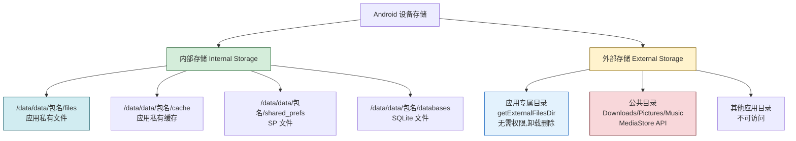
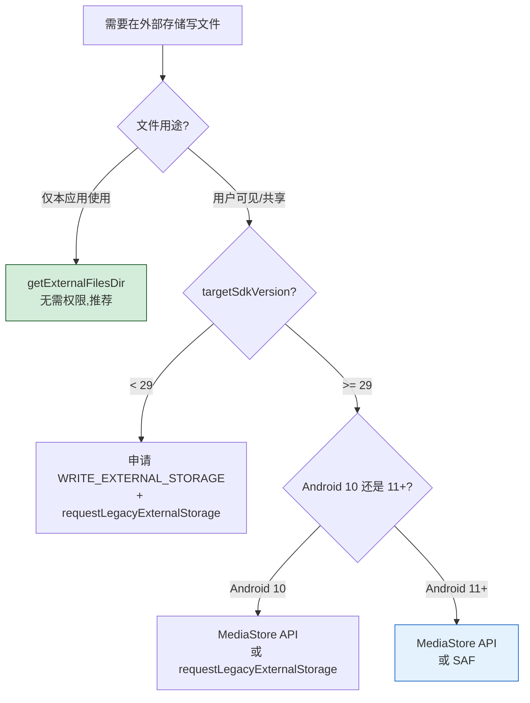

# 5.2 文件读写（内部存储、外部存储）

> [!abstract] 本节概述
> SharedPreferences 只能存简单键值对，遇到非结构化字节流（日志、缓存、下载的图片、用户文档）就无能为力。Android 沿用 Linux 的文件系统抽象，把存储划分为**内部存储**（应用沙箱，私有、免权限）与**外部存储**（公共目录，需权限、用户可见）两类。自 Android 10 起，Google 进一步引入 **Scoped Storage（分区存储）** 限制应用对外部存储的访问范围，保护用户隐私。本节解决"应用私有文件与公共文件分别怎么读写、如何应对 Scoped Storage 限制"的问题。

## 1. Android 存储架构总览



> [!note] 内部 vs 外部的本质
> "内部/外部"是历史命名，**不是**物理位置：
> - 早期外部存储指 SD 卡，内部存储指机身内置存储
> - 现代设备普遍内置 eMMC/UFS，外部存储实际是机身存储中划分出的共享分区
> - 判断依据是"是否应用私有 + 是否需权限"，而非"是否可拔插"

## 2. 内部存储：应用私有空间

> [!definition] 内部存储特性
> - **位置**：`/data/data/<包名>/files/`、`/data/data/<包名>/cache/`
> - **私有性**：仅本应用可读写（root 设备除外），无需任何权限
> - **生命周期**：随应用卸载自动删除
> - **容量**：受系统内部存储空间限制，不建议存放 GB 级大文件
> - **可见性**：用户通过文件管理器默认看不到（除非 root）

### 2.1 文件读写 API

| 操作 | 方法 | 说明 |
| ---- | ---- | ---- |
| 写文件 | `openFileOutput(name, mode)` | 返回 `FileOutputStream`，写到 `files/` |
| 读文件 | `openFileInput(name)` | 返回 `FileInputStream`，从 `files/` 读 |
| 列文件 | `fileList()` | 返回 `files/` 下所有文件名 |
| 删文件 | `deleteFile(name)` | 删除 `files/` 下指定文件 |
| 路径 | `getFilesDir()` | 返回 `files/` 目录 `File` 对象 |
| 缓存目录 | `getCacheDir()` | 返回 `cache/` 目录 `File` 对象 |

> [!info] mode 参数
> `openFileOutput` 的 mode 仅支持 `MODE_PRIVATE`（覆盖原内容）。`MODE_APPEND` 表示追加写入。`MODE_WORLD_READABLE/WRITEABLE` 已废弃。

### 2.2 代码示例：内部存储读写

```java
public class InternalFileUtil {

    /** 把字符串写入内部存储文件（覆盖） */
    public static void write(Context ctx, String filename, String content) {
        try (FileOutputStream fos = ctx.openFileOutput(filename, Context.MODE_PRIVATE)) {
            fos.write(content.getBytes(StandardCharsets.UTF_8));
        } catch (IOException e) {
            Log.e("InternalFile", "write fail", e);
        }
    }

    /** 从内部存储文件读取字符串 */
    public static String read(Context ctx, String filename) {
        try (FileInputStream fis = ctx.openFileInput(filename);
             ByteArrayOutputStream baos = new ByteArrayOutputStream()) {
            byte[] buf = new byte[1024];
            int len;
            while ((len = fis.read(buf)) != -1) {
                baos.write(buf, 0, len);
            }
            return baos.toString(StandardCharsets.UTF_8.name());
        } catch (IOException e) {
            Log.e("InternalFile", "read fail", e);
            return "";
        }
    }

    /** 追加写入日志 */
    public static void append(Context ctx, String filename, String line) {
        try (FileOutputStream fos = ctx.openFileOutput(filename, Context.MODE_APPEND)) {
            fos.write((line + "\n").getBytes(StandardCharsets.UTF_8));
        } catch (IOException e) {
            Log.e("InternalFile", "append fail", e);
        }
    }
}
```

调用示例：

```java
InternalFileUtil.write(this, "note.txt", "hello world");
String text = InternalFileUtil.read(this, "note.txt");
InternalFileUtil.append(this, "app.log", "2026-08-03 用户点击登录按钮");
```

### 2.3 缓存目录使用

缓存目录 `getCacheDir()` 用于存放可被系统在低内存时清除的临时文件：

```java
File cacheFile = new File(getCacheDir(), "thumb_tmp.jpg");
// 写入缓存文件...
// 系统在磁盘空间不足时可能自动清除 cache/, 业务需做好恢复
```

> [!tip] 缓存目录管理
> 系统不会主动告知缓存被清除，应用应在使用前判断文件是否存在；自身也应定期清理过期缓存（如使用 `LruCache` 或在 `onTrimMemory` 中处理）。

## 3. 外部存储：公共目录与权限

> [!definition] 外部存储特性
> - **位置**：`/storage/emulated/0/`（即用户看到的"内部存储"根目录）
> - **可见性**：用户与其他应用可见，可通过 USB 在电脑上访问
> - **生命周期**：应用卸载**不会**删除公共目录下的文件（应用专属目录除外）
> - **容量**：通常几 GB 到几百 GB，适合大文件
> - **权限**：访问公共目录需要存储权限（Android 10+ 受 Scoped Storage 限制）

### 3.1 外部存储的两种角色

| 角色 | 路径获取方式 | 是否需权限 | 卸载是否删除 |
| ---- | ------------ | ---------- | ------------ |
| 应用专属目录 | `getExternalFilesDir(type)` | 否（API 19+） | 是 |
| 公共共享目录 | `MediaStore` API / `Environment.DIRECTORY_*` | 是（部分需运行时申请） | 否 |

> [!note] 应用专属目录的便利
> `getExternalFilesDir(null)` 返回 `/storage/emulated/0/Android/data/<包名>/files/`，**无需任何权限**即可读写，且卸载时自动清理。这是存放应用产出大文件（如缓存图片、下载文件）的首选位置。

### 3.2 旧式 API（已废弃但常见于老代码）

```java
// 已废弃（API 29+）：返回外部存储根目录 /storage/emulated/0/
@Deprecated
File root = Environment.getExternalStorageDirectory();

// 检查外部存储是否挂载
String state = Environment.getExternalStorageState();
if (Environment.MEDIA_MOUNTED.equals(state)) {
    // 可读写
}
```

> [!warning] 旧 API 的局限
> `getExternalStorageDirectory()` 在 Android 10+ 上即使申请了权限也**无法直接访问**公共目录，必须改用 `MediaStore` 或 `getExternalFilesDir`。直接 `new File(老路径)` 写文件会抛 `FileNotFoundException`。

### 3.3 MediaStore API（Android 10+ 推荐）

MediaStore 把公共目录抽象为数据库表，通过 `ContentResolver` 插入记录获得 `Uri`，再通过 `openOutputStream` 写入：

```java
public Uri saveImageToPictures(Context ctx, Bitmap bmp, String displayName) {
    ContentValues values = new ContentValues();
    values.put(MediaStore.Images.Media.DISPLAY_NAME, displayName);
    values.put(MediaStore.Images.Media.MIME_TYPE, "image/jpeg");
    if (Build.VERSION.SDK_INT >= Build.VERSION_CODES.Q) {
        // Android 10+ 必须指定 RELATIVE_PATH
        values.put(MediaStore.Images.Media.RELATIVE_PATH, Environment.DIRECTORY_PICTURES + "/MyApp");
        values.put(MediaStore.Images.Media.IS_PENDING, 1);
    }
    ContentResolver resolver = ctx.getContentResolver();
    Uri uri = resolver.insert(MediaStore.Images.Media.EXTERNAL_CONTENT_URI, values);
    if (uri == null) return null;

    try (OutputStream os = resolver.openOutputStream(uri)) {
        bmp.compress(Bitmap.CompressFormat.JPEG, 90, os);
    } catch (IOException e) {
        Log.e("MediaStore", "write fail", e);
        return null;
    }

    if (Build.VERSION.SDK_INT >= Build.VERSION_CODES.Q) {
        values.clear();
        values.put(MediaStore.Images.Media.IS_PENDING, 0);
        resolver.update(uri, values, null, null);
    }
    return uri;
}
```

## 4. Scoped Storage 分区存储

> [!definition] Scoped Storage 核心规则
> Android 10（API 29）引入，Android 11 起强制执行：
> - 应用只能**自由读写**自己的应用专属目录（`getExternalFilesDir`），无需权限
> - 访问**公共目录**（Pictures/Music/Movies/Downloads）必须通过 `MediaStore` 或 SAF（Storage Access Framework）
> - 应用**无法直接 `File` 路径访问**其他应用的专属目录或公共目录
> - 通过 `requestLegacyExternalStorage=true` 可在 Android 10 临时兼容旧 API（Android 11+ 失效）

### 4.1 Scoped Storage 适配策略



### 4.2 AndroidManifest 配置

```xml
<manifest xmlns:android="http://schemas.android.com/apk/res/android"
    package="com.example.app">

    <!-- 外部存储读写权限 -->
    <uses-permission android:name="android.permission.READ_EXTERNAL_STORAGE"
        android:maxSdkVersion="32" />
    <uses-permission android:name="android.permission.WRITE_EXTERNAL_STORAGE"
        android:maxSdkVersion="29" />

    <!-- Android 11+ 大范围访问（需 Google Play 审核） -->
    <uses-permission android:name="android.permission.MANAGE_EXTERNAL_STORAGE" />

    <application
        android:requestLegacyExternalStorage="true"
        ... >
        ...
    </application>
</manifest>
```

> [!warning] MANAGE_EXTERNAL_STORAGE 风险
> 该权限允许应用访问整个外部存储，Google Play 对其审核极严，仅文件管理器、备份工具等少数品类可申请。普通应用应避免使用，改用 MediaStore + 应用专属目录。

## 5. 内部存储 vs 外部存储对比

| 维度 | 内部存储 | 外部存储（应用专属目录） | 外部存储（公共目录） |
| ---- | -------- | ---------------------- | -------------------- |
| 物理位置 | `/data/data/包名/` | `/storage/emulated/0/Android/data/包名/` | `/storage/emulated/0/Pictures/` 等 |
| 是否需权限 | 否 | 否 | 是（Android 10+ 受限） |
| 用户可见性 | 不可见（除非 root） | 默认不可见 | 可见 |
| 卸载是否删除 | 是 | 是 | 否 |
| 容量 | 较小 | 较大 | 较大 |
| 典型用途 | 配置、缓存、数据库 | 应用产出大文件 | 用户文档、媒体 |
| API | `openFileOutput/Input` | `getExternalFilesDir` | `MediaStore` |

## 6. 代码示例：外部存储应用专属目录读写

```java
public class ExternalFileUtil {

    /** 写入外部存储应用专属目录 */
    public static File writeExternal(Context ctx, String filename, String content) {
        File dir = ctx.getExternalFilesDir(null);  // /Android/data/包名/files/
        if (dir == null) return null;              // 外部存储未挂载
        File file = new File(dir, filename);
        try (FileOutputStream fos = new FileOutputStream(file)) {
            fos.write(content.getBytes(StandardCharsets.UTF_8));
            return file;
        } catch (IOException e) {
            Log.e("ExternalFile", "write fail", e);
            return null;
        }
    }

    /** 写入到 Pictures/MyApp 公共目录（Android 10+ 用 MediaStore） */
    public static void writeToPictures(Context ctx, Bitmap bmp, String name) {
        if (Build.VERSION.SDK_INT >= Build.VERSION_CODES.Q) {
            saveImageViaMediaStore(ctx, bmp, name);
        } else {
            // Android 9 及以下:直接 File 写入(需 WRITE_EXTERNAL_STORAGE 权限)
            File dir = new File(Environment.getExternalStoragePublicDirectory(
                Environment.DIRECTORY_PICTURES), "MyApp");
            if (!dir.exists()) dir.mkdirs();
            File file = new File(dir, name);
            try (FileOutputStream fos = new FileOutputStream(file)) {
                bmp.compress(Bitmap.CompressFormat.JPEG, 90, fos);
            } catch (IOException e) {
                Log.e("ExternalFile", "write Pictures fail", e);
            }
        }
    }

    private static void saveImageViaMediaStore(Context ctx, Bitmap bmp, String name) {
        // 见 3.3 节 MediaStore 实现
    }
}
```

## 7. 案例：APP 日志文件写入

> [!example] 应用运行日志写入内部存储
> 需求：把每次启动的时间、版本号、关键操作记录到 `app.log`，并提供"导出日志"按钮（写入外部存储应用专属目录）便于用户反馈问题。

```java
public class LogWriter {
    private static final String LOG_FILE = "app.log";
    private final Context ctx;

    public LogWriter(Context ctx) {
        this.ctx = ctx;
    }

    /** 写一条日志到内部存储 */
    public void log(String tag, String msg) {
        String line = String.format("%s [%s] %s\n",
            new SimpleDateFormat("yyyy-MM-dd HH:mm:ss", Locale.CHINA).format(new Date()),
            tag, msg);
        try (FileOutputStream fos = ctx.openFileOutput(LOG_FILE, Context.MODE_APPEND)) {
            fos.write(line.getBytes(StandardCharsets.UTF_8));
        } catch (IOException e) {
            Log.e("LogWriter", "append fail", e);
        }
    }

    /** 导出日志到外部存储应用专属目录,返回文件对象 */
    public File exportLog() {
        String content = readInternal();
        File dir = ctx.getExternalFilesDir(null);
        if (dir == null) return null;
        File exportFile = new File(dir, "app_export.log");
        try (FileOutputStream fos = new FileOutputStream(exportFile)) {
            fos.write(content.getBytes(StandardCharsets.UTF_8));
        } catch (IOException e) {
            Log.e("LogWriter", "export fail", e);
            return null;
        }
        return exportFile;
    }

    private String readInternal() {
        try (FileInputStream fis = ctx.openFileInput(LOG_FILE);
             ByteArrayOutputStream baos = new ByteArrayOutputStream()) {
            byte[] buf = new byte[2048];
            int len;
            while ((len = fis.read(buf)) != -1) {
                baos.write(buf, 0, len);
            }
            return baos.toString(StandardCharsets.UTF_8.name());
        } catch (IOException e) {
            return "";
        }
    }
}
```

## 8. 易错点与最佳实践

> [!warning] 常见易错点
> 1. **未检查外部存储挂载状态**：SD 卡未挂载时直接 `getExternalFilesDir` 返回 null，需判空。
> 2. **Android 10+ 仍用 `getExternalStorageDirectory`**：直接 `new File` 写公共目录会失败，应改用 MediaStore。
> 3. **未关闭流**：`FileInputStream/FileOutputStream` 不关闭会导致句柄泄漏，应使用 try-with-resources。
> 4. **主线程写大文件**：磁盘 I/O 阻塞 UI 线程可能 ANR，应放到工作线程。
> 5. **缓存目录与文件目录混淆**：`getCacheDir()` 下的文件可能被系统清除，重要数据不能放这里。
> 6. **未配置 `requestLegacyExternalStorage`**：targetSdk 29 应用若仍依赖旧 API，必须在 manifest 中显式开启。

> [!tip] 最佳实践
> - **优先用应用专属目录**：`getExternalFilesDir` 免权限且卸载清理，是大多数场景的最佳选择。
> - **使用 try-with-resources**：自动关闭流，避免泄漏。
> - **封装工具类**：把读写逻辑封装到 `InternalFileUtil`/`ExternalFileUtil`，业务层只调方法。
> - **大文件异步写**：使用线程池或协程处理 I/O，避免阻塞 UI。
> - **目录创建兜底**：写文件前 `dir.mkdirs()` 确保目录存在。

## 章节导航

- 上级：[[MOC - 第5章|第5章 数据持久化存储]]
- 上一节：[[5.1 SharedPreferences 轻量存储|5.1 SharedPreferences 轻量存储]]
- 下一节：[[5.3 SQLite 数据库基础操作|5.3 SQLite 数据库基础操作]]
- 习题：[[MOC - 第5章习题|第5章习题]]
