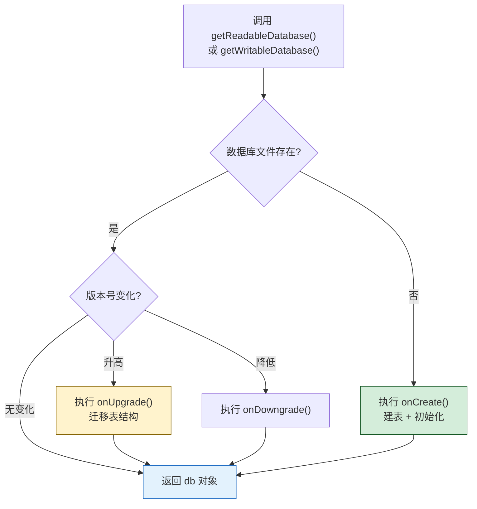
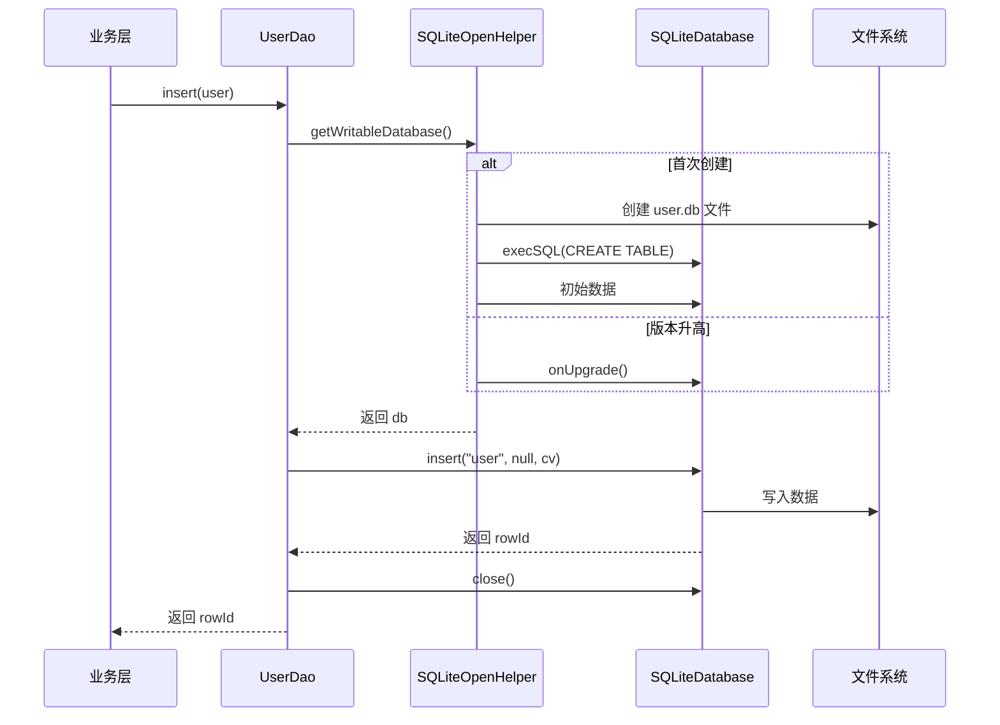

# 5.3 SQLite 数据库基础操作

> [!abstract] 本节概述
> 当数据具有**结构化特征**——多条同构记录、字段需条件过滤、要按字段排序或聚合——SharedPreferences 的 KV 模型与文件的字节流模型都不再合适。Android 内置了 **SQLite** 这个轻量级嵌入式关系数据库：单文件、零配置、支持 SQL 语法与事务，能像服务端数据库一样用表、行、列组织数据。本节解决"如何用 SQLite 在 Android 上实现结构化数据的创建、查询、更新、删除"的问题，重点掌握 `SQLiteOpenHelper` 管理建表与升级、`SQLiteDatabase` 执行 CRUD、`Cursor` 遍历结果集，以及用参数化查询防止 SQL 注入。

## 1. SQLite 简介

> [!definition] SQLite 核心特性
> - **嵌入式**：无需独立服务进程，数据库引擎以库形式链接进应用
> - **单文件**：整个数据库就是一个 `.db` 文件，便于备份与迁移
> - **零配置**：无需管理员、无用户体系、开箱即用
> - **支持 SQL**：兼容 SQL92 标准的大部分语法（SELECT/INSERT/UPDATE/DELETE/JOIN/事务）
> - **ACID 事务**：保证原子性、一致性、隔离性、持久性
> - **轻量**：库体积 < 500 KB，启动开销极低
> - **动态类型**：列类型是"亲和类型"，实际存储由值决定（INTEGER/TEXT/REAL/BLOB/NULL）

> [!info] SQLite vs MySQL/Oracle
> SQLite 不与业务进程通过网络通信，没有用户权限管理，适合"单应用本地数据"场景；MySQL/Oracle 是服务端数据库，多客户端并发访问，需要用户与权限体系。Android 应用使用 SQLite 主要出于"零部署、单文件、足够快"的考虑。

## 2. SQLiteOpenHelper：数据库管理帮助类

`SQLiteOpenHelper` 是 Android 提供的抽象类，封装了数据库创建与版本管理。开发者继承它并实现两个回调：

| 回调方法 | 触发时机 | 典型用途 |
| -------- | -------- | -------- |
| `onCreate(db)` | 首次创建数据库（文件不存在）时调用一次 | 执行 `CREATE TABLE` 建表、初始化数据 |
| `onUpgrade(db, old, new)` | 版本号升高时调用一次 | 执行 `ALTER TABLE`、数据迁移、新增表 |
| `onDowngrade(db, old, new)` | 版本号降低时调用 | 默认抛异常，可重写处理降级 |



> [!note] getReadableDatabase vs getWritableDatabase
> - `getWritableDatabase()`：返回可读可写的数据库对象；磁盘空间不足时可能失败抛异常
> - `getReadableDatabase()`：先尝试返回可写对象，失败则返回只读对象
> - 两者底层都会触发 `onCreate`/`onUpgrade`，实际开发中绝大多数场景用 `getWritableDatabase` 即可

### 2.1 定义 Helper 子类

```java
public class UserDBHelper extends SQLiteOpenHelper {

    // 数据库元信息
    private static final String DB_NAME    = "user.db";
    private static final int    DB_VERSION = 1;

    // 表与列名常量
    public static final String TABLE_USER     = "user";
    public static final String COL_ID         = "_id";
    public static final String COL_USERNAME   = "username";
    public static final String COL_AGE        = "age";
    public static final String COL_EMAIL      = "email";
    public static final String COL_CREATED_AT = "created_at";

    /** 建表 SQL */
    private static final String SQL_CREATE =
        "CREATE TABLE " + TABLE_USER + " (" +
            COL_ID         + " INTEGER PRIMARY KEY AUTOINCREMENT, " +
            COL_USERNAME   + " TEXT NOT NULL UNIQUE, " +
            COL_AGE        + " INTEGER DEFAULT 0, " +
            COL_EMAIL      + " TEXT, " +
            COL_CREATED_AT + " INTEGER DEFAULT (strftime('%s','now') * 1000)" +
        ")";

    public UserDBHelper(Context ctx) {
        // CursorFactory 传 null 使用默认;DB_NAME 在内部存储 databases/ 目录下
        super(ctx, DB_NAME, null, DB_VERSION);
    }

    @Override
    public void onCreate(SQLiteDatabase db) {
        db.execSQL(SQL_CREATE);
        // 可选:初始化一些默认数据
        db.execSQL("INSERT INTO " + TABLE_USER + "(" + COL_USERNAME + "," + COL_AGE + ") VALUES('admin', 30)");
    }

    @Override
    public void onUpgrade(SQLiteDatabase db, int oldVersion, int newVersion) {
        // 简单策略:删表重建(生产环境应根据 oldVersion 分步迁移)
        db.execSQL("DROP TABLE IF EXISTS " + TABLE_USER);
        onCreate(db);
    }
}
```

> [!warning] 主键命名约定
> 强烈建议主键命名为 `_id`（带下划线），因为 Android 的 `CursorAdapter`、`ListView`、`ContentProvider` 默认从 `_id` 字段取行 ID。若主键命名为 `id` 在与系统组件配合时会报错。

## 3. SQLiteDatabase 基本操作

获取 `SQLiteDatabase` 对象后，可通过两类 API 操作：

| 操作类型 | 方法 | 说明 |
| -------- | ---- | ---- |
| 执行非查询 SQL | `execSQL(sql)` / `execSQL(sql, bindArgs)` | 用于 CREATE/INSERT/UPDATE/DELETE，无返回值 |
| 执行查询 | `rawQuery(sql, selectionArgs)` | 返回 `Cursor` |
| 便捷插入 | `insert(table, nullColumnHack, values)` | 内部组装 INSERT |
| 便捷更新 | `update(table, values, whereClause, whereArgs)` | 内部组装 UPDATE |
| 便捷删除 | `delete(table, whereClause, whereArgs)` | 内部组装 DELETE |
| 便捷查询 | `query(...)` | 内部组装 SELECT，返回 `Cursor` |

### 3.1 增：insert

```java
public long insertUser(String username, int age, String email) {
    SQLiteDatabase db = helper.getWritableDatabase();
    ContentValues cv = new ContentValues();
    cv.put(UserDBHelper.COL_USERNAME, username);
    cv.put(UserDBHelper.COL_AGE, age);
    cv.put(UserDBHelper.COL_EMAIL, email);
    // 返回新行 _id;-1 表示失败
    long rowId = db.insert(UserDBHelper.TABLE_USER, null, cv);
    db.close();
    return rowId;
}
```

> [!note] nullColumnHack 的作用
> 当 `ContentValues` 为空（没 put 任何字段）时，SQL 无法生成合法 INSERT。`nullColumnHack` 指定一个允许写 NULL 的列名，让 SQL 变成 `INSERT INTO table (col) VALUES (NULL)`。日常开发传入 `null` 即可（只要 cv 非空）。

### 3.2 删：delete

```java
public int deleteUserById(long id) {
    SQLiteDatabase db = helper.getWritableDatabase();
    // 参数化:whereArgs 替换 whereClause 中的 ?
    int rows = db.delete(UserDBHelper.TABLE_USER,
        UserDBHelper.COL_ID + " = ?",
        new String[]{ String.valueOf(id) });
    db.close();
    return rows;   // 返回受影响行数
}
```

### 3.3 改：update

```java
public int updateAge(long id, int newAge) {
    SQLiteDatabase db = helper.getWritableDatabase();
    ContentValues cv = new ContentValues();
    cv.put(UserDBHelper.COL_AGE, newAge);
    int rows = db.update(UserDBHelper.TABLE_USER, cv,
        UserDBHelper.COL_ID + " = ?",
        new String[]{ String.valueOf(id) });
    db.close();
    return rows;
}
```

### 3.4 查：query / rawQuery

```java
public List<User> queryAll() {
    SQLiteDatabase db = helper.getReadableDatabase();
    Cursor cursor = db.query(
        UserDBHelper.TABLE_USER,   // 表名
        new String[]{ COL_ID, COL_USERNAME, COL_AGE, COL_EMAIL },  // 列
        null,                      // selection (WHERE)
        null,                      // selectionArgs
        null,                      // groupBy
        null,                      // having
        COL_ID + " DESC",          // orderBy
        null                       // limit
    );

    List<User> list = new ArrayList<>();
    while (cursor.moveToNext()) {
        User u = new User();
        u.id       = cursor.getLong  (cursor.getColumnIndexOrThrow(COL_ID));
        u.username = cursor.getString(cursor.getColumnIndexOrThrow(COL_USERNAME));
        u.age      = cursor.getInt   (cursor.getColumnIndexOrThrow(COL_AGE));
        u.email    = cursor.getString(cursor.getColumnIndexOrThrow(COL_EMAIL));
        list.add(u);
    }
    cursor.close();   // 必须关闭!
    db.close();
    return list;
}

/** 条件查询:年龄 > 某值的用户 */
public List<User> queryByAgeGt(int minAge) {
    SQLiteDatabase db = helper.getReadableDatabase();
    Cursor cursor = db.query(UserDBHelper.TABLE_USER, null,
        COL_AGE + " > ?",
        new String[]{ String.valueOf(minAge) },
        null, null, COL_AGE + " ASC");
    List<User> list = new ArrayList<>();
    while (cursor.moveToNext()) {
        // ...解析同上
    }
    cursor.close();
    db.close();
    return list;
}
```

### 3.5 原生 SQL：execSQL 与 rawQuery

```java
// 直接执行 DDL 或 DML(无返回值)
db.execSQL("CREATE INDEX idx_username ON " + TABLE_USER + "(" + COL_USERNAME + ")");

// 参数化执行 INSERT/UPDATE/DELETE
db.execSQL("INSERT INTO " + TABLE_USER + "(username, age) VALUES(?, ?)",
    new Object[]{ "bob", 25 });

// 原生查询
Cursor cursor = db.rawQuery(
    "SELECT * FROM " + TABLE_USER + " WHERE " + COL_AGE + " > ? ORDER BY " + COL_AGE,
    new String[]{ String.valueOf(20) });
```

## 4. Cursor 游标使用

`Cursor` 是查询结果集的游标对象，初始指向第一行**之前**，必须通过 `moveToNext` 推进才能读取数据。

| 方法 | 作用 |
| ---- | ---- |
| `moveToNext()` | 移到下一行，返回 false 表示已到末尾 |
| `moveToFirst()` | 移到第一行 |
| `moveToPosition(i)` | 移到第 i 行 |
| `getCount()` | 返回总行数 |
| `getColumnIndex(name)` | 返回列索引（-1 表示不存在） |
| `getColumnIndexOrThrow(name)` | 同上但不存在时抛异常 |
| `getLong/getInt/getString/getBlob(colIndex)` | 按列索引取值 |
| `isAfterLast()` | 是否在最后一行之后 |
| `close()` | 关闭游标，释放资源 |

> [!warning] Cursor 必须关闭
> Cursor 持有数据库资源，不关闭会导致内存泄漏与数据库锁定。推荐用 try-finally 或 try-with-resources（API 16+ Cursor 实现了 Closeable）：
> ```java
> try (Cursor cursor = db.query(...)) {
>     while (cursor.moveToNext()) { ... }
> }
> ```

## 5. 参数化查询与 SQL 注入防护

> [!definition] SQL 注入风险
> 若把用户输入直接拼接到 SQL 字符串中，攻击者可构造恶意输入绕过条件甚至执行破坏性命令。例如登录查询 `"SELECT * FROM user WHERE name = '" + name + "'"`，输入 `' OR '1'='1` 即可返回全部用户。

**防护方法**：使用 `?` 占位符 + `selectionArgs` 数组。`SQLiteDatabase` 会自动转义参数值，避免注入。

```java
// ❌ 危险:字符串拼接,易被注入
String sql = "SELECT * FROM user WHERE name = '" + userInput + "'";
Cursor c = db.rawQuery(sql, null);

// ✅ 安全:参数化查询
Cursor c = db.rawQuery(
    "SELECT * FROM user WHERE name = ?",
    new String[]{ userInput });
```

> [!tip] 何时用 execSQL vs query
> - 执行 INSERT/UPDATE/DELETE/CREATE 等不返回结果集的语句 → `execSQL` 或 `insert/update/delete` 便捷方法
> - 执行 SELECT → `rawQuery` 或 `query`
> - 任何接受用户输入的查询都必须用参数化，禁止字符串拼接

## 6. 数据库版本升级

当表结构需要变更（新增字段、新增表、修改约束）时，提高 `DB_VERSION`，系统会自动调用 `onUpgrade`：

```java
public class UserDBHelper extends SQLiteOpenHelper {
    private static final int DB_VERSION = 2;   // 从 1 升到 2

    @Override
    public void onUpgrade(SQLiteDatabase db, int oldVersion, int newVersion) {
        // 推荐:按版本号分步迁移,而不是一刀切删表
        if (oldVersion < 2) {
            // v2:新增 phone 字段
            db.execSQL("ALTER TABLE " + TABLE_USER + " ADD COLUMN phone TEXT");
        }
        if (oldVersion < 3) {
            // v3:新增订单表
            db.execSQL("CREATE TABLE IF NOT EXISTS order (...)");
        }
    }
}
```

> [!note] 升级策略
> - **开发期**：可简单删表重建（数据丢失无所谓）
> - **生产期**：必须用 `ALTER TABLE` 分步迁移，保留用户数据
> - 跨多个版本升级时，按 `oldVersion < N` 顺序执行每个版本的迁移脚本，确保从任意旧版本都能升到最新

## 7. 事务操作

多条关联修改需保证原子性时使用事务：

```java
public void transferMoney(SQLiteDatabase db, long from, long to, int amount) {
    db.beginTransaction();
    try {
        db.execSQL("UPDATE account SET balance = balance - ? WHERE _id = ?",
            new Object[]{ amount, from });
        db.execSQL("UPDATE account SET balance = balance + ? WHERE _id = ?",
            new Object[]{ amount, to });
        db.setTransactionSuccessful();   // 标记成功,否则回滚
    } finally {
        db.endTransaction();             // 提交或回滚
    }
}
```

> [!tip] 事务性能优势
> 批量插入 1000 条数据时，开事务比逐条插入快几十倍——因为 SQLite 默认每条 INSERT 都是独立事务，频繁刷盘开销巨大。批量操作务必包在事务里。

## 8. 案例：用户信息表 CRUD 完整实现

> [!example] User 实体 + UserDBHelper + UserDao

```java
// ============ User.java ============
public class User {
    public long id;
    public String username;
    public int age;
    public String email;
    @Override public String toString() {
        return String.format("User{id=%d, name=%s, age=%d, email=%s}", id, username, age, email);
    }
}

// ============ UserDBHelper.java(见 2.1) ============

// ============ UserDao.java ============
public class UserDao {
    private final UserDBHelper helper;

    public UserDao(Context ctx) {
        helper = new UserDBHelper(ctx.getApplicationContext());
    }

    public long insert(User u) {
        SQLiteDatabase db = helper.getWritableDatabase();
        ContentValues cv = new ContentValues();
        cv.put(UserDBHelper.COL_USERNAME, u.username);
        cv.put(UserDBHelper.COL_AGE, u.age);
        cv.put(UserDBHelper.COL_EMAIL, u.email);
        long id = db.insert(UserDBHelper.TABLE_USER, null, cv);
        db.close();
        return id;
    }

    public int delete(long id) {
        SQLiteDatabase db = helper.getWritableDatabase();
        int rows = db.delete(UserDBHelper.TABLE_USER,
            UserDBHelper.COL_ID + " = ?", new String[]{ String.valueOf(id) });
        db.close();
        return rows;
    }

    public int update(User u) {
        SQLiteDatabase db = helper.getWritableDatabase();
        ContentValues cv = new ContentValues();
        cv.put(UserDBHelper.COL_USERNAME, u.username);
        cv.put(UserDBHelper.COL_AGE, u.age);
        cv.put(UserDBHelper.COL_EMAIL, u.email);
        int rows = db.update(UserDBHelper.TABLE_USER, cv,
            UserDBHelper.COL_ID + " = ?", new String[]{ String.valueOf(u.id) });
        db.close();
        return rows;
    }

    public User queryById(long id) {
        SQLiteDatabase db = helper.getReadableDatabase();
        try (Cursor c = db.query(UserDBHelper.TABLE_USER, null,
                UserDBHelper.COL_ID + " = ?",
                new String[]{ String.valueOf(id) },
                null, null, null)) {
            if (c.moveToFirst()) {
                User u = new User();
                u.id       = c.getLong  (c.getColumnIndexOrThrow(UserDBHelper.COL_ID));
                u.username = c.getString(c.getColumnIndexOrThrow(UserDBHelper.COL_USERNAME));
                u.age      = c.getInt   (c.getColumnIndexOrThrow(UserDBHelper.COL_AGE));
                u.email    = c.getString(c.getColumnIndexOrThrow(UserDBHelper.COL_EMAIL));
                return u;
            }
        }
        return null;
    }

    public List<User> queryAll() {
        SQLiteDatabase db = helper.getReadableDatabase();
        List<User> list = new ArrayList<>();
        try (Cursor c = db.query(UserDBHelper.TABLE_USER, null,
                null, null, null, null, UserDBHelper.COL_ID + " DESC")) {
            while (c.moveToNext()) {
                User u = new User();
                u.id       = c.getLong  (c.getColumnIndexOrThrow(UserDBHelper.COL_ID));
                u.username = c.getString(c.getColumnIndexOrThrow(UserDBHelper.COL_USERNAME));
                u.age      = c.getInt   (c.getColumnIndexOrThrow(UserDBHelper.COL_AGE));
                u.email    = c.getString(c.getColumnIndexOrThrow(UserDBHelper.COL_EMAIL));
                list.add(u);
            }
        }
        return list;
    }
}
```

调用示例：

```java
UserDao dao = new UserDao(this);

// 增
User u = new User();
u.username = "alice"; u.age = 20; u.email = "alice@example.com";
long newId = dao.insert(u);

// 查
User found = dao.queryById(newId);
List<User> all = dao.queryAll();

// 改
found.age = 21;
dao.update(found);

// 删
dao.delete(newId);
```

## 9. 数据库操作流程总览



## 10. 易错点与最佳实践

> [!warning] 常见易错点
> 1. **主键未命名 `_id`**：导致 `CursorAdapter` 等系统组件报错。
> 2. **未关闭 Cursor / SQLiteDatabase**：引发内存泄漏与数据库锁。
> 3. **字符串拼接 SQL**：导致 SQL 注入，必须用参数化查询。
> 4. **在主线程做数据库操作**：大数据量查询会卡 UI，应放工作线程。
> 5. **onUpgrade 一刀切删表**：生产环境会丢用户数据，应分步 ALTER。
> 6. **忘记 `setTransactionSuccessful`**：事务内修改全部回滚。
> 7. **频繁开关数据库连接**：每次操作都 `getWritableDatabase + close` 开销大，建议在 Dao 中复用。

> [!tip] 最佳实践
> - **DAO 模式**：把每张表的 CRUD 封装到独立 `XxxDao` 类，业务层不直接接触 `SQLiteDatabase`。
> - **Helper 单例**：`SQLiteOpenHelper` 应全局单例，避免重复创建。
> - **使用 `try-with-resources` 关闭 Cursor**：自动资源管理，避免遗漏。
> - **批量操作用事务**：性能提升数量级。
> - **生产环境考虑 Room**：Jetpack Room 在 SQLite 上提供编译期 SQL 校验与 LiveData/Flow 集成，是 Google 推荐方案。
> - **加密敏感数据**：使用 SQLCipher 替代原生 SQLite 加密整库。

## 章节导航

- 上级：[[MOC - 第5章|第5章 数据持久化存储]]
- 上一节：[[5.2 文件读写（内部存储、外部存储）|5.2 文件读写]]
- 下一节：[[5.4 权限管理：存储权限申请|5.4 权限管理：存储权限申请]]
- 习题：[[MOC - 第5章习题|第5章习题]]
