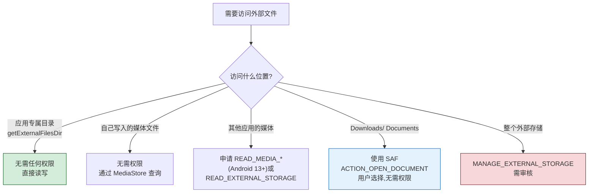
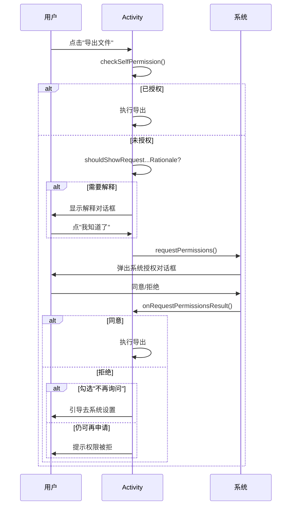

# 5.4 权限管理：存储权限申请

> [!abstract] 本节概述
> Android 6.0（API 23）之前，应用在安装时一次性获取所有声明权限，用户只能"全接受或全不装"。这种"安装即授权"模式让恶意应用轻易获取通讯录、定位、存储等敏感资源。Android 6.0 起把权限分为**普通权限**与**危险权限**：普通权限安装即生效，危险权限必须在运行时**动态申请**，由用户在使用时二次确认。本章前几节涉及的外部存储读写、SQLite 数据库迁移等场景，凡涉及公共目录访问都需要申请存储权限。本节解决"如何在运行时申请存储权限、处理用户拒绝、适配 Scoped Storage"的问题。

## 1. Android 权限分类

> [!definition] 普通权限 vs 危险权限
> Android 把权限分为两类：
> - **普通权限（Normal Permissions）**：不涉及用户隐私，安装时自动授权，无需运行时申请。如 `INTERNET`、`VIBRATE`、`WAKE_LOCK`、`ACCESS_NETWORK_STATE`。
> - **危险权限（Dangerous Permissions）**：涉及用户隐私或可能影响设备安全，必须运行时动态申请。按**权限组**归类：
>
> | 权限组 | 包含权限（典型） | 用途 |
> | ------ | ---------------- | ---- |
> | CALENDAR | READ/WRITE_CALENDAR | 读写日历 |
> | CAMERA | CAMERA | 相机 |
> | CONTACTS | READ/WRITE/GET_ACCOUNTS | 通讯录 |
> | LOCATION | ACCESS_FINE/COARSE_LOCATION | 定位 |
> | MICROPHONE | RECORD_AUDIO | 录音 |
> | PHONE | READ_PHONE_STATE/CALL_PHONE/READ_SMS | 电话与短信 |
> | SENSORS | BODY_SENSORS | 体感传感器 |
> | SMS | SEND/RECEIVE_SMS | 短信 |
> | STORAGE | READ/WRITE_EXTERNAL_STORAGE | 外部存储 |

> [!info] 权限组的特殊行为
> 同一权限组内的某条权限被授权后，系统可能自动授予同组其他权限（早期行为）。但 Google 自 Android 11 起明确**不再保证此行为**，应用应针对每条用到的权限单独申请。

## 2. 存储相关权限一览

| 权限 | 作用 | 引入版本 | 适用场景 |
| ---- | ---- | -------- | -------- |
| `READ_EXTERNAL_STORAGE` | 读取外部存储公共目录 | API 16 | 读取其他应用产出的媒体/文档 |
| `WRITE_EXTERNAL_STORAGE` | 写入外部存储公共目录 | API 16 | Android 9 及以下写公共目录 |
| `MANAGE_EXTERNAL_STORAGE` | 管理整个外部存储 | API 30 (Android 11) | 文件管理器类应用，需 Google Play 审核 |
| `READ_MEDIA_IMAGES` / `READ_MEDIA_VIDEO` / `READ_MEDIA_AUDIO` | 仅读取指定类型媒体 | API 33 (Android 13) | 替代 `READ_EXTERNAL_STORAGE` 的细分权限 |

> [!note] Scoped Storage 对权限的影响
> Android 10 起：
> - **应用专属目录**（`getExternalFilesDir`）的读写**完全不需要**任何存储权限
> - 通过 `MediaStore` 访问**自己写入**的媒体文件**不需要**权限
> - 访问**其他应用写入**的媒体文件需要 `READ_EXTERNAL_STORAGE`（Android 13+ 改为 `READ_MEDIA_*`）
> - `WRITE_EXTERNAL_STORAGE` 在 Android 10+ 实际失效（除非 `requestLegacyExternalStorage=true` 且 targetSdk ≤ 29）

## 3. 运行时权限申请流程

```mermaid
flowchart TD
    Start["需要使用危险权限"] --> Q1{targetSdkVersion >= 23?}
    Q1 -->|"否"| Auto["安装时自动授权"]
    Q1 -->|"是"| Q2{用户是否已授权?}
    Q2 -->|"是"| Do["直接执行操作"]
    Q2 -->|"否"| Q3{是否应显示说明?}
    Q3 -->|"shouldShowRequestPermissionRationale=true"| Show["向用户解释为何需要该权限"]
    Q3 -->|"否"| Req["调用 requestPermissions<br/>弹出系统授权对话框"]
    Show --> Req
    Req --> Q4{用户选择?}
    Q4 -->|"同意"| Do
    Q4 -->|"拒绝"| Q5{是否勾选"不再询问"?}
    Q5 -->|"否"| Retry["下次再申请时仍会弹窗"]
    Q5 -->|"是"| Q6["shouldShow...=false<br/>无法再弹窗"]
    Q6 --> Guide["引导用户去系统设置手动开启"]

    style Do fill:#d4edda,stroke:#155724
    style Guide fill:#f8d7da,stroke:#721c24
```

### 3.1 三步核心 API

| 步骤 | 方法 | 作用 |
| ---- | ---- | ---- |
| 1. 检查 | `ContextCompat.checkSelfPermission(ctx, perm)` | 返回 `PERMISSION_GRANTED` 或 `PERMISSION_DENIED` |
| 2. 申请 | `ActivityCompat.requestPermissions(act, perms[], requestCode)` | 弹出系统授权对话框 |
| 3. 回调 | `onRequestPermissionsResult(reqCode, perms[], grants[])` | 接收用户授权结果 |

> [!tip] shouldShowRequestPermissionRationale
> `ActivityCompat.shouldShowRequestPermissionRationale(act, perm)` 返回 true 表示：
> - 应用之前申请过该权限，但被用户拒绝
> - 用户**没有**勾选"不再询问"
> 此时建议先展示一个解释弹窗（说明为何需要权限），用户点"我知道了"后再调 `requestPermissions`。

### 3.2 完整代码示例：动态申请存储权限

```java
public class StoragePermissionActivity extends AppCompatActivity {

    private static final int REQ_PERMISSION_STORAGE = 1001;
    private static final String[] STORAGE_PERMS;

    static {
        if (Build.VERSION.SDK_INT >= Build.VERSION_CODES.TIRAMISU) {
            // Android 13+:用细分媒体权限
            STORAGE_PERMS = new String[]{
                Manifest.permission.READ_MEDIA_IMAGES,
                Manifest.permission.READ_MEDIA_VIDEO,
                Manifest.permission.READ_MEDIA_AUDIO
            };
        } else {
            // Android 12 及以下
            STORAGE_PERMS = new String[]{
                Manifest.permission.READ_EXTERNAL_STORAGE,
                Manifest.permission.WRITE_EXTERNAL_STORAGE
            };
        }
    }

    @Override
    protected void onCreate(Bundle savedInstanceState) {
        super.onCreate(savedInstanceState);
        setContentView(R.layout.activity_storage);

        findViewById(R.id.btn_request).setOnClickListener(v -> {
            if (checkStoragePermission()) {
                startExportFile();
            } else {
                requestStoragePermission();
            }
        });
    }

    /** 检查是否已拥有存储权限 */
    private boolean checkStoragePermission() {
        for (String perm : STORAGE_PERMS) {
            if (ContextCompat.checkSelfPermission(this, perm)
                    != PackageManager.PERMISSION_GRANTED) {
                return false;
            }
        }
        return true;
    }

    /** 申请存储权限 */
    private void requestStoragePermission() {
        // 是否需要先解释
        boolean shouldRationale = false;
        for (String perm : STORAGE_PERMS) {
            if (ActivityCompat.shouldShowRequestPermissionRationale(this, perm)) {
                shouldRationale = true;
                break;
            }
        }
        if (shouldRationale) {
            new AlertDialog.Builder(this)
                .setTitle("需要存储权限")
                .setMessage("本应用需要存储权限以导出您的文件到设备,拒绝将无法使用该功能。")
                .setPositiveButton("去授权", (d, w) ->
                    ActivityCompat.requestPermissions(this, STORAGE_PERMS, REQ_PERMISSION_STORAGE))
                .setNegativeButton("取消", null)
                .show();
        } else {
            ActivityCompat.requestPermissions(this, STORAGE_PERMS, REQ_PERMISSION_STORAGE);
        }
    }

    /** 接收授权结果 */
    @Override
    public void onRequestPermissionsResult(int requestCode,
                                           @NonNull String[] permissions,
                                           @NonNull int[] grantResults) {
        super.onRequestPermissionsResult(requestCode, permissions, grantResults);
        if (requestCode != REQ_PERMISSION_STORAGE) return;

        boolean allGranted = grantResults.length > 0;
        for (int r : grantResults) {
            if (r != PackageManager.PERMISSION_GRANTED) {
                allGranted = false;
                break;
            }
        }

        if (allGranted) {
            startExportFile();
        } else {
            // 判断是否"不再询问"
            boolean neverAsk = false;
            for (String perm : STORAGE_PERMS) {
                if (!ActivityCompat.shouldShowRequestPermissionRationale(this, perm)) {
                    neverAsk = true;
                    break;
                }
            }
            if (neverAsk) {
                guideToSettings();
            } else {
                Toast.makeText(this, "权限被拒绝,功能不可用", Toast.LENGTH_SHORT).show();
            }
        }
    }

    /** 引导用户去系统设置手动开启权限 */
    private void guideToSettings() {
        new AlertDialog.Builder(this)
            .setTitle("权限已被禁用")
            .setMessage("存储权限被设为不再询问,请到系统设置中手动开启")
            .setPositiveButton("去设置", (d, w) -> {
                Intent intent = new Intent(Settings.ACTION_APPLICATION_DETAILS_SETTINGS);
                intent.setData(Uri.parse("package:" + getPackageName()));
                startActivity(intent);
            })
            .setNegativeButton("取消", null)
            .show();
    }

    private void startExportFile() {
        Toast.makeText(this, "权限已获取,开始导出文件", Toast.LENGTH_SHORT).show();
        // 实际业务:调用 ExternalFileUtil 导出
    }
}
```

### 3.3 AndroidManifest 声明

权限申请代码之外，必须在 `AndroidManifest.xml` 中声明所需权限，否则 `checkSelfPermission` 始终返回 DENIED：

```xml
<manifest xmlns:android="http://schemas.android.com/apk/res/android"
    package="com.example.app">

    <uses-permission android:name="android.permission.READ_EXTERNAL_STORAGE"
        android:maxSdkVersion="32" />
    <uses-permission android:name="android.permission.WRITE_EXTERNAL_STORAGE"
        android:maxSdkVersion="29" />

    <!-- Android 13+ 细分媒体权限 -->
    <uses-permission android:name="android.permission.READ_MEDIA_IMAGES" />
    <uses-permission android:name="android.permission.READ_MEDIA_VIDEO" />
    <uses-permission android:name="android.permission.READ_MEDIA_AUDIO" />

    <application
        android:requestLegacyExternalStorage="true"
        ... >
    </application>
</manifest>
```

## 4. MANAGE_EXTERNAL_STORAGE：所有文件访问权限

Android 11 引入的特殊权限，允许应用访问整个外部存储（除其他应用专属目录外）。**不能通过 `requestPermissions` 申请**，必须通过 Settings Intent 引导用户授权：

```java
private void requestManageAllFiles() {
    if (Build.VERSION.SDK_INT >= Build.VERSION_CODES.R) {
        if (!Environment.isExternalStorageManager()) {
            Intent intent = new Intent(Settings.ACTION_MANAGE_APP_ALL_FILES_ACCESS_PERMISSION);
            intent.setData(Uri.parse("package:" + getPackageName()));
            startActivity(intent);
        }
    }
}
```

> [!warning] MANAGE_EXTERNAL_STORAGE 审核
> Google Play 对该权限审核极严，仅文件管理器、备份恢复、杀毒安全类应用可申请。普通应用滥用会被拒上架。绝大多数场景应改用 MediaStore + 应用专属目录。

## 5. Scoped Storage 对权限申请的影响



> [!tip] SAF：替代权限申请的方案
> 当应用只需让用户选择某个文件读写时，使用 **Storage Access Framework** (`ACTION_OPEN_DOCUMENT` / `ACTION_CREATE_DOCUMENT`) 弹出系统文件选择器，用户主动选择后系统返回 `Uri`，应用据此访问，**完全无需申请存储权限**。这是 Scoped Storage 时代处理"用户文档"的推荐方案。

```java
private void openFilePicker() {
    Intent intent = new Intent(Intent.ACTION_OPEN_DOCUMENT);
    intent.addCategory(Intent.CATEGORY_OPENABLE);
    intent.setType("*/*");                          // 所有类型
    intent.putExtra(Intent.EXTRA_ALLOW_MULTIPLE, false);
    startActivityForResult(intent, REQ_OPEN_DOC);
}

@Override
protected void onActivityResult(int reqCode, int resCode, @Nullable Intent data) {
    super.onActivityResult(reqCode, resCode, data);
    if (reqCode == REQ_OPEN_DOC && resCode == RESULT_OK && data != null) {
        Uri uri = data.getData();
        // 通过 uri 读取文件,可持续访问
        getContentResolver().takePersistableUriPermission(uri,
            Intent.FLAG_GRANT_READ_URI_PERMISSION);
    }
}
```

## 6. 案例：APP 首次申请存储权限

> [!example] 文件导出功能首次申请权限
> 需求：用户点击"导出日志"按钮时，检查存储权限；未授权则弹出申请对话框；用户拒绝时显示说明并引导重试；用户勾选"不再询问"时引导去系统设置。

```java
public class LogExportActivity extends AppCompatActivity {

    private static final int REQ_STORAGE = 2001;
    private static final String[] PERMS = {
        Manifest.permission.WRITE_EXTERNAL_STORAGE,
        Manifest.permission.READ_EXTERNAL_STORAGE
    };

    @Override
    protected void onCreate(Bundle savedInstanceState) {
        super.onCreate(savedInstanceState);
        setContentView(R.layout.activity_export);

        findViewById(R.id.btn_export).setOnClickListener(v -> {
            // Android 10+ 应用专属目录无需权限,直接导出
            if (Build.VERSION.SDK_INT >= Build.VERSION_CODES.Q) {
                exportToExternalFilesDir();
                return;
            }
            // Android 9 及以下需检查权限
            if (hasStoragePerm()) {
                exportToPublicDir();
            } else {
                ActivityCompat.requestPermissions(this, PERMS, REQ_STORAGE);
            }
        });
    }

    private boolean hasStoragePerm() {
        for (String p : PERMS) {
            if (ContextCompat.checkSelfPermission(this, p)
                    != PackageManager.PERMISSION_GRANTED) return false;
        }
        return true;
    }

    @Override
    public void onRequestPermissionsResult(int reqCode,
                                           @NonNull String[] perms,
                                           @NonNull int[] results) {
        super.onRequestPermissionsResult(reqCode, perms, results);
        if (reqCode != REQ_STORAGE) return;
        boolean granted = results.length > 0;
        for (int r : results) {
            if (r != PackageManager.PERMISSION_GRANTED) { granted = false; break; }
        }
        if (granted) {
            exportToPublicDir();
        } else {
            boolean neverAsk = false;
            for (String p : PERMS) {
                if (!ActivityCompat.shouldShowRequestPermissionRationale(this, p)) {
                    neverAsk = true; break;
                }
            }
            if (neverAsk) {
                new AlertDialog.Builder(this)
                    .setTitle("需要存储权限")
                    .setMessage("日志导出需要写外部存储,请到设置中开启权限")
                    .setPositiveButton("去设置", (d, w) -> {
                        Intent i = new Intent(Settings.ACTION_APPLICATION_DETAILS_SETTINGS);
                        i.setData(Uri.parse("package:" + getPackageName()));
                        startActivity(i);
                    }).setNegativeButton("取消", null).show();
            } else {
                Toast.makeText(this, "权限被拒绝,无法导出", Toast.LENGTH_SHORT).show();
            }
        }
    }

    private void exportToPublicDir() { /* 调用 ExternalFileUtil */ }
    private void exportToExternalFilesDir() { /* 调用 getExternalFilesDir */ }
}
```

## 7. 权限申请流程总结图



## 8. 易错点与最佳实践

> [!warning] 常见易错点
> 1. **忘记在 Manifest 声明权限**：只写代码不写 `<uses-permission>` 会导致 `requestPermissions` 无弹窗、`checkSelfPermission` 始终返回 DENIED。
> 2. **在 `onCreate` 中申请权限**：用户尚未理解功能就被弹窗，体验差。应在用户触发功能时申请。
> 3. **未处理"不再询问"**：用户勾选后 `requestPermissions` 不再弹窗，必须引导去系统设置。
> 4. **Android 13 仍用 `READ_EXTERNAL_STORAGE`**：会被忽略，应改用 `READ_MEDIA_*`。
> 5. **请求码冲突**：多个权限请求的 `requestCode` 重复会导致回调错乱。
> 6. **未适配 Scoped Storage**：仍用旧式 `File` API 访问公共目录，在 Android 11+ 会失败。
> 7. **在 Fragment 中申请权限用了 Activity 的 API**：应使用 `Fragment.requestPermissions` 与 `Fragment.onRequestPermissionsResult`，或新的 `ActivityResult API`。

> [!tip] 最佳实践
> - **按需申请**：用户触发功能时才申请，不要在启动时就批量申请。
> - **先解释再申请**：首次拒绝后用 `shouldShowRequestPermissionRationale` 判断是否需要解释。
> - **处理"不再询问"**：检测到无法弹窗时引导用户去系统设置。
> - **使用新 API**：Android 推荐使用 `ActivityResultContracts.RequestPermission()` 替代旧的 `requestPermissions`/`onRequestPermissionsResult`，代码更简洁。
> - **优先用无需权限的方案**：应用专属目录、SAF、MediaStore 自有文件均免权限，能不申请就不申请。
> - **targetSdkVersion 适配**：升级 targetSdk 时同步检查权限与新行为（如 33 必须用 `READ_MEDIA_*`）。

> [!note] 新版 ActivityResult API
> Androidx Activity 1.2+ 提供更简洁的权限申请方式，替代旧的 `requestPermissions`：
> ```java
> private final ActivityResultLauncher<String> permLauncher =
>     registerForActivityResult(new ActivityResultContracts.RequestPermission(), isGranted -> {
>         if (isGranted) {
>             startExportFile();
>         } else {
>             Toast.makeText(this, "权限被拒绝", Toast.LENGTH_SHORT).show();
>         }
>     });
>
> // 触发申请
> permLauncher.launch(Manifest.permission.WRITE_EXTERNAL_STORAGE);
> ```
> 该方式避免了 `requestCode` 管理与回调分发，是 Google 当前推荐做法。

## 章节导航

- 上级：[[MOC - 第5章|第5章 数据持久化存储]]
- 上一节：[[5.3 SQLite 数据库基础操作|5.3 SQLite 数据库基础操作]]
- 下一节：本章末节
- 习题：[[MOC - 第5章习题|第5章习题]]
