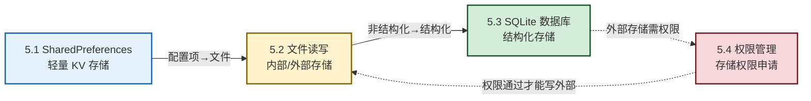

# MOC - 第5章 数据持久化存储

移动应用运行在内存中，进程一旦被回收或应用被关闭，所有内存数据都会丢失。本章解决的核心问题是：**如何把数据持久地保存到设备的存储介质中，并在下次启动时恢复**。围绕"轻量配置—文件—结构化数据"三层需求，Android 提供了 SharedPreferences、文件读写、SQLite 三套方案；又因外部存储涉及用户隐私，自 Android 6.0 起必须动态申请存储权限，自 Android 10 起引入 Scoped Storage 限制访问范围。本章把"存什么、用什么存、能不能存"三个问题一次讲透。

> [!info] 本章定位
> - **章节性质**：核心实操章节，从"看得见 UI"过渡到"留得住数据"
> - **前置**：[[MOC - 第2章|第2章]] 工程结构与四大组件、[[MOC - 第3章|第3章]] Activity 生命周期、[[MOC - 第4章|第4章]] UI 控件
> - **后续衔接**：[[MOC - 第6章|第6章]] 网络通信把本地数据与远端打通，[[MOC - 第8章|第8章]] 安全会回来讨论存储加密
> - **学习目标**：掌握三种持久化方案的适用场景与 API、理解存储分区演化、能编写动态权限申请代码
> - **学时建议**：理论 4 学时 + 实验 2 学时

## 本章学习路线

学习路线说明：先从最轻量的 SharedPreferences 入手解决配置类数据存储（5.1）；再扩展到自由格式的文件读写，引入内外部存储的分区差异（5.2）；当数据具有结构化特征时升级到 SQLite 关系数据库（5.3）；最后回到工程合规问题，讲解访问外部存储所需的运行时权限申请（5.4）。5.4 与 5.2 之间存在依赖：写入外部存储前必须先通过权限检查。

## 知识点导航

| 小节 | 主题 | 核心问题 | 关键产出 | 难度 |
| ---- | ---- | -------- | -------- | ---- |
| [[5.1 SharedPreferences 轻量存储\|5.1]] | SharedPreferences 轻量存储 | 如何保存少量 KV 配置？ | 掌握 edit/apply/commit 流程，能保存登录状态 | ★★ |
| [[5.2 文件读写（内部存储、外部存储）\|5.2]] | 文件读写 | 应用私有文件与公共文件分别怎么读写？ | 理解 Scoped Storage，能写日志文件 | ★★★ |
| [[5.3 SQLite 数据库基础操作\|5.3]] | SQLite 数据库 | 如何存储结构化数据并支持查询？ | 掌握 SQLiteOpenHelper 与 CRUD，能建表查询 | ★★★★ |
| [[5.4 权限管理：存储权限申请\|5.4]] | 存储权限申请 | 如何动态申请危险权限？ | 掌握 checkSelfPermission/requestPermissions 流程 | ★★★ |

## 核心考点

> [!warning] 高频考点（7 点）
> 1. **三种存储方案选型**：SharedPreferences（KV 配置）/ 文件（非结构化）/ SQLite（结构化）的适用场景与数据量级（必考）
> 2. **SharedPreferences 写入流程**：`edit() → putXxx() → apply()/commit()`，apply 异步无返回值、commit 同步有返回值
> 3. **内部存储 vs 外部存储**：私有性、是否需权限、卸载是否删除、容量限制的对比
> 4. **Scoped Storage 分区存储**：Android 10 引入，应用只能访问自己专属目录与媒体集合，旧式 `Environment.getExternalStorageDirectory()` 已废弃
> 5. **SQLiteOpenHelper 三个回调**：`onCreate`（首次建表）、`onUpgrade`（版本升级迁移）、`getReadableDatabase/getWritableDatabase`
> 6. **参数化查询防 SQL 注入**：使用 `?` 占位符 + `selectionArgs`，禁止字符串拼接 SQL
> 7. **运行时权限三步流程**：`checkSelfPermission` → `requestPermissions` → `onRequestPermissionsResult`，Android 6.0+ 必须动态申请危险权限

## 数据存储方案对比

| 方案 | 数据模型 | 存储位置 | 是否需权限 | 卸载是否删除 | 典型容量 | 适用场景 |
| ---- | -------- | -------- | ---------- | ------------ | -------- | -------- |
| SharedPreferences | 键值对（XML） | 内部存储 `shared_prefs/` | 否 | 是 | < 1 MB | 登录状态、配置项、简单缓存 |
| 内部存储文件 | 任意字节流 | `/data/data/包名/files/` | 否 | 是 | 几 MB | 应用私有日志、缓存文件 |
| 外部存储文件 | 任意字节流 | `Downloads/`、`Pictures/` 等 | 是（部分） | 否（公共目录） | 几 GB | 用户可见文档、媒体文件 |
| SQLite | 关系表 | 内部存储 `databases/` | 否 | 是 | 几十 MB | 结构化业务数据、需查询 |
| Room | 关系表（SQLite 封装） | 内部存储 `databases/` | 否 | 是 | 几十 MB | 复杂业务、编译期 SQL 校验 |

> [!note] 选型决策
> - 数据量小且只是开关/标记 → SharedPreferences
> - 数据是非结构化字节流且只供本应用使用 → 内部存储文件
> - 数据需要让用户可见或其他应用访问 → 外部存储文件（注意权限与 Scoped Storage）
> - 数据有结构、需要条件查询与事务 → SQLite 或 Room

## 关键概念速查

| 概念 | 一句话定义 |
| ---- | ---------- |
| 持久化 | 把内存中的数据写入存储介质，使进程结束后仍可恢复 |
| SharedPreferences | Android 提供的轻量 KV 存储，底层以 XML 文件保存 |
| 内部存储 | 应用沙箱目录，无需权限，卸载即删 |
| 外部存储 | 公共目录（Downloads/Pictures 等），需权限，用户可访问 |
| Scoped Storage | Android 10 引入的分区存储，限制应用对外部目录的访问范围 |
| SQLiteOpenHelper | 管理数据库创建与版本升级的帮助类 |
| Cursor | 查询结果集游标，按行遍历数据 |
| 危险权限 | 涉及用户隐私的权限，需运行时动态申请（如存储、定位、相机） |

## 跨章关联

- **上行**：[[MOC - 第2章|第2章]] 四大组件中的 ContentProvider 提供跨应用数据共享的另一条路径
- **横向**：[[MOC - 第3章|第3章]] Activity 生命周期决定了"何时保存数据"（如 onPause 写 SharedPreferences）
- **下行**：[[MOC - 第6章|第6章]] 网络通信获取的数据需写入本地缓存或数据库
- **安全**：[[MOC - 第8章|第8章]] 移动应用安全会讨论 SharedPreferences 加密、SQLite SQL 注入防护
- **跨平台**：[[MOC - 第9章|第9章]] Flutter/RN 也需调用原生存储能力

## 章节导航

- 上级：[[MOC - 移动互联网开发技术|课程总览 MOC]]
- 上一章：[[MOC - 第4章|第4章 Android UI 界面开发]]
- 下一章：[[MOC - 第6章|第6章 移动网络通信技术]]
- 习题：[[MOC - 第5章习题|第5章习题]]
- 首节：[[5.1 SharedPreferences 轻量存储|5.1 SharedPreferences 轻量存储]]
